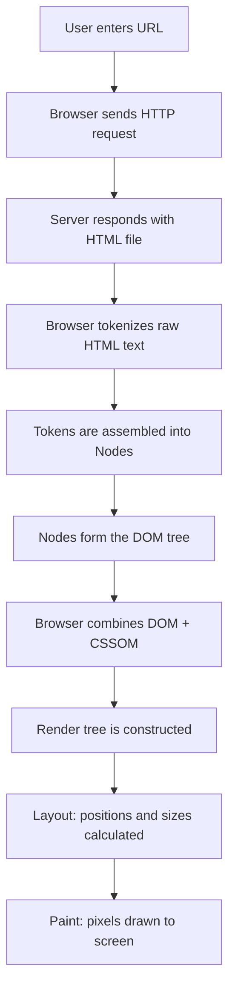
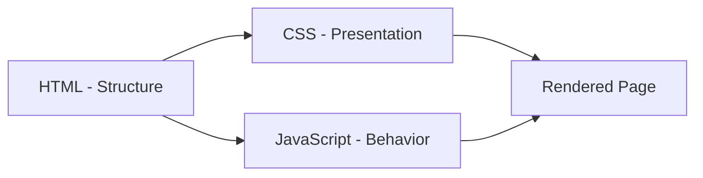

# Introduction to HTML

## What is HTML?

HTML (HyperText Markup Language) is the standard markup language used to create and structure content on the web. It is not a programming language — it does not have logic, loops, or conditionals. Instead, it is a **declarative language** that tells the browser _what_ content exists and _how_ it is structured.

Think of it this way: if a web page were a building, **HTML is the structural frame** — the steel beams, walls, floors, and rooms. CSS is the paint, wallpaper, and interior design. JavaScript is the electricity, plumbing, and elevator systems that make things move and respond.

Without HTML, a browser would have no idea what to render. It is the foundational layer of every single web page on the internet.

## Why HTML Matters

- It is the **entry point** to web development. Every web technology builds on top of HTML.
- Search engines read HTML to understand and index your content (SEO).
- Screen readers rely on HTML structure to make websites accessible to people with disabilities.
- Browsers use HTML to construct the Document Object Model (DOM), which is the internal representation of your page.

## A Brief History

| Year    | Version              | Key Milestone                                                          |
| ------- | -------------------- | ---------------------------------------------------------------------- |
| 1991    | HTML 1.0             | Tim Berners-Lee publishes the first HTML specification with 18 tags    |
| 1995    | HTML 2.0             | First formal standard by IETF                                          |
| 1997    | HTML 3.2             | Tables, applets, text flow around images                               |
| 1999    | HTML 4.01            | Stylesheets, scripting, frames, internationalization                   |
| 2014    | HTML5                | Semantic elements, audio/video, canvas, local storage, new form inputs |
| Ongoing | HTML Living Standard | Maintained by WHATWG as a continuously evolving specification          |

HTML5 was a watershed moment. It eliminated the need for plugins like Flash and introduced native support for multimedia, better semantics, and powerful APIs.

## How Browsers Parse HTML

When you type a URL into your browser, a precise sequence of events unfolds:



### Key Parsing Concepts

1. **Tokenization**: The browser reads the raw HTML character by character, identifying opening tags, closing tags, attributes, and text content.
2. **Tree Construction**: Tokens are organized into a hierarchical tree structure — the DOM (Document Object Model).
3. **Error Tolerance**: Unlike most programming languages, HTML parsers are extremely forgiving. A missing closing tag will not crash the page — the browser will attempt to fix it silently. This is by design, but it can lead to subtle bugs.

### The DOM Analogy

Think of the DOM as a family tree. The `<html>` element is the grandparent. It has two children: `<head>` and `<body>`. Each of those has their own children, and so on. Every element, attribute, and text node has a precise position in this tree.

## Your First HTML Document

```html
<!DOCTYPE html>
<html lang="en">
  <head>
    <meta charset="UTF-8" />
    <meta name="viewport" content="width=device-width, initial-scale=1.0" />
    <title>My First Page</title>
  </head>
  <body>
    <h1>Hello, World!</h1>
    <p>This is my first HTML document.</p>
  </body>
</html>
```

Every piece of this document has a purpose — we will dissect it fully in the next chapter on the HTML Boilerplate.

## How HTML Relates to CSS and JavaScript



- **HTML** defines what exists: headings, paragraphs, images, links.
- **CSS** defines how it looks: colors, spacing, layout.
- **JavaScript** defines how it behaves: click handlers, animations, data fetching.

This separation of concerns is a core principle of web development. Mixing them together (inline styles, onclick attributes) is possible but generally discouraged for maintainability.

## Best Practices

- Always start with a valid document structure (DOCTYPE, html, head, body).
- Use semantic elements (`<article>`, `<nav>`, `<main>`) over generic `<div>` elements when possible.
- Validate your HTML using the [W3C Markup Validation Service](https://validator.w3.org/).
- Write HTML that is readable and properly indented — your future self will thank you.
- Keep HTML focused on structure. Move styles to CSS and behavior to JavaScript.

## Common Mistakes

| Mistake                                   | Why It Is a Problem                                                             |
| ----------------------------------------- | ------------------------------------------------------------------------------- |
| Skipping `<!DOCTYPE html>`                | Browser enters "quirks mode" and renders inconsistently                         |
| Using `<div>` for everything              | Hurts accessibility and SEO; screen readers cannot interpret generic containers |
| Not setting `lang` attribute              | Screen readers may mispronounce content; hurts internationalization             |
| Treating HTML like a programming language | Leads to confusion about what HTML can and cannot do                            |
| Not closing tags properly                 | May produce unexpected rendering, especially with nested elements               |

## Summary

- HTML is a markup language that structures web content — it is the skeleton of every web page.
- Browsers parse HTML into a DOM tree, which is then combined with styles to produce what you see on screen.
- HTML has evolved from 18 tags in 1991 to a living standard with hundreds of elements and attributes.
- Writing clean, semantic, valid HTML is the foundation of good web development — everything else (CSS, JS, frameworks) builds on top of it.
- Understanding how the browser parses HTML gives you insight into performance, debugging, and how your code actually becomes pixels on a screen.
