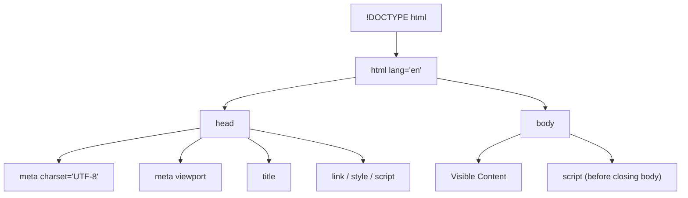

# HTML Boilerplate

## What is the HTML Boilerplate?

The HTML boilerplate is the minimum required structure that every HTML document needs to be valid and render correctly across browsers. It is the standardized starting point — the foundation poured before any walls go up.

Think of it like the paperwork before construction begins: permits, blueprints, and site preparation. Without them, the building might still stand, but it will not be up to code and problems will surface later.

## Why It Matters

- Without a proper boilerplate, browsers fall into **quirks mode** — a legacy rendering mode that produces inconsistent results.
- Search engines expect well-formed documents to properly index content.
- Screen readers depend on metadata (like `lang`) to pronounce content correctly.
- Responsive design requires the viewport meta tag to function.

## The Complete Boilerplate

```html
<!DOCTYPE html>
<html lang="en">
  <head>
    <meta charset="UTF-8" />
    <meta name="viewport" content="width=device-width, initial-scale=1.0" />
    <meta name="description" content="A brief description of the page" />
    <title>Page Title</title>
    <link rel="stylesheet" href="styles.css" />
  </head>
  <body>
    <!-- Your visible content goes here -->

    <script src="app.js"></script>
  </body>
</html>
```

## Breaking Down Each Piece

### 1. `<!DOCTYPE html>`

```html
<!DOCTYPE html>
```

This is a **document type declaration** — not an HTML tag. It tells the browser: "This document is HTML5. Render it using modern standards."

Without it, the browser may use quirks mode, which emulates bugs from the 1990s for backward compatibility. You never want this.

**History note**: Older DOCTYPEs were verbose nightmares:

```html
<!DOCTYPE html PUBLIC "-//W3C//DTD HTML 4.01 Transitional//EN" "http://www.w3.org/TR/html4/loose.dtd">
```

HTML5 simplified this to just `<!DOCTYPE html>`.

### 2. `<html lang="en">`

```html
<html lang="en"></html>
```

The root element of the entire document. Everything else lives inside it.

The `lang` attribute specifies the **primary language** of the page content. This is critical for:

- **Screen readers**: They use this to select the correct pronunciation engine. A French screen reader will mangle English text if `lang="fr"` is set incorrectly.
- **Search engines**: Google uses this for serving correct regional results.
- **Translation tools**: Browser auto-translate features reference this attribute.

Common values: `en`, `en-US`, `fr`, `de`, `hi`, `ja`, `zh`.

### 3. `<head>` Section

```html
<head>
  <!-- Metadata, links, scripts that are NOT visible content -->
</head>
```

The `<head>` contains **metadata** — information _about_ the document, not content that appears on the page. Think of it as the backstage crew: invisible to the audience but essential for the show to run.

### 4. `<meta charset="UTF-8">`

```html
<meta charset="UTF-8" />
```

This declares the **character encoding** of the document. UTF-8 supports virtually every character from every writing system on Earth — Latin, Cyrillic, Arabic, Chinese, emojis, mathematical symbols.

Without this, special characters may render as garbled text (mojibake). Always place this as the **first element** in `<head>` so the browser knows how to decode everything that follows.

### 5. `<meta name="viewport">`

```html
<meta name="viewport" content="width=device-width, initial-scale=1.0" />
```

This is **essential for responsive design**. Without it, mobile browsers will render your page as if it were 980px wide and then zoom out to fit the screen — making everything tiny and unreadable.

| Property             | What It Does                                         |
| -------------------- | ---------------------------------------------------- |
| `width=device-width` | Sets the viewport width to the device's screen width |
| `initial-scale=1.0`  | Sets the initial zoom level to 100%                  |

### 6. `<title>`

```html
<title>Page Title</title>
```

Sets the text shown in:

- The browser tab
- Bookmarks
- Search engine results (the blue clickable link)

Keep it descriptive but concise (50-60 characters). Every page should have a unique title.

### 7. `<body>`

```html
<body>
  <!-- All visible content lives here -->
</body>
```

Everything users see and interact with goes inside `<body>`. Text, images, forms, navigation — all of it. If `<head>` is backstage, `<body>` is the stage itself.

## Document Structure Diagram



## Script and Stylesheet Placement

### CSS: In the `<head>`

```html
<head>
  <link rel="stylesheet" href="styles.css" />
</head>
```

Place CSS links in the head so styles are loaded **before** content renders. This prevents the "flash of unstyled content" (FOUC).

### JavaScript: Before closing `</body>`

```html
<body>
  <!-- content -->
  <script src="app.js"></script>
</body>
```

Place scripts at the bottom so the HTML content loads first. Alternatively, use the `defer` attribute:

```html
<head>
  <script src="app.js" defer></script>
</head>
```

`defer` tells the browser: "Download this script in parallel, but execute it only after the HTML is fully parsed."

## Best Practices

- Always include `<!DOCTYPE html>` as the very first line.
- Always set `lang` on the `<html>` element.
- Always include `<meta charset="UTF-8">` as the first child of `<head>`.
- Always include the viewport meta tag for mobile-friendly pages.
- Give every page a unique, descriptive `<title>`.
- Place stylesheets in `<head>`, scripts at the end of `<body>` (or use `defer`).

## Common Mistakes

| Mistake                                           | Consequence                                     |
| ------------------------------------------------- | ----------------------------------------------- |
| Omitting DOCTYPE                                  | Quirks mode rendering                           |
| Forgetting charset                                | Garbled characters for non-ASCII text           |
| Missing viewport meta                             | Mobile devices render page zoomed out           |
| Duplicate `<title>` or missing title              | Poor SEO, confusing bookmarks                   |
| Placing large scripts in `<head>` without `defer` | Blocks page rendering, slow perceived load time |
| Setting `lang="en"` on a non-English page         | Screen readers use wrong pronunciation          |

## Summary

- The HTML boilerplate is not boilerplate in the "copy-paste filler" sense — every line serves a real purpose.
- `<!DOCTYPE html>` activates standards mode. `lang` enables correct pronunciation and indexing. `charset` prevents encoding corruption. `viewport` enables responsive design. `title` identifies your page.
- Get the boilerplate right once, and you prevent an entire class of subtle, hard-to-debug issues later.
- Think of it as the foundation of a house: invisible when the house is done, but if it is crooked, everything built on top will be crooked too.
