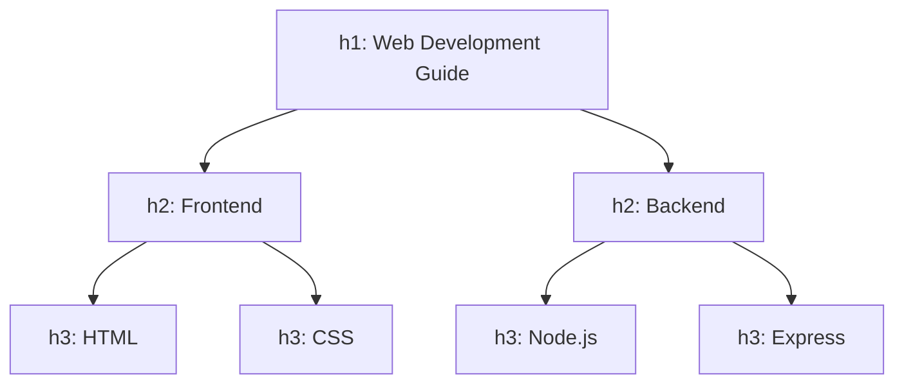

# Headings and Paragraphs

## What Are Headings and Paragraphs?

Headings (`<h1>` through `<h6>`) and paragraphs (`<p>`) are the most fundamental building blocks for organizing text content in HTML. Headings define the hierarchy and structure; paragraphs contain the actual prose.

**Analogy**: Think of your web page as a newspaper. Headings are the headlines — they tell readers what each section is about and signal relative importance. Paragraphs are the body text — where the actual information lives. Just as a newspaper with no headlines would be an unreadable wall of text, a web page without proper heading structure is confusing for both humans and machines.

## Why They Matter

- **Accessibility**: Screen readers allow users to navigate a page by jumping between headings. A well-structured heading hierarchy is like a table of contents for blind users.
- **SEO**: Search engines use headings (especially `<h1>`) to understand what your page is about. Proper heading structure can directly impact your search ranking.
- **Readability**: Humans scan before they read. Headings let users quickly find what they are looking for.
- **Document Outline**: Headings create an implicit document outline that browsers, assistive technologies, and reading mode features use.

## Heading Hierarchy: h1 through h6

```html
<h1>Main Page Title</h1>
<h2>Major Section</h2>
<h3>Subsection</h3>
<h4>Sub-subsection</h4>
<h5>Minor Detail</h5>
<h6>Smallest Heading</h6>
```

### Visual Size and Semantic Weight

| Tag    | Default Size     | Purpose                      |
| ------ | ---------------- | ---------------------------- |
| `<h1>` | ~2em (32px)      | Page title / primary topic   |
| `<h2>` | ~1.5em (24px)    | Major sections               |
| `<h3>` | ~1.17em (18.7px) | Subsections within h2        |
| `<h4>` | ~1em (16px)      | Subsections within h3        |
| `<h5>` | ~0.83em (13.3px) | Rarely needed — deep nesting |
| `<h6>` | ~0.67em (10.7px) | Very rarely needed           |

**Important**: The visual size is just the browser's default stylesheet. You can (and should) override it with CSS. The semantic meaning, however, cannot be changed — an `<h3>` always means "a sub-topic of the nearest `<h2>` above it."

## The Heading Hierarchy Rule

Headings must follow a logical, sequential order. Do not skip levels.

```html
<!-- CORRECT: Proper hierarchy -->
<h1>Web Development Guide</h1>
<h2>Frontend</h2>
<h3>HTML</h3>
<h3>CSS</h3>
<h2>Backend</h2>
<h3>Node.js</h3>

<!-- INCORRECT: Skipped from h1 to h3 -->
<h1>Web Development Guide</h1>
<h3>HTML</h3>
<!-- Where is the h2? -->
```



## Paragraphs

```html
<p>
  This is a paragraph. It represents a block of related text content. Browsers
  automatically add vertical spacing between paragraphs.
</p>

<p>
  This is another paragraph. Note that the browser will collapse any extra
  whitespace inside a paragraph into a single space.
</p>
```

### Key Behaviors

- **Block-level element**: Takes up the full available width and starts on a new line.
- **Whitespace collapsing**: Multiple spaces, tabs, and line breaks in the source code are rendered as a single space.
- **Default margins**: Browsers add top and bottom margins (~16px) between paragraphs.

### What NOT to Use Paragraphs For

```html
<!-- WRONG: Using <p> for spacing -->
<p></p>
<!-- Empty paragraphs for visual spacing — use CSS margin instead -->

<!-- WRONG: Using <br> for paragraph separation -->
<p>First paragraph.<br /><br />Second paragraph.</p>
<!-- Use two separate <p> elements instead -->
```

## SEO Implications

### H1 Tag and Search Engines

- Each page should have exactly **one `<h1>`** that describes the page's primary topic.
- Google uses the `<h1>` as a strong signal for what the page is about.
- The `<h1>` should ideally contain or relate to your target keyword.

### Heading Structure as Content Signal

Search engines use heading structure to understand content hierarchy:

```html
<!-- Google sees this structure and understands the topic relationships -->
<h1>Complete Guide to JavaScript</h1>
<h2>Variables and Data Types</h2>
<p>Detailed content about variables...</p>
<h2>Functions</h2>
<h3>Arrow Functions</h3>
<p>Detailed content about arrow functions...</p>
<h3>Higher-Order Functions</h3>
<p>Detailed content about HOFs...</p>
```

### Paragraph Content and SEO

- The first paragraph on a page often appears in search result snippets.
- Write clear, keyword-relevant first paragraphs.
- Break content into digestible paragraphs — walls of text have higher bounce rates.

## Best Practices

- Use exactly one `<h1>` per page.
- Maintain a strict, logical heading hierarchy — never skip levels.
- Do not choose heading levels for their visual size; use CSS for styling.
- Keep headings concise and descriptive.
- Use `<p>` for any block of related text content.
- Do not use empty paragraphs or `<br>` tags for spacing — that is CSS's job.
- Ensure heading text is meaningful out of context (screen reader users may see a list of headings only).

## Common Mistakes

| Mistake                                        | Why It Is Wrong                                                                                    | Fix                                     |
| ---------------------------------------------- | -------------------------------------------------------------------------------------------------- | --------------------------------------- |
| Multiple `<h1>` tags                           | Confuses search engines about page topic                                                           | Use one `<h1>`, use `<h2>` for sections |
| Skipping heading levels                        | Breaks document outline; confuses assistive technology                                             | Follow h1 > h2 > h3 sequence            |
| Using headings for visual size                 | Heading level has semantic meaning, not just style                                                 | Use CSS `font-size` for visual changes  |
| Long paragraphs (10+ sentences)                | Hurts readability; users skim                                                                      | Break into shorter paragraphs           |
| Using `<br>` instead of new `<p>`              | Semantically incorrect; one long paragraph with line breaks is not the same as multiple paragraphs | Use separate `<p>` elements             |
| Using `<b>` or `<strong>` instead of a heading | Text importance is not the same as structural hierarchy                                            | Use appropriate heading level           |

## Summary

- Headings (`<h1>`-`<h6>`) create a hierarchical document outline that serves accessibility, SEO, and readability.
- Only one `<h1>` per page. Never skip levels.
- Paragraphs (`<p>`) are for blocks of text. They are block-level, collapse whitespace, and have default vertical margins.
- The heading structure is one of the strongest on-page SEO signals you control directly.
- Choose heading levels for their meaning, not their appearance. Style with CSS, structure with HTML.
