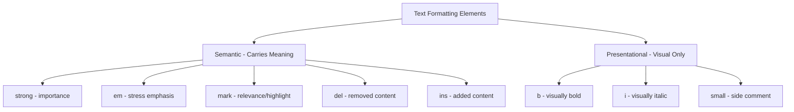

# Text Formatting in HTML

## What is Text Formatting?

Text formatting in HTML refers to a set of inline elements that alter the appearance or semantic meaning of text content. These elements range from purely visual (bold, italic) to semantically meaningful (strong emphasis, importance).

**Analogy**: Imagine reading a printed textbook. Some words are **bolded** to indicate key terms. Others are _italicized_ for titles or foreign words. Some text is ~~struck through~~ to show corrections. HTML formatting tags work the same way — but with an added dimension: they can carry _meaning_ that machines understand, not just visual styling for humans.

## Why It Matters

- **Accessibility**: Screen readers change their tone or emphasis when encountering `<strong>` or `<em>`. They do _not_ change tone for `<b>` or `<i>`. This distinction can affect how a blind user understands your content.
- **SEO**: Search engines interpret `<strong>` as a signal that the enclosed text is important. This can influence keyword relevance.
- **Maintainability**: Semantic markup communicates intent to other developers. When you see `<strong>`, you know the text carries importance. When you see `<b>`, you only know it looks bold.

## The Critical Distinction: Semantic vs. Presentational



## Element Reference

### `<strong>` vs `<b>`

Both render text in **bold** by default, but they mean different things.

```html
<!-- strong: This text is IMPORTANT. A screen reader will emphasize it. -->
<p><strong>Warning:</strong> Do not delete this file.</p>

<!-- b: This text is visually bold but carries no extra importance. -->
<p>Product Name: <b>ThinkPad X1 Carbon</b></p>
```

| Feature                | `<strong>`                       | `<b>`                                          |
| ---------------------- | -------------------------------- | ---------------------------------------------- |
| Visual default         | Bold                             | Bold                                           |
| Semantic meaning       | Importance, seriousness, urgency | Stylistically offset text, no extra importance |
| Screen reader behavior | May change tone/emphasis         | No change in delivery                          |
| SEO weight             | Signals keyword importance       | No SEO signal                                  |
| Use case               | Warnings, key information        | Product names, keywords in a summary           |

### `<em>` vs `<i>`

Both render text in _italic_ by default, but the semantics differ.

```html
<!-- em: Stress emphasis — changes the meaning of the sentence -->
<p>I said we should <em>not</em> deploy on Friday.</p>
<!-- Reading: emphasis on "not" — the point is about NOT deploying -->

<!-- i: Alternate voice/mood — no extra emphasis -->
<p>The word <i>schadenfreude</i> comes from German.</p>
```

| Feature                | `<em>`                                     | `<i>`                                                     |
| ---------------------- | ------------------------------------------ | --------------------------------------------------------- |
| Visual default         | Italic                                     | Italic                                                    |
| Semantic meaning       | Stress emphasis — changes sentence meaning | Alternate voice, technical terms, foreign words, thoughts |
| Screen reader behavior | Changes intonation                         | No change in delivery                                     |
| Use case               | Emphasizing a word to alter meaning        | Taxonomy names, foreign phrases, ship names               |

### `<mark>` — Highlighted/Relevant Text

```html
<p>Search results for "JavaScript":</p>
<p>Learn <mark>JavaScript</mark> from scratch with our comprehensive guide.</p>
```

`<mark>` indicates text that is **relevant in the current context** — like a highlighter pen on paper. Common uses include search result highlighting and drawing attention to text that is relevant to the user's current activity.

Default styling: yellow background.

### `<small>` — Side Comments and Fine Print

```html
<p>Price: $49.99</p>
<p><small>Taxes and shipping not included.</small></p>
```

`<small>` represents side comments, disclaimers, legal text, or copyright notices. It does not just mean "small text" — it means "this is supplementary information of lesser importance."

### `<del>` and `<ins>` — Edits and Revisions

```html
<p>The meeting is on <del>Tuesday</del> <ins>Wednesday</ins>.</p>
```

- `<del>` indicates text that has been **removed/deleted** from the document. Default: strikethrough.
- `<ins>` indicates text that has been **added/inserted**. Default: underline.

Both support `cite` (URL explaining the change) and `datetime` attributes:

```html
<del datetime="2024-01-15" cite="/changelog">Old text</del>
<ins datetime="2024-01-16">New text</ins>
```

### `<sup>` and `<sub>` — Superscript and Subscript

```html
<!-- Superscript: exponents, ordinal indicators, footnotes -->
<p>E = mc<sup>2</sup></p>
<p>This is the 1<sup>st</sup> edition.</p>
<p>Reference<sup>[1]</sup></p>

<!-- Subscript: chemical formulas, mathematical notation -->
<p>H<sub>2</sub>O is the chemical formula for water.</p>
<p>The value of x<sub>n</sub> depends on x<sub>n-1</sub>.</p>
```

These are purely typographical — they position text above or below the baseline for correct notation. They have no semantic emphasis.

## Complete Example: All Formatting Elements Together

```html
<article>
  <h2>Product Update — Version 3.0</h2>

  <p><strong>Important:</strong> This update requires a restart.</p>

  <p>We <em>strongly</em> recommend backing up before updating.</p>

  <p>
    New features include <mark>real-time collaboration</mark> and improved
    performance.
  </p>

  <p><small>Release date: January 2024. Subject to change.</small></p>

  <p>
    Pricing: <del>$99/month</del> <ins>$79/month</ins> (limited time offer).
  </p>

  <p>The formula is: a<sup>2</sup> + b<sup>2</sup> = c<sup>2</sup></p>

  <p>Chemical composition: C<sub>6</sub>H<sub>12</sub>O<sub>6</sub></p>

  <p>The word <i>ubuntu</i> originates from Southern African languages.</p>

  <p>Product: <b>ThinkPad X1</b></p>
</article>
```

## Nesting Rules

Formatting elements can be nested, but keep it logical:

```html
<!-- Valid: bold and italic -->
<p>
  <strong><em>This is very important and emphasized.</em></strong>
</p>

<!-- Valid: marked and strong -->
<p>
  <mark><strong>Critical match found</strong></mark>
</p>

<!-- Avoid: excessive nesting that confuses meaning -->
<p>
  <strong
    ><em
      ><mark><del>What does this even mean?</del></mark></em
    ></strong
  >
</p>
```

## Best Practices

- Use `<strong>` when the text is important. Use `<b>` when it just needs to look bold.
- Use `<em>` when stress emphasis changes the sentence meaning. Use `<i>` for alternate voice/foreign terms.
- Do not use formatting tags for layout or spacing purposes.
- Do not overuse `<strong>` — if everything is "important," nothing is.
- Use CSS for purely visual styling needs rather than HTML formatting elements.
- Always consider what a screen reader would convey — that reveals whether you need semantic or presentational markup.

## Common Mistakes

| Mistake                                  | Why It Is Wrong                                      | Correction                                      |
| ---------------------------------------- | ---------------------------------------------------- | ----------------------------------------------- |
| Using `<b>` for all bold text            | Misses opportunity to convey importance semantically | Use `<strong>` when text has genuine importance |
| Using `<i>` for emphasis                 | Screen readers will not emphasize it                 | Use `<em>` when you want vocal stress           |
| Using `<u>` for underlines               | Users will confuse it with a hyperlink               | Use CSS `text-decoration` if you must underline |
| Wrapping entire paragraphs in `<strong>` | If everything is strong, nothing is                  | Limit `<strong>` to key phrases                 |
| Using `<br>` for visual spacing          | Semantically incorrect                               | Use CSS margin/padding                          |

## Summary

- HTML text formatting elements come in two flavors: semantic (carry machine-readable meaning) and presentational (visual-only).
- The `<strong>`/`<b>` and `<em>`/`<i>` distinctions are not academic — they affect accessibility and SEO.
- Use semantic elements when the formatting reflects meaning. Use presentational elements when the formatting is purely stylistic convention.
- Screen readers respond to `<strong>` and `<em>` but ignore `<b>` and `<i>`. Your choice of element directly impacts how people with visual impairments experience your content.
