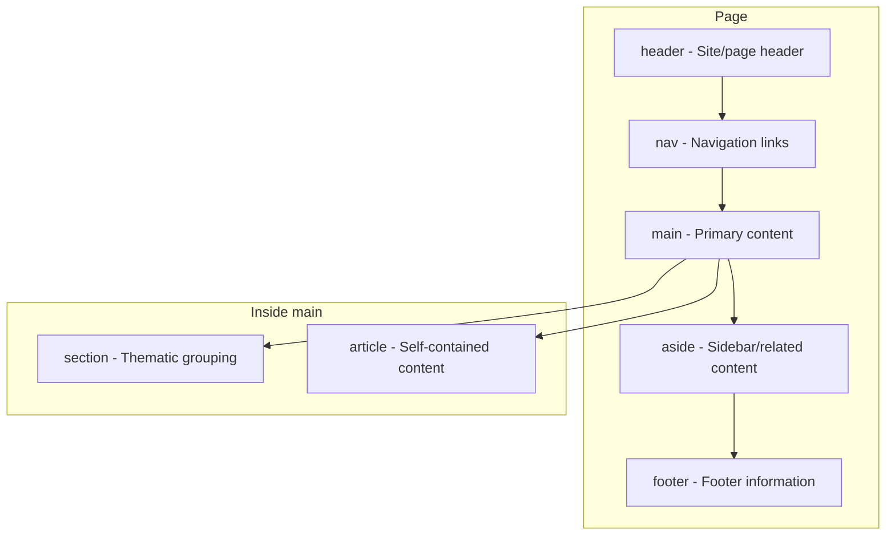
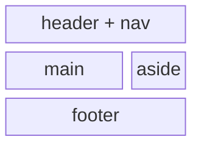

# Semantic HTML

## What is Semantic HTML?

Semantic HTML means using HTML elements that **clearly describe their meaning** — both to developers reading the code and to machines (browsers, search engines, screen readers) parsing it. Instead of using generic containers like `<div>` and `<span>` for everything, you use elements like `<nav>`, `<article>`, `<header>`, and `<footer>` that explicitly communicate the role of the content they contain.

**Analogy**: Imagine moving into a new apartment. Unlabeled cardboard boxes tell you nothing — you have to open each one to find the kitchen utensils. But boxes labeled "Kitchen," "Bedroom," "Bathroom" let you know immediately what is inside and where it belongs. Semantic HTML is labeling your boxes. Generic `<div>` elements are the unlabeled ones.

## Why Semantic HTML Matters

### 1. Accessibility

Screen readers use semantic elements as landmarks to navigate pages. A blind user can jump directly to `<nav>` to find links, or skip to `<main>` to reach the primary content. Without semantic markup, they must wade through every element sequentially.

### 2. SEO

Search engines prioritize content inside `<main>` and `<article>` differently than content in `<aside>` or `<footer>`. Proper semantics help crawlers understand what your core content is versus what is supplementary.

### 3. Code Readability

```html
<!-- Without semantics — what is this? -->
<div class="top-bar">
  <div class="links">...</div>
</div>
<div class="content">...</div>
<div class="bottom">...</div>

<!-- With semantics — instantly clear -->
<header>
  <nav>...</nav>
</header>
<main>...</main>
<footer>...</footer>
```

### 4. Browser Features

Reading mode (like Firefox's Reader View or Safari's Reader) uses semantic elements to extract the primary article content and strip away navigation, ads, and sidebars.

## The Semantic Elements

### Page Structure Diagram



### Visual Layout Representation



## Element Deep Dive

### `<header>`

Represents introductory content — typically a group of introductory or navigational aids.

```html
<header>
  <h1>My Website</h1>
  <nav>
    <a href="/">Home</a>
    <a href="/about">About</a>
  </nav>
</header>
```

- Can appear inside `<article>` or `<section>` too (for section-level headers).
- **Not** the same as the `<head>` element (which is metadata, not content).
- A page can have multiple `<header>` elements.

### `<nav>`

Represents a section of navigation links.

```html
<nav aria-label="Main navigation">
  <ul>
    <li><a href="/">Home</a></li>
    <li><a href="/products">Products</a></li>
    <li><a href="/contact">Contact</a></li>
  </ul>
</nav>
```

- Use for **major** navigation blocks, not every group of links.
- A page might have multiple `<nav>` elements (main nav, footer nav, breadcrumbs).
- Adding `aria-label` distinguishes multiple navs for screen reader users.

### `<main>`

Represents the **dominant content** of the `<body>`. Content that is unique to this page and not repeated across pages.

```html
<main>
  <h1>How to Learn JavaScript</h1>
  <article>
    <p>JavaScript is a versatile programming language...</p>
  </article>
</main>
```

- There must be only **one `<main>`** per page.
- Should not contain content repeated across pages (navigation, sidebars, footers).
- `<main>` is the landmark that allows screen reader users to skip directly to the "meat" of the page.

### `<section>`

Represents a **thematic grouping** of content, typically with a heading.

```html
<section>
  <h2>Features</h2>
  <p>Our product offers the following features...</p>
</section>

<section>
  <h2>Pricing</h2>
  <p>Choose the plan that works for you...</p>
</section>
```

- Use when content has a natural heading and forms a distinct topic.
- Do not use as a generic wrapper — that is what `<div>` is for.
- The rule of thumb: if you would add it to a table of contents, it is a `<section>`.

### `<article>`

Represents a **self-contained, independently distributable** piece of content.

```html
<article>
  <header>
    <h2>Understanding Closures in JavaScript</h2>
    <time datetime="2024-03-15">March 15, 2024</time>
  </header>
  <p>
    A closure is a function that remembers the variables from its outer scope...
  </p>
  <footer>
    <p>Written by Jane Doe</p>
  </footer>
</article>
```

- Ask yourself: "Would this make sense on its own, out of context?" Blog posts, news articles, comments, forum posts, product cards — all `<article>`.
- Articles can be nested (e.g., an article with user comments, where each comment is also an `<article>`).

### `<aside>`

Represents content **tangentially related** to the surrounding content.

```html
<main>
  <article>
    <h2>CSS Grid Layout</h2>
    <p>CSS Grid is a two-dimensional layout system...</p>
  </article>

  <aside>
    <h3>Related Articles</h3>
    <ul>
      <li><a href="/flexbox">Flexbox Guide</a></li>
      <li><a href="/positioning">CSS Positioning</a></li>
    </ul>
  </aside>
</main>
```

- Sidebars, pull quotes, advertising, related links.
- Screen readers can identify this as supplementary and let users skip it.

### `<footer>`

Represents the footer of its nearest sectioning ancestor.

```html
<footer>
  <p>Copyright 2024 My Company</p>
  <nav aria-label="Footer navigation">
    <a href="/privacy">Privacy Policy</a>
    <a href="/terms">Terms of Service</a>
  </nav>
</footer>
```

- Typically contains copyright, contact info, related links.
- Can appear inside `<article>` or `<section>` too.

## Semantic vs Non-Semantic Comparison

```html
<!-- Non-semantic: Screen readers see a flat, meaningless structure -->
<div id="header">
  <div class="nav">...</div>
</div>
<div id="main">
  <div class="post">
    <div class="post-header">...</div>
    <div class="post-body">...</div>
  </div>
</div>
<div id="sidebar">...</div>
<div id="footer">...</div>

<!-- Semantic: Screen readers see landmarks and structure -->
<header>
  <nav aria-label="Main">...</nav>
</header>
<main>
  <article>
    <header>...</header>
    <p>...</p>
  </article>
</main>
<aside>...</aside>
<footer>...</footer>
```

## When to Use `<div>` (It Is Still Valid)

`<div>` is not evil — it is a **generic container** for when no semantic element fits. Use it for:

- CSS layout wrappers (flexbox/grid containers)
- JavaScript hooks that need a DOM reference
- Grouping elements purely for styling

```html
<!-- Correct use of div: layout wrapper with no semantic meaning -->
<div class="card-grid">
  <article class="card">...</article>
  <article class="card">...</article>
</div>
```

## Best Practices

- Use semantic elements wherever their meaning applies — default to semantics, fall back to `<div>`.
- Only one `<main>` per page.
- `<section>` should always have a heading. If it does not need one, it might be a `<div>`.
- `<article>` should be independently meaningful.
- Use `aria-label` to distinguish multiple `<nav>` or `<aside>` elements.
- Do not replace CSS layout with semantic elements (do not use `<section>` just because you need a flex container).

## Common Mistakes

| Mistake                                      | Why It Is Wrong                                      | Fix                                         |
| -------------------------------------------- | ---------------------------------------------------- | ------------------------------------------- |
| Using `<section>` as a `<div>` replacement   | Adds false semantic meaning; confuses assistive tech | Use `<div>` for non-semantic grouping       |
| Putting repeated content in `<main>`         | `<main>` is for unique page content only             | Keep nav/sidebar outside `<main>`           |
| No headings inside `<section>`               | A section without a heading lacks identity           | Add an appropriate heading or use `<div>`   |
| Using `<article>` for non-standalone content | Misrepresents content as independently distributable | Use `<section>` for thematic groupings      |
| Ignoring semantic elements entirely          | Hurts accessibility, SEO, and code readability       | Learn the elements; they exist for a reason |

## Summary

- Semantic HTML elements (`<header>`, `<nav>`, `<main>`, `<section>`, `<article>`, `<aside>`, `<footer>`) describe the **role** of content, not just its visual appearance.
- They enable screen reader navigation, improve SEO, support browser features like reading mode, and make code easier to understand.
- Use `<div>` only when no semantic element fits. It is a last resort, not a first choice.
- The test for semantic correctness: "If I removed all CSS, would the document structure still communicate meaning?" If yes, your semantics are sound.
