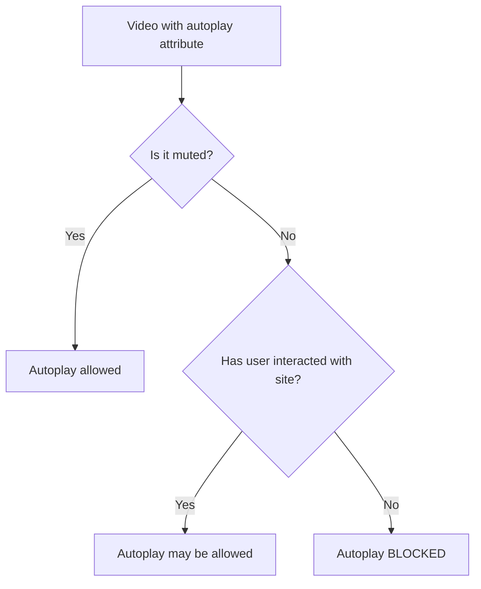

# Audio and Video in HTML

## What Are the Audio and Video Elements?

HTML5 introduced native `<audio>` and `<video>` elements that allow you to embed media directly into web pages without third-party plugins like Flash or Silverlight. These elements provide built-in controls, programmatic access via JavaScript, and graceful fallback mechanisms.

**Analogy**: Before HTML5, embedding media was like needing a special adapter to plug your device into a foreign outlet. Flash was that adapter — proprietary, battery-draining, and security-prone. HTML5's native elements are like having a universal socket built into the wall: no adapters needed, just plug in and play.

## Why It Matters

- **No plugin dependencies**: Works natively in all modern browsers.
- **Mobile support**: iOS never supported Flash. Native media is the only option on mobile.
- **Accessibility**: Native controls are keyboard-navigable and screen-reader compatible.
- **Performance**: No overhead of loading a plugin runtime.
- **JavaScript API**: Full programmatic control (play, pause, seek, volume, events).

## The `<audio>` Element

### Basic Usage

```html
<audio controls>
  <source src="song.mp3" type="audio/mpeg" />
  <source src="song.ogg" type="audio/ogg" />
  <p>
    Your browser does not support the audio element.
    <a href="song.mp3">Download the audio</a>.
  </p>
</audio>
```

### Attributes

| Attribute  | Description                                              |
| ---------- | -------------------------------------------------------- |
| `controls` | Displays play/pause, volume, seek bar                    |
| `autoplay` | Starts playing automatically (often blocked by browsers) |
| `loop`     | Restarts from the beginning when it reaches the end      |
| `muted`    | Starts with volume at zero                               |
| `preload`  | Hint for how much to buffer: `none`, `metadata`, `auto`  |

### Supported Audio Formats

| Format      | MIME Type    | Browser Support             |
| ----------- | ------------ | --------------------------- |
| MP3         | `audio/mpeg` | Universal                   |
| OGG Vorbis  | `audio/ogg`  | Firefox, Chrome, Edge       |
| WAV         | `audio/wav`  | Universal (but large files) |
| AAC         | `audio/aac`  | Safari, Chrome, Edge        |
| WebM (Opus) | `audio/webm` | Chrome, Firefox, Edge       |

**Best practice**: Provide MP3 as the primary source (universal support) and OGG or WebM as an alternative for better compression in supporting browsers.

## The `<video>` Element

### Basic Usage

```html
<video controls width="720" height="405">
  <source src="tutorial.mp4" type="video/mp4" />
  <source src="tutorial.webm" type="video/webm" />
  <p>
    Your browser does not support the video element.
    <a href="tutorial.mp4">Download the video</a>.
  </p>
</video>
```

### Attributes

| Attribute          | Description                                              |
| ------------------ | -------------------------------------------------------- |
| `controls`         | Displays play/pause, volume, seek bar, fullscreen button |
| `autoplay`         | Starts playing automatically (usually requires `muted`)  |
| `loop`             | Restarts from the beginning when it ends                 |
| `muted`            | Starts with audio muted                                  |
| `poster`           | Image to display before the video plays                  |
| `width` / `height` | Sets dimensions (prevents layout shift)                  |
| `preload`          | `none`, `metadata`, or `auto`                            |
| `playsinline`      | Plays inline on iOS instead of entering fullscreen       |

### Supported Video Formats

| Format           | MIME Type    | Browser Support           |
| ---------------- | ------------ | ------------------------- |
| MP4 (H.264)      | `video/mp4`  | Universal                 |
| WebM (VP8/VP9)   | `video/webm` | Chrome, Firefox, Edge     |
| OGG (Theora)     | `video/ogg`  | Firefox, Chrome (legacy)  |
| MP4 (H.265/HEVC) | `video/mp4`  | Safari, some Edge         |
| MP4 (AV1)        | `video/mp4`  | Chrome, Firefox (growing) |

**Best practice**: Provide MP4 (H.264) as the primary format and WebM (VP9) as an alternative for better compression.

## The `<source>` Element

The `<source>` element lets you provide multiple file formats. The browser plays the **first one it supports**.

```html
<video controls>
  <!-- Browser tries these in order, uses first compatible format -->
  <source src="video.webm" type="video/webm" />
  <source src="video.mp4" type="video/mp4" />
</video>
```

The `type` attribute is important — it lets the browser skip formats it cannot play without downloading them first.

## The `poster` Attribute

```html
<video controls poster="thumbnail.jpg" width="720" height="405">
  <source src="lecture.mp4" type="video/mp4" />
</video>
```

The poster is the preview image shown before playback begins. Without it, the browser shows either a black frame or the first frame of the video (browser-dependent).

## Autoplay Policies

Modern browsers **block autoplay with sound** to prevent annoying user experiences. The rules:



To reliably autoplay (e.g., background video):

```html
<!-- This will autoplay reliably because it is muted -->
<video autoplay muted loop playsinline>
  <source src="background.mp4" type="video/mp4" />
</video>
```

## Fallback Content

Always provide fallback for browsers that do not support the media element:

```html
<video controls>
  <source src="demo.mp4" type="video/mp4" />
  <source src="demo.webm" type="video/webm" />
  <!-- Fallback: shown only if <video> is not supported -->
  <p>
    Your browser does not support HTML5 video. You can
    <a href="demo.mp4">download the video</a> instead.
  </p>
</video>
```

## Adding Subtitles and Captions

```html
<video controls>
  <source src="movie.mp4" type="video/mp4" />
  <track
    src="captions-en.vtt"
    kind="captions"
    srclang="en"
    label="English"
    default
  />
  <track src="subtitles-es.vtt" kind="subtitles" srclang="es" label="Spanish" />
</video>
```

The `<track>` element provides timed text tracks (WebVTT format) for:

- **captions**: Dialogue and sound descriptions for deaf/hard-of-hearing users.
- **subtitles**: Translations of dialogue.
- **descriptions**: Text descriptions of visual content for blind users.

## JavaScript API (Brief Overview)

```html
<video id="myVideo" src="video.mp4"></video>

<script>
  const video = document.getElementById("myVideo");

  video.play(); // Start playback
  video.pause(); // Pause playback
  video.currentTime = 30; // Seek to 30 seconds
  video.volume = 0.5; // Set volume to 50%
  video.playbackRate = 1.5; // 1.5x speed
</script>
```

## Best Practices

- Always include `controls` unless you are building a custom player.
- Provide multiple `<source>` formats for broader compatibility.
- Always include the `type` attribute on `<source>` elements.
- Use `poster` on videos to prevent layout shift and provide visual context.
- Set explicit `width` and `height` to prevent cumulative layout shift (CLS).
- Provide `<track>` elements for accessibility (captions, subtitles).
- Use `preload="metadata"` to load duration/dimensions without downloading the full file.
- Use `muted autoplay` for background or decorative videos.
- Provide download links as fallback content.

## Common Mistakes

| Mistake                  | Why It Is a Problem                                          | Fix                                     |
| ------------------------ | ------------------------------------------------------------ | --------------------------------------- |
| Autoplay with sound      | Browsers block it; bad UX                                    | Use `muted` with `autoplay`             |
| Missing `type` attribute | Browser may download file only to discover it cannot play it | Always specify MIME type                |
| No fallback content      | Older browsers show nothing                                  | Add text and download link              |
| Only one format          | May not play in all browsers                                 | Provide MP4 + WebM                      |
| No `poster` on video     | Black rectangle before play; looks broken                    | Add a meaningful poster image           |
| Missing width/height     | Layout shift when video loads                                | Set explicit dimensions or aspect-ratio |
| No captions/subtitles    | Inaccessible to deaf users                                   | Add WebVTT track files                  |

## Summary

- HTML5 `<audio>` and `<video>` provide native media playback without plugins.
- Use `<source>` to offer multiple formats; browsers use the first one they support.
- Key attributes: `controls`, `autoplay`, `muted`, `loop`, `poster`, `preload`.
- Modern browsers block unmuted autoplay — respect user preferences.
- Always provide fallback content and caption tracks for accessibility.
- The JavaScript API gives full programmatic control for custom player interfaces.
