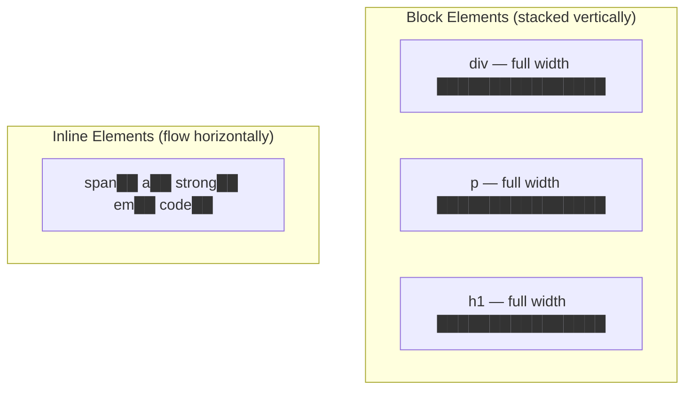

# Block vs Inline Elements

## What Are Block and Inline Elements?

Every HTML element has a default **display behavior** that determines how it occupies space on the page. The two fundamental categories are:

- **Block-level elements**: Take up the full available width and always start on a new line.
- **Inline elements**: Take up only as much width as their content requires and sit side-by-side within a line of text.

**Analogy**: Think of block elements as shipping containers stacked in a warehouse — each one occupies an entire row, and the next one goes below it. Inline elements are like words in a sentence — they flow next to each other until the line runs out of space, then wrap to the next line.

## Why It Matters

- Understanding block vs inline is essential for predicting layout behavior.
- It determines which CSS properties work on an element (width/height work on block, not on inline).
- It affects how elements nest inside each other (block can contain inline, but inline cannot contain block).
- It is the foundation for understanding CSS display, flexbox, and grid.

## Block-Level Elements

### Characteristics

| Property         | Behavior                                 |
| ---------------- | ---------------------------------------- |
| Width            | Takes up 100% of parent width by default |
| Height           | Determined by content                    |
| New line         | Always starts on a new line              |
| Margins          | Top and bottom margins are respected     |
| Padding          | All padding is respected                 |
| Width/Height CSS | Can be set explicitly                    |

### Common Block Elements

```html
<div>Generic block container</div>
<p>Paragraph</p>
<h1>Heading</h1>
<!-- h1 through h6 -->
<ul>
  <li>List</li>
</ul>
<ol>
  <li>Ordered list</li>
</ol>
<table>
  ...
</table>
<form>...</form>
<header>...</header>
<nav>...</nav>
<main>...</main>
<section>...</section>
<article>...</article>
<aside>...</aside>
<footer>...</footer>
<blockquote>...</blockquote>
<pre>...</pre>
```

### Block Behavior Illustrated

```html
<div style="background: lightblue;">Block 1 — full width</div>
<div style="background: lightcoral;">Block 2 — starts on new line</div>
<div style="background: lightgreen;">Block 3 — also new line</div>
```

Result: Three colored bars stacked vertically, each spanning the full width.

## Inline Elements

### Characteristics

| Property         | Behavior                                                                              |
| ---------------- | ------------------------------------------------------------------------------------- |
| Width            | Only as wide as its content                                                           |
| Height           | Only as tall as its content (line height)                                             |
| New line         | Does NOT start a new line                                                             |
| Margins          | Only left and right margins are respected                                             |
| Padding          | Left/right padding works; top/bottom padding renders but does NOT push other elements |
| Width/Height CSS | CANNOT be set (ignored)                                                               |

### Common Inline Elements

```html
<span>Generic inline container</span>
<a href="#">Link</a>
<strong>Strong text</strong>
<em>Emphasized text</em>

<!-- Inline, but special (replaced element) -->
<code>Code snippet</code>
<br />
<!-- Line break -->
<input type="text" />
<!-- Inline, but special (replaced element) -->
<label>Label text</label>
<abbr title="HyperText Markup Language">HTML</abbr>
<time datetime="2024-01-01">January 1</time>
```

### Inline Behavior Illustrated

```html
<span style="background: lightblue;">Inline 1</span>
<span style="background: lightcoral;">Inline 2</span>
<span style="background: lightgreen;">Inline 3</span>
```

Result: Three colored text boxes sitting side by side on the same line.

## Visual Comparison



## The Nesting Rule

**Block elements can contain inline elements and other block elements.**
**Inline elements can contain only other inline elements (not block elements).**

```html
<!-- CORRECT: Block contains inline -->
<p>
  This paragraph has a <strong>bold word</strong> and a <a href="#">link</a>.
</p>

<!-- CORRECT: Block contains block -->
<div>
  <p>A paragraph inside a div.</p>
</div>

<!-- INCORRECT: Inline contains block -->
<span>
  <p>This is invalid — a p inside a span.</p>
</span>

<!-- INCORRECT: Inline (a) wrapping a block -->
<!-- EXCEPTION: In HTML5, <a> CAN wrap block elements! This is a special case. -->
<a href="/article">
  <article>
    <h2>Clickable Article</h2>
    <p>This entire card is a link.</p>
  </article>
</a>
```

## Inline-Block: The Hybrid

CSS provides a third display mode: `inline-block`. It combines characteristics of both:

```html
<span
  style="display: inline-block; width: 100px; height: 100px; background: coral;"
>
  Box 1
</span>
<span
  style="display: inline-block; width: 100px; height: 100px; background: skyblue;"
>
  Box 2
</span>
```

| Property                   | Block | Inline          | Inline-Block |
| -------------------------- | ----- | --------------- | ------------ |
| Starts new line            | Yes   | No              | No           |
| Respects width/height      | Yes   | No              | Yes          |
| Respects all margins       | Yes   | Left/Right only | Yes          |
| Sits beside other elements | No    | Yes             | Yes          |

## Replaced Elements (Special Case)

Some elements are technically inline but behave differently because they are **replaced elements** — their content comes from an external source:

- `` — inline but respects width/height
- `<input>` — inline but respects width/height
- `<video>` — inline but respects width/height
- `<canvas>` — inline but respects width/height

These elements behave like `inline-block` by default even though they are classified as inline.

## Changing Display Behavior with CSS

```css
/* Make a block element behave inline */
div.tag {
  display: inline;
}

/* Make an inline element behave as block */
span.full-width {
  display: block;
}

/* Make a list horizontal */
li {
  display: inline-block;
}

/* Modern approach: Flexbox/Grid override all of this */
.container {
  display: flex; /* Children become flex items regardless of block/inline */
}
```

## Best Practices

- Understand the default display type of elements so you can predict layout without guessing.
- Do not fight the default behavior with excessive CSS — choose the right element for the job.
- Use `<div>` for block-level generic containers, `<span>` for inline generic containers.
- Respect the nesting rule: do not put block elements inside inline elements (except `<a>` in HTML5).
- When you need inline elements with width/height, use `display: inline-block` or flexbox.

## Common Mistakes

| Mistake                                             | Why It Is Wrong                                        | Fix                                              |
| --------------------------------------------------- | ------------------------------------------------------ | ------------------------------------------------ |
| Setting width on a `<span>`                         | Inline elements ignore width/height                    | Use `display: inline-block` or a block element   |
| Expecting top/bottom margin on inline               | Inline elements ignore vertical margins                | Use `display: block` or `inline-block`           |
| Nesting `<div>` inside `<span>`                     | Violates inline-cannot-contain-block rule              | Use a block container or restructure             |
| Using `<br>` to create space between block elements | Misuse of line breaks; fragile spacing                 | Use CSS margin between blocks                    |
| Forgetting that `` is inline                   | Images sit on text baselines; may have unexpected gaps | Use `display: block` or `vertical-align: middle` |

## Summary

- Block elements stack vertically and take full width. Inline elements flow horizontally and take only the width they need.
- This distinction determines which CSS properties work, how elements nest, and how layout flows.
- `inline-block` is the hybrid: inline flow with block-level dimension control.
- Replaced elements (``, `<input>`) break the normal inline rules — they accept width/height despite being inline.
- CSS `display` property can override any default, but understanding the defaults is essential for writing predictable layouts.
