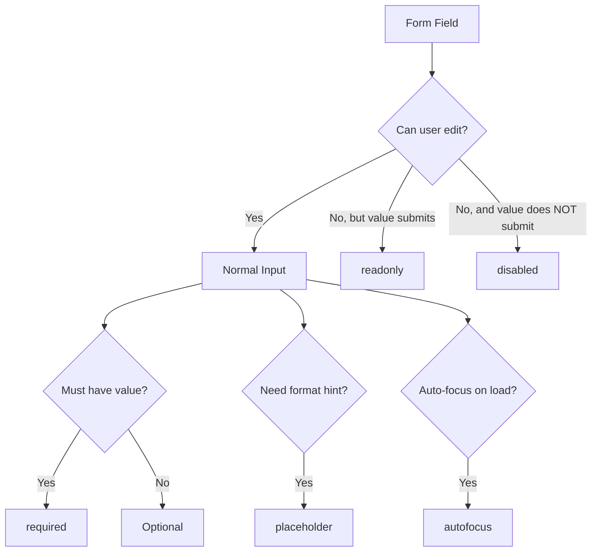

# HTML5 Form Attributes

## What Are HTML5 Attributes?

HTML5 introduced a set of attributes for form elements that provide built-in behavior previously requiring JavaScript. These attributes handle validation, user experience hints, and input state directly in markup — reducing code complexity and improving consistency across browsers.

**Analogy**: Think of these attributes as smart features built into a physical form. `required` is like the red asterisk that prevents submission without an answer. `placeholder` is the light gray example text pre-printed in the field. `readonly` is a pre-filled field behind a glass panel — you can see it but cannot change it. `disabled` is a field that has been blacked out entirely — invisible to the submission process.

## Why They Matter

- **Less JavaScript**: Validation and UX hints happen natively without custom code.
- **Consistent behavior**: Browser-native implementations work the same across devices.
- **Accessibility**: Screen readers announce these states (required, disabled, etc.) automatically.
- **Mobile UX**: Attributes like `autofocus` improve form usability on touch devices.
- **Progressive enhancement**: These attributes work even if JavaScript fails to load.

## The Attributes

### `required`

Prevents form submission until the field has a value.

```html
<form>
  <label for="email">Email (required):</label>
  <input type="email" id="email" name="email" required />

  <label for="name">Name (required):</label>
  <input type="text" id="name" name="name" required />

  <button type="submit">Submit</button>
</form>
```

**Behavior**:

- Browser shows a validation tooltip if the user tries to submit with an empty required field.
- Screen readers announce "required" when the field is focused.
- Works on `<input>`, `<select>`, and `<textarea>`.
- CSS pseudo-classes `:required` and `:valid`/`:invalid` can style these fields.

```css
input:required {
  border-left: 3px solid red;
}
input:valid {
  border-left: 3px solid green;
}
```

### `placeholder`

Shows hint text inside the field that disappears when the user starts typing.

```html
<input type="text" name="search" placeholder="Search articles..." />
<input type="email" name="email" placeholder="you@example.com" />
<textarea name="bio" placeholder="Tell us about yourself..."></textarea>
```

**Important distinctions**:

- Placeholder is NOT a substitute for `<label>`. It disappears on focus and is not announced by all screen readers.
- Placeholder is a hint about the expected format, not a description of the field.
- Low contrast of default placeholder text can be an accessibility concern.

```html
<!-- WRONG: Placeholder as label -->
<input type="text" placeholder="Full Name" />

<!-- CORRECT: Label AND placeholder -->
<label for="fullname">Full Name</label>
<input
  type="text"
  id="fullname"
  name="fullname"
  placeholder="e.g., John Smith"
/>
```

### `readonly`

The field displays its value but the user cannot modify it. The value IS submitted with the form.

```html
<label for="order-id">Order ID:</label>
<input type="text" id="order-id" name="orderId" value="ORD-12345" readonly />

<label for="total">Total:</label>
<input type="number" id="total" name="total" value="99.99" readonly />
```

**When to use**:

- Displaying calculated values that should not be edited.
- Showing information that needs to be submitted but not changed.
- Confirming data before final submission.

### `disabled`

The field is grayed out, cannot be interacted with, and its value is NOT submitted with the form.

```html
<label for="plan">Current Plan:</label>
<input type="text" id="plan" name="plan" value="Free Tier" disabled />

<label for="upgrade">Upgrade to:</label>
<select id="upgrade" name="upgrade" disabled>
  <option>Pro Plan</option>
  <option>Enterprise</option>
</select>

<button type="submit" disabled>Submit (disabled until form is valid)</button>
```

**Key differences from readonly**:

| Feature                 | `readonly`                                  | `disabled`                                   |
| ----------------------- | ------------------------------------------- | -------------------------------------------- |
| User can interact       | No (cannot edit, CAN focus and select text) | No (cannot focus, click, or interact at all) |
| Value submitted in form | Yes                                         | No                                           |
| Visual appearance       | Normal (or slightly muted)                  | Grayed out                                   |
| Receives focus          | Yes                                         | No                                           |
| Works on buttons        | No                                          | Yes                                          |
| Keyboard navigable      | Yes (Tab reaches it)                        | No (Tab skips it)                            |

### `autofocus`

Automatically focuses the input when the page loads.

```html
<!-- The cursor will be in this field when the page loads -->
<input type="search" name="q" autofocus placeholder="Search..." />
```

**Rules and considerations**:

- Only ONE element per page should have `autofocus`.
- Can be used on `<input>`, `<textarea>`, `<select>`, and `<button>`.
- Problematic for accessibility: it moves focus unexpectedly, which can disorient screen reader users.
- Best suited for pages where the primary purpose is a single form (login page, search page).

```html
<!-- Good use: Search page where the search box is the whole point -->
<main>
  <h1>Search Our Catalog</h1>
  <input type="search" name="q" autofocus />
</main>

<!-- Bad use: Long page where autofocus scrolls past important content -->
<main>
  <h1>Welcome to Our Site</h1>
  <p>Important information here that gets skipped...</p>
  <!-- ... many lines later ... -->
  <input type="text" name="newsletter" autofocus />
  <!-- User misses all content above -->
</main>
```

## Additional HTML5 Attributes

### `autocomplete`

Controls whether the browser suggests previously entered values.

```html
<!-- Let browser suggest previously entered emails -->
<input type="email" name="email" autocomplete="email" />

<!-- Disable autocomplete for sensitive fields -->
<input type="text" name="otp" autocomplete="off" />

<!-- Common autocomplete values -->
<input type="text" name="fname" autocomplete="given-name" />
<input type="text" name="lname" autocomplete="family-name" />
<input type="tel" name="phone" autocomplete="tel" />
<input type="text" name="address" autocomplete="street-address" />
```

### `spellcheck`

Controls whether the browser checks spelling in the field.

```html
<textarea name="message" spellcheck="true">Check my spelling</textarea>
<input type="text" name="code" spellcheck="false" />
<!-- Code shouldn't be spell-checked -->
```

### `pattern`

Validates input against a regular expression.

```html
<!-- Only allows letters and spaces -->
<input
  type="text"
  name="name"
  pattern="[A-Za-z\s]+"
  title="Only letters and spaces allowed"
/>

<!-- Phone number format -->
<input
  type="tel"
  name="phone"
  pattern="[0-9]{10}"
  title="Enter a 10-digit phone number"
/>
```

### `min`, `max`, `step`

Constrain numeric and date inputs.

```html
<input type="number" name="age" min="18" max="120" step="1" />
<input type="date" name="start" min="2024-01-01" max="2024-12-31" />
<input type="range" name="volume" min="0" max="100" step="5" />
```

## Attribute Interaction Diagram



## Best Practices

- Always pair `placeholder` with a visible `<label>` — placeholders are hints, not labels.
- Use `required` for mandatory fields instead of custom JavaScript validation.
- Prefer `readonly` over `disabled` when the value must be submitted.
- Use `autofocus` sparingly — only on pages where a single input is the primary action.
- Combine `pattern` with `title` to explain the expected format to users.
- Use the `title` attribute with `pattern` to provide custom validation messages.
- Use `autocomplete` with appropriate token values to help browsers autofill correctly.

## Common Mistakes

| Mistake                                   | Why It Is Wrong                              | Fix                               |
| ----------------------------------------- | -------------------------------------------- | --------------------------------- |
| Using placeholder instead of label        | Disappears on focus; not accessible          | Always include a `<label>`        |
| Using `disabled` when value should submit | Disabled values are excluded from form data  | Use `readonly` instead            |
| Multiple `autofocus` elements             | Only first one works; confusing behavior     | One `autofocus` per page maximum  |
| `required` without visual indication      | Users do not know which fields are mandatory | Add asterisk or "(required)" text |
| Relying solely on HTML validation         | Can be bypassed; no server-side protection   | Always validate on the server too |

## Summary

- HTML5 attributes (`required`, `placeholder`, `readonly`, `disabled`, `autofocus`) provide native form behavior without JavaScript.
- `required` prevents submission of empty mandatory fields.
- `placeholder` provides format hints but is never a replacement for labels.
- `readonly` allows viewing and submission but prevents editing.
- `disabled` completely removes the element from interaction and form submission.
- `autofocus` places the cursor automatically but should be used thoughtfully for accessibility.
- These attributes are progressive enhancement — they improve UX when supported but should always be backed by server-side validation.
