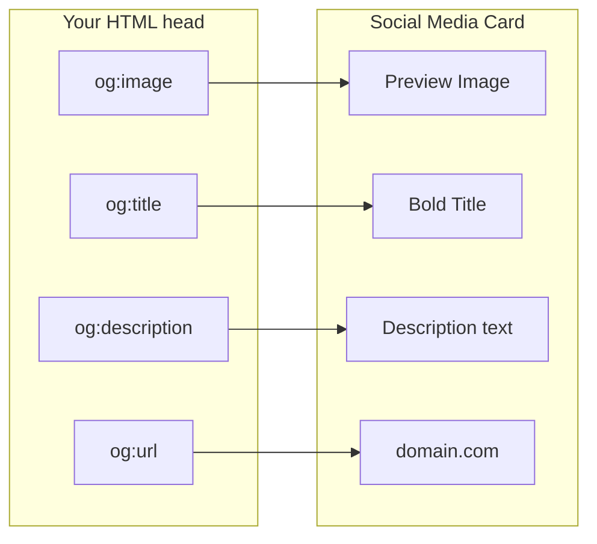

# Meta Tags

## What Are Meta Tags?

Meta tags are HTML elements placed in the `<head>` section that provide **metadata** — information about the page that is not visible to users but is critical for browsers, search engines, and social media platforms. They control how your page is rendered, indexed, shared, and displayed across the web.

**Analogy**: Think of meta tags as the information on the back cover and copyright page of a book. Readers rarely look at it, but bookstores use it to categorize the book, search systems use it to index it, and the ISBN tells the supply chain what it is. Without this metadata, the book's content might be excellent, but it would be nearly impossible to discover or properly display.

## Why Meta Tags Matter

- **SEO**: Search engines use meta descriptions for result snippets and interpret meta tags for indexing decisions.
- **Responsive Design**: The viewport meta tag is required for mobile-friendly rendering.
- **Social Sharing**: Open Graph and Twitter Card tags control how your page appears when shared on social media.
- **Character Encoding**: Without charset declaration, text may render incorrectly.
- **Browser Behavior**: Meta tags can control caching, refresh intervals, and compatibility modes.

## Essential Meta Tags

### Character Set

```html
<meta charset="UTF-8" />
```

Declares the character encoding. UTF-8 supports all characters from all languages. This must be the **first element** in `<head>` so the browser knows how to decode everything that follows.

### Viewport (Responsive Design)

```html
<meta name="viewport" content="width=device-width, initial-scale=1.0" />
```

Without this, mobile browsers render your page at desktop width (~980px) and zoom out. This single tag is what makes responsive CSS actually work on mobile devices.

| Property             | Purpose                                               |
| -------------------- | ----------------------------------------------------- |
| `width=device-width` | Match viewport to device screen width                 |
| `initial-scale=1.0`  | No zoom on initial load                               |
| `maximum-scale=1.0`  | Prevent user zoom (avoid this — accessibility issue)  |
| `user-scalable=no`   | Disable pinch zoom (avoid this — accessibility issue) |

### Page Description

```html
<meta
  name="description"
  content="Learn HTML from scratch with comprehensive,
beginner-friendly tutorials covering semantics, forms, accessibility, and best practices."
/>
```

The description meta tag is arguably the most important for SEO. Search engines often display this as the snippet below your page title in results.

**Guidelines**:

- Keep between 120-160 characters.
- Make it compelling — it is your page's "elevator pitch" in search results.
- Include relevant keywords naturally.
- Each page should have a unique description.

### Keywords (Historical Context)

```html
<meta
  name="keywords"
  content="HTML, tutorial, web development, semantic markup"
/>
```

**Reality check**: Google has publicly stated it does NOT use the keywords meta tag for ranking since 2009. It was abused so heavily by spammers that it became worthless. Some other search engines may still use it, but it has negligible SEO value today. Include it if you want, but do not rely on it.

### Author

```html
<meta name="author" content="Jane Smith" />
```

Identifies the content author. Used by some CMS systems and can appear in browser interfaces.

### Robots

```html
<!-- Allow indexing and following links (default behavior) -->
<meta name="robots" content="index, follow" />

<!-- Prevent indexing this page -->
<meta name="robots" content="noindex, nofollow" />

<!-- Index page but don't follow links -->
<meta name="robots" content="index, nofollow" />
```

Controls search engine crawler behavior:

- `index` / `noindex`: Whether to include the page in search results.
- `follow` / `nofollow`: Whether to follow links on the page.
- `noarchive`: Do not show cached version in search results.
- `nosnippet`: Do not show description snippet.

## Open Graph Tags (Social Media)

Open Graph (OG) tags control how your page appears when shared on Facebook, LinkedIn, Discord, Slack, and most social platforms.

```html
<meta property="og:title" content="Complete Guide to HTML Meta Tags" />
<meta
  property="og:description"
  content="Everything you need to know about meta tags for SEO, social sharing, and responsive design."
/>
<meta
  property="og:image"
  content="https://example.com/images/meta-tags-guide.png"
/>
<meta property="og:url" content="https://example.com/html-meta-tags" />
<meta property="og:type" content="article" />
<meta property="og:site_name" content="Web Dev Academy" />
```

### How OG Tags Map to Social Cards



### Twitter Card Tags

Twitter (X) has its own card system that falls back to OG tags if not present:

```html
<meta name="twitter:card" content="summary_large_image" />
<meta name="twitter:site" content="@yourusername" />
<meta name="twitter:title" content="Complete Guide to HTML Meta Tags" />
<meta
  name="twitter:description"
  content="Everything about meta tags for modern web development."
/>
<meta name="twitter:image" content="https://example.com/images/card.png" />
```

Card types: `summary`, `summary_large_image`, `app`, `player`.

## Other Useful Meta Tags

### Theme Color (Mobile Browsers)

```html
<!-- Colors the browser's address bar on mobile -->
<meta name="theme-color" content="#1a73e8" />
```

### HTTP Equiv Tags

```html
<!-- Redirect after 5 seconds -->
<meta http-equiv="refresh" content="5; url=https://example.com/new-page" />

<!-- Set content language (prefer lang attribute on html instead) -->
<meta http-equiv="content-language" content="en" />

<!-- Control caching (prefer HTTP headers instead) -->
<meta http-equiv="cache-control" content="no-cache" />
```

### Favicon Reference (Not a Meta Tag, But Related)

```html
<link rel="icon" type="image/png" href="/favicon.png" />
<link rel="apple-touch-icon" href="/apple-touch-icon.png" />
```

## Complete Meta Tag Template

```html
<head>
  <!-- Essential -->
  <meta charset="UTF-8" />
  <meta name="viewport" content="width=device-width, initial-scale=1.0" />
  <title>Page Title — Site Name</title>
  <meta
    name="description"
    content="Concise, compelling page description (120-160 chars)"
  />

  <!-- SEO -->
  <meta name="robots" content="index, follow" />
  <meta name="author" content="Author Name" />
  <link rel="canonical" href="https://example.com/this-page" />

  <!-- Open Graph -->
  <meta property="og:title" content="Page Title" />
  <meta property="og:description" content="Description for social sharing" />
  <meta property="og:image" content="https://example.com/og-image.png" />
  <meta property="og:url" content="https://example.com/this-page" />
  <meta property="og:type" content="website" />

  <!-- Twitter -->
  <meta name="twitter:card" content="summary_large_image" />
  <meta name="twitter:title" content="Page Title" />
  <meta name="twitter:description" content="Description for Twitter" />
  <meta name="twitter:image" content="https://example.com/twitter-image.png" />

  <!-- Mobile -->
  <meta name="theme-color" content="#ffffff" />

  <!-- Favicon -->
  <link rel="icon" type="image/png" href="/favicon.png" />
</head>
```

## Best Practices

- Always include charset, viewport, title, and description.
- Write unique descriptions for every page — duplicate descriptions dilute SEO.
- Use OG tags for any page likely to be shared on social media.
- Never disable user zooming (`user-scalable=no`) — it is an accessibility violation.
- Use `rel="canonical"` to avoid duplicate content issues.
- Test your OG tags using Facebook's Sharing Debugger and Twitter's Card Validator.
- Keep meta tag order consistent: charset first, then viewport, then descriptive tags.

## Common Mistakes

| Mistake                         | Why It Is Wrong                               | Fix                                        |
| ------------------------------- | --------------------------------------------- | ------------------------------------------ |
| Missing viewport tag            | Page renders incorrectly on mobile            | Always include viewport meta               |
| Same description on every page  | Search engines may ignore duplicate content   | Write unique descriptions                  |
| Description over 160 characters | Gets truncated in search results              | Keep concise and front-load important info |
| Relying on keywords meta tag    | Google ignores it completely                  | Focus on quality content and description   |
| Missing OG image                | Social shares look plain and get fewer clicks | Add a compelling preview image             |
| Using `user-scalable=no`        | Prevents zoom; fails WCAG accessibility       | Let users zoom                             |
| No canonical URL                | Duplicate content dilutes search ranking      | Set canonical on every page                |

## Summary

- Meta tags are invisible to users but critical for SEO, social sharing, responsive design, and browser behavior.
- The essential trio: `charset`, `viewport`, and `description`.
- Open Graph tags determine how your page looks when shared on social media — a poor social card means fewer clicks.
- The `keywords` meta tag is dead for Google SEO, but `description` and proper OG tags are very much alive.
- Think of meta tags as your page's resume — the content is what matters, but without proper metadata, nobody will find it or give it a chance.
