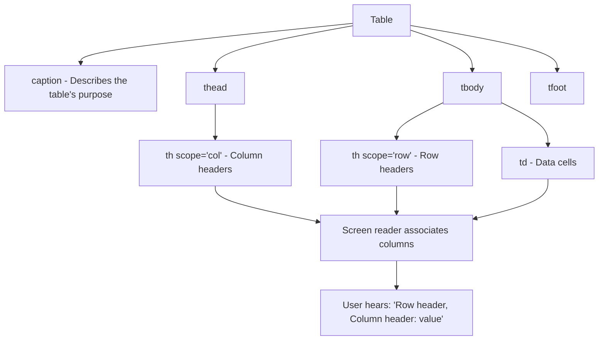

# Tables in HTML

## What Are HTML Tables?

HTML tables (`<table>`) are used to display **tabular data** — information that is logically organized into rows and columns. Think spreadsheets, financial reports, schedules, comparison charts, and statistics.

**Analogy**: A table is like a spreadsheet in Excel or Google Sheets. Each row is a record, each column is a field, and each cell is a data point at the intersection of a specific row and column. The HTML table element gives you the structure to represent this grid relationship semantically.

## Why Tables Matter

- They are the semantically correct way to present data that has row-column relationships.
- Screen readers use table structure to announce cell positions ("Row 3, Column 2: $49.99").
- Properly structured tables are parseable by data tools and scrapers.
- They remain the only appropriate HTML element for genuinely tabular data.

## When to Use Tables vs CSS Grid/Flexbox

| Use Tables                             | Use CSS Grid/Flexbox                   |
| -------------------------------------- | -------------------------------------- |
| Data that has logical rows and columns | Page layout (header, sidebar, content) |
| Spreadsheet-like information           | Card grids (products, articles)        |
| Comparison charts                      | Navigation menus                       |
| Schedules and timetables               | Form layouts                           |
| Statistics and financial data          | Gallery layouts                        |

**The rule**: If the data would make sense in a spreadsheet, use a table. If you are creating visual layout, use CSS.

## Basic Table Structure

```html
<table>
  <tr>
    <th>Name</th>
    <th>Role</th>
    <th>Department</th>
  </tr>
  <tr>
    <td>Alice Johnson</td>
    <td>Frontend Developer</td>
    <td>Engineering</td>
  </tr>
  <tr>
    <td>Bob Smith</td>
    <td>UX Designer</td>
    <td>Design</td>
  </tr>
</table>
```

### Elements

| Element   | Purpose                                       |
| --------- | --------------------------------------------- |
| `<table>` | Table container                               |
| `<tr>`    | Table row                                     |
| `<th>`    | Table header cell (bold, centered by default) |
| `<td>`    | Table data cell                               |

## Proper Table Structure with Sections

For accessible, well-structured tables, use `<thead>`, `<tbody>`, and `<tfoot>`:

```html
<table>
  <caption>
    Q4 2024 Sales Report
  </caption>
  <thead>
    <tr>
      <th scope="col">Product</th>
      <th scope="col">Units Sold</th>
      <th scope="col">Revenue</th>
    </tr>
  </thead>
  <tbody>
    <tr>
      <td>Widget A</td>
      <td>1,200</td>
      <td>$36,000</td>
    </tr>
    <tr>
      <td>Widget B</td>
      <td>850</td>
      <td>$25,500</td>
    </tr>
    <tr>
      <td>Widget C</td>
      <td>2,100</td>
      <td>$63,000</td>
    </tr>
  </tbody>
  <tfoot>
    <tr>
      <td>Total</td>
      <td>4,150</td>
      <td>$124,500</td>
    </tr>
  </tfoot>
</table>
```

### Section Elements

| Element     | Purpose                                                                    |
| ----------- | -------------------------------------------------------------------------- |
| `<caption>` | Table title/description — announced by screen readers before table content |
| `<thead>`   | Header row group — stays fixed during scrolling in some implementations    |
| `<tbody>`   | Main data rows — can have multiple `<tbody>` sections                      |
| `<tfoot>`   | Footer row group (totals, summaries)                                       |

## `colspan` and `rowspan`

### `colspan` — Cell Spanning Multiple Columns

```html
<table>
  <tr>
    <th colspan="3">Employee Information</th>
  </tr>
  <tr>
    <th>Name</th>
    <th>Position</th>
    <th>Salary</th>
  </tr>
  <tr>
    <td>Jane Doe</td>
    <td>Engineer</td>
    <td>$120,000</td>
  </tr>
</table>
```

### `rowspan` — Cell Spanning Multiple Rows

```html
<table>
  <tr>
    <th rowspan="2">Contact</th>
    <td>Email: jane@example.com</td>
  </tr>
  <tr>
    <td>Phone: (555) 123-4567</td>
  </tr>
</table>
```

### Combined Example

```html
<table>
  <thead>
    <tr>
      <th rowspan="2">Name</th>
      <th colspan="2">Scores</th>
    </tr>
    <tr>
      <th>Midterm</th>
      <th>Final</th>
    </tr>
  </thead>
  <tbody>
    <tr>
      <td>Alice</td>
      <td>92</td>
      <td>88</td>
    </tr>
    <tr>
      <td>Bob</td>
      <td>78</td>
      <td>85</td>
    </tr>
  </tbody>
</table>
```

## The `scope` Attribute (Accessibility)

`scope` tells screen readers whether a header applies to its row or column:

```html
<table>
  <thead>
    <tr>
      <th scope="col">Product</th>
      <th scope="col">Price</th>
      <th scope="col">Stock</th>
    </tr>
  </thead>
  <tbody>
    <tr>
      <th scope="row">Laptop</th>
      <td>$999</td>
      <td>45</td>
    </tr>
    <tr>
      <th scope="row">Mouse</th>
      <td>$29</td>
      <td>200</td>
    </tr>
  </tbody>
</table>
```

When a screen reader reaches the "$999" cell, it can announce: "Product: Laptop, Price: $999" because of the `scope` attributes.

## Table Accessibility Diagram



## Responsive Tables

Tables can overflow on small screens. Common solutions:

### Horizontal Scroll

```css
.table-wrapper {
  overflow-x: auto;
}
```

```html
<div class="table-wrapper">
  <table>
    <!-- Wide table content -->
  </table>
</div>
```

### Stacked Layout (CSS Only)

```css
@media (max-width: 600px) {
  table,
  thead,
  tbody,
  th,
  td,
  tr {
    display: block;
  }
  thead {
    display: none; /* Hide header row */
  }
  td::before {
    content: attr(data-label); /* Show label from data attribute */
    font-weight: bold;
    display: block;
  }
}
```

## Styling Tables

```css
table {
  width: 100%;
  border-collapse: collapse; /* Remove double borders */
  font-family: system-ui;
}

th,
td {
  padding: 0.75rem 1rem;
  text-align: left;
  border-bottom: 1px solid #ddd;
}

th {
  background-color: #f5f5f5;
  font-weight: 600;
}

/* Zebra stripes for readability */
tbody tr:nth-child(even) {
  background-color: #fafafa;
}

/* Hover state */
tbody tr:hover {
  background-color: #e8f4fd;
}
```

## Best Practices

- Use `<caption>` to give every data table a descriptive title.
- Use `<thead>`, `<tbody>`, `<tfoot>` for proper sectioning.
- Add `scope="col"` or `scope="row"` to all `<th>` elements.
- Never use tables for page layout — that practice died with the 1990s.
- Use `border-collapse: collapse` in CSS for clean borders.
- Wrap tables in a scrollable container for responsive design.
- Keep tables simple when possible — deeply nested spans are hard to maintain and hard for screen readers.

## Common Mistakes

| Mistake                     | Why It Is Wrong                                   | Fix                             |
| --------------------------- | ------------------------------------------------- | ------------------------------- |
| Using tables for layout     | Confuses screen readers; inaccessible             | Use CSS Grid/Flexbox for layout |
| Missing `<th>` for headers  | Screen readers cannot associate data with headers | Use `<th>` with `scope`         |
| No `<caption>`              | Users lack context for the table's purpose        | Add descriptive `<caption>`     |
| Excessive colspan/rowspan   | Hard to maintain; confusing for assistive tech    | Simplify table structure        |
| Not wrapping for responsive | Table overflows on mobile                         | Add `overflow-x: auto` wrapper  |
| Using `<td>` for everything | Loses header semantics                            | Use `<th>` for header cells     |

## Summary

- HTML tables are for **tabular data only** — never for page layout.
- A well-structured table uses `<caption>`, `<thead>`, `<tbody>`, `<tfoot>`, `<th>` with `scope`, and `<td>`.
- `colspan` and `rowspan` allow cells to span multiple columns or rows.
- The `scope` attribute on `<th>` is essential for screen readers to correctly associate headers with data cells.
- Make tables responsive by wrapping them in a scrollable container or using CSS to stack cells on small screens.
- If your data does not have a genuine row-column relationship, it is probably not a table — consider a list or grid layout instead.
