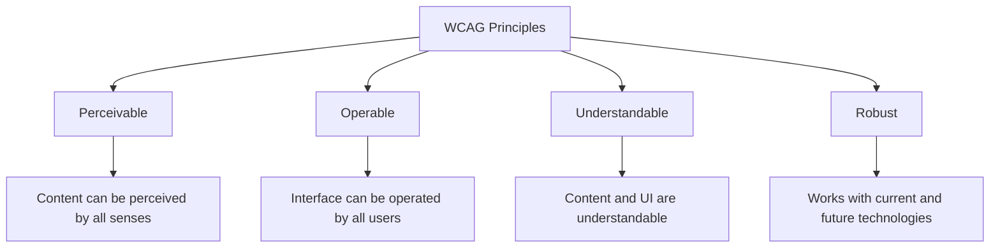

# Accessibility Basics

## What Is Web Accessibility?

Web accessibility (often abbreviated as **a11y** — "a" + 11 letters + "y") means designing and building websites that everyone can use, including people with disabilities. This covers visual, auditory, motor, and cognitive impairments.

**Analogy:** A building with only stairs excludes wheelchair users. Adding a ramp does not remove the stairs — it just ensures everyone can enter. Web accessibility is building digital ramps.

---

## Why Accessibility Matters

### 1. It Is the Right Thing to Do

Over 1 billion people worldwide live with some form of disability. Excluding them from the web is excluding them from information, services, commerce, and community.

### 2. It Is Often the Law

- **ADA** (Americans with Disabilities Act) — courts have ruled that websites are "places of public accommodation."
- **Section 508** — US federal agencies must make technology accessible.
- **EU Web Accessibility Directive** — public sector websites in the EU must meet WCAG 2.1 AA.
- **India's RPwD Act 2016** — mandates accessible digital infrastructure.

### 3. It Improves UX for Everyone

- Captions help people watching videos in noisy environments.
- High contrast benefits users in bright sunlight.
- Keyboard navigation helps power users who prefer not to use a mouse.
- Clear structure helps users with slow internet connections.

### 4. It Helps SEO

Search engines are essentially blind users — they cannot see images, they read text and structure. Accessible HTML is naturally SEO-friendly.

---

## Types of Disabilities to Consider

| Category    | Examples                                        | Web Impact                                    |
| ----------- | ----------------------------------------------- | --------------------------------------------- |
| Visual      | Blindness, low vision, color blindness          | Screen readers, magnification, contrast needs |
| Auditory    | Deafness, hard of hearing                       | Captions, transcripts                         |
| Motor       | Limited hand use, tremors, paralysis            | Keyboard navigation, large click targets      |
| Cognitive   | Dyslexia, ADHD, autism, memory issues           | Simple language, consistent navigation        |
| Temporary   | Broken arm, ear infection, bright sunlight      | Same solutions help short-term situations     |
| Situational | Holding a baby, noisy environment, small screen | Responsive, flexible designs                  |

---

## WCAG (Web Content Accessibility Guidelines)

WCAG is the international standard for web accessibility. It is organized around four principles:

### POUR Principles



- **Perceivable** — Users must be able to perceive the content (alt text, captions, contrast).
- **Operable** — Users must be able to operate the interface (keyboard access, enough time, no seizure triggers).
- **Understandable** — Content and UI behavior must be understandable (clear language, predictable navigation).
- **Robust** — Content must work with diverse user agents and assistive technologies (valid HTML, ARIA).

### Conformance Levels

| Level | Meaning                  | Target                                |
| ----- | ------------------------ | ------------------------------------- |
| A     | Minimum accessibility    | Bare minimum — still has barriers     |
| AA    | Acceptable accessibility | **Industry standard** — aim for this  |
| AAA   | Optimal accessibility    | Not always achievable for all content |

---

## Practical Accessibility Techniques

### 1. Alternative Text for Images

```html
<!-- Informative image — describe the content -->


<!-- Decorative image — empty alt (screen readers skip it) -->


<!-- Complex image — short alt + detailed description -->

<details>
  <summary>Full description of infographic</summary>
  <p>The infographic shows revenue growth from 2020 to 2024...</p>
</details>
```

**Rules for alt text:**

- Describe the purpose, not the appearance ("Submit button" not "Blue rectangle").
- Keep it concise (125 characters is a good limit).
- Never start with "Image of..." — screen readers already announce it as an image.
- If the image is purely decorative, use `alt=""` (not omitting `alt` entirely).

---

### 2. Semantic HTML (First Line of Defense)

```html
<!-- Bad: Screen reader sees meaningless divs -->
<div class="btn" onclick="submit()">Submit</div>

<!-- Good: Screen reader knows it is a button -->
<button type="submit">Submit</button>
```

Native HTML elements come with built-in accessibility:

- `<button>` — focusable, activatable with Enter/Space, announced as "button."
- `<a href>` — focusable, activatable with Enter, announced as "link."
- `<input>` — focusable, role and type announced.
- `<h1>`–`<h6>` — create a navigable heading hierarchy.
- `<nav>`, `<main>`, `<aside>` — create landmark regions.

**Rule:** Use the correct semantic element first. Only reach for ARIA when no native element exists for your use case.

---

### 3. Keyboard Accessibility

All interactive elements must be reachable and operable with a keyboard alone.

```html
<!-- Naturally focusable elements (no extra work needed) -->
<a href="/page">Link</a>
<button>Click</button>
<input type="text" />
<select>
  ...
</select>
<textarea></textarea>

<!-- Making a custom element focusable -->
<div role="button" tabindex="0" onkeydown="handleKey(event)">Custom Button</div>
```

**Tab order:**

- `tabindex="0"` — element enters the natural tab order.
- `tabindex="-1"` — focusable programmatically (via JavaScript) but not in tab order.
- `tabindex="1+"` — **avoid this** — it creates confusing custom tab orders.

**Keyboard interactions to support:**

- `Tab` — move to next focusable element.
- `Shift+Tab` — move to previous focusable element.
- `Enter` / `Space` — activate buttons and links.
- `Escape` — close modals, dropdowns, tooltips.
- `Arrow keys` — navigate within components (tabs, menus, radio groups).

---

### 4. Color and Contrast

- **Minimum contrast ratio** (WCAG AA): 4.5:1 for normal text, 3:1 for large text.
- **Never use color alone** to convey information.

```html
<!-- Bad: only color indicates error -->
<input style="border-color: red;" />

<!-- Good: color + icon + text -->
<input
  aria-describedby="error-msg"
  aria-invalid="true"
  style="border-color: red;"
/>
<span id="error-msg" role="alert">⚠️ Email is required</span>
```

---

### 5. Focus Indicators

Never remove the outline without providing an alternative.

```css
/* Bad — removes all focus indication */
*:focus {
  outline: none;
}

/* Good — custom visible focus style */
:focus-visible {
  outline: 3px solid #4a90d9;
  outline-offset: 2px;
}
```

---

### 6. Skip Navigation Link

Allows keyboard users to skip repeated navigation and jump to content.

```html
<body>
  <a href="#main-content" class="skip-link">Skip to main content</a>
  <nav><!-- long navigation --></nav>
  <main id="main-content">
    <!-- page content -->
  </main>
</body>
```

```css
.skip-link {
  position: absolute;
  top: -40px;
  left: 0;
  padding: 8px;
  background: #000;
  color: #fff;
  z-index: 100;
}
.skip-link:focus {
  top: 0;
}
```

---

### 7. Forms Accessibility

```html
<form>
  <!-- Associate labels with inputs -->
  <label for="email">Email address:</label>
  <input
    type="email"
    id="email"
    name="email"
    required
    aria-describedby="email-help"
  />
  <span id="email-help">We will never share your email.</span>

  <!-- Group related radio buttons -->
  <fieldset>
    <legend>Preferred contact method:</legend>
    <label><input type="radio" name="contact" value="email" /> Email</label>
    <label><input type="radio" name="contact" value="phone" /> Phone</label>
  </fieldset>

  <!-- Clear error messages -->
  <label for="password">Password:</label>
  <input
    type="password"
    id="password"
    aria-invalid="true"
    aria-describedby="pw-error"
  />
  <span id="pw-error" role="alert"
    >Password must be at least 8 characters.</span
  >
</form>
```

---

### 8. Multimedia Accessibility

```html
<!-- Video with captions -->
<video controls>
  <source src="tutorial.mp4" type="video/mp4" />
  <track
    kind="captions"
    src="captions-en.vtt"
    srclang="en"
    label="English"
    default
  />
</video>

<!-- Audio with transcript -->
<audio controls>
  <source src="podcast.mp3" type="audio/mpeg" />
</audio>
<details>
  <summary>Read transcript</summary>
  <p>Host: Welcome to episode 42 of the JavaScript podcast...</p>
</details>
```

---

## Testing Accessibility

| Method                 | Tool                            | What It Catches                          |
| ---------------------- | ------------------------------- | ---------------------------------------- |
| Automated scan         | Lighthouse, axe DevTools, WAVE  | Missing alt, contrast, ARIA errors       |
| Keyboard testing       | Tab through your page manually  | Focus traps, unreachable elements        |
| Screen reader testing  | NVDA (Windows), VoiceOver (Mac) | Confusing announcements, missing context |
| Color contrast checker | WebAIM Contrast Checker         | Insufficient contrast ratios             |
| Browser zoom           | Zoom to 200%                    | Content that breaks at larger sizes      |

---

## Best Practices

1. **Start with semantic HTML** — it provides most accessibility for free.
2. **Test with keyboard only** — unplug your mouse and try to use your site.
3. **Add alt text to all meaningful images** — be concise and descriptive.
4. **Maintain a logical heading hierarchy** — do not skip from `<h1>` to `<h4>`.
5. **Ensure sufficient color contrast** — use tools to verify ratios.
6. **Do not disable zoom** — never use `maximum-scale=1` in viewport meta.
7. **Provide captions and transcripts** for audio/video content.
8. **Make error messages clear and associated** with their inputs using `aria-describedby`.

---

## Common Mistakes

| Mistake                            | Why It Is Wrong                                          | Fix                               |
| ---------------------------------- | -------------------------------------------------------- | --------------------------------- |
| Missing `alt` attribute            | Screen readers announce file name instead                | Add descriptive `alt` or `alt=""` |
| Using only color to convey meaning | Color-blind users miss the information                   | Add icons, text, or patterns      |
| Removing focus outline             | Keyboard users cannot see where they are                 | Style `:focus-visible` instead    |
| Click-only interactions            | Keyboard and switch users are locked out                 | Add keyboard event handlers       |
| Auto-playing media                 | Disorienting; screen reader users cannot hear their tool | Never autoplay; provide controls  |
| `tabindex` values > 0              | Creates unpredictable navigation order                   | Use `0` or `-1` only              |
| Missing form labels                | Screen readers announce "edit text" with no context      | Always use `<label>` with `for`   |

---

## Summary

- Web accessibility ensures everyone can use the web, regardless of ability or circumstance.
- WCAG provides the standard: aim for Level AA conformance (POUR principles).
- Start with semantic HTML — native elements have built-in accessibility.
- Ensure keyboard operability, sufficient contrast, meaningful alt text, and clear form labels.
- Test with automated tools AND manual methods (keyboard, screen reader, zoom).
- Accessibility is not a separate feature — it is a quality attribute of good code.

> **Note:** Full WCAG compliance validation requires manual testing with assistive technologies and expert accessibility review. Automated tools catch approximately 30–50% of accessibility issues.
