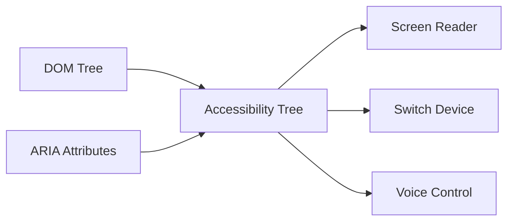

# ARIA Accessibility

## What Is ARIA?

ARIA (Accessible Rich Internet Applications) is a set of HTML attributes that add extra accessibility information to elements when native semantics are insufficient. It bridges the gap between complex interactive widgets (modals, tabs, drag-and-drop, live updates) and assistive technologies like screen readers.

**Analogy:** If semantic HTML elements are clearly labeled doors (screen readers know they are doors and how to open them), ARIA is like adding signs to custom-built entrances that do not look like standard doors — telling assistive technology "this is a door, it is currently closed, and you push to open it."

---

## The First Rule of ARIA

> **Do not use ARIA if you can use a native HTML element instead.**

```html
<!-- Bad: reinventing a button with ARIA -->
<div role="button" tabindex="0" aria-pressed="false">Click me</div>

<!-- Good: use a real button -->
<button>Click me</button>
```

Native elements have built-in keyboard handling, focus management, and semantics. ARIA only adds metadata — it does **not** add behavior. A `<div role="button">` is announced as a button but does not respond to Enter/Space unless you write that JavaScript yourself.

---

## How ARIA Works

ARIA attributes modify the **accessibility tree** — a parallel structure to the DOM that assistive technologies read.



ARIA tells assistive technology three things about an element:

1. **What it is** (role)
2. **What state it is in** (states & properties)
3. **How it relates to other elements** (relationships)

---

## ARIA Categories

### 1. Roles

Roles define **what an element is**. They override or supplement the element's native semantics.

#### Landmark Roles

```html
<div role="banner">Site header</div>
<!-- same as <header> (top-level) -->
<div role="navigation">Nav links</div>
<!-- same as <nav> -->
<div role="main">Primary content</div>
<!-- same as <main> -->
<div role="complementary">Sidebar</div>
<!-- same as <aside> -->
<div role="contentinfo">Footer</div>
<!-- same as <footer> -->
<div role="search">Search form</div>
<!-- no native equivalent -->
```

**Prefer native elements over landmark roles** — `<nav>` is better than `<div role="navigation">`.

#### Widget Roles

For custom interactive components:

| Role          | Purpose                         | Native Equivalent         |
| ------------- | ------------------------------- | ------------------------- |
| `button`      | Clickable button                | `<button>`                |
| `link`        | Navigation link                 | `<a href>`                |
| `checkbox`    | Toggle option                   | `<input type="checkbox">` |
| `radio`       | One of a group selection        | `<input type="radio">`    |
| `tab`         | Tab in a tabbed interface       | None                      |
| `tabpanel`    | Content panel for a tab         | None                      |
| `dialog`      | Modal or dialog window          | `<dialog>`                |
| `alertdialog` | Dialog requiring acknowledgment | None                      |
| `menu`        | Menu of actions                 | None                      |
| `menuitem`    | Item in a menu                  | None                      |
| `slider`      | Range selector                  | `<input type="range">`    |
| `progressbar` | Progress indicator              | `<progress>`              |
| `tooltip`     | Descriptive popup               | None                      |
| `tree`        | Hierarchical list               | None                      |
| `treeitem`    | Item in a tree                  | None                      |

#### Document Structure Roles

| Role        | Purpose                           |
| ----------- | --------------------------------- |
| `heading`   | A heading (use with `aria-level`) |
| `list`      | A list container                  |
| `listitem`  | An item in a list                 |
| `img`       | An image or image group           |
| `table`     | A data table                      |
| `row`       | A row in a table                  |
| `cell`      | A cell in a table                 |
| `separator` | A visual/thematic divider         |

---

### 2. States and Properties

#### Properties (Relatively Static)

| Attribute          | Purpose                                           | Example                         |
| ------------------ | ------------------------------------------------- | ------------------------------- |
| `aria-label`       | Provides an accessible name                       | `aria-label="Close dialog"`     |
| `aria-labelledby`  | Points to element(s) that label this one          | `aria-labelledby="heading-1"`   |
| `aria-describedby` | Points to element(s) that describe this           | `aria-describedby="help-text"`  |
| `aria-required`    | Indicates a field is required                     | `aria-required="true"`          |
| `aria-placeholder` | Hint text for custom inputs                       | `aria-placeholder="Enter name"` |
| `aria-controls`    | Identifies the element this one controls          | `aria-controls="panel-1"`       |
| `aria-owns`        | Defines parent-child when DOM is not nested       | `aria-owns="dropdown-list"`     |
| `aria-live`        | Region announces dynamic updates                  | `aria-live="polite"`            |
| `aria-atomic`      | Whether to announce entire region or just changes | `aria-atomic="true"`            |
| `aria-haspopup`    | Indicates a popup is available                    | `aria-haspopup="menu"`          |

#### States (Dynamic — Change with Interaction)

| Attribute       | Purpose                       | Values                           |
| --------------- | ----------------------------- | -------------------------------- |
| `aria-expanded` | Collapsible content state     | `"true"` / `"false"`             |
| `aria-hidden`   | Hides from accessibility tree | `"true"` / `"false"`             |
| `aria-disabled` | Element is disabled           | `"true"` / `"false"`             |
| `aria-selected` | Item is selected              | `"true"` / `"false"`             |
| `aria-checked`  | Checkbox/radio state          | `"true"` / `"false"` / `"mixed"` |
| `aria-pressed`  | Toggle button state           | `"true"` / `"false"`             |
| `aria-invalid`  | Input has a validation error  | `"true"` / `"false"`             |
| `aria-busy`     | Region is being updated       | `"true"` / `"false"`             |
| `aria-current`  | Indicates current item        | `"page"` / `"step"` / `"true"`   |

---

## Common ARIA Patterns

### Accessible Modal Dialog

```html
<button aria-haspopup="dialog" onclick="openModal()">Open Settings</button>

<div role="dialog" aria-labelledby="dialog-title" aria-modal="true" hidden>
  <h2 id="dialog-title">Settings</h2>
  <p>Configure your preferences below.</p>

  <label for="theme">Theme:</label>
  <select id="theme">
    <option>Light</option>
    <option>Dark</option>
  </select>

  <button onclick="closeModal()">Save</button>
  <button onclick="closeModal()">Cancel</button>
</div>
```

Requirements:

- `role="dialog"` or use `<dialog>` element.
- `aria-labelledby` points to the dialog title.
- `aria-modal="true"` tells screen readers content behind is inert.
- Trap focus inside the dialog (JavaScript required).
- Return focus to the trigger button on close.

---

### Accordion / Expandable Section

```html
<h3>
  <button aria-expanded="false" aria-controls="section1-content">
    What is JavaScript?
  </button>
</h3>
<div
  id="section1-content"
  role="region"
  aria-labelledby="section1-heading"
  hidden
>
  <p>JavaScript is a programming language for the web...</p>
</div>
```

- Toggle `aria-expanded` between `"true"` and `"false"` with JavaScript.
- Toggle `hidden` attribute on the content panel.
- `aria-controls` links the button to the panel it reveals.

---

### Tab Interface

```html
<div role="tablist" aria-label="Product information">
  <button role="tab" id="tab-1" aria-selected="true" aria-controls="panel-1">
    Description
  </button>
  <button
    role="tab"
    id="tab-2"
    aria-selected="false"
    aria-controls="panel-2"
    tabindex="-1"
  >
    Reviews
  </button>
  <button
    role="tab"
    id="tab-3"
    aria-selected="false"
    aria-controls="panel-3"
    tabindex="-1"
  >
    Shipping
  </button>
</div>

<div role="tabpanel" id="panel-1" aria-labelledby="tab-1">
  <p>This product is handcrafted...</p>
</div>
<div role="tabpanel" id="panel-2" aria-labelledby="tab-2" hidden>
  <p>4.5 stars from 230 reviews...</p>
</div>
<div role="tabpanel" id="panel-3" aria-labelledby="tab-3" hidden>
  <p>Free shipping on orders over $50...</p>
</div>
```

Keyboard behavior to implement:

- Arrow keys move between tabs.
- Only the active tab has `tabindex="0"`, others have `tabindex="-1"`.
- Tab key moves focus into the panel content.

---

### Live Regions (Dynamic Content Updates)

```html
<!-- Polite: waits until screen reader finishes current announcement -->
<div aria-live="polite" aria-atomic="true">
  <p>3 items in your cart</p>
</div>

<!-- Assertive: interrupts immediately (use sparingly) -->
<div aria-live="assertive" role="alert">
  <p>Your session will expire in 2 minutes</p>
</div>

<!-- Status messages -->
<div role="status" aria-live="polite">Form submitted successfully!</div>
```

| Value       | When to Use                                     |
| ----------- | ----------------------------------------------- |
| `polite`    | Non-urgent updates (cart count, search results) |
| `assertive` | Urgent information (errors, session expiry)     |
| `off`       | Region should not announce (default)            |

---

### Custom Toggle Button

```html
<button aria-pressed="false" onclick="toggle(this)">Dark Mode</button>

<script>
  function toggle(btn) {
    const pressed = btn.getAttribute("aria-pressed") === "true";
    btn.setAttribute("aria-pressed", String(!pressed));
  }
</script>
```

Screen reader announces: "Dark Mode, toggle button, not pressed" → "Dark Mode, toggle button, pressed."

---

## `aria-hidden` — Hiding from Assistive Technology

```html
<!-- Decorative icon — hide from screen readers -->
<span aria-hidden="true">🎉</span>
<span>Congratulations!</span>

<!-- Icon button — hide icon, provide label -->
<button aria-label="Close">
  <svg aria-hidden="true"><!-- X icon --></svg>
</button>
```

- `aria-hidden="true"` removes the element from the accessibility tree entirely.
- Content is still visually visible — it is just invisible to screen readers.
- **Never** use `aria-hidden="true"` on focusable elements — creates a confusing experience.

---

## `aria-label` vs `aria-labelledby` vs `aria-describedby`

| Attribute          | Provides          | When to Use                                    |
| ------------------ | ----------------- | ---------------------------------------------- |
| `aria-label`       | Accessible name   | When no visible text labels the element        |
| `aria-labelledby`  | Accessible name   | When visible text elsewhere labels the element |
| `aria-describedby` | Extra description | When additional info supplements the label     |

```html
<!-- aria-label: no visible label exists -->
<button aria-label="Close menu">✕</button>

<!-- aria-labelledby: visible heading serves as label -->
<section aria-labelledby="faq-title">
  <h2 id="faq-title">Frequently Asked Questions</h2>
</section>

<!-- aria-describedby: supplemental help text -->
<input type="password" aria-describedby="pw-requirements" />
<p id="pw-requirements">Must be at least 8 characters with one number.</p>
```

---

## Best Practices

1. **Native HTML first, ARIA second** — every ARIA role has a native equivalent you should prefer.
2. **Do not change native semantics unnecessarily** — `<h2 role="tab">` is confusing; use a `<button role="tab">` inside the `<h2>`.
3. **All interactive ARIA elements need keyboard support** — ARIA adds semantics, not behavior.
4. **Keep `aria-hidden` and `display: none` in sync** — if something is visually hidden with CSS, it is already hidden from the accessibility tree.
5. **Update ARIA states dynamically** — `aria-expanded`, `aria-selected`, and `aria-pressed` must reflect current state via JavaScript.
6. **Use live regions sparingly** — too many announcements overwhelm screen reader users.
7. **Test with a real screen reader** — ARIA bugs are invisible without one.

---

## Common Mistakes

| Mistake                                       | Why It Is Wrong                                          | Fix                                                      |
| --------------------------------------------- | -------------------------------------------------------- | -------------------------------------------------------- |
| Using `role="button"` without keyboard        | Announced as button but Enter/Space does nothing         | Add `keydown` handler or use `<button>`                  |
| `aria-hidden="true"` on focusable element     | Screen reader focus lands on invisible element           | Remove from tab order or remove aria-hidden              |
| Redundant ARIA on native elements             | `<button role="button">` is redundant and clutters code  | Omit the role; native element has it                     |
| Using `aria-label` on non-interactive `<div>` | Most screen readers ignore labels on generic elements    | Add a `role` or use semantic element                     |
| Stale ARIA states                             | `aria-expanded="false"` when content is actually visible | Update states with JavaScript on interaction             |
| Using `aria-live="assertive"` everywhere      | Constant interruptions make the page unusable            | Default to `polite`; reserve `assertive` for emergencies |

---

## Summary

- ARIA adds accessibility semantics to custom widgets that lack native HTML equivalents.
- The three pillars: **Roles** (what it is), **Properties** (static information), and **States** (dynamic information).
- Always prefer native HTML — ARIA is a supplement, not a replacement.
- ARIA adds **no behavior** — you must implement keyboard handling and state management in JavaScript.
- Common patterns: dialogs, tabs, accordions, live regions, toggle buttons.
- Test with real screen readers (NVDA, VoiceOver, JAWS) — ARIA bugs are only apparent through assistive technology.

> **Note:** Full WCAG compliance validation requires manual testing with assistive technologies and expert accessibility review.
