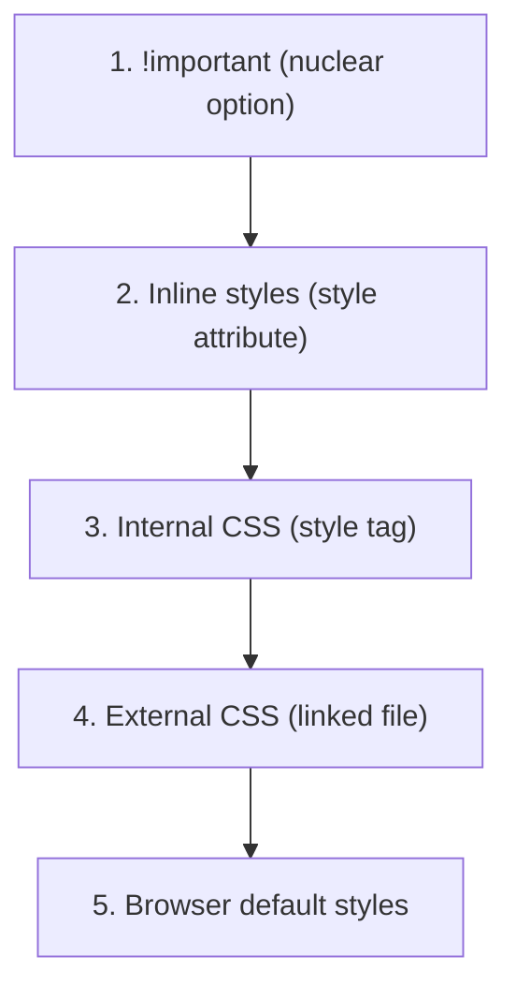

# Types of CSS: Inline, Internal, and External

## What It Is

CSS (Cascading Style Sheets) can be applied to HTML documents in three distinct ways. Each method has its own use case, scope, and priority level. Understanding when and how to use each type is foundational to writing maintainable stylesheets.

Think of it like getting dressed in the morning:

- **External CSS** is your wardrobe — a well-organized closet that all your outfits (pages) draw from.
- **Internal CSS** is an outfit you picked specifically for today — it only applies to this one occasion (page).
- **Inline CSS** is the final accessory you throw on at the last second — a scarf, a watch — it overrides and completes the look right there on the element.

---

## Why It Matters

- Choosing the right type affects **maintainability**, **performance**, and **scalability** of your project.
- Understanding priority (cascade) prevents frustrating "why isn't my style working?" moments.
- Real-world projects almost always use external CSS, but knowing all three helps you debug and make informed decisions.

---

## The Three Types

### 1. Inline CSS

Styles applied directly on an HTML element using the `style` attribute.

```html
<p style="color: red; font-size: 18px;">This text is red and 18px.</p>
```

**Characteristics:**

- Highest specificity among the three types (short of `!important`).
- Only affects the single element it is applied to.
- Cannot use pseudo-classes (`:hover`) or pseudo-elements (`::before`).
- Hard to maintain at scale — avoid in production code.

**When to use:** Quick prototyping, email templates (where external CSS support is limited), or dynamically generated styles via JavaScript.

---

### 2. Internal (Embedded) CSS

Styles written inside a `<style>` tag in the `<head>` section of an HTML document.

```html
<!DOCTYPE html>
<html>
  <head>
    <style>
      body {
        background-color: #f5f5f5;
      }
      h1 {
        color: navy;
        font-family: Georgia, serif;
      }
    </style>
  </head>
  <body>
    <h1>Hello World</h1>
  </body>
</html>
```

**Characteristics:**

- Applies only to the page it lives in.
- Supports full CSS syntax — selectors, pseudo-classes, media queries.
- No additional HTTP request needed (styles load with the HTML).
- Can cause code duplication if the same styles are needed on multiple pages.

**When to use:** Single-page applications, landing pages, or critical CSS that must load without a render-blocking request.

---

### 3. External CSS

Styles written in a separate `.css` file and linked to HTML via the `<link>` tag.

```html
<!-- index.html -->
<!DOCTYPE html>
<html>
  <head>
    <link rel="stylesheet" href="styles.css" />
  </head>
  <body>
    <h1>Hello World</h1>
  </body>
</html>
```

```css
/* styles.css */
body {
  background-color: #f5f5f5;
}
h1 {
  color: navy;
  font-family: Georgia, serif;
}
```

**Characteristics:**

- Separation of concerns — HTML handles structure, CSS handles presentation.
- One file can style multiple pages (DRY principle).
- Browser caches the CSS file — faster subsequent page loads.
- Requires an additional HTTP request on first load.

**When to use:** Always, for any project beyond a single prototype page.

---

## Priority and the Cascade

When multiple types of CSS target the same element with conflicting rules, the browser resolves conflicts using the **cascade**. Here is the priority order (highest to lowest):



### Example of Cascade in Action

```html
<!-- External CSS (styles.css) -->
<!-- p { color: blue; } -->

<!DOCTYPE html>
<html>
  <head>
    <link rel="stylesheet" href="styles.css" />
    <style>
      p {
        color: green;
      }
    </style>
  </head>
  <body>
    <p style="color: red;">What color am I?</p>
  </body>
</html>
```

**Result:** The paragraph is **red**. Inline wins over internal, which wins over external.

### Important Nuance: Source Order

If two rules have the **same specificity and same type**, the one that appears **later** in the source wins:

```css
p {
  color: blue;
}
p {
  color: green;
} /* This wins — it comes later */
```

---

## Comparison Table

| Feature                  | Inline         | Internal    | External       |
| ------------------------ | -------------- | ----------- | -------------- |
| Scope                    | Single element | Single page | Multiple pages |
| Reusability              | None           | None        | High           |
| Cacheability             | No             | No          | Yes            |
| Separation of concerns   | Poor           | Moderate    | Excellent      |
| Supports full CSS syntax | No             | Yes         | Yes            |
| Priority (default)       | Highest        | Medium      | Lower          |
| Maintenance              | Difficult      | Moderate    | Easy           |

---

## Best Practices

1. **Default to external CSS.** It keeps your HTML clean and your styles reusable.
2. **Use internal CSS for critical above-the-fold styles** to avoid flash of unstyled content (FOUC).
3. **Avoid inline CSS** unless you have a specific technical reason (email templates, JS-driven animations).
4. **Never rely on `!important`** as a first solution — it makes debugging a nightmare.
5. **Organize external files logically** — consider naming conventions like `base.css`, `layout.css`, `components.css`.

---

## Common Mistakes

| Mistake                                      | Why It Is Wrong                                                      |
| -------------------------------------------- | -------------------------------------------------------------------- |
| Using inline styles everywhere               | Impossible to maintain, no hover/focus states, duplicated code       |
| Putting `<style>` in `<body>`                | Valid HTML5, but causes re-rendering and is considered poor practice |
| Forgetting `rel="stylesheet"` on `<link>`    | The browser will not parse the file as CSS                           |
| Using `!important` to fix specificity issues | Masks the real problem — fix the selector instead                    |
| Multiple external files without bundling     | Too many HTTP requests hurt performance                              |

---

## Summary

- **Inline CSS** goes directly on elements — highest priority, lowest maintainability.
- **Internal CSS** lives in `<style>` tags — page-scoped, useful for single pages or critical CSS.
- **External CSS** lives in `.css` files — the standard for all real projects. Cacheable, reusable, maintainable.
- The cascade resolves conflicts: inline beats internal beats external beats browser defaults.
- When in doubt, use external CSS and write well-structured selectors rather than fighting the cascade with `!important`.
