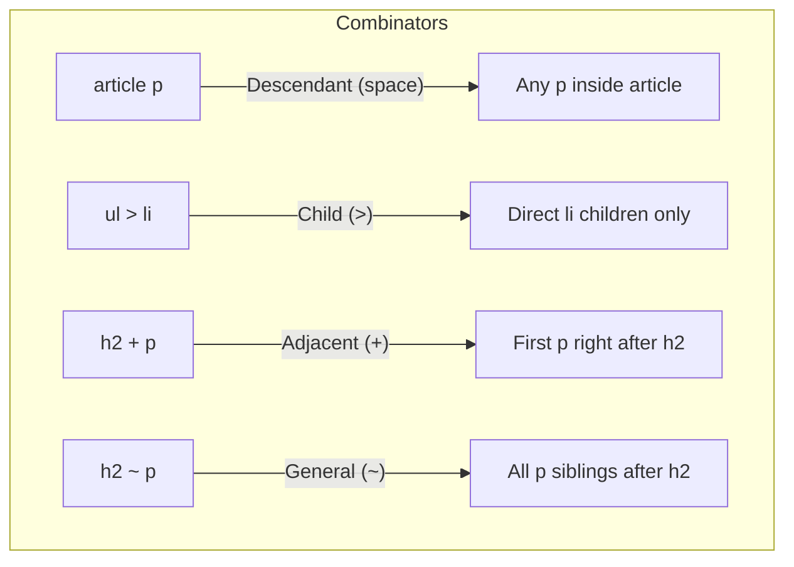

# CSS Selectors

## What They Are

Selectors are the targeting mechanism of CSS. They tell the browser _which_ HTML elements a set of styles should apply to. Think of selectors as an address system: just as a postal address narrows down from country to city to street to house number, CSS selectors narrow down from all elements to the exact ones you want to style.

---

## Why They Matter

- Without selectors, you cannot apply styles to anything.
- The precision of your selectors determines how maintainable and predictable your styles are.
- Understanding specificity (how the browser decides which rule wins) prevents hours of debugging.
- Efficient selectors contribute to better rendering performance in large applications.

---

## Selector Types

### 1. Universal Selector (`*`)

Selects every element on the page.

```css
* {
  margin: 0;
  padding: 0;
  box-sizing: border-box;
}
```

**Use case:** CSS resets. Be careful — it matches _everything_, including pseudo-elements in some contexts.

---

### 2. Element (Type) Selector

Selects all instances of a given HTML tag.

```css
p {
  line-height: 1.6;
}

h1 {
  font-size: 2rem;
}
```

**Use case:** Setting base typography and default element styles.

---

### 3. Class Selector (`.`)

Selects elements with a specific `class` attribute. Multiple elements can share the same class.

```css
.card {
  border: 1px solid #ddd;
  border-radius: 8px;
  padding: 1rem;
}

.card--featured {
  border-color: gold;
}
```

```html
<div class="card card--featured">Featured item</div>
<div class="card">Regular item</div>
```

**Use case:** The workhorse of CSS — used for reusable component styles.

---

### 4. ID Selector (`#`)

Selects the single element with a specific `id` attribute.

```css
#main-header {
  position: sticky;
  top: 0;
  background: white;
}
```

**Use case:** Unique page landmarks. Avoid for styling — its high specificity makes overriding difficult. Prefer classes.

---

### 5. Attribute Selectors

Select elements based on the presence or value of attributes.

```css
/* Has the attribute */
input[required] {
  border-left: 3px solid red;
}

/* Exact value */
input[type="email"] {
  background-image: url("email-icon.svg");
}

/* Starts with */
a[href^="https"] {
  color: green;
}

/* Ends with */
a[href$=".pdf"] {
  padding-right: 20px;
  background: url("pdf-icon.svg") no-repeat right;
}

/* Contains */
a[href*="example"] {
  font-style: italic;
}
```

**Use case:** Styling form elements by type, external links, or elements with data attributes.

---

### 6. Pseudo-Class Selectors

Select elements based on their **state** or **position** in the DOM tree.

```css
/* Interaction states */
a:hover {
  color: darkblue;
}
a:focus {
  outline: 2px solid blue;
}
a:active {
  color: red;
}

/* Structural pseudo-classes */
li:first-child {
  font-weight: bold;
}
li:last-child {
  border-bottom: none;
}
li:nth-child(odd) {
  background: #f9f9f9;
}
li:nth-child(3n) {
  color: purple;
} /* every 3rd item */

/* Form states */
input:disabled {
  opacity: 0.5;
}
input:checked + label {
  font-weight: bold;
}
input:valid {
  border-color: green;
}
input:invalid {
  border-color: red;
}

/* Negation */
p:not(.intro) {
  font-size: 0.9rem;
}
```

---

### 7. Pseudo-Element Selectors

Select and style a **specific part** of an element (not a state, but a sub-part).

```css
/* First line of a paragraph */
p::first-line {
  font-variant: small-caps;
}

/* First letter (drop cap) */
p::first-letter {
  font-size: 3rem;
  float: left;
  margin-right: 0.1em;
}

/* Generated content */
blockquote::before {
  content: "\201C"; /* opening curly quote */
  font-size: 3rem;
  color: #ccc;
}

.required-label::after {
  content: " *";
  color: red;
}

/* Selection highlight */
::selection {
  background: #ffeb3b;
  color: black;
}
```

**Note:** Pseudo-elements use `::` (double colon). Single colon (`:before`) is legacy syntax — still works but is discouraged.

---

## Combinators

Combinators define **relationships** between selectors.

### Descendant Combinator (space)

Selects elements that are anywhere inside another element.

```css
article p {
  margin-bottom: 1em;
}
/* Selects ALL p elements inside article, no matter how deeply nested */
```

### Child Combinator (`>`)

Selects only **direct children** — not grandchildren or deeper.

```css
ul > li {
  list-style: square;
}
/* Only selects li that are direct children of ul */
```

### Adjacent Sibling Combinator (`+`)

Selects the element that **immediately follows** another (same parent).

```css
h2 + p {
  font-size: 1.1rem;
  color: #555;
}
/* Only the first p directly after an h2 */
```

### General Sibling Combinator (`~`)

Selects **all siblings** that follow another element (same parent).

```css
h2 ~ p {
  color: #333;
}
/* All p elements that come after h2 (same parent level) */
```

### Visual Diagram



---

## Specificity Calculation

Specificity determines which rule wins when multiple rules target the same element. It is calculated as a four-part value: `(inline, IDs, classes/attributes/pseudo-classes, elements/pseudo-elements)`.

### The Scoring System

| Selector Component                                | Weight  |
| ------------------------------------------------- | ------- |
| Inline style                                      | 1,0,0,0 |
| ID (`#`)                                          | 0,1,0,0 |
| Class (`.`), attribute (`[]`), pseudo-class (`:`) | 0,0,1,0 |
| Element, pseudo-element (`::`)                    | 0,0,0,1 |
| Universal (`*`), combinators                      | 0,0,0,0 |

### Calculation Examples

```css
/* Specificity: 0,0,0,1 (one element) */
p {
  color: black;
}

/* Specificity: 0,0,1,0 (one class) */
.text {
  color: blue;
}

/* Specificity: 0,1,0,0 (one ID) */
#intro {
  color: green;
}

/* Specificity: 0,1,1,1 (one ID + one class + one element) */
#intro .text p {
  color: red;
}

/* Specificity: 0,0,2,1 (two classes + one element) */
.card .card__title h2 {
  color: navy;
}

/* Specificity: 0,0,1,2 (one pseudo-class + two elements) */
ul li:first-child {
  font-weight: bold;
}
```

### Resolving a Conflict

```html
<p id="intro" class="highlight">Which color wins?</p>
```

```css
p {
  color: black;
} /* 0,0,0,1 */
.highlight {
  color: yellow;
} /* 0,0,1,0 — wins over element */
#intro {
  color: green;
} /* 0,1,0,0 — wins over class */
p.highlight {
  color: orange;
} /* 0,0,1,1 — still loses to ID */
```

**Result:** The text is **green** because `#intro` has the highest specificity.

---

## Grouping Selectors

Apply the same styles to multiple selectors by separating them with commas:

```css
h1,
h2,
h3 {
  font-family: "Georgia", serif;
  color: #222;
}
```

---

## Best Practices

1. **Prefer classes over IDs for styling.** Classes are reusable and have lower specificity — easier to override when needed.
2. **Keep selectors shallow.** `.card__title` is better than `div.container > article.card > h2.card__title`.
3. **Avoid qualifying classes with elements.** `div.card` is unnecessarily specific — just use `.card`.
4. **Use meaningful class names** that describe purpose, not appearance (`.error-message` not `.red-text`).
5. **Never use `!important` to win specificity battles** — restructure your selectors instead.
6. **Use `:is()` and `:where()` for modern selector grouping** — `:where()` has zero specificity, useful for defaults.

---

## Common Mistakes

| Mistake                                                   | Why It Is Wrong                                                      |
| --------------------------------------------------------- | -------------------------------------------------------------------- |
| Overly specific selectors like `body div.wrapper ul li a` | Fragile, hard to override, tightly coupled to HTML structure         |
| Using IDs for repeated components                         | IDs must be unique — use classes for reusable patterns               |
| Forgetting specificity when debugging                     | If a style "doesn't work," check DevTools computed specificity first |
| Confusing `>` with space combinator                       | Space selects all descendants; `>` selects direct children only      |
| Using `::before`/`::after` without `content`              | These pseudo-elements will not render without a `content` property   |

---

## Summary

- Selectors range from broad (universal `*`) to very precise (ID + class + attribute combinations).
- Combinators define relationships: descendant, child, adjacent sibling, general sibling.
- Specificity is the tiebreaker: inline > ID > class/attribute/pseudo-class > element/pseudo-element.
- Write selectors that are specific enough to avoid conflicts but general enough to remain maintainable.
- Lean on classes for component styling — they hit the sweet spot of specificity and reusability.
