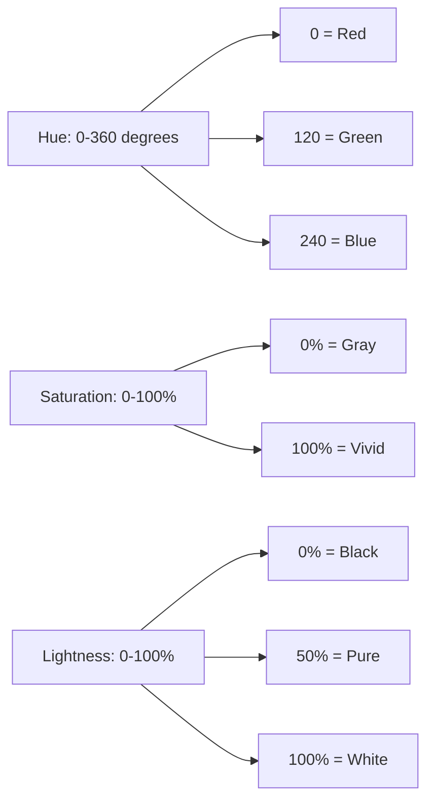

# Colors in CSS

## What It Is

Color in CSS defines the visual appearance of text, backgrounds, borders, shadows, and virtually any visible property. CSS supports multiple color formats, each with its own strengths. Choosing the right format is like choosing the right language for the audience — they all describe the same thing (a color), but some are more intuitive for certain tasks.

---

## Why It Matters

- Color is the first thing users perceive — it communicates hierarchy, state, and brand.
- Different formats suit different workflows: designers often think in HSL, developers in HEX, and programmatic color manipulation is easiest with RGB/HSL.
- Understanding opacity and transparency enables layered, modern UI designs.
- Accessibility depends on color contrast — you need to understand color values to meet WCAG standards.

---

## Color Formats

### 1. Named Colors

CSS provides 147 predefined color keywords.

```css
color: red;
color: steelblue;
color: papayawhip;
background-color: transparent; /* special keyword */
```

**Pros:** Readable, great for prototyping.
**Cons:** Limited palette, imprecise for brand colors.

---

### 2. HEX (Hexadecimal)

A six-character code representing Red, Green, and Blue channels in base-16.

```css
color: #ff0000; /* pure red */
color: #00ff00; /* pure green */
color: #336699; /* steel blue-ish */
color: #333; /* shorthand for #333333 */
color: #ff000080; /* 8-digit HEX with 50% opacity */
```

**Format:** `#RRGGBB` or shorthand `#RGB` (when each pair is identical digits).

**Pros:** Compact, universally supported, easy to copy from design tools.
**Cons:** Not human-readable — you cannot glance at `#2a7f3b` and immediately picture the color.

---

### 3. RGB / RGBA

Defines color using Red, Green, Blue channels (0-255) with optional Alpha (0-1) for opacity.

```css
color: rgb(255, 0, 0); /* pure red */
color: rgb(42, 127, 59); /* forest green */
color: rgba(0, 0, 0, 0.5); /* 50% transparent black */

/* Modern syntax (CSS Level 4) — no commas, slash for alpha */
color: rgb(255 0 0);
color: rgb(255 0 0 / 0.5);
```

**Pros:** Intuitive for programmatic manipulation (add 20 to the red channel), alpha built in.
**Cons:** Hard to "think in" — what does `rgb(173, 216, 230)` look like? (It is light blue.)

---

### 4. HSL / HSLA

Defines color using Hue (0-360 degrees), Saturation (0-100%), and Lightness (0-100%).

```css
color: hsl(0, 100%, 50%); /* pure red */
color: hsl(120, 100%, 50%); /* pure green */
color: hsl(210, 50%, 40%); /* muted blue */
color: hsla(210, 50%, 40%, 0.7); /* with 70% opacity */

/* Modern syntax */
color: hsl(210 50% 40% / 0.7);
```

**The color wheel analogy:**

- **Hue** is the position on a color wheel (0 = red, 120 = green, 240 = blue).
- **Saturation** is how vivid the color is (0% = gray, 100% = pure color).
- **Lightness** is how bright it is (0% = black, 50% = pure color, 100% = white).



**Pros:** Most human-readable. Easy to create color variations — just adjust lightness or saturation. Perfect for theming.
**Cons:** Slightly less familiar to developers who learned HEX first.

---

### 5. Opacity Property

Separate from color-based alpha, the `opacity` property affects the **entire element** including its children.

```css
.overlay {
  background-color: black;
  opacity: 0.5; /* The element AND all children are 50% transparent */
}

/* vs. just the background being transparent */
.overlay-better {
  background-color: rgba(0, 0, 0, 0.5); /* Only background is transparent */
}
```

**Key difference:** `opacity` affects everything inside the element. `rgba`/`hsla` alpha only affects that specific color.

---

### 6. The `currentColor` Keyword

A dynamic value that inherits the element's computed `color` property.

```css
.button {
  color: #3366ff;
  border: 2px solid currentColor; /* border matches text color */
  box-shadow: 0 2px 4px currentColor; /* shadow matches too */
}

.button:hover {
  color: #0044cc; /* All three (text, border, shadow) update automatically */
}
```

**Use case:** Creating components where accent colors should stay in sync. Change one property, everything follows.

---

## When to Use Which Format

| Scenario                               | Recommended Format | Reason                                                         |
| -------------------------------------- | ------------------ | -------------------------------------------------------------- |
| Brand colors from a design system      | HEX                | Designers deliver HEX values; direct copy-paste                |
| Creating color variations (light/dark) | HSL                | Adjust lightness: `hsl(210, 50%, 40%)` to `hsl(210, 50%, 60%)` |
| Semi-transparent overlays              | RGBA or HSLA       | Alpha channel controls transparency                            |
| CSS custom properties / theming        | HSL                | Easy to create palettes from a single hue                      |
| Quick prototyping                      | Named colors       | Readable, fast to type                                         |
| Programmatic color generation (JS)     | RGB or HSL         | Math-friendly numeric values                                   |

---

## CSS Custom Properties for Color Systems

Modern projects define colors as variables for consistency:

```css
:root {
  /* Define base HSL values */
  --primary-hue: 210;
  --primary-saturation: 70%;

  --primary-100: hsl(var(--primary-hue), var(--primary-saturation), 90%);
  --primary-300: hsl(var(--primary-hue), var(--primary-saturation), 70%);
  --primary-500: hsl(var(--primary-hue), var(--primary-saturation), 50%);
  --primary-700: hsl(var(--primary-hue), var(--primary-saturation), 30%);
  --primary-900: hsl(var(--primary-hue), var(--primary-saturation), 10%);
}

.button-primary {
  background-color: var(--primary-500);
  color: white;
}

.button-primary:hover {
  background-color: var(--primary-700);
}
```

---

## Best Practices

1. **Use HSL for design systems and theming** — creating tints and shades is trivial.
2. **Use RGBA/HSLA for transparency** — keep the `opacity` property for full-element fading (animations).
3. **Define colors as CSS custom properties** — never hard-code the same color in 20 places.
4. **Ensure sufficient contrast** — WCAG AA requires 4.5:1 for normal text, 3:1 for large text.
5. **Use `currentColor`** for borders, shadows, and SVG fills that should match text color.
6. **Prefer the modern space-separated syntax** — `rgb(255 0 0 / 0.5)` is cleaner than `rgba(255, 0, 0, 0.5)`.

---

## Common Mistakes

| Mistake                                                     | Why It Is Wrong                                                            |
| ----------------------------------------------------------- | -------------------------------------------------------------------------- |
| Using `opacity` when you only want a transparent background | `opacity` makes children transparent too — use `rgba`/`hsla` instead       |
| Hard-coding colors throughout stylesheets                   | Leads to inconsistency; use variables                                      |
| Forgetting HEX is case-insensitive                          | `#FF0000` and `#ff0000` are the same — pick a convention and stick with it |
| Ignoring color contrast accessibility                       | Low contrast makes text unreadable for many users                          |
| Using named colors in production                            | Limited palette, no brand consistency guarantee                            |

---

## Summary

- CSS supports multiple color formats: named, HEX, RGB(A), HSL(A).
- **HEX** is compact and ubiquitous — good for static brand colors.
- **HSL** is the most human-friendly — ideal for creating color systems and variations.
- **RGBA/HSLA** give you per-property transparency without affecting child elements.
- **`currentColor`** creates dynamic color inheritance within components.
- **`opacity`** affects the entire element tree — use it deliberately.
- Build color systems with CSS custom properties for scalable, consistent theming.
