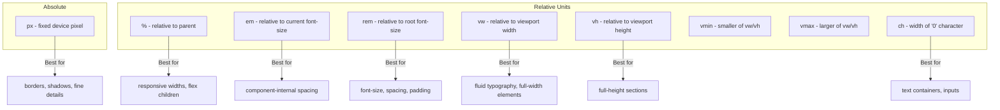

# CSS Units

## What They Are

CSS units define the size of things — text, spacing, widths, heights, borders, and more. Just as the real world has meters, inches, and feet, CSS has its own measurement systems. Some are fixed (absolute), and some adapt based on context (relative).

**Analogy:** Think of absolute units like measuring with a rigid metal ruler — always the same regardless of context. Relative units are like saying "half the room" — the actual measurement changes depending on which room you are in.

---

## Why They Matter

- The wrong unit makes designs break on different screen sizes.
- Relative units are the foundation of responsive design — they let layouts adapt.
- Accessibility depends on relative units — users who increase their browser font size expect text to actually get bigger.
- Performance and maintainability improve when you choose units intentionally rather than defaulting to `px` everywhere.

---

## Absolute Units

### `px` (Pixels)

The most common absolute unit. One CSS pixel is not always one device pixel (on retina screens, 1 CSS px = 2+ device pixels), but CSS handles this.

```css
border: 1px solid #ccc;
box-shadow: 0 2px 4px rgba(0, 0, 0, 0.1);
```

**When to use:** Borders, shadows, fine details, and anything that should stay the same physical size regardless of context.

**When NOT to use:** Font sizes (breaks accessibility), widths/heights of responsive containers.

---

## Relative Units

### `%` (Percentage)

Relative to the **parent element's** corresponding property.

```css
.container {
  width: 80%; /* 80% of parent's width */
}

.sidebar {
  width: 30%;
}

.main-content {
  width: 70%;
}
```

**Context matters:** `width: 50%` means 50% of parent's width. `padding: 10%` is 10% of parent's **width** (yes, even vertical padding). `line-height: 150%` is 150% of the element's own font-size.

---

### `em`

Relative to the **current element's** font size (or parent's font-size for `font-size` itself).

```css
.card {
  font-size: 16px;
  padding: 1.5em; /* 1.5 * 16 = 24px */
  margin-bottom: 2em; /* 2 * 16 = 32px */
}

.card h2 {
  font-size: 1.5em; /* 1.5 * 16 = 24px */
  margin-bottom: 0.5em; /* 0.5 * 24 = 12px (based on h2's own font-size) */
}
```

**The compounding problem:** `em` compounds when nested. If a parent is `1.2em` and a child is `1.2em`, the child is `1.2 * 1.2 = 1.44` of the root. This can spiral out of control in deep nesting.

---

### `rem` (Root EM)

Relative to the **root element** (`<html>`) font size. Always consistent, never compounds.

```css
html {
  font-size: 16px; /* default in most browsers */
}

h1 {
  font-size: 2.5rem;
} /* 40px */
h2 {
  font-size: 2rem;
} /* 32px */
p {
  font-size: 1rem;
} /* 16px */
.small {
  font-size: 0.875rem;
} /* 14px */

.section {
  padding: 2rem; /* 32px — always, regardless of nesting */
  margin-bottom: 3rem; /* 48px */
}
```

**Why `rem` is preferred:** Consistent, predictable, respects user font-size preferences, no compounding issues.

---

### `vw` (Viewport Width)

1vw = 1% of the viewport width.

```css
.hero-title {
  font-size: 5vw; /* scales with screen width */
}

.full-bleed {
  width: 100vw;
  margin-left: calc(-50vw + 50%); /* break out of container */
}
```

---

### `vh` (Viewport Height)

1vh = 1% of the viewport height.

```css
.hero-section {
  min-height: 100vh; /* full viewport height */
}

.half-screen {
  height: 50vh;
}
```

**Mobile caveat:** On mobile browsers, `100vh` can be taller than the visible area because it includes the URL bar space. Use `100dvh` (dynamic viewport height) for truly visible-area sizing in modern browsers.

---

### `vmin` and `vmax`

- `vmin` = 1% of the smaller dimension (width or height).
- `vmax` = 1% of the larger dimension.

```css
/* Text that scales based on the smaller dimension — works on both portrait and landscape */
.responsive-text {
  font-size: 4vmin;
}

/* Square that always fits in the viewport */
.square {
  width: 80vmin;
  height: 80vmin;
}
```

---

### `ch` (Character Width)

Equal to the width of the "0" character in the current font. Useful for typographic constraints.

```css
.article-body {
  max-width: 70ch; /* optimal reading width: 50-75 characters per line */
}

input[type="text"] {
  width: 30ch; /* fits approximately 30 characters */
}
```

---

## Comparison Diagram



---

## When to Use Which

| Use Case                   | Recommended Unit      | Reasoning                               |
| -------------------------- | --------------------- | --------------------------------------- |
| Font sizes                 | `rem`                 | Consistent, accessible, predictable     |
| Spacing (padding/margin)   | `rem`                 | Scales with root, no compounding        |
| Component-internal spacing | `em`                  | Scales with the component's font-size   |
| Container widths           | `%` or viewport units | Responsive to available space           |
| Max content width          | `ch`                  | Optimal line length for readability     |
| Full-height sections       | `vh` / `dvh`          | Viewport-relative                       |
| Borders and outlines       | `px`                  | Should remain visually crisp            |
| Box shadows                | `px`                  | Consistent visual weight                |
| Media query breakpoints    | `em` or `px`          | `em` respects zoom; `px` is predictable |

---

## Responsive Design Implications

### The `clamp()` Function

Combines a minimum, preferred, and maximum value — eliminating breakpoints for fluid sizing.

```css
h1 {
  /* Never smaller than 1.5rem, never larger than 3rem, prefers 5vw */
  font-size: clamp(1.5rem, 5vw, 3rem);
}

.container {
  /* Fluid width with constraints */
  width: clamp(320px, 90%, 1200px);
}
```

### The `calc()` Function

Combine units mathematically.

```css
.sidebar {
  width: 250px;
}

.main {
  width: calc(100% - 250px);
}

.spaced-section {
  padding: calc(2rem + 1vw); /* base spacing + fluid extra */
}
```

---

## Best Practices

1. **Use `rem` as your default** for font sizes and spacing — consistent and accessible.
2. **Use `em` inside components** where spacing should scale with the component's own font-size.
3. **Never use `px` for font-size on `body`** — it overrides user accessibility preferences.
4. **Use `ch` for `max-width` on text containers** — gives you ideal line length automatically.
5. **Prefer `dvh` over `vh` on mobile** — accounts for browser chrome (URL bar).
6. **Use `clamp()` for fluid typography** — responsive without media queries.
7. **Be consistent** — pick a system and stick with it across the project.

---

## Common Mistakes

| Mistake                                            | Why It Is Wrong                                            |
| -------------------------------------------------- | ---------------------------------------------------------- |
| Using `px` for all font sizes                      | Breaks when users adjust browser font settings             |
| Deep nesting with `em` units                       | Compounding makes sizes unpredictable                      |
| `100vh` on mobile for full-screen sections         | Extends behind the URL bar — use `100dvh`                  |
| Mixing too many unit types inconsistently          | Makes spacing feel random and hard to maintain             |
| Forgetting `%` padding is relative to parent width | Vertical padding as `%` can surprise you                   |
| Using `vw` for font-size without `clamp()`         | Text becomes unreadably small on mobile or huge on desktop |

---

## Summary

- **`px`** — absolute, use for borders and shadows.
- **`%`** — relative to parent, use for responsive widths.
- **`em`** — relative to current font-size, use for component-local spacing (but beware compounding).
- **`rem`** — relative to root font-size, your primary unit for fonts and spacing.
- **`vw`/`vh`** — viewport-relative, use for full-screen layouts and fluid sizing.
- **`vmin`/`vmax`** — the smaller/larger viewport dimension, use for orientation-independent sizing.
- **`ch`** — character-width-based, perfect for setting readable line lengths.
- Combine units with `calc()` and `clamp()` for powerful responsive designs without media queries.
