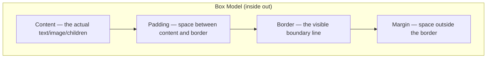
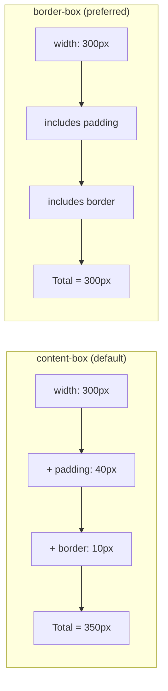

# The CSS Box Model

## What It Is

Every HTML element is rendered as a rectangular box. The **box model** defines the structure of that box: what is inside it, how much space surrounds it, and where its boundaries lie. Understanding the box model is understanding how space works in CSS.

**Analogy:** Think of a framed painting in a gallery:

- The **painting itself** is the content.
- The **matting** (white space between painting and frame) is the padding.
- The **frame** is the border.
- The **wall space** between this frame and the next painting is the margin.

---

## Why It Matters

- Every layout issue you will ever debug comes back to the box model.
- Misunderstanding `box-sizing` causes elements to overflow their containers.
- Margin collapsing is one of the most common sources of "my spacing is wrong" bugs.
- Getting the box model right means your layouts are predictable and consistent.

---

## The Four Layers



### Visual Representation

```
+------------------------------------------+
|              MARGIN                       |
|  +------------------------------------+  |
|  |           BORDER                   |  |
|  |  +------------------------------+  |  |
|  |  |        PADDING               |  |  |
|  |  |  +------------------------+  |  |  |
|  |  |  |      CONTENT           |  |  |  |
|  |  |  |  (width x height)      |  |  |  |
|  |  |  +------------------------+  |  |  |
|  |  +------------------------------+  |  |
|  +------------------------------------+  |
+------------------------------------------+
```

---

## Content

The innermost area where text, images, or child elements live.

```css
.box {
  width: 300px;
  height: 200px;
}
```

The `width` and `height` properties set the content area's dimensions — but whether this means the _total_ box size depends on `box-sizing` (covered below).

---

## Padding

Space between the content and the border. Padding is **inside** the element — it gets the element's background color.

```css
.card {
  padding: 20px; /* all four sides */
  padding: 20px 40px; /* vertical | horizontal */
  padding: 10px 20px 30px; /* top | horizontal | bottom */
  padding: 10px 20px 30px 40px; /* top | right | bottom | left (clockwise) */
}

/* Individual sides */
.card {
  padding-top: 10px;
  padding-right: 20px;
  padding-bottom: 10px;
  padding-left: 20px;
}
```

**Note:** Padding cannot be negative. Use margin for negative spacing.

---

## Border

The line that sits between padding and margin.

```css
.card {
  border: 2px solid #333; /* shorthand: width style color */
  border-radius: 8px; /* rounded corners */
}

/* Individual properties */
.card {
  border-width: 2px;
  border-style: solid; /* solid, dashed, dotted, double, groove, ridge, inset, outset, none */
  border-color: #333;
}

/* Individual sides */
.card {
  border-top: 3px solid red;
  border-bottom: 1px dashed #ccc;
}
```

---

## Margin

Space **outside** the border. Margins create distance between elements. Margins are transparent — they do not receive background color.

```css
.card {
  margin: 20px; /* all four sides */
  margin: 0 auto; /* vertical 0, horizontal auto (centering) */
  margin-bottom: 2rem; /* common: spacing between stacked elements */
}
```

### Negative Margins

Margins can be negative — this pulls the element (or its neighbors) closer.

```css
.overlap {
  margin-top: -20px; /* pulls element 20px upward, overlapping what's above */
}
```

### Auto Margins

`auto` tells the browser to distribute available space evenly. Classic block centering:

```css
.container {
  width: 800px;
  margin: 0 auto; /* centers horizontally within parent */
}
```

---

## Margin Collapsing

One of CSS's most misunderstood behaviors. When two **vertical** margins touch, they do not add up — they **collapse** into the larger of the two.

```css
h2 {
  margin-bottom: 20px;
}
p {
  margin-top: 16px;
}
/* Space between h2 and p is 20px, NOT 36px */
```

**Rules of collapsing:**

1. Only **vertical** margins collapse (top/bottom), never horizontal (left/right).
2. Only applies to **block-level elements** in normal flow.
3. Does NOT happen when elements have padding, border, or are flex/grid children.
4. Parent-child margins can also collapse if the parent has no padding/border.

```css
/* Preventing collapse */
.parent {
  padding-top: 1px; /* even 1px of padding prevents parent-child collapse */
  /* or use: overflow: hidden; */
  /* or use: display: flow-root; (modern solution) */
}
```

---

## `box-sizing`: The Critical Property

### `content-box` (Default)

`width` and `height` apply ONLY to the content area. Padding and border are added on top.

```css
.box {
  box-sizing: content-box; /* default */
  width: 300px;
  padding: 20px;
  border: 5px solid black;
}
/* Total rendered width = 300 + 20 + 20 + 5 + 5 = 350px */
```

### `border-box` (Preferred)

`width` and `height` include content + padding + border. What you set is what you get.

```css
.box {
  box-sizing: border-box;
  width: 300px;
  padding: 20px;
  border: 5px solid black;
}
/* Total rendered width = 300px (content shrinks to 250px to accommodate padding + border) */
```

### The Universal Box-Sizing Reset

Every modern project should include this:

```css
*,
*::before,
*::after {
  box-sizing: border-box;
}
```

This makes sizing intuitive — a `width: 300px` element is exactly 300px wide, period.



---

## Outline vs Border

They look similar but behave very differently.

| Feature                | Border                      | Outline                                                   |
| ---------------------- | --------------------------- | --------------------------------------------------------- |
| Takes up space         | Yes — affects layout        | No — drawn on top of content                              |
| Affects box dimensions | Yes (with `content-box`)    | Never                                                     |
| Can be per-side        | Yes (`border-top`, etc.)    | No — always all four sides                                |
| Has `border-radius`    | Yes                         | `outline` does not follow border-radius in older browsers |
| Use case               | Visual design, card borders | Focus indicators, debugging                               |

```css
/* Focus indicator — does not shift layout */
button:focus-visible {
  outline: 3px solid #3366ff;
  outline-offset: 2px;
}

/* Debug layout — see all boxes without affecting them */
* {
  outline: 1px solid red;
}
```

---

## Practical Examples

### A Card Component

```css
.card {
  box-sizing: border-box;
  width: 100%;
  max-width: 400px;
  padding: 1.5rem;
  border: 1px solid #e0e0e0;
  border-radius: 8px;
  margin-bottom: 1.5rem;
}
```

### Consistent Spacing System

```css
:root {
  --space-xs: 0.25rem;
  --space-sm: 0.5rem;
  --space-md: 1rem;
  --space-lg: 1.5rem;
  --space-xl: 2rem;
  --space-2xl: 3rem;
}

.section {
  padding: var(--space-xl);
  margin-bottom: var(--space-2xl);
}
```

---

## DevTools: Your Best Friend

Every browser's DevTools shows the box model visually:

- **Content** — blue (in Chrome) or outlined area
- **Padding** — green
- **Border** — yellow/dark
- **Margin** — orange

Open DevTools (F12), select an element, and look at the "Computed" or "Layout" tab to see exact dimensions.

---

## Best Practices

1. **Always apply `box-sizing: border-box` globally** — do this once in every project.
2. **Use padding for internal spacing, margin for external spacing** — never confuse the two.
3. **Be aware of margin collapsing** — use flex/grid containers to avoid surprises.
4. **Use `outline` for focus states, not `border`** — outline does not shift layout.
5. **Use a spacing scale** — consistent spacing tokens (4px, 8px, 16px, 24px, 32px) create visual rhythm.
6. **Avoid setting both `width` and `padding` in `%`** without `border-box` — the math gets confusing fast.

---

## Common Mistakes

| Mistake                                                                                | Why It Is Wrong                                                           |
| -------------------------------------------------------------------------------------- | ------------------------------------------------------------------------- |
| Not using `border-box`                                                                 | Elements overflow containers; width calculations are confusing            |
| Adding `margin-top` and `margin-bottom` on adjacent elements and expecting them to add | They collapse — use one consistent direction instead (margin-bottom only) |
| Using `padding` to space sibling elements apart                                        | Padding is internal — use margin or gap (in flex/grid) for siblings       |
| Setting `width: 100%` with padding (in `content-box`)                                  | The element overflows its parent — switch to `border-box`                 |
| Using `outline: none` without providing alternative focus styles                       | Breaks keyboard accessibility — always replace with a visible focus style |

---

## Summary

- Every element is a box made of four layers: content, padding, border, margin.
- **Padding** is space inside the border (gets background color). **Margin** is space outside (transparent).
- `box-sizing: border-box` makes sizing intuitive — always apply it globally.
- Vertical margins **collapse** — they do not add up. Flex/grid containers prevent this.
- **Outline** does not affect layout; **border** does.
- Use DevTools to inspect the box model visually when debugging spacing issues.
- Build a spacing scale and use it consistently for professional, rhythmic layouts.
