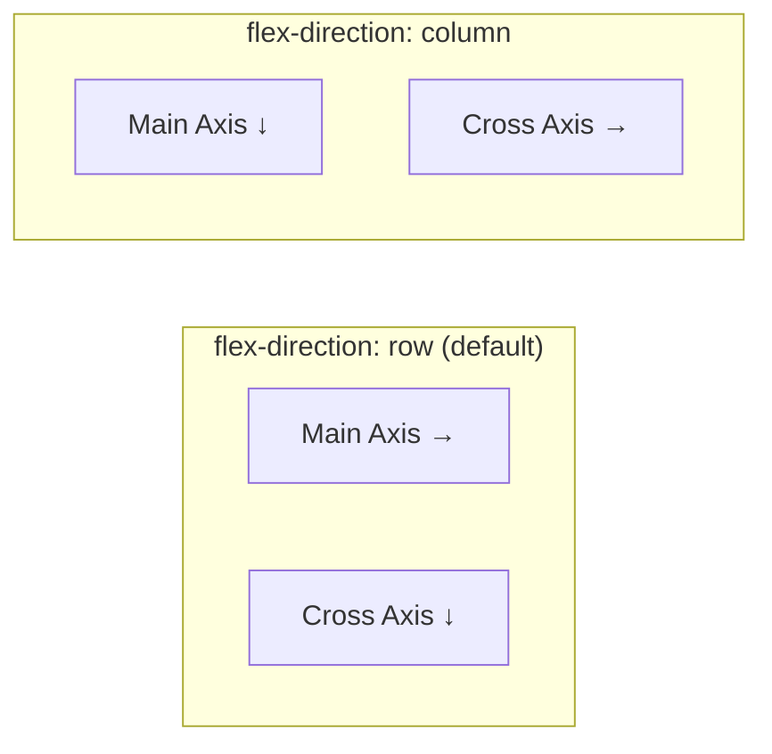
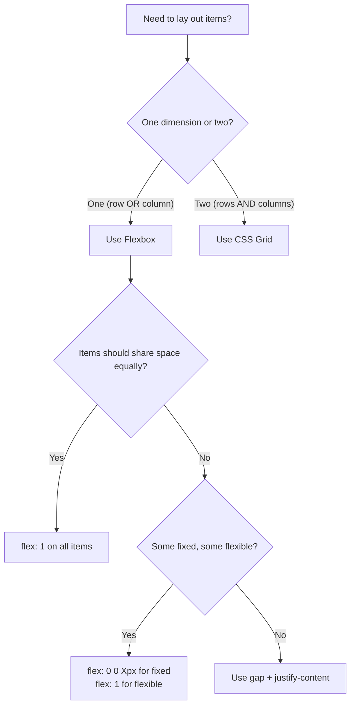

# CSS Flexbox

## What It Is

Flexbox (Flexible Box Layout) is a one-dimensional layout system designed for distributing space and aligning items within a container. It handles either a row OR a column at a time (hence "one-dimensional").

**Analogy:** Think of a bookshelf. The shelf is the flex container, and the books are flex items. You decide whether books sit side-by-side (row) or stacked (column), how much space is between them, and whether they stretch to fill the shelf or huddle at one end.

---

## Why It Matters

- Before flexbox, centering something vertically required hacks. Flexbox makes it one line.
- It solves the most common layout problems: navigation bars, card grids, form layouts, centering.
- Flexbox handles dynamic content gracefully — items grow, shrink, and wrap automatically.
- It is the foundation for component-level layout in modern CSS (Grid handles page-level layout).

---

## Core Concepts

### The Two Axes

Flexbox operates on two axes. Their direction depends on `flex-direction`.



- **Main axis** — the direction items flow (set by `flex-direction`).
- **Cross axis** — perpendicular to the main axis.

---

## Container Properties

These go on the **parent** element (the flex container).

### `display: flex`

Activates flexbox on the container.

```css
.container {
  display: flex; /* block-level flex container */
}

.inline-container {
  display: inline-flex; /* inline-level flex container */
}
```

---

### `flex-direction`

Sets the main axis direction.

```css
.container {
  flex-direction: row; /* default — left to right */
  flex-direction: row-reverse; /* right to left */
  flex-direction: column; /* top to bottom */
  flex-direction: column-reverse; /* bottom to top */
}
```

---

### `justify-content`

Aligns items along the **main axis**.

```css
.container {
  justify-content: flex-start; /* default — items packed at the start */
  justify-content: flex-end; /* items packed at the end */
  justify-content: center; /* items centered */
  justify-content: space-between; /* first at start, last at end, equal space between */
  justify-content: space-around; /* equal space around each item (edges have half-space) */
  justify-content: space-evenly; /* perfectly equal space between and at edges */
}
```

```
justify-content: flex-start
[A][B][C]

justify-content: center
         [A][B][C]

justify-content: space-between
[A]        [B]        [C]

justify-content: space-evenly
   [A]     [B]     [C]
```

---

### `align-items`

Aligns items along the **cross axis**.

```css
.container {
  align-items: stretch; /* default — items stretch to fill container height */
  align-items: flex-start; /* items align to the start of cross axis */
  align-items: flex-end; /* items align to the end of cross axis */
  align-items: center; /* items centered on cross axis */
  align-items: baseline; /* items align by their text baseline */
}
```

---

### `flex-wrap`

Controls whether items wrap to the next line or stay on one line.

```css
.container {
  flex-wrap: nowrap; /* default — all items on one line, may overflow */
  flex-wrap: wrap; /* items wrap to the next line */
  flex-wrap: wrap-reverse; /* items wrap upward */
}
```

---

### `align-content`

Aligns **wrapped lines** along the cross axis (only works with `flex-wrap: wrap` and multiple lines).

```css
.container {
  flex-wrap: wrap;
  align-content: flex-start;
  align-content: flex-end;
  align-content: center;
  align-content: space-between;
  align-content: space-around;
  align-content: stretch; /* default */
}
```

---

### `gap`

Sets spacing between flex items (no more margin hacks).

```css
.container {
  display: flex;
  gap: 1rem; /* equal gap in both directions */
  gap: 1rem 2rem; /* row-gap | column-gap */
  row-gap: 1rem;
  column-gap: 2rem;
}
```

---

## Item Properties

These go on the **children** (flex items).

### `flex-grow`

How much an item should grow relative to others when extra space is available. Default is `0` (do not grow).

```css
.item-a {
  flex-grow: 1;
} /* takes 1 share of extra space */
.item-b {
  flex-grow: 2;
} /* takes 2 shares of extra space */
/* If 300px of extra space, A gets 100px, B gets 200px */
```

---

### `flex-shrink`

How much an item should shrink when there is not enough space. Default is `1` (all items shrink equally).

```css
.sidebar {
  flex-shrink: 0;
} /* will NOT shrink — maintains its width */
.content {
  flex-shrink: 1;
} /* will shrink if needed */
```

---

### `flex-basis`

The initial size of an item before growing/shrinking is applied. Like a "starting width" (or height in column direction).

```css
.item {
  flex-basis: 200px; /* start at 200px, then grow/shrink from there */
  flex-basis: 30%; /* start at 30% of container */
  flex-basis: auto; /* default — use the item's width/height property */
}
```

---

### `flex` Shorthand

Combines grow, shrink, and basis.

```css
.item {
  flex: 1; /* flex: 1 1 0% — grow equally, shrink equally, basis 0 */
  flex: 0 0 250px; /* don't grow, don't shrink, stay at 250px */
  flex: 2 1 auto; /* grow with 2 shares, shrink normally, basis auto */
}
```

**Common patterns:**

- `flex: 1` — item takes up equal available space.
- `flex: none` — `flex: 0 0 auto` — item stays at its natural size.
- `flex: 0 0 250px` — fixed-width item.

---

### `align-self`

Overrides `align-items` for a single item.

```css
.container {
  align-items: flex-start;
}

.special-item {
  align-self: center; /* this one item centers on the cross axis */
}
```

---

### `order`

Controls the visual order of items (without changing HTML source order).

```css
.item-first {
  order: -1;
} /* appears first */
.item-default {
  order: 0;
} /* default position */
.item-last {
  order: 1;
} /* appears last */
```

**Accessibility warning:** Screen readers follow source order, not visual order. Use `order` sparingly and only for purely visual reordering.

---

## Practical Layout Examples

### Centered Content (The Holy Grail of CSS)

```css
.center-everything {
  display: flex;
  justify-content: center;
  align-items: center;
  min-height: 100vh;
}
```

### Navigation Bar

```css
.navbar {
  display: flex;
  align-items: center;
  padding: 0.75rem 1.5rem;
  gap: 1rem;
}

.navbar .logo {
  flex-shrink: 0; /* logo never shrinks */
}

.navbar .nav-links {
  display: flex;
  gap: 1.5rem;
  margin-left: auto; /* pushes nav to the right */
}
```

### Card Row with Equal Heights

```css
.card-container {
  display: flex;
  gap: 1.5rem;
  flex-wrap: wrap;
}

.card {
  flex: 1 1 300px; /* grow, shrink, minimum 300px */
  /* All cards in the same row will have equal height (stretch is default) */
}
```

### Sidebar Layout

```css
.layout {
  display: flex;
  min-height: 100vh;
}

.sidebar {
  flex: 0 0 280px; /* fixed width sidebar */
}

.main-content {
  flex: 1; /* takes remaining space */
  padding: 2rem;
}
```

### Footer Pushed to Bottom

```css
body {
  display: flex;
  flex-direction: column;
  min-height: 100vh;
}

main {
  flex: 1; /* takes all available space, pushing footer down */
}

footer {
  flex-shrink: 0;
}
```

### Input with Button

```css
.search-bar {
  display: flex;
  gap: 0;
}

.search-bar input {
  flex: 1; /* input takes all available space */
  padding: 0.5rem 1rem;
}

.search-bar button {
  flex-shrink: 0; /* button stays at its natural width */
  padding: 0.5rem 1.5rem;
}
```

---

## Flexbox Decision Diagram



---

## Best Practices

1. **Use `gap` instead of margins** between flex items — cleaner, no extra selectors needed.
2. **Prefer `flex: 1`** over `width: 33.33%` for equal distribution — it handles gaps correctly.
3. **Use `min-width: 0`** on flex items with overflowing content (text truncation) — flex items default to `min-width: auto` which prevents shrinking below content size.
4. **Use `margin-left: auto`** (or `margin-right: auto`) to push items to one side — a flexbox-specific trick.
5. **Stick to `flex-direction: row`** for most UI components — it is the most natural for horizontal layouts.
6. **Use `flex-wrap: wrap` with `flex-basis`** for responsive card grids without media queries.

---

## Common Mistakes

| Mistake                                                          | Why It Is Wrong                                                                  |
| ---------------------------------------------------------------- | -------------------------------------------------------------------------------- |
| Forgetting `display: flex` on the parent                         | Properties like `justify-content` do nothing without it                          |
| Using `justify-content` expecting cross-axis alignment           | `justify-content` = main axis; `align-items` = cross axis                        |
| Setting `height: 100%` on flex items that should stretch         | `align-items: stretch` already handles this — just do not set an explicit height |
| Using `order` for meaningful content reordering                  | Screen readers ignore visual order — use it only for decorative reordering       |
| Forgetting `flex-shrink: 0` on items that should not shrink      | Default is `1`, so items shrink — set `0` for fixed-width sidebars, logos, etc.  |
| Not setting `min-width: 0` for text truncation inside flex items | Content can overflow because flex items refuse to shrink below content size      |

---

## Summary

- Flexbox is a **one-dimensional** layout system — rows or columns, not both simultaneously.
- **Container properties** (`justify-content`, `align-items`, `flex-wrap`, `gap`) control the overall layout.
- **Item properties** (`flex-grow`, `flex-shrink`, `flex-basis`, `align-self`, `order`) control individual item behavior.
- `flex: 1` means "take up available space equally." `flex: 0 0 Xpx` means "stay fixed at X pixels."
- Use `gap` for spacing, `margin: auto` for pushing items, and `min-height: 100vh` + `flex: 1` for sticky footers.
- Flexbox is ideal for components (navbars, cards, forms). For full page layouts with rows AND columns, reach for CSS Grid.
