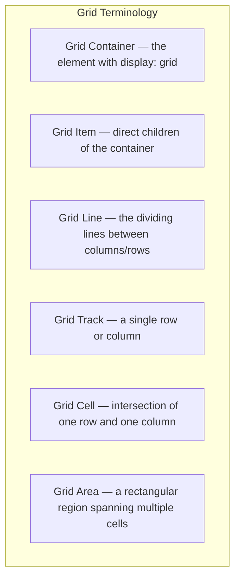
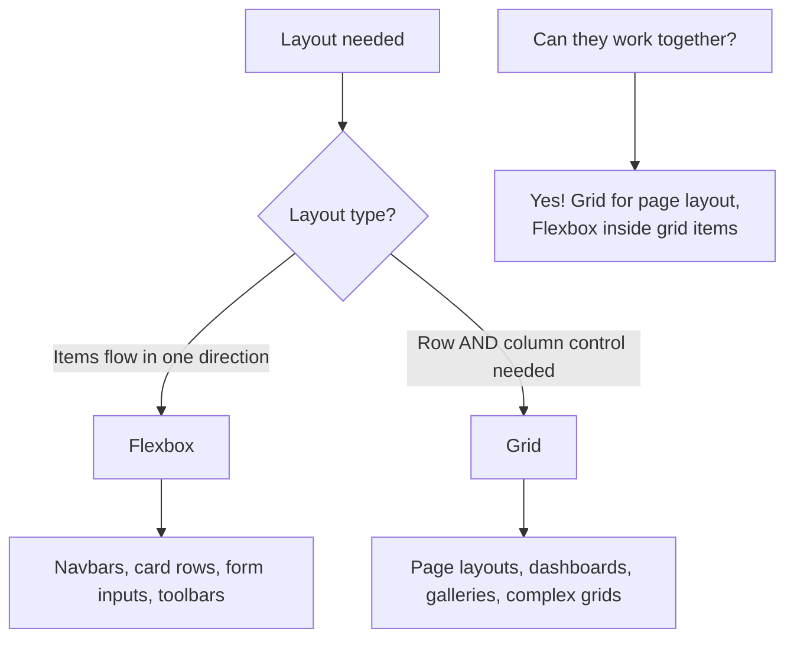

# CSS Grid

## What It Is

CSS Grid is a **two-dimensional** layout system that handles both rows AND columns simultaneously. While Flexbox excels at distributing items along a single axis, Grid gives you complete control over a two-dimensional space.

**Analogy:** If Flexbox is a clothesline (items hang along one line), Grid is a chess board — you control exactly which square each piece occupies, and you define the size of every row and column in the board.

---

## Why It Matters

- Grid eliminates the need for complex float/flexbox hacks for page-level layouts.
- It allows you to place items exactly where you want them — by row, column, or named area.
- Responsive layouts that previously required many media queries can be done in one declaration with `auto-fit` and `minmax()`.
- Grid is the proper tool for page layouts, dashboards, image galleries, and any design that has both row and column structure.

---

## Core Concepts



---

## Defining a Grid

### `display: grid`

```css
.container {
  display: grid;
}
```

### `grid-template-columns` and `grid-template-rows`

Define the structure of the grid.

```css
.container {
  display: grid;

  /* Fixed columns */
  grid-template-columns: 200px 1fr 200px;

  /* Fixed rows */
  grid-template-rows: 80px 1fr 60px;
}
```

---

## The `fr` Unit

`fr` (fraction) distributes available space proportionally — like `flex-grow` but for grid tracks.

```css
.container {
  grid-template-columns: 1fr 2fr 1fr;
  /* First and last columns get 1 share, middle gets 2 shares */
  /* If container is 800px: 200px | 400px | 200px */
}

.container {
  grid-template-columns: 250px 1fr;
  /* Fixed sidebar, fluid main content */
}
```

---

## The `repeat()` Function

Shorthand for repeated track definitions.

```css
.container {
  /* Instead of: 1fr 1fr 1fr 1fr */
  grid-template-columns: repeat(4, 1fr);

  /* Mixed pattern */
  grid-template-columns: repeat(3, 1fr 2fr);
  /* Results in: 1fr 2fr 1fr 2fr 1fr 2fr (6 columns) */
}
```

---

## Gap (Gutters)

Space between grid tracks.

```css
.container {
  gap: 1rem; /* row and column gap */
  gap: 1rem 2rem; /* row-gap | column-gap */
  row-gap: 1rem;
  column-gap: 2rem;
}
```

---

## Placing Items

### Line-Based Placement

Grid lines are numbered starting at 1.

```css
.item {
  grid-column-start: 1;
  grid-column-end: 3; /* spans columns 1 and 2 */
  grid-row-start: 1;
  grid-row-end: 2; /* occupies first row */
}

/* Shorthand */
.item {
  grid-column: 1 / 3; /* start / end */
  grid-row: 1 / 2;
}

/* Span syntax */
.item {
  grid-column: 1 / span 2; /* start at 1, span 2 columns */
  grid-row: span 3; /* span 3 rows from wherever placed */
}
```

### Grid Line Diagram

```
Column lines:  1      2      3      4
               |      |      |      |
Row line 1 --- +------+------+------+
               | Cell | Cell | Cell |
Row line 2 --- +------+------+------+
               | Cell | Cell | Cell |
Row line 3 --- +------+------+------+
               | Cell | Cell | Cell |
Row line 4 --- +------+------+------+
```

---

## `grid-template-areas`

Name regions of your grid and place items by area name. One of Grid's most powerful features.

```css
.container {
  display: grid;
  grid-template-columns: 250px 1fr;
  grid-template-rows: 80px 1fr 60px;
  grid-template-areas:
    "header  header"
    "sidebar content"
    "footer  footer";
  min-height: 100vh;
}

header {
  grid-area: header;
}
aside {
  grid-area: sidebar;
}
main {
  grid-area: content;
}
footer {
  grid-area: footer;
}
```

```html
<div class="container">
  <header>Header</header>
  <aside>Sidebar</aside>
  <main>Main Content</main>
  <footer>Footer</footer>
</div>
```

**Use `.` for empty cells:**

```css
grid-template-areas:
  "header header  header"
  ".      content sidebar"
  "footer footer  footer";
```

---

## Responsive Grid with `auto-fit` and `auto-fill`

Create responsive grids without media queries.

### `auto-fill`

Creates as many tracks as fit, even if empty.

```css
.gallery {
  display: grid;
  grid-template-columns: repeat(auto-fill, minmax(250px, 1fr));
  gap: 1rem;
}
```

### `auto-fit`

Like `auto-fill`, but collapses empty tracks — items stretch to fill available space.

```css
.card-grid {
  display: grid;
  grid-template-columns: repeat(auto-fit, minmax(300px, 1fr));
  gap: 1.5rem;
}
```

**Practical difference:** With 3 items in a wide container:

- `auto-fill` keeps the empty column slots visible (items stay at `minmax` sizes).
- `auto-fit` collapses empty slots — existing items grow to fill the space.

---

## The `minmax()` Function

Sets a minimum and maximum size for a track.

```css
.container {
  /* Columns are at least 200px, at most 1fr (equal share of space) */
  grid-template-columns: repeat(auto-fit, minmax(200px, 1fr));

  /* Rows are at least 100px but grow with content */
  grid-template-rows: repeat(3, minmax(100px, auto));
}
```

---

## Alignment

Grid supports alignment on both axes.

### Container-Level Alignment

```css
.container {
  /* Align all items within their cells */
  justify-items: start | end | center | stretch; /* horizontal */
  align-items: start | end | center | stretch; /* vertical */
  place-items: center; /* shorthand for both */

  /* Align the entire grid within the container */
  justify-content: start | end | center | space-between | space-around |
    space-evenly;
  align-content: start | end | center | space-between | space-around |
    space-evenly;
  place-content: center; /* shorthand for both */
}
```

### Item-Level Alignment

```css
.item {
  justify-self: start | end | center | stretch; /* horizontal */
  align-self: start | end | center | stretch; /* vertical */
  place-self: center; /* shorthand for both */
}
```

---

## Implicit Grid

When items are placed outside the explicitly defined grid, the browser creates **implicit tracks**.

```css
.container {
  display: grid;
  grid-template-columns: repeat(3, 1fr);
  /* Only 1 row defined explicitly, but if there are 6 items... */

  /* Control the size of auto-created rows */
  grid-auto-rows: minmax(150px, auto);

  /* Control direction of auto-placement */
  grid-auto-flow: row; /* default — fill rows first */
  grid-auto-flow: column; /* fill columns first */
  grid-auto-flow: dense; /* backfill empty cells (useful for galleries) */
}
```

---

## Named Lines

Give lines meaningful names for easier placement.

```css
.container {
  grid-template-columns:
    [sidebar-start] 250px
    [sidebar-end content-start] 1fr
    [content-end];
  grid-template-rows:
    [header-start] 80px
    [header-end main-start] 1fr
    [main-end footer-start] 60px
    [footer-end];
}

.header {
  grid-column: sidebar-start / content-end;
  grid-row: header-start / header-end;
}
```

---

## Practical Layout Examples

### Dashboard Layout

```css
.dashboard {
  display: grid;
  grid-template-columns: 250px 1fr 1fr;
  grid-template-rows: 64px 1fr;
  grid-template-areas:
    "nav header header"
    "nav main   aside";
  min-height: 100vh;
  gap: 0;
}

.dashboard-nav {
  grid-area: nav;
}
.dashboard-header {
  grid-area: header;
}
.dashboard-main {
  grid-area: main;
}
.dashboard-aside {
  grid-area: aside;
}
```

### Image Gallery with Spanning

```css
.gallery {
  display: grid;
  grid-template-columns: repeat(auto-fit, minmax(200px, 1fr));
  grid-auto-rows: 200px;
  grid-auto-flow: dense; /* fills gaps when items span */
  gap: 0.5rem;
}

.gallery .featured {
  grid-column: span 2;
  grid-row: span 2;
}
```

### Holy Grail Layout (Responsive)

```css
.page {
  display: grid;
  grid-template-areas:
    "header"
    "main"
    "footer";
  grid-template-rows: auto 1fr auto;
  min-height: 100vh;
}

@media (min-width: 768px) {
  .page {
    grid-template-columns: 200px 1fr 200px;
    grid-template-areas:
      "header header  header"
      "nav    main    aside"
      "footer footer  footer";
  }
}
```

---

## Grid vs Flexbox: When to Use Which



| Scenario                                       | Use                                                         |
| ---------------------------------------------- | ----------------------------------------------------------- |
| Navigation bar                                 | Flexbox                                                     |
| Page layout (header, sidebar, content, footer) | Grid                                                        |
| Card grid with uniform columns                 | Grid                                                        |
| Centering a single item                        | Flexbox (simpler) or Grid                                   |
| Items that wrap into rows                      | Both work — Grid for uniform sizing, Flex for content-based |
| Dashboard with complex regions                 | Grid                                                        |
| Form input + button side-by-side               | Flexbox                                                     |

---

## Best Practices

1. **Use `grid-template-areas` for page layouts** — they are self-documenting and easy to rearrange.
2. **Use `auto-fit` + `minmax()` for responsive card grids** — no media queries needed.
3. **Use `fr` units over percentages** — they account for gaps automatically.
4. **Combine Grid and Flexbox** — Grid for the macro layout, Flexbox inside individual components.
5. **Use `grid-auto-rows: minmax(Xpx, auto)`** to ensure rows have a minimum height but can grow.
6. **Name your lines or areas** for complex layouts — makes the code readable months later.

---

## Common Mistakes

| Mistake                                                    | Why It Is Wrong                                                                     |
| ---------------------------------------------------------- | ----------------------------------------------------------------------------------- |
| Using Grid for simple one-axis layouts                     | Overkill — Flexbox is simpler and sufficient                                        |
| Forgetting that `gap` is not included in `fr` calculations | `fr` distributes space AFTER gaps are subtracted — this is correct, just surprising |
| Using `auto-fill` when `auto-fit` is desired               | With few items, `auto-fill` leaves empty tracks — items do not stretch              |
| Setting explicit `width` on grid items                     | Let the grid control sizing via track definitions — explicit widths fight the grid  |
| Not using `minmax()` with `auto-fit`/`auto-fill`           | Without a minimum, items can shrink to 0; without a maximum, they cannot grow       |
| Placing items by line number in a responsive grid          | Line numbers shift as columns change — use named areas for responsive layouts       |

---

## Summary

- CSS Grid is a **two-dimensional** layout system — it controls both rows and columns simultaneously.
- Define structure with `grid-template-columns`, `grid-template-rows`, and `grid-template-areas`.
- **`fr` units** distribute available space proportionally — like `flex-grow` for grid tracks.
- **`auto-fit` + `minmax()`** creates responsive grids without media queries.
- **`grid-template-areas`** creates readable, visual layout definitions.
- Grid handles **page-level layout**; Flexbox handles **component-level layout**. Use them together.
- Place items by line number, span, or named area depending on complexity.
