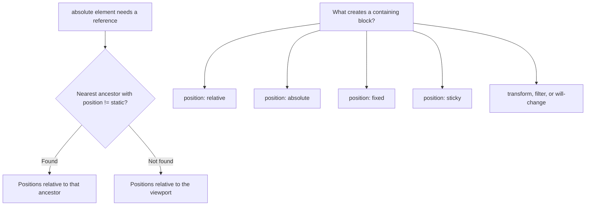

# The CSS Position Property

## What It Is

The `position` property controls how an element is placed in the document flow and how it relates to its surrounding elements. It determines whether an element follows normal document flow, is offset from its natural position, is anchored to the viewport, or is positioned relative to a specific ancestor.

**Analogy:** Think of normal document flow as a stack of papers on a desk. Each paper (element) sits below the previous one. Positioning is like pinning a paper to the wall (fixed), sliding it slightly on the desk (relative), or pulling it off the stack entirely and placing it wherever you want (absolute).

---

## Why It Matters

- Without understanding position, you cannot build overlays, dropdowns, sticky headers, or tooltips.
- `z-index` only works on positioned elements — and creates stacking contexts that affect your entire layout.
- Misunderstanding `absolute` positioning is one of the most common sources of layout bugs.
- Knowing which ancestor serves as the "containing block" is essential for precise placement.

---

## Position Values

### `static` (Default)

The element follows normal document flow. Top, right, bottom, left, and z-index have **no effect**.

```css
.element {
  position: static; /* default — you rarely write this explicitly */
}
```

Every element is `static` unless you change it. Normal flow means block elements stack vertically, inline elements sit side by side.

---

### `relative`

The element stays in normal flow (its original space is preserved), but can be **offset** from its natural position using `top`, `right`, `bottom`, `left`.

```css
.nudged {
  position: relative;
  top: 10px; /* pushes element 10px DOWN from where it would be */
  left: 20px; /* pushes element 20px RIGHT from where it would be */
}
```

```
Normal position:     After relative offset:
+----------+        +----------+
| Element  |        |   (gap)  |
+----------+        |     +----------+
                    |     | Element  |
                    |     +----------+
```

**Key behaviors:**

- Original space in the document is **preserved** (other elements do not shift).
- Creates a **containing block** for absolutely positioned children.
- Creates a new **stacking context** if `z-index` is set.

**Primary use case:** Establishing a positioning reference for `absolute` children.

---

### `absolute`

The element is **removed from normal flow** — other elements act as if it does not exist. It is positioned relative to its nearest **positioned ancestor** (any ancestor with `position` other than `static`).

```css
.parent {
  position: relative; /* establishes the reference point */
}

.tooltip {
  position: absolute;
  top: 100%; /* immediately below the parent */
  left: 50%;
  transform: translateX(-50%); /* center horizontally */
}
```

```
Parent (position: relative)
+----------------------------+
|                            |
|   Content here             |
|                            |
+----------------------------+
      |--- Tooltip (position: absolute, top: 100%) ---|
      +---------------------+
      | Tooltip content     |
      +---------------------+
```

**Key behaviors:**

- Removed from flow — sibling elements fill its former space.
- Positioned relative to the nearest positioned ancestor.
- If no positioned ancestor exists, it positions relative to the **viewport** (initial containing block).
- Collapses to fit its content unless `width`/`height` are set.

**Common use cases:** Tooltips, dropdowns, modals, badges, overlay elements.

---

### `fixed`

The element is removed from normal flow and positioned relative to the **viewport**. It does not move when the page scrolls.

```css
.sticky-header {
  position: fixed;
  top: 0;
  left: 0;
  right: 0; /* stretches full width */
  z-index: 1000;
  background: white;
  box-shadow: 0 2px 4px rgba(0, 0, 0, 0.1);
}

.back-to-top {
  position: fixed;
  bottom: 2rem;
  right: 2rem;
}
```

**Key behaviors:**

- Always relative to the viewport (unless an ancestor has `transform`, `filter`, or `will-change` — which creates a new containing block).
- Does not scroll with the page.
- Removed from flow — content can hide behind it (add padding to body to compensate).

**Common use cases:** Sticky navigation bars, floating action buttons, chat widgets.

---

### `sticky`

A hybrid of `relative` and `fixed`. The element behaves as `relative` until it reaches a scroll threshold, then it "sticks" like `fixed`.

```css
.section-header {
  position: sticky;
  top: 0; /* sticks when it reaches the top of the viewport */
  background: white;
  z-index: 10;
}
```

**Key behaviors:**

- Remains in normal flow until the scroll threshold.
- Once the threshold is reached, it sticks in place.
- It stops sticking when its parent element scrolls out of view.
- Requires at least one of `top`, `right`, `bottom`, or `left` to be set.
- Only works if the parent has scrollable overflow.

**Common use cases:** Table headers, section labels, sidebar navigation items.

```css
/* Sticky table header */
thead th {
  position: sticky;
  top: 0;
  background: #f8f8f8;
  z-index: 1;
}

/* Sticky sidebar */
.sidebar-nav {
  position: sticky;
  top: 80px; /* offset below the fixed header */
  align-self: flex-start; /* important in flex containers */
}
```

---

## The Containing Block

An absolutely positioned element's reference point is its **containing block** — the nearest ancestor with a position value other than `static`.



**Practical pattern:** Always set `position: relative` on the parent you want to contain absolute children — even if you do not offset it:

```css
.dropdown-wrapper {
  position: relative; /* reference for the menu */
}

.dropdown-menu {
  position: absolute;
  top: 100%;
  left: 0;
  width: 200px;
}
```

---

## Stacking Context and `z-index`

`z-index` controls which elements appear on top when they overlap. It **only works on positioned elements** (anything except `static`).

```css
.modal-backdrop {
  position: fixed;
  inset: 0;
  background: rgba(0, 0, 0, 0.5);
  z-index: 999;
}

.modal {
  position: fixed;
  top: 50%;
  left: 50%;
  transform: translate(-50%, -50%);
  z-index: 1000; /* above the backdrop */
}
```

### Stacking Context Rules

A new stacking context is created by:

- An element with `position` + `z-index` (any value other than `auto`)
- `opacity` less than 1
- `transform`, `filter`, `will-change`, `backdrop-filter`
- `isolation: isolate`

**Why it matters:** `z-index` values are only compared within the same stacking context. A `z-index: 9999` inside a stacking context with `z-index: 1` will still appear below a sibling with `z-index: 2`.

```css
/* Create an isolated stacking context to prevent z-index leaks */
.card {
  position: relative;
  isolation: isolate; /* modern approach to contain z-index */
}
```

---

## The `inset` Shorthand

Modern shorthand for `top`, `right`, `bottom`, `left`:

```css
.overlay {
  position: fixed;
  inset: 0; /* same as top:0; right:0; bottom:0; left:0 */
}

.padded-overlay {
  position: absolute;
  inset: 1rem; /* 1rem offset on all sides */
}

.custom-inset {
  position: absolute;
  inset: 10px 20px 30px 40px; /* top right bottom left */
}
```

---

## Practical Examples

### Centered Modal

```css
.modal-overlay {
  position: fixed;
  inset: 0;
  background: rgba(0, 0, 0, 0.5);
  display: grid;
  place-items: center;
  z-index: 1000;
}
```

### Badge on Icon

```css
.icon-wrapper {
  position: relative;
  display: inline-block;
}

.badge {
  position: absolute;
  top: -5px;
  right: -5px;
  background: red;
  color: white;
  border-radius: 50%;
  width: 18px;
  height: 18px;
  font-size: 11px;
  display: grid;
  place-items: center;
}
```

### Sticky Header with Fixed Offset

```css
.page-header {
  position: fixed;
  top: 0;
  left: 0;
  right: 0;
  height: 64px;
  z-index: 100;
}

/* Prevent content from hiding behind fixed header */
body {
  padding-top: 64px;
}

.section-title {
  position: sticky;
  top: 64px; /* sticks below the fixed header */
}
```

---

## Best Practices

1. **Always set `position: relative` on the intended containing block** — do not let absolute elements accidentally reference the viewport.
2. **Use `position: sticky` over JavaScript scroll listeners** — it is performant and declarative.
3. **Avoid high z-index values** — use a z-index scale (10, 20, 30...) and document it.
4. **Use `isolation: isolate`** on component roots to prevent z-index conflicts between components.
5. **Add padding/margin to body** when using fixed headers — otherwise content hides behind them.
6. **Use `inset: 0`** instead of writing all four directional properties.
7. **Prefer layout systems (flex/grid) over absolute positioning** for general layout — use position only for overlays and special cases.

---

## Common Mistakes

| Mistake                                              | Why It Is Wrong                                                      |
| ---------------------------------------------------- | -------------------------------------------------------------------- |
| Using `z-index` on a `static` element                | `z-index` only works on positioned elements — it is silently ignored |
| Forgetting to set `position: relative` on the parent | Absolute child positions relative to the viewport, not the parent    |
| Using `position: absolute` for layout                | Absolute elements are removed from flow — use flex/grid for layout   |
| Setting `position: sticky` without a `top` value     | The element never sticks — at least one threshold is required        |
| Parent with `overflow: hidden` on a sticky element   | Prevents sticky behavior — the element cannot "escape" the overflow  |
| Using `z-index: 99999` to force layering             | Creates z-index wars — use a managed scale and stacking contexts     |

---

## Summary

- **`static`** — default, normal flow, ignores positioning offsets.
- **`relative`** — offset from natural position, preserves space, creates containing block.
- **`absolute`** — removed from flow, positioned relative to nearest positioned ancestor.
- **`fixed`** — removed from flow, positioned relative to viewport, does not scroll.
- **`sticky`** — hybrid that sticks after a scroll threshold within its parent.
- `z-index` controls layer order but only within the same stacking context.
- Always establish a containing block intentionally (`position: relative` on the parent).
- Use positioning for overlays, tooltips, and sticky UI — not for general page layout.
