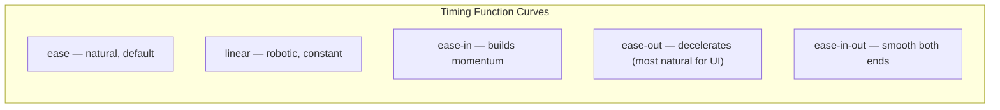
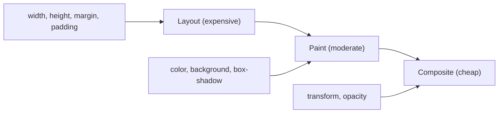

# CSS Animations and Transitions

## What They Are

Transitions and animations bring movement to the web. **Transitions** smoothly change a property from one value to another when triggered by a state change (like hover). **Animations** define multi-step sequences that can run independently, loop, and follow complex timelines.

**Analogy:** A transition is like a light dimmer switch — you slide from bright to dim smoothly when someone flicks it. An animation is like a choreographed dance — it has multiple steps, can repeat, and runs on its own schedule.

---

## Why They Matter

- Motion provides feedback — users know their actions were registered.
- Smooth transitions make interfaces feel polished and professional.
- Animations guide attention to important elements (notifications, loading states).
- Understanding performance ensures your animations run at 60fps, not in a janky stutter.

---

## CSS Transitions

### Basic Syntax

```css
.button {
  background-color: #3366ff;
  transition: background-color 0.3s ease;
}

.button:hover {
  background-color: #0044cc;
}
```

### Transition Properties

```css
.element {
  transition-property: transform, opacity; /* which properties to animate */
  transition-duration: 0.3s; /* how long */
  transition-timing-function: ease-in-out; /* acceleration curve */
  transition-delay: 0.1s; /* wait before starting */
}

/* Shorthand: property | duration | timing | delay */
.element {
  transition: transform 0.3s ease-in-out 0.1s;
}

/* Multiple properties */
.element {
  transition:
    transform 0.3s ease,
    opacity 0.2s ease 0.1s,
    background-color 0.3s ease;
}

/* All animatable properties (use cautiously) */
.element {
  transition: all 0.3s ease;
}
```

### Timing Functions

```css
.ease {
  transition-timing-function: ease;
} /* default — slow start, fast middle, slow end */
.linear {
  transition-timing-function: linear;
} /* constant speed */
.ease-in {
  transition-timing-function: ease-in;
} /* slow start */
.ease-out {
  transition-timing-function: ease-out;
} /* slow end */
.ease-in-out {
  transition-timing-function: ease-in-out;
} /* slow both ends */

/* Custom cubic bezier */
.custom {
  transition-timing-function: cubic-bezier(0.68, -0.55, 0.265, 1.55);
}
/* This one overshoots and bounces back — experiment at cubic-bezier.com */
```



**Recommendation:** Use `ease-out` for elements entering the screen, `ease-in` for elements leaving, and `ease-in-out` for state changes.

---

### Common Transition Patterns

```css
/* Card hover lift */
.card {
  transition:
    transform 0.2s ease,
    box-shadow 0.2s ease;
}
.card:hover {
  transform: translateY(-4px);
  box-shadow: 0 8px 25px rgba(0, 0, 0, 0.15);
}

/* Fade in/out */
.tooltip {
  opacity: 0;
  visibility: hidden;
  transition:
    opacity 0.2s ease,
    visibility 0.2s ease;
}
.trigger:hover .tooltip {
  opacity: 1;
  visibility: visible;
}

/* Smooth color change */
a {
  color: #3366ff;
  transition: color 0.2s ease;
}
a:hover {
  color: #0044cc;
}

/* Expanding search bar */
.search-input {
  width: 200px;
  transition: width 0.3s ease;
}
.search-input:focus {
  width: 350px;
}
```

---

## CSS Animations with `@keyframes`

### Defining Keyframes

```css
@keyframes fadeIn {
  from {
    opacity: 0;
    transform: translateY(20px);
  }
  to {
    opacity: 1;
    transform: translateY(0);
  }
}

@keyframes pulse {
  0% {
    transform: scale(1);
  }
  50% {
    transform: scale(1.05);
  }
  100% {
    transform: scale(1);
  }
}

@keyframes slideInFromLeft {
  0% {
    transform: translateX(-100%);
    opacity: 0;
  }
  100% {
    transform: translateX(0);
    opacity: 1;
  }
}
```

### Animation Properties

```css
.element {
  animation-name: fadeIn;
  animation-duration: 0.5s;
  animation-timing-function: ease-out;
  animation-delay: 0.2s;
  animation-iteration-count: 1; /* or infinite */
  animation-direction: normal; /* normal, reverse, alternate, alternate-reverse */
  animation-fill-mode: forwards; /* none, forwards, backwards, both */
  animation-play-state: running; /* running, paused */
}

/* Shorthand: name | duration | timing | delay | iterations | direction | fill | play-state */
.element {
  animation: fadeIn 0.5s ease-out 0.2s 1 normal forwards;
}
```

### `animation-fill-mode` Explained

Controls what styles apply before/after the animation:

- **`none`** — no styles applied outside the animation.
- **`forwards`** — retains the final keyframe values after completion.
- **`backwards`** — applies the first keyframe values during the delay period.
- **`both`** — applies both `forwards` and `backwards`.

```css
.fade-in {
  opacity: 0; /* initial state */
  animation: fadeIn 0.5s ease forwards; /* stays visible after animation */
}
```

---

### Practical Animation Examples

```css
/* Loading spinner */
@keyframes spin {
  to {
    transform: rotate(360deg);
  }
}

.spinner {
  width: 40px;
  height: 40px;
  border: 4px solid #eee;
  border-top-color: #3366ff;
  border-radius: 50%;
  animation: spin 0.8s linear infinite;
}

/* Bouncing dot loader */
@keyframes bounce {
  0%,
  80%,
  100% {
    transform: scale(0);
  }
  40% {
    transform: scale(1);
  }
}

.dot-loader span {
  display: inline-block;
  width: 12px;
  height: 12px;
  background: #3366ff;
  border-radius: 50%;
  animation: bounce 1.4s infinite ease-in-out both;
}
.dot-loader span:nth-child(2) {
  animation-delay: 0.16s;
}
.dot-loader span:nth-child(3) {
  animation-delay: 0.32s;
}

/* Shake for error */
@keyframes shake {
  0%,
  100% {
    transform: translateX(0);
  }
  10%,
  30%,
  50%,
  70%,
  90% {
    transform: translateX(-5px);
  }
  20%,
  40%,
  60%,
  80% {
    transform: translateX(5px);
  }
}

.input-error {
  animation: shake 0.5s ease;
}
```

---

## CSS Transform

Transform changes an element's shape, size, position, or orientation without affecting document flow.

### Transform Functions

```css
/* Translate — move the element */
.move {
  transform: translate(50px, 20px);
}
.move-x {
  transform: translateX(50px);
}
.move-y {
  transform: translateY(-20px);
}

/* Rotate — spin the element */
.rotate {
  transform: rotate(45deg);
}
.rotate-3d {
  transform: rotateX(45deg) rotateY(30deg);
}

/* Scale — resize the element */
.grow {
  transform: scale(1.2);
} /* 120% size */
.shrink {
  transform: scale(0.8);
} /* 80% size */
.stretch {
  transform: scaleX(1.5);
} /* stretch horizontally */

/* Skew — tilt the element */
.skew {
  transform: skew(10deg, 5deg);
}
.skew-x {
  transform: skewX(10deg);
}

/* Combine multiple transforms */
.complex {
  transform: translateX(50px) rotate(45deg) scale(1.2);
}
```

### `transform-origin`

Sets the pivot point for transformations:

```css
.element {
  transform-origin: center center; /* default */
  transform-origin: top left; /* rotates around top-left corner */
  transform-origin: 50% 100%; /* bottom center */
}
```

---

## Performance Considerations

### The Rendering Pipeline

Not all CSS properties are equal when animated:



### What to Animate (and What Not to)

| Cheap (Composite-only) | Expensive (Trigger Layout/Paint) |
| ---------------------- | -------------------------------- |
| `transform`            | `width`, `height`                |
| `opacity`              | `margin`, `padding`              |
|                        | `top`, `left`, `right`, `bottom` |
|                        | `border-width`                   |
|                        | `font-size`                      |

**Rule:** Whenever possible, animate ONLY `transform` and `opacity`. They run on the GPU compositor thread and do not trigger layout recalculations.

```css
/* BAD — triggers layout on every frame */
.element {
  transition:
    width 0.3s,
    left 0.3s;
}

/* GOOD — GPU-accelerated, smooth */
.element {
  transition:
    transform 0.3s,
    opacity 0.3s;
}
```

### `will-change`

Hints the browser to optimize an element for upcoming changes:

```css
.element-that-will-animate {
  will-change: transform, opacity;
}
```

**Rules for `will-change`:**

- Apply it **before** the animation starts (on hover parent, or via JavaScript).
- Do NOT put it on every element — it consumes GPU memory.
- Remove it after the animation completes if it is one-time.

```css
/* Good pattern — apply on parent hover */
.card:hover .card-image {
  will-change: transform;
}

.card-image {
  transition: transform 0.3s ease;
}

.card:hover .card-image {
  transform: scale(1.05);
}
```

---

## Accessibility: `prefers-reduced-motion`

Some users experience motion sickness or have vestibular disorders. Always respect their preferences:

```css
/* Remove or reduce animations for users who prefer reduced motion */
@media (prefers-reduced-motion: reduce) {
  *,
  *::before,
  *::after {
    animation-duration: 0.01ms !important;
    animation-iteration-count: 1 !important;
    transition-duration: 0.01ms !important;
    scroll-behavior: auto !important;
  }
}
```

Or selectively:

```css
.hero-animation {
  animation: fadeIn 0.8s ease-out forwards;
}

@media (prefers-reduced-motion: reduce) {
  .hero-animation {
    animation: none;
    opacity: 1; /* show content without animation */
  }
}
```

---

## Best Practices

1. **Animate only `transform` and `opacity`** for 60fps performance.
2. **Use `ease-out` for entrances, `ease-in` for exits** — matches natural physics.
3. **Keep durations between 150ms-400ms** — shorter feels snappy, longer feels sluggish.
4. **Always add `prefers-reduced-motion` handling** — it is an accessibility requirement.
5. **Do not animate `all`** — be explicit about which properties transition to avoid unintended effects and performance costs.
6. **Use `animation-fill-mode: forwards`** when you want the end state to persist.
7. **Use `will-change` sparingly** — only on elements you know will animate, and remove when done.
8. **Test on lower-end devices** — what is smooth on your machine may stutter elsewhere.

---

## Common Mistakes

| Mistake                                                    | Why It Is Wrong                                                                    |
| ---------------------------------------------------------- | ---------------------------------------------------------------------------------- |
| Animating `width`/`height` instead of `transform: scale()` | Triggers expensive layout recalculations every frame                               |
| Animating `top`/`left` instead of `transform: translate()` | Same issue — causes layout thrashing                                               |
| Using `transition: all 0.3s`                               | Animates everything including properties you did not intend (color, padding, etc.) |
| Forgetting `animation-fill-mode: forwards`                 | Element snaps back to pre-animation state after completion                         |
| Adding `will-change` to every element                      | Wastes GPU memory and can actually hurt performance                                |
| Not providing `prefers-reduced-motion` fallback            | Excludes users with motion sensitivities                                           |
| Very long animation durations (>1s) for UI interactions    | Feels sluggish and blocks user interaction                                         |

---

## Summary

- **Transitions** smoothly interpolate between two states when triggered (hover, focus, class change).
- **Animations** (`@keyframes`) define multi-step sequences that can loop, reverse, and run independently.
- **Transform** (`translate`, `rotate`, `scale`, `skew`) changes visual appearance without affecting layout.
- Animate **only `transform` and `opacity`** for smooth, GPU-accelerated performance.
- Use `will-change` as a performance hint — but sparingly and only when needed.
- Always respect `prefers-reduced-motion` — it is both an accessibility best practice and a moral obligation.
- Keep animations purposeful — they should communicate meaning, not just look cool.
