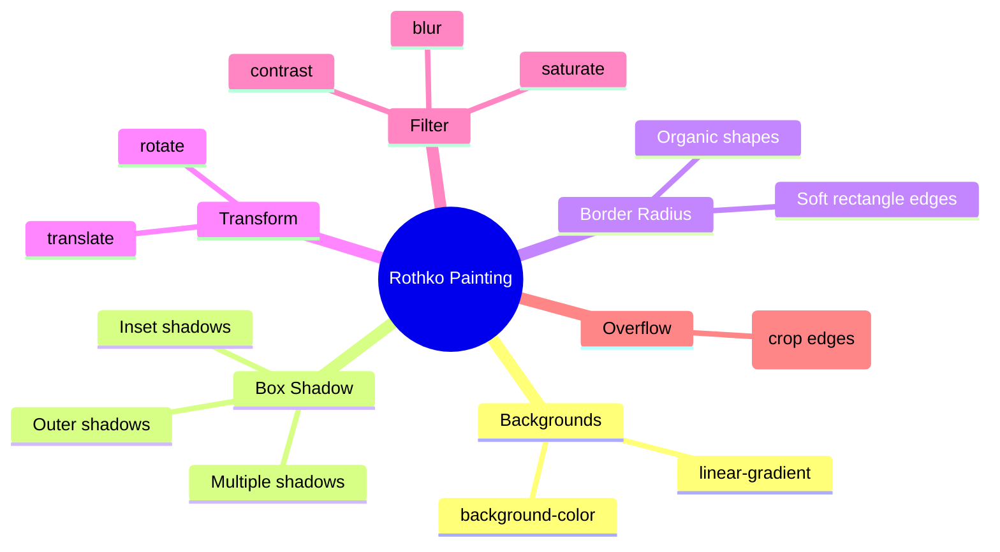

# CSS Rothko Painting Exercise

## What Is This Exercise?

This is a creative CSS project where you recreate a Mark Rothko-style abstract painting using only HTML and CSS. Rothko's paintings are rectangular blocks of color with soft edges, subtle gradients, and blurred boundaries — which maps perfectly to CSS properties like `background`, `box-shadow`, `border-radius`, `transform`, and `filter`.

**Analogy:** Think of your browser as a canvas and CSS as your paint. Instead of a brush, you use `div` elements as color blocks and CSS properties to soften, blur, rotate, and layer them — just like Rothko layered oil paint on canvas.

---

## Why This Exercise Matters

- Reinforces multiple CSS properties in one cohesive project.
- Teaches you to think visually about how CSS properties combine.
- Covers `background`, `box-shadow`, `filter`, `transform`, `border-radius`, and `overflow` in a practical context.
- Proves that CSS alone can create art — no images needed.

---

## The Properties You Will Practice



---

## Building the Painting Step by Step

### Step 1: The Canvas (Frame)

The canvas is the outer container that holds the painting. It uses `overflow: hidden` to crop any elements that bleed past its edges.

```html
<div class="frame">
  <div class="canvas">
    <div class="block block-one"></div>
    <div class="block block-two"></div>
    <div class="block block-three"></div>
  </div>
</div>
```

```css
.frame {
  width: 500px;
  margin: 50px auto;
  padding: 50px;
  background-color: #1a1a1a;
  border: 8px solid #2c2c2c;
}

.canvas {
  width: 100%;
  height: 600px;
  background-color: #4d0000;
  overflow: hidden;
  filter: blur(2px);
  display: flex;
  flex-direction: column;
  align-items: center;
  justify-content: space-evenly;
}
```

**Key concept:** `overflow: hidden` on the canvas means blocks can be positioned slightly off-center or rotated without breaking outside the frame.

---

### Step 2: Color Blocks

Each block is a `div` with a distinct background color and soft edges:

```css
.block {
  border-radius: 20px;
}

.block-one {
  width: 80%;
  height: 150px;
  background-color: #6b1010;
  box-shadow: 0 0 40px 10px rgba(107, 16, 16, 0.6);
  transform: rotate(-0.5deg);
}

.block-two {
  width: 75%;
  height: 200px;
  background-color: #9b2d2d;
  box-shadow: 0 0 30px 8px rgba(155, 45, 45, 0.5);
  transform: rotate(0.3deg);
}

.block-three {
  width: 80%;
  height: 120px;
  background-color: #1a1a5e;
  box-shadow: 0 0 35px 12px rgba(26, 26, 94, 0.6);
  transform: rotate(-0.7deg);
}
```

---

### Step 3: Adding Depth with Box Shadows

Rothko paintings feel like colors are floating or glowing. Box shadows create this effect:

```css
/* Single shadow */
box-shadow: 0 0 40px 10px rgba(107, 16, 16, 0.6);
/*          x  y  blur  spread  color */

/* Multiple shadows for more complexity */
.block-one {
  box-shadow:
    0 0 40px 10px rgba(107, 16, 16, 0.6),
    inset 0 0 20px rgba(0, 0, 0, 0.3);
}
```

| Shadow Part | What It Does                                    |
| ----------- | ----------------------------------------------- |
| `0 0`       | No offset — shadow is centered (glowing effect) |
| `40px`      | Blur radius — larger = softer edge              |
| `10px`      | Spread — extends the shadow outward             |
| `rgba()`    | Semi-transparent color for natural blending     |
| `inset`     | Shadow inside the element (adds inner depth)    |

---

### Step 4: Gradients for Realism

Real paintings are never a flat single color. Add subtle gradients:

```css
.block-two {
  background: linear-gradient(to bottom, #b83c3c 0%, #9b2d2d 50%, #7a1f1f 100%);
}
```

For a more painterly feel, use radial gradients:

```css
.block-one {
  background: radial-gradient(
    ellipse at 40% 50%,
    #8b2020 0%,
    #6b1010 60%,
    #4d0000 100%
  );
}
```

---

### Step 5: Transform for Organic Feel

Rothko's rectangles are never perfectly aligned. Slight rotations make them feel hand-painted:

```css
.block-one {
  transform: rotate(-0.5deg) translateX(-5px);
}

.block-two {
  transform: rotate(0.3deg) translateX(3px);
}

.block-three {
  transform: rotate(-0.7deg) translateY(2px);
}
```

Small values are key — anything over 2-3 degrees looks intentionally tilted rather than organically imperfect.

---

### Step 6: Filter for Soft Edges

The `filter` property on the canvas blurs everything slightly, mimicking the soft edges of oil paint:

```css
.canvas {
  filter: blur(2px);
}
```

You can also apply filters to individual blocks:

```css
.block-three {
  filter: blur(1px) saturate(1.2);
}
```

| Filter       | Effect                              | Rothko Use                    |
| ------------ | ----------------------------------- | ----------------------------- |
| `blur()`     | Softens edges                       | Mimics blended paint edges    |
| `saturate()` | Increases/decreases color intensity | Makes colors richer or muted  |
| `contrast()` | Adjusts light/dark difference       | Adds visual weight to a block |
| `opacity()`  | Makes element semi-transparent      | Layered color effect          |

---

## Complete Example

```html
<!DOCTYPE html>
<html lang="en">
  <head>
    <meta charset="UTF-8" />
    <meta name="viewport" content="width=device-width, initial-scale=1.0" />
    <title>CSS Rothko Painting</title>
    <link rel="stylesheet" href="style.css" />
  </head>
  <body>
    <div class="frame">
      <div class="canvas">
        <div class="block block-one"></div>
        <div class="block block-two"></div>
        <div class="block block-three"></div>
      </div>
    </div>
  </body>
</html>
```

```css
* {
  margin: 0;
  padding: 0;
  box-sizing: border-box;
}

body {
  background-color: #2c2c2c;
  display: flex;
  justify-content: center;
  align-items: center;
  min-height: 100vh;
}

.frame {
  width: 500px;
  padding: 50px;
  background-color: #1a1a1a;
  border: 10px solid #3d3d3d;
  box-shadow: 0 20px 60px rgba(0, 0, 0, 0.5);
}

.canvas {
  width: 100%;
  height: 600px;
  background-color: #4d0000;
  overflow: hidden;
  filter: blur(2px);
  display: flex;
  flex-direction: column;
  align-items: center;
  justify-content: space-evenly;
  padding: 20px 0;
}

.block {
  border-radius: 20px;
  transition: filter 0.3s ease;
}

.block-one {
  width: 80%;
  height: 150px;
  background: radial-gradient(
    ellipse at 40% 50%,
    #8b2020,
    #6b1010 60%,
    #4d0000
  );
  box-shadow:
    0 0 40px 10px rgba(107, 16, 16, 0.6),
    inset 0 0 25px rgba(0, 0, 0, 0.3);
  transform: rotate(-0.5deg) translateX(-5px);
}

.block-two {
  width: 75%;
  height: 200px;
  background: linear-gradient(to bottom, #b83c3c, #9b2d2d 50%, #7a1f1f);
  box-shadow:
    0 0 30px 8px rgba(155, 45, 45, 0.5),
    inset 0 0 20px rgba(0, 0, 0, 0.25);
  transform: rotate(0.3deg) translateX(3px);
}

.block-three {
  width: 80%;
  height: 120px;
  background: linear-gradient(to bottom, #2a2a7e, #1a1a5e 60%, #0f0f3d);
  box-shadow:
    0 0 35px 12px rgba(26, 26, 94, 0.6),
    inset 0 0 15px rgba(0, 0, 0, 0.4);
  transform: rotate(-0.7deg) translateY(2px);
}
```

---

## Properties Recap

| Property        | Role in This Project                         | Example Value                      |
| --------------- | -------------------------------------------- | ---------------------------------- |
| `background`    | Block color, gradients                       | `linear-gradient(to bottom, …)`    |
| `box-shadow`    | Glow, depth, inner shadow                    | `0 0 40px 10px rgba(…)`            |
| `border-radius` | Soft rounded rectangle edges                 | `20px`                             |
| `transform`     | Slight rotation/translation for organic feel | `rotate(-0.5deg) translateX(-5px)` |
| `filter`        | Blur edges, adjust saturation                | `blur(2px)`                        |
| `overflow`      | Crop anything that extends past the canvas   | `hidden`                           |

---

## Best Practices

1. **Use small transform values** — 0.1 to 1 degree rotations feel organic; larger values look intentional.
2. **Layer multiple box-shadows** — combine outer glow with `inset` shadow for depth.
3. **Use `rgba()` or `hsla()` for shadows** — semi-transparent colors blend naturally.
4. **Apply `filter: blur()` to the container** — blurs all children uniformly for a cohesive soft look.
5. **Use `overflow: hidden`** — prevents rotated or offset blocks from breaking outside the frame.
6. **Stick to 2-4 colors per painting** — Rothko's power comes from limited palettes with subtle variation.
7. **Test different background colors** — the canvas background color dramatically changes the mood.

---

## Common Mistakes

| Mistake                              | Why It Is Wrong                               | Fix                                            |
| ------------------------------------ | --------------------------------------------- | ---------------------------------------------- |
| Too much rotation                    | Looks intentionally skewed, not organic       | Keep rotations under 1 degree                  |
| Using solid colors without gradients | Looks flat and digital, not painterly         | Add subtle gradients (even 2-shade)            |
| Forgetting `overflow: hidden`        | Rotated blocks stick out of the canvas        | Add `overflow: hidden` to the canvas container |
| Sharp `border-radius: 0`             | Hard edges look like UI components, not paint | Use at least `10px-30px` border-radius         |
| Box shadow with full opacity         | Shadow looks like a UI element, not a glow    | Use `rgba()` with 0.3-0.6 opacity              |
| Blur filter too high                 | Everything becomes unrecognizable mush        | Keep `blur()` between 1-3px for the canvas     |
| Not using `inset` shadows            | Blocks feel flat without inner depth          | Combine outer + `inset` box-shadow             |

---

## Variations to Try

- **Yellow/Orange Palette:** Replace reds with `#f5a623`, `#d4740e`, `#8b4513`
- **Blue/Black Palette:** Use `#1a237e`, `#0d47a1`, `#000033` on a `#0a0a2e` canvas
- **Add a fourth block** with more `filter: blur()` to create a hazy background layer
- **Animate the blocks** subtly with `@keyframes` for a "breathing" effect:

```css
@keyframes breathe {
  0%,
  100% {
    transform: rotate(-0.5deg) scale(1);
  }
  50% {
    transform: rotate(-0.3deg) scale(1.01);
  }
}

.block-one {
  animation: breathe 8s ease-in-out infinite;
}
```

---

## Summary

- This exercise practices `background`, `box-shadow`, `border-radius`, `transform`, `filter`, and `overflow` in a creative context.
- Rothko-style paintings are soft-edged colored rectangles — perfect for CSS recreation.
- Small transforms (rotation, translation) create an organic, hand-painted feel.
- Box shadows with `rgba()` create glow effects; `inset` shadows add inner depth.
- `filter: blur()` on the canvas container softens all edges uniformly.
- `overflow: hidden` keeps the composition clean despite transforms.
- Art + CSS = a memorable way to internalize visual properties.
