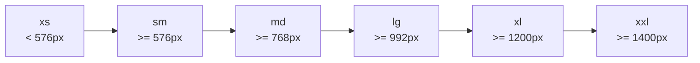

# Bootstrap 5 Breakpoints

## What Is It

Breakpoints are predefined screen-width thresholds that Bootstrap uses to adapt your layout across different devices. They are the backbone of responsive design in Bootstrap -- the invisible fences that determine when your layout shifts from a phone view to a tablet view to a desktop view.

**Analogy:** Think of breakpoints like water level marks on a dam. As the screen width rises past each mark, the layout "spills" into a new configuration. Below 576px, you are in a narrow channel; above 1400px, the river has a wide, open floodplain.

## Why It Matters

- Users visit on phones, tablets, laptops, and ultrawide monitors. One static layout cannot serve them all.
- Bootstrap's breakpoint system gives you a consistent vocabulary (`sm`, `md`, `lg`, etc.) to express responsive behavior.
- The mobile-first approach means you write less CSS -- styles cascade upward from the smallest screen.

---

## The Breakpoint System

Bootstrap 5 defines six breakpoints:

| Breakpoint | Class infix | Dimension | Typical Device         |
| ---------- | ----------- | --------- | ---------------------- |
| X-Small    | (none)      | < 576px   | Portrait phones        |
| Small      | `sm`        | >= 576px  | Landscape phones       |
| Medium     | `md`        | >= 768px  | Tablets                |
| Large      | `lg`        | >= 992px  | Laptops / Desktops     |
| X-Large    | `xl`        | >= 1200px | Large desktops         |
| XX-Large   | `xxl`       | >= 1400px | Ultrawide / TV screens |



---

## Mobile-First Approach

Bootstrap uses a **mobile-first** strategy. This means:

1. Base styles target the smallest screens (no media query needed).
2. You add classes with breakpoint infixes to layer on styles for larger screens.
3. Styles applied at a breakpoint cascade **upward** to all larger breakpoints.

```html
<!-- This column is full-width on phones, half-width on medium+, one-third on large+ -->
<div class="col-12 col-md-6 col-lg-4">Content here</div>
```

**Analogy:** Mobile-first is like dressing in layers. You start with the base layer (mobile) and add jackets (tablet rules) and coats (desktop rules) on top. You never remove layers -- you only add.

### How Media Queries Work Under the Hood

Bootstrap generates `min-width` media queries for each breakpoint:

```css
/* No media query for xs -- this is the base */

/* Small devices (landscape phones, 576px and up) */
@media (min-width: 576px) { ... }

/* Medium devices (tablets, 768px and up) */
@media (min-width: 768px) { ... }

/* Large devices (desktops, 992px and up) */
@media (min-width: 992px) { ... }

/* X-Large devices (large desktops, 1200px and up) */
@media (min-width: 1200px) { ... }

/* XX-Large devices (1400px and up) */
@media (min-width: 1400px) { ... }
```

---

## Using Breakpoints in Practice

### Grid Columns

```html
<div class="container">
  <div class="row">
    <!-- Full width on mobile, 2 columns on tablet, 3 columns on desktop -->
    <div class="col-12 col-md-6 col-lg-4">Card 1</div>
    <div class="col-12 col-md-6 col-lg-4">Card 2</div>
    <div class="col-12 col-md-12 col-lg-4">Card 3</div>
  </div>
</div>
```

### Responsive Utilities (Show/Hide)

```html
<!-- Hidden on mobile, visible on medium and up -->
<div class="d-none d-md-block">Desktop sidebar</div>

<!-- Visible on mobile only -->
<div class="d-block d-md-none">Mobile menu</div>
```

### Responsive Spacing

```html
<!-- Small padding on mobile, larger padding on desktop -->
<div class="p-2 p-md-4 p-lg-5">Responsive padding</div>
```

### Responsive Text Alignment

```html
<p class="text-center text-lg-start">
  Centered on small screens, left-aligned on large screens.
</p>
```

---

## Containers and Breakpoints

Bootstrap containers also respond to breakpoints:

| Class              | Behavior                           |
| ------------------ | ---------------------------------- |
| `.container`       | Fixed max-width at each breakpoint |
| `.container-fluid` | Always 100% width                  |
| `.container-sm`    | 100% until `sm`, then fixed        |
| `.container-md`    | 100% until `md`, then fixed        |
| `.container-lg`    | 100% until `lg`, then fixed        |
| `.container-xl`    | 100% until `xl`, then fixed        |
| `.container-xxl`   | 100% until `xxl`, then fixed       |

```html
<!-- Full-width until 768px, then constrained -->
<div class="container-md">
  Content that becomes contained on tablets and up.
</div>
```

---

## Customizing Breakpoints (Sass)

If the default breakpoints do not match your design needs, you can override them in Sass before importing Bootstrap:

```scss
// Custom breakpoints
$grid-breakpoints: (
  xs: 0,
  sm: 480px,
  // Changed from 576px
  md: 768px,
  lg: 1024px,
  // Changed from 992px
  xl: 1280px,
  // Changed from 1200px
  xxl: 1440px, // Changed from 1400px
);

// Then import Bootstrap
@import "bootstrap/scss/bootstrap";
```

You can also add entirely new breakpoints:

```scss
$grid-breakpoints: (
  xs: 0,
  sm: 576px,
  md: 768px,
  lg: 992px,
  xl: 1200px,
  xxl: 1400px,
  xxxl: 1600px, // New breakpoint for ultrawide
);
```

---

## Breakpoint Mixins (Sass)

When writing custom Sass, use Bootstrap's mixins instead of hardcoding pixel values:

```scss
// Applies from medium breakpoint and up
@include media-breakpoint-up(md) {
  .custom-sidebar {
    width: 250px;
  }
}

// Applies below the large breakpoint
@include media-breakpoint-down(lg) {
  .custom-sidebar {
    display: none;
  }
}

// Applies only between md and lg
@include media-breakpoint-between(md, lg) {
  .custom-sidebar {
    width: 200px;
  }
}

// Applies only at the exact md range
@include media-breakpoint-only(md) {
  .custom-sidebar {
    background: lightgray;
  }
}
```

---

## Best Practices

1. Always design mobile-first. Start with the smallest layout, then progressively enhance.
2. Test at each breakpoint boundary -- not just exact pixel values. Real devices have varying widths.
3. Use responsive utility classes before writing custom media queries.
4. Avoid using too many breakpoint overrides on a single element -- it becomes hard to maintain.
5. Use `.container` (not `.container-fluid`) when you want centered, max-width content.

## Common Mistakes

| Mistake                                                     | Why It Is Wrong                                                   | Fix                                                                        |
| ----------------------------------------------------------- | ----------------------------------------------------------------- | -------------------------------------------------------------------------- |
| Designing desktop-first, then "fixing" mobile               | Leads to excessive overrides and fragile layouts                  | Start from `xs` and build up                                               |
| Confusing `min-width` with `max-width`                      | Bootstrap uses `min-width`; styles cascade up, not down           | Remember: a `col-md-6` applies at `md` and above                           |
| Hardcoding pixel values instead of using breakpoint classes | Breaks the responsive system and creates maintenance burden       | Use Bootstrap's class infixes                                              |
| Forgetting the viewport meta tag                            | Without it, mobile browsers render the desktop layout scaled down | Add `<meta name="viewport" content="width=device-width, initial-scale=1">` |

---

## Summary

Bootstrap's breakpoint system divides the screen-width spectrum into six named zones. Combined with the mobile-first philosophy, this lets you write a single HTML structure that gracefully adapts from pocket-sized phones to widescreen monitors. Master the breakpoints and you master responsive design in Bootstrap -- every grid class, utility, and component responds to these same thresholds.
