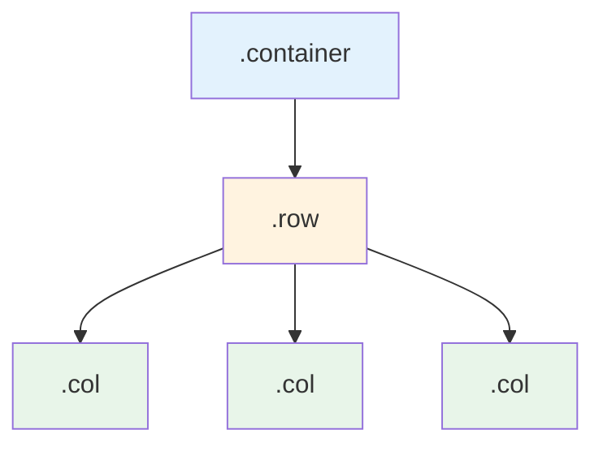

# Bootstrap 5 Grid System

## What Is It

The Bootstrap grid system is a powerful, mobile-first flexbox layout engine that divides the page into a 12-column structure. It uses containers, rows, and columns to organize content into responsive layouts without writing complex CSS.

**Analogy:** Imagine a bookshelf with exactly 12 equal slots. You can place one wide book across all 12 slots, two medium books taking 6 slots each, or mix and match -- 4 slots for a sidebar and 8 for main content. The grid works the same way: you decide how many of the 12 columns each piece of content occupies.

## Why It Matters

- Provides a consistent, predictable layout system across all screen sizes.
- Eliminates manual float calculations and complex CSS positioning.
- Built on flexbox, giving you powerful alignment and distribution options.
- Responsive by default -- columns stack on small screens and sit side-by-side on larger ones.

---

## Architecture



The three building blocks:

1. **Container** -- wraps everything, provides horizontal padding, and centers content.
2. **Row** -- horizontal group of columns. Uses negative margins to counteract container padding.
3. **Column** -- the actual content holder. Specifies width as a fraction of 12.

---

## Containers

```html
<!-- Fixed-width container (max-width changes at each breakpoint) -->
<div class="container">...</div>

<!-- Full-width container (always 100%) -->
<div class="container-fluid">...</div>

<!-- Responsive container (full-width until the specified breakpoint) -->
<div class="container-md">...</div>
```

---

## Basic Grid Usage

### Equal-Width Columns

```html
<div class="container">
  <div class="row">
    <div class="col">Column 1</div>
    <div class="col">Column 2</div>
    <div class="col">Column 3</div>
  </div>
</div>
```

When you use `.col` without a number, Bootstrap distributes space equally among all columns in the row.

### Specifying Column Widths

```html
<div class="container">
  <div class="row">
    <div class="col-4">4 columns wide (1/3)</div>
    <div class="col-8">8 columns wide (2/3)</div>
  </div>
</div>
```

### Mixing Fixed and Auto Columns

```html
<div class="container">
  <div class="row">
    <div class="col-3">Fixed 3 cols</div>
    <div class="col">Takes remaining space</div>
    <div class="col-2">Fixed 2 cols</div>
  </div>
</div>
```

---

## Responsive Columns

This is where the grid truly shines. Combine column classes with breakpoint infixes to create layouts that adapt.

```html
<div class="container">
  <div class="row">
    <!-- Full width on mobile, half on tablet, third on desktop -->
    <div class="col-12 col-md-6 col-lg-4">Card 1</div>
    <div class="col-12 col-md-6 col-lg-4">Card 2</div>
    <div class="col-12 col-md-12 col-lg-4">Card 3</div>
  </div>
</div>
```

### Common Responsive Patterns

```html
<!-- Sidebar + Main Content -->
<div class="row">
  <aside class="col-12 col-lg-3">Sidebar</aside>
  <main class="col-12 col-lg-9">Main Content</main>
</div>

<!-- Three equal columns on desktop, stacked on mobile -->
<div class="row">
  <div class="col-12 col-md-4">Feature 1</div>
  <div class="col-12 col-md-4">Feature 2</div>
  <div class="col-12 col-md-4">Feature 3</div>
</div>

<!-- Two uneven columns -->
<div class="row">
  <div class="col-12 col-md-8">Blog post</div>
  <div class="col-12 col-md-4">Related posts</div>
</div>
```

---

## Column Offsetting

Push columns to the right without adding empty columns.

```html
<div class="row">
  <div class="col-md-4 offset-md-4">Centered 4-col block</div>
</div>

<div class="row">
  <div class="col-md-3 offset-md-3">Offset by 3</div>
  <div class="col-md-3 offset-md-3">Offset by 3</div>
</div>
```

**Analogy:** Offsets are like indenting a paragraph. You do not add blank words -- you just push the content to the right.

---

## Nesting

You can nest rows inside columns to create sub-grids. The nested row gets its own 12-column system.

```html
<div class="container">
  <div class="row">
    <div class="col-md-8">
      <h3>Main Content</h3>
      <!-- Nested grid -->
      <div class="row">
        <div class="col-md-6">Nested Left</div>
        <div class="col-md-6">Nested Right</div>
      </div>
    </div>
    <div class="col-md-4">Sidebar</div>
  </div>
</div>
```

---

## Gutters

Gutters are the spacing (padding) between columns. Bootstrap 5 uses `g-*`, `gx-*` (horizontal), and `gy-*` (vertical) classes.

```html
<!-- Default gutters (1.5rem = 24px total) -->
<div class="row">
  <div class="col-6">Left</div>
  <div class="col-6">Right</div>
</div>

<!-- No gutters -->
<div class="row g-0">
  <div class="col-6">Left (flush)</div>
  <div class="col-6">Right (flush)</div>
</div>

<!-- Large gutters -->
<div class="row g-5">
  <div class="col-6">Left</div>
  <div class="col-6">Right</div>
</div>

<!-- Horizontal gutters only -->
<div class="row gx-4 gy-0">
  <div class="col-6">Left</div>
  <div class="col-6">Right</div>
</div>

<!-- Responsive gutters -->
<div class="row g-2 g-md-4 g-lg-5">
  <div class="col-6">Left</div>
  <div class="col-6">Right</div>
</div>
```

Gutter scale: `g-0` (0px) through `g-5` (3rem / 48px).

---

## Alignment

### Vertical Alignment (Row Level)

```html
<div class="row align-items-start" style="height: 200px;">
  <div class="col">Top</div>
</div>

<div class="row align-items-center" style="height: 200px;">
  <div class="col">Middle</div>
</div>

<div class="row align-items-end" style="height: 200px;">
  <div class="col">Bottom</div>
</div>
```

### Vertical Alignment (Column Level)

```html
<div class="row" style="height: 200px;">
  <div class="col align-self-start">Top</div>
  <div class="col align-self-center">Middle</div>
  <div class="col align-self-end">Bottom</div>
</div>
```

### Horizontal Alignment

```html
<div class="row justify-content-start">
  <div class="col-4">Left</div>
</div>

<div class="row justify-content-center">
  <div class="col-4">Center</div>
</div>

<div class="row justify-content-end">
  <div class="col-4">Right</div>
</div>

<div class="row justify-content-between">
  <div class="col-3">Left</div>
  <div class="col-3">Right</div>
</div>

<div class="row justify-content-evenly">
  <div class="col-3">A</div>
  <div class="col-3">B</div>
  <div class="col-3">C</div>
</div>
```

---

## Column Ordering

Change visual order without changing source order.

```html
<div class="row">
  <div class="col order-3">First in DOM, appears third</div>
  <div class="col order-1">Second in DOM, appears first</div>
  <div class="col order-2">Third in DOM, appears second</div>
</div>
```

---

## Row Columns

Control how many columns appear per row without specifying individual column widths.

```html
<!-- Always 2 items per row -->
<div class="row row-cols-2">
  <div class="col">Item 1</div>
  <div class="col">Item 2</div>
  <div class="col">Item 3</div>
  <div class="col">Item 4</div>
</div>

<!-- Responsive: 1 on mobile, 2 on md, 4 on lg -->
<div class="row row-cols-1 row-cols-md-2 row-cols-lg-4">
  <div class="col">Item 1</div>
  <div class="col">Item 2</div>
  <div class="col">Item 3</div>
  <div class="col">Item 4</div>
</div>
```

---

## Best Practices

1. Always place columns inside a `.row`, and rows inside a `.container`.
2. Column widths in a row should add up to 12 (or less). Exceeding 12 wraps to the next line.
3. Use `row-cols-*` for uniform card grids instead of repeating `col-md-4` on every item.
4. Use gutters (`g-*`) instead of adding margins/padding manually to columns.
5. Prefer the grid system over manual flexbox when layout follows a columnar pattern.

## Common Mistakes

| Mistake                                     | Why It Is Wrong                                            | Fix                                          |
| ------------------------------------------- | ---------------------------------------------------------- | -------------------------------------------- |
| Placing `.col` outside a `.row`             | Columns need the row's negative margins to align correctly | Always wrap cols in a row                    |
| Adding extra padding/margin to cols         | Breaks the gutter system and causes misalignment           | Use gutter classes on the row                |
| Exceeding 12 columns without intention      | Causes unexpected wrapping                                 | Audit column numbers; use responsive classes |
| Using the grid for single-element centering | Overkill; adds unnecessary DOM nodes                       | Use `mx-auto`, `d-flex`, or text utilities   |

---

## Summary

The Bootstrap grid system gives you a 12-column, flexbox-powered layout engine that handles responsive design through a simple class-naming convention. Master the container-row-column hierarchy, understand how breakpoint infixes work, and use gutters and alignment utilities to build any layout from a mobile-stacked card list to a complex multi-column dashboard.
