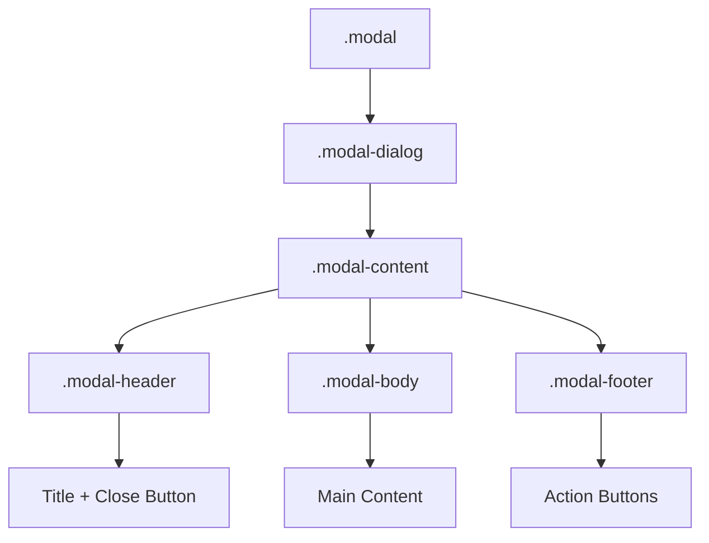

# Bootstrap 5 Modals

## What Is It

A modal is a dialog overlay that appears on top of the page content, demanding user attention before they can interact with anything else. Bootstrap modals provide a structured, accessible way to display forms, confirmations, alerts, or any content that requires focused interaction.

**Analogy:** A modal is like a colleague tapping you on the shoulder during a meeting. The meeting (page content) pauses while you address the interruption (modal). Once you are done, you return to where you left off. The page behind gets a dark backdrop -- visually communicating "this is paused."

## Why It Matters

- Modals focus user attention on a specific task without navigating away.
- Common use cases: confirmation dialogs, login forms, image previews, settings panels.
- Bootstrap handles the backdrop, scrolling behavior, focus trapping, and keyboard navigation.
- Fully accessible -- focus management and ARIA attributes are built in.

---

## Modal Structure



### Basic Modal

```html
<!-- Trigger Button -->
<button
  type="button"
  class="btn btn-primary"
  data-bs-toggle="modal"
  data-bs-target="#exampleModal"
>
  Open Modal
</button>

<!-- Modal -->
<div
  class="modal fade"
  id="exampleModal"
  tabindex="-1"
  aria-labelledby="exampleModalLabel"
  aria-hidden="true"
>
  <div class="modal-dialog">
    <div class="modal-content">
      <div class="modal-header">
        <h5 class="modal-title" id="exampleModalLabel">Modal Title</h5>
        <button
          type="button"
          class="btn-close"
          data-bs-dismiss="modal"
          aria-label="Close"
        ></button>
      </div>
      <div class="modal-body">
        <p>This is the modal body content. You can put anything here.</p>
      </div>
      <div class="modal-footer">
        <button type="button" class="btn btn-secondary" data-bs-dismiss="modal">
          Cancel
        </button>
        <button type="button" class="btn btn-primary">Save Changes</button>
      </div>
    </div>
  </div>
</div>
```

Key attributes explained:

- `.modal.fade` -- the outer container with fade animation.
- `tabindex="-1"` -- removes the modal from normal tab order.
- `aria-labelledby` -- links to the modal title for screen readers.
- `aria-hidden="true"` -- hides from assistive tech when not visible.
- `data-bs-toggle="modal"` -- tells the trigger to open a modal.
- `data-bs-target="#id"` -- specifies which modal to open.
- `data-bs-dismiss="modal"` -- closes the modal when clicked.

---

## Modal Sizes

```html
<!-- Small -->
<div class="modal-dialog modal-sm">...</div>

<!-- Default (no extra class) -->
<div class="modal-dialog">...</div>

<!-- Large -->
<div class="modal-dialog modal-lg">...</div>

<!-- Extra Large -->
<div class="modal-dialog modal-xl">...</div>

<!-- Fullscreen -->
<div class="modal-dialog modal-fullscreen">...</div>

<!-- Fullscreen below a breakpoint -->
<div class="modal-dialog modal-fullscreen-md-down">...</div>
```

Fullscreen breakpoint variants: `modal-fullscreen-sm-down`, `modal-fullscreen-md-down`, `modal-fullscreen-lg-down`, `modal-fullscreen-xl-down`, `modal-fullscreen-xxl-down`.

---

## Vertically Centered Modal

By default, modals appear near the top of the viewport. Center them vertically:

```html
<div class="modal-dialog modal-dialog-centered">
  <div class="modal-content">
    <!-- content -->
  </div>
</div>
```

---

## Scrollable Modal

When modal content exceeds the viewport height, you have two options:

### Scroll the Entire Modal (Default)

The page scrolls to reveal overflowing modal content.

### Scroll Only the Modal Body

```html
<div class="modal-dialog modal-dialog-scrollable">
  <div class="modal-content">
    <div class="modal-header">
      <h5 class="modal-title">Terms of Service</h5>
      <button type="button" class="btn-close" data-bs-dismiss="modal"></button>
    </div>
    <div class="modal-body">
      <!-- Long content here -- only this section scrolls -->
      <p>Very long content...</p>
    </div>
    <div class="modal-footer">
      <button type="button" class="btn btn-primary">Accept</button>
    </div>
  </div>
</div>
```

The header and footer stay fixed while the body scrolls.

---

## Static Backdrop

Prevent the modal from closing when clicking outside it.

```html
<div
  class="modal fade"
  id="staticBackdrop"
  data-bs-backdrop="static"
  data-bs-keyboard="false"
  tabindex="-1"
  aria-labelledby="staticBackdropLabel"
  aria-hidden="true"
>
  <div class="modal-dialog">
    <div class="modal-content">
      <div class="modal-header">
        <h5 class="modal-title" id="staticBackdropLabel">Important Action</h5>
        <button
          type="button"
          class="btn-close"
          data-bs-dismiss="modal"
          aria-label="Close"
        ></button>
      </div>
      <div class="modal-body">
        <p>
          You must explicitly close this modal. Clicking outside will not
          dismiss it.
        </p>
      </div>
      <div class="modal-footer">
        <button type="button" class="btn btn-primary" data-bs-dismiss="modal">
          I Understand
        </button>
      </div>
    </div>
  </div>
</div>
```

- `data-bs-backdrop="static"` -- backdrop click does not close.
- `data-bs-keyboard="false"` -- Escape key does not close.

---

## Triggering via JavaScript

```html
<script>
  // Create modal instance
  const modalElement = document.getElementById("exampleModal");
  const modal = new bootstrap.Modal(modalElement, {
    backdrop: "static", // or true, or false
    keyboard: false, // disable Escape key
    focus: true, // auto-focus on open
  });

  // Show
  modal.show();

  // Hide
  modal.hide();

  // Toggle
  modal.toggle();

  // Dispose (destroys the modal instance)
  modal.dispose();
</script>
```

---

## Modal Events

```html
<script>
  const modalEl = document.getElementById("exampleModal");

  // Before the modal opens
  modalEl.addEventListener("show.bs.modal", (event) => {
    console.log("Modal is about to show");
    // event.relatedTarget is the trigger element
    const trigger = event.relatedTarget;
  });

  // After the modal is fully visible
  modalEl.addEventListener("shown.bs.modal", () => {
    console.log("Modal is now visible");
    // Good place to focus an input
    document.getElementById("emailInput").focus();
  });

  // Before the modal closes
  modalEl.addEventListener("hide.bs.modal", () => {
    console.log("Modal is about to hide");
  });

  // After the modal is fully hidden
  modalEl.addEventListener("hidden.bs.modal", () => {
    console.log("Modal is now hidden");
    // Good place to reset forms
  });
</script>
```

---

## Passing Data to Modals

Use `data-bs-*` attributes on the trigger and read them in the `show.bs.modal` event:

```html
<button
  type="button"
  class="btn btn-primary"
  data-bs-toggle="modal"
  data-bs-target="#editModal"
  data-bs-user-id="42"
  data-bs-username="Alice"
>
  Edit Alice
</button>

<script>
  const editModal = document.getElementById("editModal");
  editModal.addEventListener("show.bs.modal", (event) => {
    const button = event.relatedTarget;
    const userId = button.getAttribute("data-bs-user-id");
    const username = button.getAttribute("data-bs-username");

    // Update modal content
    editModal.querySelector(".modal-title").textContent = `Edit ${username}`;
    editModal.querySelector("#userId").value = userId;
  });
</script>
```

---

## Modal with Form

```html
<div class="modal fade" id="loginModal" tabindex="-1">
  <div class="modal-dialog">
    <div class="modal-content">
      <div class="modal-header">
        <h5 class="modal-title">Sign In</h5>
        <button
          type="button"
          class="btn-close"
          data-bs-dismiss="modal"
        ></button>
      </div>
      <form action="/login" method="POST">
        <div class="modal-body">
          <div class="mb-3">
            <label for="email" class="form-label">Email</label>
            <input type="email" class="form-control" id="email" required />
          </div>
          <div class="mb-3">
            <label for="password" class="form-label">Password</label>
            <input
              type="password"
              class="form-control"
              id="password"
              required
            />
          </div>
        </div>
        <div class="modal-footer">
          <button
            type="button"
            class="btn btn-secondary"
            data-bs-dismiss="modal"
          >
            Cancel
          </button>
          <button type="submit" class="btn btn-primary">Sign In</button>
        </div>
      </form>
    </div>
  </div>
</div>
```

---

## Best Practices

1. Always include `aria-labelledby` pointing to the modal title.
2. Use `modal-dialog-scrollable` for long content to keep header/footer visible.
3. Use static backdrop for critical confirmations (delete, payment).
4. Reset form state on `hidden.bs.modal` event to avoid stale data.
5. Avoid nesting modals -- it creates confusing UX. Use a single modal with dynamic content instead.

## Common Mistakes

| Mistake                                         | Why It Is Wrong                                | Fix                                    |
| ----------------------------------------------- | ---------------------------------------------- | -------------------------------------- |
| Nesting modals inside other modals              | Bootstrap does not support stacked modals well | Use one modal with dynamic content     |
| Forgetting `tabindex="-1"`                      | Focus management breaks                        | Always include it on `.modal`          |
| Not matching `data-bs-target` with modal `id`   | Modal will not open                            | Ensure IDs match exactly (with `#`)    |
| Opening modals on page load without user action | Feels intrusive, hurts UX                      | Require user-initiated triggers        |
| Not disposing modals in SPAs                    | Memory leaks in single-page apps               | Call `modal.dispose()` on route change |

---

## Summary

Bootstrap modals are structured dialog overlays with three layers: `.modal` > `.modal-dialog` > `.modal-content`. They support sizes, centering, scrollable bodies, static backdrops, and full JavaScript control. The built-in event system lets you pass data, manage focus, and reset state. Use them for focused tasks that require user attention, but avoid overusing them -- every modal interrupts the user's flow.
