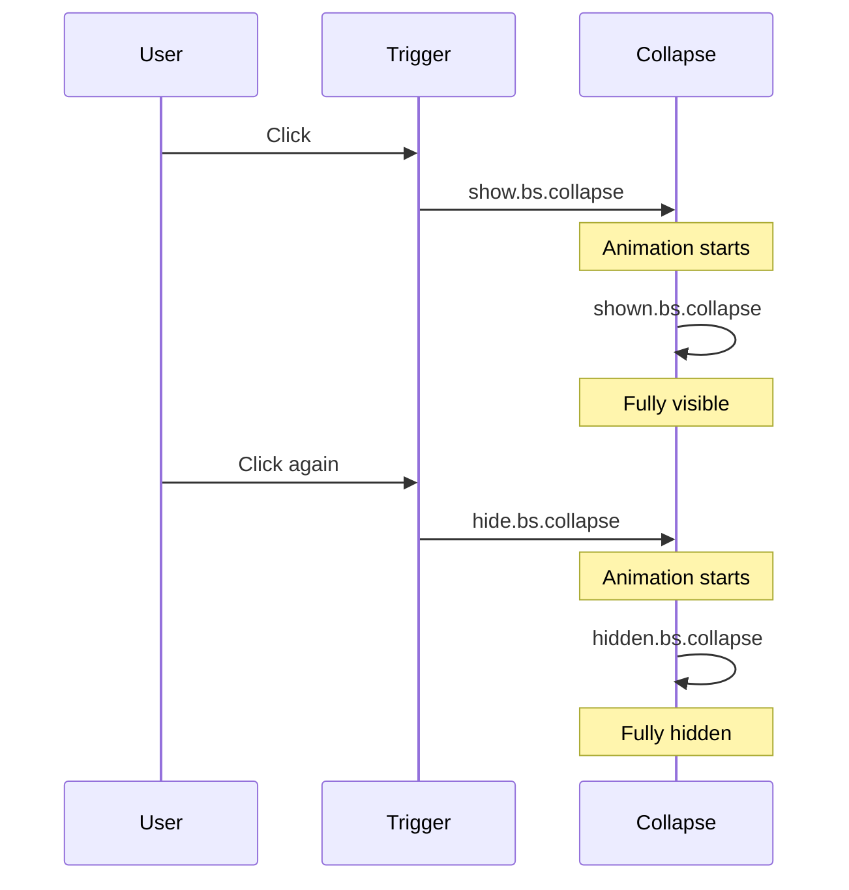

# Bootstrap 5 Collapse

## What Is It

The Collapse component lets you toggle the visibility of content with a smooth sliding animation. It is the mechanism behind accordions, expandable sections, and show/hide patterns throughout Bootstrap.

**Analogy:** Think of a collapse as a retractable awning on a storefront. It is always there, but you extend it (show) or retract it (hide) as needed. The content does not disappear from the DOM -- it simply slides out of view.

## Why It Matters

- Reduces visual clutter by hiding secondary content until the user requests it.
- Improves mobile UX where screen space is limited.
- Powers FAQ sections, expandable navigation, filter panels, and accordions.
- Smooth animation provides a polished, professional feel.

---

## Basic Collapse

### Using a Button

```html
<button
  class="btn btn-primary"
  type="button"
  data-bs-toggle="collapse"
  data-bs-target="#collapseExample"
  aria-expanded="false"
  aria-controls="collapseExample"
>
  Toggle Content
</button>

<div class="collapse" id="collapseExample">
  <div class="card card-body">
    This content is hidden by default and revealed when the button is clicked.
    The sliding animation makes the appearance feel natural.
  </div>
</div>
```

### Using an Anchor

```html
<a
  class="btn btn-primary"
  data-bs-toggle="collapse"
  href="#collapseAnchor"
  role="button"
  aria-expanded="false"
  aria-controls="collapseAnchor"
>
  Toggle via Link
</a>

<div class="collapse" id="collapseAnchor">
  <div class="card card-body">Content toggled by an anchor element.</div>
</div>
```

Key attributes:

- `data-bs-toggle="collapse"` -- activates collapse behavior.
- `data-bs-target="#id"` -- the element to collapse (for buttons).
- `href="#id"` -- alternative to `data-bs-target` (for anchors).
- `aria-expanded="false"` -- accessibility state indicator.
- `aria-controls="id"` -- links the trigger to the collapsible element.

---

## Initially Shown Content

Add the `.show` class to have content visible on page load.

```html
<button
  class="btn btn-secondary"
  type="button"
  data-bs-toggle="collapse"
  data-bs-target="#openByDefault"
  aria-expanded="true"
  aria-controls="openByDefault"
>
  Collapse This
</button>

<div class="collapse show" id="openByDefault">
  <div class="card card-body">
    This content is visible when the page loads. Clicking the button will hide
    it.
  </div>
</div>
```

Note: When content starts visible, set `aria-expanded="true"` on the trigger.

---

## Multiple Targets

One trigger can collapse multiple elements simultaneously.

```html
<button
  class="btn btn-primary"
  type="button"
  data-bs-toggle="collapse"
  data-bs-target=".multi-collapse"
  aria-expanded="false"
>
  Toggle Both
</button>

<div class="row mt-3">
  <div class="col">
    <div class="collapse multi-collapse" id="multiOne">
      <div class="card card-body">First collapsible content.</div>
    </div>
  </div>
  <div class="col">
    <div class="collapse multi-collapse" id="multiTwo">
      <div class="card card-body">Second collapsible content.</div>
    </div>
  </div>
</div>
```

Using a class selector (`.multi-collapse`) instead of an ID targets all matching elements.

### Independent Triggers for Multiple Elements

```html
<div class="d-flex gap-2">
  <button
    class="btn btn-primary"
    data-bs-toggle="collapse"
    data-bs-target="#multiOne"
  >
    Toggle First
  </button>
  <button
    class="btn btn-secondary"
    data-bs-toggle="collapse"
    data-bs-target="#multiTwo"
  >
    Toggle Second
  </button>
  <button
    class="btn btn-dark"
    data-bs-toggle="collapse"
    data-bs-target=".multi-collapse"
  >
    Toggle Both
  </button>
</div>
```

---

## Horizontal Collapse

By default, collapse animates vertically. For horizontal animation, add `.collapse-horizontal` and set a width on the inner content.

```html
<button
  class="btn btn-primary"
  type="button"
  data-bs-toggle="collapse"
  data-bs-target="#collapseHorizontal"
>
  Toggle Width
</button>

<div style="min-height: 120px;">
  <div class="collapse collapse-horizontal" id="collapseHorizontal">
    <div class="card card-body" style="width: 300px;">
      This content collapses horizontally. It slides in and out from the side.
    </div>
  </div>
</div>
```

---

## Programmatic Control (JavaScript)

```html
<div class="collapse" id="jsCollapse">
  <div class="card card-body">Controlled via JavaScript.</div>
</div>

<script>
  const collapseElement = document.getElementById("jsCollapse");
  const bsCollapse = new bootstrap.Collapse(collapseElement, {
    toggle: false, // Do not toggle on instantiation
  });

  // Show
  bsCollapse.show();

  // Hide
  bsCollapse.hide();

  // Toggle
  bsCollapse.toggle();
</script>
```

### Options

| Option   | Type             | Default | Description                                                                                         |
| -------- | ---------------- | ------- | --------------------------------------------------------------------------------------------------- |
| `parent` | selector/element | `null`  | If set, other collapsible elements under this parent are closed when one opens (accordion behavior) |
| `toggle` | boolean          | `true`  | Whether to toggle the element on instantiation                                                      |

---

## Events

```html
<script>
  const collapseEl = document.getElementById("jsCollapse");

  // Fires immediately when show() is called
  collapseEl.addEventListener("show.bs.collapse", () => {
    console.log("About to show");
  });

  // Fires after the transition completes
  collapseEl.addEventListener("shown.bs.collapse", () => {
    console.log("Fully visible now");
  });

  // Fires immediately when hide() is called
  collapseEl.addEventListener("hide.bs.collapse", () => {
    console.log("About to hide");
  });

  // Fires after the element is fully hidden
  collapseEl.addEventListener("hidden.bs.collapse", () => {
    console.log("Fully hidden now");
  });
</script>
```



---

## Accordion Using Collapse (Manual)

Before using the dedicated `accordion` component, understand that it is built on collapse with a `parent` option:

```html
<div id="manualAccordion">
  <div class="card">
    <div class="card-header">
      <button
        class="btn btn-link"
        data-bs-toggle="collapse"
        data-bs-target="#itemOne"
        data-bs-parent="#manualAccordion"
      >
        Section One
      </button>
    </div>
    <div class="collapse show" id="itemOne" data-bs-parent="#manualAccordion">
      <div class="card-body">Content for section one.</div>
    </div>
  </div>

  <div class="card">
    <div class="card-header">
      <button
        class="btn btn-link"
        data-bs-toggle="collapse"
        data-bs-target="#itemTwo"
        data-bs-parent="#manualAccordion"
      >
        Section Two
      </button>
    </div>
    <div class="collapse" id="itemTwo" data-bs-parent="#manualAccordion">
      <div class="card-body">Content for section two.</div>
    </div>
  </div>
</div>
```

The `data-bs-parent` attribute ensures only one section is open at a time.

---

## Best Practices

1. Always include `aria-expanded` and `aria-controls` for screen reader support.
2. Use `aria-expanded="true"` when content starts visible (`.show` class).
3. Wrap collapsible content in a container (like `.card`) to avoid layout jumps.
4. Prefer the dedicated Accordion component over manual collapse for FAQ-style content.
5. Use collapse for progressive disclosure -- show the essential, hide the detailed.

## Common Mistakes

| Mistake                                      | Why It Is Wrong                              | Fix                                                             |
| -------------------------------------------- | -------------------------------------------- | --------------------------------------------------------------- |
| Mismatched `data-bs-target` and element `id` | Collapse will not trigger                    | Ensure IDs match (with `#` prefix on target)                    |
| Forgetting `aria-expanded`                   | Screen readers cannot communicate state      | Add it and update it (Bootstrap does this automatically via JS) |
| Animating elements with padding directly     | Causes jerky animation                       | Wrap content in an inner container; collapse the outer          |
| Using collapse for tabbed content            | Tabs have their own component with better UX | Use Bootstrap Tabs instead                                      |

---

## Summary

Bootstrap Collapse provides a simple show/hide mechanism with smooth sliding animation. It works via data attributes or JavaScript, supports horizontal animation, multiple targets, and powers the accordion pattern through its `parent` option. Use it to progressively disclose content, keeping your interface clean while making detailed information accessible on demand.
