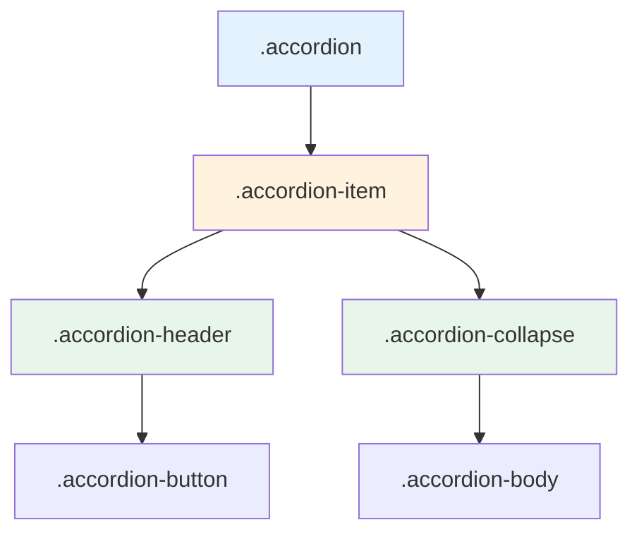

# Bootstrap 5 Accordion

## What Is It

The Accordion component is a vertically stacked set of collapsible sections where only one section is open at a time (by default). It is built on top of the Collapse component but provides a dedicated structure with proper styling, borders, and transition behavior.

**Analogy:** An accordion works like a filing cabinet with labeled drawers. You pull open one drawer to see its contents, and the previously open drawer automatically slides shut. This keeps the surface clean while giving access to all the information inside.

## Why It Matters

- Ideal for FAQs, settings panels, and any content with multiple distinct sections.
- Saves vertical space -- users see headings at a glance and expand only what interests them.
- Built-in accessibility: ARIA attributes, keyboard navigation, and focus management.
- Cleaner than building accordion behavior manually with collapse classes.

---

## Basic Accordion

```html
<div class="accordion" id="basicAccordion">
  <!-- Item 1 (open by default) -->
  <div class="accordion-item">
    <h2 class="accordion-header">
      <button
        class="accordion-button"
        type="button"
        data-bs-toggle="collapse"
        data-bs-target="#collapseOne"
        aria-expanded="true"
        aria-controls="collapseOne"
      >
        What is Bootstrap?
      </button>
    </h2>
    <div
      id="collapseOne"
      class="accordion-collapse collapse show"
      data-bs-parent="#basicAccordion"
    >
      <div class="accordion-body">
        Bootstrap is a free, open-source CSS framework directed at responsive,
        mobile-first front-end web development. It contains HTML, CSS, and
        JavaScript-based design templates.
      </div>
    </div>
  </div>

  <!-- Item 2 -->
  <div class="accordion-item">
    <h2 class="accordion-header">
      <button
        class="accordion-button collapsed"
        type="button"
        data-bs-toggle="collapse"
        data-bs-target="#collapseTwo"
        aria-expanded="false"
        aria-controls="collapseTwo"
      >
        How do I install Bootstrap?
      </button>
    </h2>
    <div
      id="collapseTwo"
      class="accordion-collapse collapse"
      data-bs-parent="#basicAccordion"
    >
      <div class="accordion-body">
        You can install Bootstrap via npm, yarn, or include it directly from a
        CDN. The simplest approach is adding the CSS and JS links to your HTML
        file.
      </div>
    </div>
  </div>

  <!-- Item 3 -->
  <div class="accordion-item">
    <h2 class="accordion-header">
      <button
        class="accordion-button collapsed"
        type="button"
        data-bs-toggle="collapse"
        data-bs-target="#collapseThree"
        aria-expanded="false"
        aria-controls="collapseThree"
      >
        Is Bootstrap accessible?
      </button>
    </h2>
    <div
      id="collapseThree"
      class="accordion-collapse collapse"
      data-bs-parent="#basicAccordion"
    >
      <div class="accordion-body">
        Yes. Bootstrap components include ARIA attributes and follow WAI-ARIA
        patterns. However, custom implementations should always be tested with
        screen readers.
      </div>
    </div>
  </div>
</div>
```

---

## Anatomy Breakdown



| Class                 | Purpose                                                        |
| --------------------- | -------------------------------------------------------------- |
| `.accordion`          | Wrapper container; its `id` is used by `data-bs-parent`        |
| `.accordion-item`     | Individual section wrapper                                     |
| `.accordion-header`   | Contains the trigger button (use `<h2>` for semantics)         |
| `.accordion-button`   | The clickable trigger; add `.collapsed` when section is closed |
| `.accordion-collapse` | The collapsible wrapper; add `.show` for initially open        |
| `.accordion-body`     | The actual content area                                        |

---

## Flush Accordion

Removes the outer borders and rounded corners -- useful when the accordion sits inside another container (like a card or sidebar).

```html
<div class="accordion accordion-flush" id="flushAccordion">
  <div class="accordion-item">
    <h2 class="accordion-header">
      <button
        class="accordion-button collapsed"
        type="button"
        data-bs-toggle="collapse"
        data-bs-target="#flush-collapseOne"
      >
        Flush Item #1
      </button>
    </h2>
    <div
      id="flush-collapseOne"
      class="accordion-collapse collapse"
      data-bs-parent="#flushAccordion"
    >
      <div class="accordion-body">
        This accordion has no outer border or rounded corners. It blends
        seamlessly with its parent container.
      </div>
    </div>
  </div>

  <div class="accordion-item">
    <h2 class="accordion-header">
      <button
        class="accordion-button collapsed"
        type="button"
        data-bs-toggle="collapse"
        data-bs-target="#flush-collapseTwo"
      >
        Flush Item #2
      </button>
    </h2>
    <div
      id="flush-collapseTwo"
      class="accordion-collapse collapse"
      data-bs-parent="#flushAccordion"
    >
      <div class="accordion-body">
        Flush accordions are ideal inside cards, sidebars, or offcanvas panels.
      </div>
    </div>
  </div>
</div>
```

---

## Always Open Accordion

By default, opening one item closes others (single-open behavior enforced by `data-bs-parent`). To allow multiple items open simultaneously, remove `data-bs-parent`:

```html
<div class="accordion" id="alwaysOpenAccordion">
  <div class="accordion-item">
    <h2 class="accordion-header">
      <button
        class="accordion-button"
        type="button"
        data-bs-toggle="collapse"
        data-bs-target="#openOne"
        aria-expanded="true"
      >
        Section One
      </button>
    </h2>
    <!-- No data-bs-parent attribute -->
    <div id="openOne" class="accordion-collapse collapse show">
      <div class="accordion-body">
        This section stays open even when other sections are expanded.
      </div>
    </div>
  </div>

  <div class="accordion-item">
    <h2 class="accordion-header">
      <button
        class="accordion-button collapsed"
        type="button"
        data-bs-toggle="collapse"
        data-bs-target="#openTwo"
        aria-expanded="false"
      >
        Section Two
      </button>
    </h2>
    <!-- No data-bs-parent attribute -->
    <div id="openTwo" class="accordion-collapse collapse">
      <div class="accordion-body">Open this without closing Section One.</div>
    </div>
  </div>

  <div class="accordion-item">
    <h2 class="accordion-header">
      <button
        class="accordion-button collapsed"
        type="button"
        data-bs-toggle="collapse"
        data-bs-target="#openThree"
        aria-expanded="false"
      >
        Section Three
      </button>
    </h2>
    <div id="openThree" class="accordion-collapse collapse">
      <div class="accordion-body">All three can be open at the same time.</div>
    </div>
  </div>
</div>
```

---

## Nested Accordions

You can nest accordions inside accordion bodies. Each nested accordion should have its own unique `id` for the parent reference.

```html
<div class="accordion" id="outerAccordion">
  <div class="accordion-item">
    <h2 class="accordion-header">
      <button
        class="accordion-button"
        type="button"
        data-bs-toggle="collapse"
        data-bs-target="#outerOne"
      >
        Programming Languages
      </button>
    </h2>
    <div
      id="outerOne"
      class="accordion-collapse collapse show"
      data-bs-parent="#outerAccordion"
    >
      <div class="accordion-body">
        <!-- Nested accordion -->
        <div class="accordion" id="innerAccordion">
          <div class="accordion-item">
            <h3 class="accordion-header">
              <button
                class="accordion-button collapsed"
                type="button"
                data-bs-toggle="collapse"
                data-bs-target="#innerOne"
              >
                JavaScript
              </button>
            </h3>
            <div
              id="innerOne"
              class="accordion-collapse collapse"
              data-bs-parent="#innerAccordion"
            >
              <div class="accordion-body">
                A dynamic, interpreted language used for web development.
              </div>
            </div>
          </div>
          <div class="accordion-item">
            <h3 class="accordion-header">
              <button
                class="accordion-button collapsed"
                type="button"
                data-bs-toggle="collapse"
                data-bs-target="#innerTwo"
              >
                Python
              </button>
            </h3>
            <div
              id="innerTwo"
              class="accordion-collapse collapse"
              data-bs-parent="#innerAccordion"
            >
              <div class="accordion-body">
                A versatile language popular in data science and automation.
              </div>
            </div>
          </div>
        </div>
      </div>
    </div>
  </div>

  <div class="accordion-item">
    <h2 class="accordion-header">
      <button
        class="accordion-button collapsed"
        type="button"
        data-bs-toggle="collapse"
        data-bs-target="#outerTwo"
      >
        Frameworks
      </button>
    </h2>
    <div
      id="outerTwo"
      class="accordion-collapse collapse"
      data-bs-parent="#outerAccordion"
    >
      <div class="accordion-body">Content about frameworks goes here.</div>
    </div>
  </div>
</div>
```

---

## JavaScript Control

```html
<script>
  // Open a specific accordion item programmatically
  const collapseTwo = document.getElementById("collapseTwo");
  const bsCollapse = new bootstrap.Collapse(collapseTwo, {
    toggle: true,
    parent: "#basicAccordion",
  });

  // Listen for events
  collapseTwo.addEventListener("shown.bs.collapse", () => {
    console.log("Section two is now visible");
  });
</script>
```

---

## Accordion with Rich Content

```html
<div class="accordion" id="richAccordion">
  <div class="accordion-item">
    <h2 class="accordion-header">
      <button
        class="accordion-button"
        type="button"
        data-bs-toggle="collapse"
        data-bs-target="#richOne"
      >
        Pricing Plans
      </button>
    </h2>
    <div
      id="richOne"
      class="accordion-collapse collapse show"
      data-bs-parent="#richAccordion"
    >
      <div class="accordion-body">
        <table class="table table-sm">
          <thead>
            <tr>
              <th>Plan</th>
              <th>Price</th>
              <th>Features</th>
            </tr>
          </thead>
          <tbody>
            <tr>
              <td>Free</td>
              <td>$0/mo</td>
              <td>Basic features</td>
            </tr>
            <tr>
              <td>Pro</td>
              <td>$9/mo</td>
              <td>All features</td>
            </tr>
          </tbody>
        </table>
      </div>
    </div>
  </div>
</div>
```

---

## Best Practices

1. Use meaningful heading levels (`<h2>`, `<h3>`) for the accordion header to maintain document outline.
2. Keep accordion item titles short and descriptive -- users scan them to find what they need.
3. Use flush accordion when embedding inside cards or other bordered containers.
4. Limit nesting to one level deep -- deeper nesting creates confusing navigation.
5. For "always open" behavior, explicitly omit `data-bs-parent` rather than using a hack.

## Common Mistakes

| Mistake                                             | Why It Is Wrong                                     | Fix                                                     |
| --------------------------------------------------- | --------------------------------------------------- | ------------------------------------------------------- |
| Duplicate IDs across accordion items                | `data-bs-target` opens the wrong section            | Ensure every ID is unique on the page                   |
| Forgetting `.collapsed` on initially-closed buttons | The chevron icon appears in the wrong rotation      | Add `.collapsed` to closed buttons                      |
| Using `data-bs-parent` with the wrong ID            | Accordion behavior breaks; items open independently | Match the parent accordion's `id` exactly               |
| Deeply nested accordions (3+ levels)                | Users get lost in the hierarchy                     | Flatten structure or use a different navigation pattern |

---

## Summary

The Bootstrap Accordion is a polished, accessible wrapper around the Collapse component. It provides single-open behavior by default (via `data-bs-parent`), a flush variant for seamless integration, and always-open mode for independent sections. The component handles ARIA attributes, keyboard navigation, and smooth transitions automatically. Use it when you have multiple related sections of content that users want to explore one at a time.
