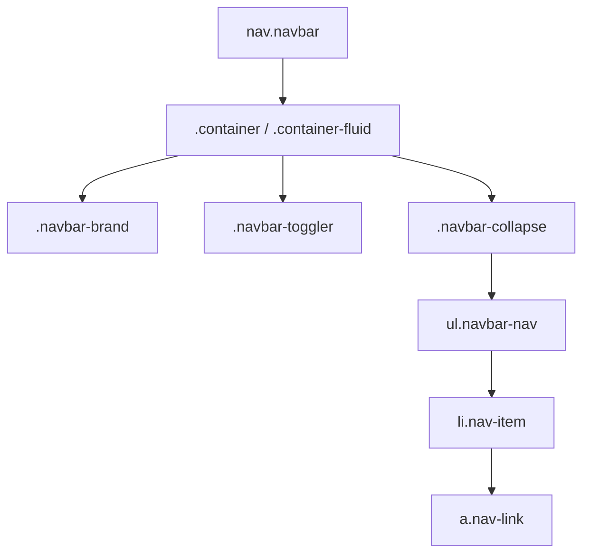

# Bootstrap 5 Navbar

## What Is It

The Navbar is Bootstrap's responsive navigation header component. It provides a structured way to build site-wide navigation with branding, links, dropdowns, forms, and a responsive toggler that collapses into a hamburger menu on smaller screens.

**Analogy:** The navbar is like the reception desk of a building. It is the first thing visitors see, it tells them where they are (brand), and it provides directions to every major section (nav links). On a phone, it folds up into a compact directory (the hamburger menu) to save space.

## Why It Matters

- Navigation is the backbone of any multi-page site or app.
- Responsive collapse behavior is complex to build from scratch -- Bootstrap handles it.
- Consistent positioning (fixed, sticky) keeps navigation accessible during scrolling.
- Built-in accessibility: ARIA landmarks, keyboard support, and screen reader labels.

---

## Basic Navbar Structure

```html
<nav class="navbar navbar-expand-lg bg-body-tertiary">
  <div class="container-fluid">
    <!-- Brand -->
    <a class="navbar-brand" href="#">MyApp</a>

    <!-- Toggler (visible on small screens) -->
    <button
      class="navbar-toggler"
      type="button"
      data-bs-toggle="collapse"
      data-bs-target="#navbarContent"
      aria-controls="navbarContent"
      aria-expanded="false"
      aria-label="Toggle navigation"
    >
      <span class="navbar-toggler-icon"></span>
    </button>

    <!-- Collapsible content -->
    <div class="collapse navbar-collapse" id="navbarContent">
      <ul class="navbar-nav me-auto mb-2 mb-lg-0">
        <li class="nav-item">
          <a class="nav-link active" aria-current="page" href="#">Home</a>
        </li>
        <li class="nav-item">
          <a class="nav-link" href="#">Features</a>
        </li>
        <li class="nav-item">
          <a class="nav-link" href="#">Pricing</a>
        </li>
        <li class="nav-item">
          <a class="nav-link disabled" aria-disabled="true">Disabled</a>
        </li>
      </ul>
    </div>
  </div>
</nav>
```

---

## Anatomy



| Class                         | Purpose                                                |
| ----------------------------- | ------------------------------------------------------ |
| `.navbar`                     | Base class for the nav component                       |
| `.navbar-expand-{breakpoint}` | Defines when the navbar expands from hamburger to full |
| `.navbar-brand`               | Logo/site name area                                    |
| `.navbar-toggler`             | The hamburger button                                   |
| `.navbar-collapse`            | Wrapper for collapsible content                        |
| `.navbar-nav`                 | The navigation list                                    |
| `.nav-item`                   | Individual nav entry                                   |
| `.nav-link`                   | Clickable link styling                                 |

---

## Responsive Toggler Breakpoints

The `navbar-expand-{breakpoint}` class controls when the navbar switches from collapsed (mobile) to expanded (desktop):

```html
<!-- Always collapsed (hamburger on all screens) -->
<nav class="navbar navbar-expand">...</nav>

<!-- Expands at small (576px) -->
<nav class="navbar navbar-expand-sm">...</nav>

<!-- Expands at medium (768px) -->
<nav class="navbar navbar-expand-md">...</nav>

<!-- Expands at large (992px) -- most common -->
<nav class="navbar navbar-expand-lg">...</nav>

<!-- Expands at extra-large (1200px) -->
<nav class="navbar navbar-expand-xl">...</nav>
```

---

## Brand Options

```html
<!-- Text brand -->
<a class="navbar-brand" href="#">SiteName</a>

<!-- Image brand -->
<a class="navbar-brand" href="#">
  
  SiteName
</a>

<!-- Brand without link -->
<span class="navbar-brand mb-0 h1">SiteName</span>
```

---

## Navbar with Dropdown

```html
<nav class="navbar navbar-expand-lg bg-body-tertiary">
  <div class="container-fluid">
    <a class="navbar-brand" href="#">Brand</a>
    <button
      class="navbar-toggler"
      type="button"
      data-bs-toggle="collapse"
      data-bs-target="#navDropdown"
    >
      <span class="navbar-toggler-icon"></span>
    </button>

    <div class="collapse navbar-collapse" id="navDropdown">
      <ul class="navbar-nav">
        <li class="nav-item">
          <a class="nav-link active" href="#">Home</a>
        </li>
        <li class="nav-item dropdown">
          <a
            class="nav-link dropdown-toggle"
            href="#"
            role="button"
            data-bs-toggle="dropdown"
            aria-expanded="false"
          >
            Services
          </a>
          <ul class="dropdown-menu">
            <li><a class="dropdown-item" href="#">Web Design</a></li>
            <li><a class="dropdown-item" href="#">Development</a></li>
            <li><hr class="dropdown-divider" /></li>
            <li><a class="dropdown-item" href="#">Consulting</a></li>
          </ul>
        </li>
        <li class="nav-item">
          <a class="nav-link" href="#">About</a>
        </li>
      </ul>
    </div>
  </div>
</nav>
```

---

## Navbar with Search Form

```html
<nav class="navbar navbar-expand-lg bg-body-tertiary">
  <div class="container-fluid">
    <a class="navbar-brand" href="#">Navbar</a>
    <button
      class="navbar-toggler"
      type="button"
      data-bs-toggle="collapse"
      data-bs-target="#navSearch"
    >
      <span class="navbar-toggler-icon"></span>
    </button>

    <div class="collapse navbar-collapse" id="navSearch">
      <ul class="navbar-nav me-auto mb-2 mb-lg-0">
        <li class="nav-item">
          <a class="nav-link" href="#">Home</a>
        </li>
      </ul>
      <form class="d-flex" role="search">
        <input
          class="form-control me-2"
          type="search"
          placeholder="Search"
          aria-label="Search"
        />
        <button class="btn btn-outline-success" type="submit">Search</button>
      </form>
    </div>
  </div>
</nav>
```

---

## Color Schemes

### Light Navbar (Default)

```html
<nav class="navbar navbar-expand-lg bg-body-tertiary">
  <!-- Light background with dark text -->
</nav>
```

### Dark Navbar

```html
<nav class="navbar navbar-expand-lg bg-dark" data-bs-theme="dark">
  <div class="container-fluid">
    <a class="navbar-brand" href="#">Dark Navbar</a>
    <!-- Links automatically become light colored -->
  </div>
</nav>
```

### Custom Background Colors

```html
<!-- Using background utilities -->
<nav class="navbar navbar-expand-lg bg-primary" data-bs-theme="dark">...</nav>
<nav class="navbar navbar-expand-lg bg-success" data-bs-theme="dark">...</nav>

<!-- Using inline style for brand colors -->
<nav
  class="navbar navbar-expand-lg"
  data-bs-theme="dark"
  style="background-color: #7952b3;"
>
  ...
</nav>
```

---

## Positioning

### Fixed Top

Stays at the top of the viewport during scrolling. Add padding to `<body>` to prevent content overlap.

```html
<nav class="navbar fixed-top navbar-expand-lg bg-dark" data-bs-theme="dark">
  ...
</nav>

<style>
  body {
    padding-top: 56px;
  } /* Height of navbar */
</style>
```

### Fixed Bottom

```html
<nav class="navbar fixed-bottom navbar-expand-lg bg-dark" data-bs-theme="dark">
  ...
</nav>
```

### Sticky Top

Scrolls with the page until it reaches the top, then sticks.

```html
<nav class="navbar sticky-top navbar-expand-lg bg-body-tertiary">...</nav>
```

**Difference:** `fixed-top` is always visible and removes the navbar from document flow. `sticky-top` is part of the flow until it reaches the scroll threshold.

---

## Offcanvas Navbar

For mobile-friendly navigation that slides in from the side:

```html
<nav class="navbar navbar-expand-lg bg-body-tertiary">
  <div class="container-fluid">
    <a class="navbar-brand" href="#">Offcanvas Nav</a>
    <button
      class="navbar-toggler"
      type="button"
      data-bs-toggle="offcanvas"
      data-bs-target="#offcanvasNavbar"
    >
      <span class="navbar-toggler-icon"></span>
    </button>

    <div class="offcanvas offcanvas-end" tabindex="-1" id="offcanvasNavbar">
      <div class="offcanvas-header">
        <h5 class="offcanvas-title">Menu</h5>
        <button
          type="button"
          class="btn-close"
          data-bs-dismiss="offcanvas"
        ></button>
      </div>
      <div class="offcanvas-body">
        <ul class="navbar-nav">
          <li class="nav-item"><a class="nav-link active" href="#">Home</a></li>
          <li class="nav-item"><a class="nav-link" href="#">About</a></li>
          <li class="nav-item"><a class="nav-link" href="#">Contact</a></li>
        </ul>
      </div>
    </div>
  </div>
</nav>
```

---

## Complete Production Navbar

```html
<nav class="navbar navbar-expand-lg sticky-top bg-white shadow-sm">
  <div class="container">
    <a class="navbar-brand fw-bold" href="#">
      
      MyApp
    </a>

    <button
      class="navbar-toggler border-0"
      type="button"
      data-bs-toggle="collapse"
      data-bs-target="#mainNav"
      aria-controls="mainNav"
      aria-expanded="false"
      aria-label="Toggle navigation"
    >
      <span class="navbar-toggler-icon"></span>
    </button>

    <div class="collapse navbar-collapse" id="mainNav">
      <ul class="navbar-nav me-auto">
        <li class="nav-item">
          <a class="nav-link active" aria-current="page" href="/">Dashboard</a>
        </li>
        <li class="nav-item">
          <a class="nav-link" href="/projects">Projects</a>
        </li>
        <li class="nav-item dropdown">
          <a
            class="nav-link dropdown-toggle"
            href="#"
            data-bs-toggle="dropdown"
          >
            Resources
          </a>
          <ul class="dropdown-menu">
            <li><a class="dropdown-item" href="/docs">Documentation</a></li>
            <li><a class="dropdown-item" href="/blog">Blog</a></li>
            <li><hr class="dropdown-divider" /></li>
            <li><a class="dropdown-item" href="/support">Support</a></li>
          </ul>
        </li>
      </ul>

      <div class="d-flex align-items-center gap-3">
        <a href="/login" class="btn btn-outline-primary">Log In</a>
        <a href="/signup" class="btn btn-primary">Sign Up</a>
      </div>
    </div>
  </div>
</nav>
```

---

## Best Practices

1. Use `.navbar-expand-lg` as the default -- it works well for most navigation sizes.
2. Always include `aria-label="Toggle navigation"` on the toggler button.
3. Mark the current page link with `aria-current="page"` and `.active`.
4. Use `.container` (not `.container-fluid`) for centered, max-width navbars.
5. Add `shadow-sm` for subtle depth separation from page content.

## Common Mistakes

| Mistake                                                | Why It Is Wrong                                          | Fix                                      |
| ------------------------------------------------------ | -------------------------------------------------------- | ---------------------------------------- |
| Not adding body padding with `fixed-top`               | Content hides behind the navbar                          | Add `padding-top` equal to navbar height |
| Forgetting the toggler button                          | Navigation disappears on mobile with no way to access it | Always include the toggler               |
| Using `data-bs-theme="dark"` without a dark background | Dark text on dark background = invisible                 | Pair theme with appropriate `bg-*` class |
| Multiple navbars without landmark labels               | Screen readers cannot distinguish them                   | Add `aria-label="Main navigation"`       |

---

## Summary

Bootstrap's Navbar is a full-featured, responsive navigation component. It handles branding, links, dropdowns, forms, responsive collapse, fixed/sticky positioning, and color themes. The toggler/collapse pattern automatically adapts to screen size, and the offcanvas variant provides a modern mobile drawer experience. Build it once, and it works from phone to ultrawide.
