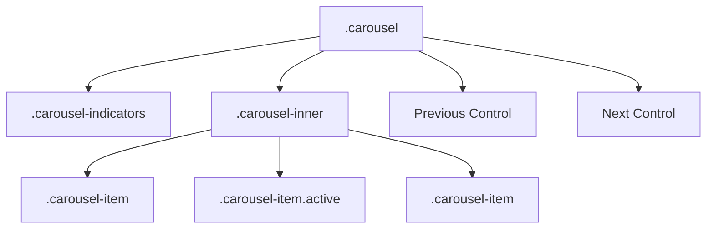

# Bootstrap 5 Carousel

## What Is It

The Carousel is a slideshow component for cycling through images, text, or custom content. It supports indicators (dots), navigation controls (arrows), captions, automatic playback, and transition effects like slide and crossfade.

**Analogy:** A carousel is like a revolving door at a hotel entrance. Content rotates in and out of view, one panel at a time. Users can let it spin automatically or grab the handle (controls) to move at their own pace.

## Why It Matters

- Carousels efficiently showcase multiple pieces of content in limited space (hero banners, testimonials, product images).
- Auto-play keeps the page dynamic without user effort.
- Touch/swipe support makes it mobile-friendly out of the box.
- Accessibility features (ARIA labels, pause on focus) are built in.

---

## Basic Carousel Structure



### Minimal Carousel (Slides Only)

```html
<div id="basicCarousel" class="carousel slide">
  <div class="carousel-inner">
    <div class="carousel-item active">
      
    </div>
    <div class="carousel-item">
      
    </div>
    <div class="carousel-item">
      
    </div>
  </div>
</div>
```

Key requirements:

- One `.carousel-item` must have the `.active` class.
- Images need `d-block w-100` to be responsive and block-level.
- The carousel `id` is used by controls and indicators.

---

## Adding Controls (Arrows)

```html
<div id="controlCarousel" class="carousel slide">
  <div class="carousel-inner">
    <div class="carousel-item active">
      
    </div>
    <div class="carousel-item">
      
    </div>
    <div class="carousel-item">
      
    </div>
  </div>

  <!-- Previous button -->
  <button
    class="carousel-control-prev"
    type="button"
    data-bs-target="#controlCarousel"
    data-bs-slide="prev"
  >
    <span class="carousel-control-prev-icon" aria-hidden="true"></span>
    <span class="visually-hidden">Previous</span>
  </button>

  <!-- Next button -->
  <button
    class="carousel-control-next"
    type="button"
    data-bs-target="#controlCarousel"
    data-bs-slide="next"
  >
    <span class="carousel-control-next-icon" aria-hidden="true"></span>
    <span class="visually-hidden">Next</span>
  </button>
</div>
```

---

## Adding Indicators (Dots)

```html
<div id="indicatorCarousel" class="carousel slide">
  <!-- Indicators -->
  <div class="carousel-indicators">
    <button
      type="button"
      data-bs-target="#indicatorCarousel"
      data-bs-slide-to="0"
      class="active"
      aria-current="true"
      aria-label="Slide 1"
    ></button>
    <button
      type="button"
      data-bs-target="#indicatorCarousel"
      data-bs-slide-to="1"
      aria-label="Slide 2"
    ></button>
    <button
      type="button"
      data-bs-target="#indicatorCarousel"
      data-bs-slide-to="2"
      aria-label="Slide 3"
    ></button>
  </div>

  <!-- Slides -->
  <div class="carousel-inner">
    <div class="carousel-item active">
      
    </div>
    <div class="carousel-item">
      
    </div>
    <div class="carousel-item">
      
    </div>
  </div>

  <!-- Controls -->
  <button
    class="carousel-control-prev"
    type="button"
    data-bs-target="#indicatorCarousel"
    data-bs-slide="prev"
  >
    <span class="carousel-control-prev-icon" aria-hidden="true"></span>
    <span class="visually-hidden">Previous</span>
  </button>
  <button
    class="carousel-control-next"
    type="button"
    data-bs-target="#indicatorCarousel"
    data-bs-slide="next"
  >
    <span class="carousel-control-next-icon" aria-hidden="true"></span>
    <span class="visually-hidden">Next</span>
  </button>
</div>
```

---

## Captions

Add text overlays on slides.

```html
<div class="carousel-item active">
  
  <div class="carousel-caption d-none d-md-block">
    <h5>Welcome to Our Platform</h5>
    <p>Build amazing web applications with ease.</p>
  </div>
</div>
```

The `d-none d-md-block` pattern hides captions on small screens where they might overlap awkwardly with images.

---

## Crossfade Transition

Replace the sliding animation with a fade effect.

```html
<div id="fadeCarousel" class="carousel slide carousel-fade">
  <div class="carousel-inner">
    <div class="carousel-item active">
      
    </div>
    <div class="carousel-item">
      
    </div>
  </div>
  <!-- controls... -->
</div>
```

Simply add `.carousel-fade` to the main carousel element.

---

## Autoplay and Interval

### Autoplay on Load

```html
<!-- Autoplay with ride attribute -->
<div id="autoCarousel" class="carousel slide" data-bs-ride="carousel">
  <!-- slides... -->
</div>

<!-- Autoplay only after first user interaction -->
<div id="autoCarousel" class="carousel slide" data-bs-ride="true">
  <!-- slides... -->
</div>
```

### Custom Interval

Control how long each slide is visible (in milliseconds).

```html
<!-- Global interval (5 seconds between slides) -->
<div
  id="intervalCarousel"
  class="carousel slide"
  data-bs-ride="carousel"
  data-bs-interval="5000"
>
  <!-- slides... -->
</div>

<!-- Per-slide interval -->
<div class="carousel-item active" data-bs-interval="2000">
  
</div>
<div class="carousel-item" data-bs-interval="10000">
  
</div>
```

### Disable Autoplay

```html
<div id="noAutoCarousel" class="carousel slide" data-bs-interval="false">
  <!-- Manual navigation only -->
</div>
```

---

## Touch/Swipe Control

Disable touch swiping (useful for carousels with form inputs):

```html
<div id="noTouchCarousel" class="carousel slide" data-bs-touch="false">
  <!-- slides... -->
</div>
```

---

## Dark Variant

For slides with light backgrounds where the default white controls are invisible:

```html
<div id="darkCarousel" class="carousel slide" data-bs-theme="dark">
  <!-- Dark indicators and controls -->
</div>
```

---

## JavaScript API

```html
<script>
  const carouselElement = document.getElementById("myCarousel");
  const carousel = new bootstrap.Carousel(carouselElement, {
    interval: 3000, // 3 seconds
    wrap: true, // Loop back to start
    keyboard: true, // Respond to keyboard arrows
    pause: "hover", // Pause on mouse hover
    touch: true, // Enable swipe
  });

  // Methods
  carousel.next(); // Go to next slide
  carousel.prev(); // Go to previous slide
  carousel.to(2); // Jump to slide index 2 (zero-based)
  carousel.pause(); // Pause autoplay
  carousel.cycle(); // Resume autoplay
  carousel.dispose(); // Destroy the carousel instance
</script>
```

---

## Carousel Events

```html
<script>
  const carouselEl = document.getElementById("myCarousel");

  // Fires immediately when slide transition starts
  carouselEl.addEventListener("slide.bs.carousel", (event) => {
    console.log("Sliding from:", event.from);
    console.log("Sliding to:", event.to);
    console.log("Direction:", event.direction); // 'left' or 'right'
  });

  // Fires after the slide transition completes
  carouselEl.addEventListener("slid.bs.carousel", (event) => {
    console.log("Now showing slide:", event.to);
  });
</script>
```

---

## Responsive Images in Carousel

```html
<div class="carousel-item active">
  <!-- Using object-fit for consistent image sizing -->
  
</div>
```

For truly responsive carousels with varying content heights:

```html
<style>
  .carousel-item img {
    width: 100%;
    height: 60vh;
    object-fit: cover;
  }

  @media (max-width: 768px) {
    .carousel-item img {
      height: 40vh;
    }
  }
</style>
```

---

## Complete Production Carousel

```html
<div
  id="heroCarousel"
  class="carousel slide carousel-fade"
  data-bs-ride="carousel"
>
  <div class="carousel-indicators">
    <button
      type="button"
      data-bs-target="#heroCarousel"
      data-bs-slide-to="0"
      class="active"
      aria-label="Slide 1"
    ></button>
    <button
      type="button"
      data-bs-target="#heroCarousel"
      data-bs-slide-to="1"
      aria-label="Slide 2"
    ></button>
    <button
      type="button"
      data-bs-target="#heroCarousel"
      data-bs-slide-to="2"
      aria-label="Slide 3"
    ></button>
  </div>

  <div class="carousel-inner">
    <div class="carousel-item active" data-bs-interval="5000">
      
      <div class="carousel-caption d-none d-md-block">
        <h2>Launch Your Project</h2>
        <p>Get started in minutes with our platform.</p>
        <a href="/signup" class="btn btn-primary btn-lg">Get Started</a>
      </div>
    </div>
    <div class="carousel-item" data-bs-interval="4000">
      
      <div class="carousel-caption d-none d-md-block">
        <h2>Powerful Features</h2>
        <p>Everything you need to build at scale.</p>
      </div>
    </div>
    <div class="carousel-item" data-bs-interval="4000">
      
      <div class="carousel-caption d-none d-md-block">
        <h2>Join Our Community</h2>
        <p>Thousands of developers trust us daily.</p>
      </div>
    </div>
  </div>

  <button
    class="carousel-control-prev"
    type="button"
    data-bs-target="#heroCarousel"
    data-bs-slide="prev"
  >
    <span class="carousel-control-prev-icon" aria-hidden="true"></span>
    <span class="visually-hidden">Previous</span>
  </button>
  <button
    class="carousel-control-next"
    type="button"
    data-bs-target="#heroCarousel"
    data-bs-slide="next"
  >
    <span class="carousel-control-next-icon" aria-hidden="true"></span>
    <span class="visually-hidden">Next</span>
  </button>
</div>
```

---

## Best Practices

1. Always provide meaningful `alt` text for carousel images.
2. Use `object-fit: cover` with a fixed height for consistent slide dimensions.
3. Hide captions on mobile (`d-none d-md-block`) to avoid text overflow.
4. Limit carousel to 3-5 slides -- users rarely view more than that.
5. Consider disabling autoplay for content-heavy carousels (give users control).

## Common Mistakes

| Mistake                                         | Why It Is Wrong                           | Fix                                       |
| ----------------------------------------------- | ----------------------------------------- | ----------------------------------------- |
| No `.active` class on any item                  | Carousel appears blank                    | Always mark one item as `.active`         |
| Images with different aspect ratios             | Carousel "jumps" in height between slides | Use `object-fit: cover` with fixed height |
| Mismatched indicator count and slide count      | Indicators point to non-existent slides   | Keep indicators in sync with items        |
| Relying solely on carousel for critical content | Users often miss slides after the first   | Put the most important content on slide 1 |

---

## Summary

The Bootstrap Carousel cycles through content with smooth transitions, touch support, and autoplay. Its structure (indicators + inner slides + controls) gives you full control over the user experience. Use crossfade for elegance, per-slide intervals for timing, and the JavaScript API for programmatic control. Keep slide counts low, images consistent in size, and always provide accessible alternatives for the content within.
