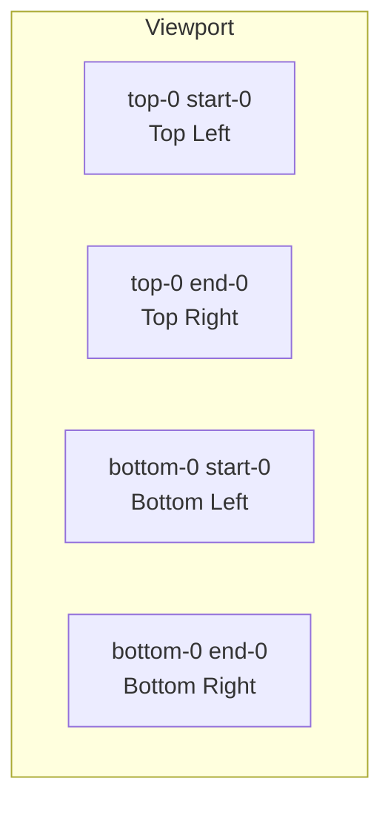

# Bootstrap 5 Toasts

## What Is It

Toasts are lightweight, non-intrusive notification messages that appear temporarily to inform users about an event -- typically in a corner of the screen. Unlike alerts (which live inline), toasts float above the page content and auto-dismiss after a set time.

**Analogy:** Toasts are like the brief notification banners on your phone (new message, download complete). They pop up, deliver their message, and disappear without requiring you to stop what you are doing. The name literally comes from bread toasting -- popping up when ready.

## Why It Matters

- Provides feedback without disrupting the user's workflow (no modals, no page reloads).
- Ideal for real-time events: messages received, actions completed, background process status.
- Stackable -- multiple toasts can appear simultaneously without blocking each other.
- Fully controllable: auto-hide timing, manual dismiss, placement.

---

## Basic Toast Structure

```html
<div class="toast" role="alert" aria-live="assertive" aria-atomic="true">
  <div class="toast-header">
    
    <strong class="me-auto">Notification</strong>
    <small>Just now</small>
    <button
      type="button"
      class="btn-close"
      data-bs-dismiss="toast"
      aria-label="Close"
    ></button>
  </div>
  <div class="toast-body">Your file has been saved successfully.</div>
</div>
```

Key attributes:

- `role="alert"` -- announces to screen readers.
- `aria-live="assertive"` -- interrupts the current task to announce.
- `aria-atomic="true"` -- reads the entire toast, not just changes.
- `data-bs-dismiss="toast"` -- close button behavior.

---

## Showing a Toast

Toasts are hidden by default. You must initialize and show them via JavaScript.

```html
<button class="btn btn-primary" id="showToastBtn">Show Toast</button>

<div class="toast-container position-fixed bottom-0 end-0 p-3">
  <div
    class="toast"
    id="myToast"
    role="alert"
    aria-live="assertive"
    aria-atomic="true"
  >
    <div class="toast-header">
      <strong class="me-auto">Success</strong>
      <small>Just now</small>
      <button type="button" class="btn-close" data-bs-dismiss="toast"></button>
    </div>
    <div class="toast-body">Operation completed successfully!</div>
  </div>
</div>

<script>
  document.getElementById("showToastBtn").addEventListener("click", () => {
    const toastEl = document.getElementById("myToast");
    const toast = new bootstrap.Toast(toastEl);
    toast.show();
  });
</script>
```

---

## Toast Options

```html
<script>
  const toast = new bootstrap.Toast(element, {
    animation: true, // Apply fade transition
    autohide: true, // Automatically hide after delay
    delay: 5000, // Milliseconds before auto-hide (default: 5000)
  });
</script>
```

### Disable Auto-Hide

```html
<!-- Via data attribute -->
<div class="toast" data-bs-autohide="false">
  <!-- This toast stays until manually closed -->
</div>

<!-- Via JavaScript -->
<script>
  const toast = new bootstrap.Toast(element, { autohide: false });
</script>
```

### Custom Delay

```html
<!-- Via data attribute -->
<div class="toast" data-bs-delay="10000">
  <!-- Stays visible for 10 seconds -->
</div>
```

---

## Toast Placement

Position toasts using a container with utility classes.

```html
<!-- Top Right -->
<div class="toast-container position-fixed top-0 end-0 p-3">
  <!-- toasts here -->
</div>

<!-- Top Center -->
<div
  class="toast-container position-fixed top-0 start-50 translate-middle-x p-3"
>
  <!-- toasts here -->
</div>

<!-- Bottom Left -->
<div class="toast-container position-fixed bottom-0 start-0 p-3">
  <!-- toasts here -->
</div>

<!-- Bottom Center -->
<div
  class="toast-container position-fixed bottom-0 start-50 translate-middle-x p-3"
>
  <!-- toasts here -->
</div>

<!-- Center of screen -->
<div
  class="toast-container position-fixed top-50 start-50 translate-middle p-3"
>
  <!-- toasts here -->
</div>
```



---

## Stacking Multiple Toasts

Place multiple toasts inside the same container -- they stack vertically.

```html
<div class="toast-container position-fixed bottom-0 end-0 p-3">
  <div
    class="toast"
    id="toast1"
    role="alert"
    aria-live="assertive"
    aria-atomic="true"
  >
    <div class="toast-header">
      <strong class="me-auto">Message 1</strong>
      <button type="button" class="btn-close" data-bs-dismiss="toast"></button>
    </div>
    <div class="toast-body">First notification</div>
  </div>

  <div
    class="toast"
    id="toast2"
    role="alert"
    aria-live="assertive"
    aria-atomic="true"
  >
    <div class="toast-header">
      <strong class="me-auto">Message 2</strong>
      <button type="button" class="btn-close" data-bs-dismiss="toast"></button>
    </div>
    <div class="toast-body">Second notification</div>
  </div>

  <div
    class="toast"
    id="toast3"
    role="alert"
    aria-live="assertive"
    aria-atomic="true"
  >
    <div class="toast-header">
      <strong class="me-auto">Message 3</strong>
      <button type="button" class="btn-close" data-bs-dismiss="toast"></button>
    </div>
    <div class="toast-body">Third notification</div>
  </div>
</div>

<script>
  // Show all toasts
  document.querySelectorAll(".toast").forEach((el) => {
    new bootstrap.Toast(el).show();
  });
</script>
```

---

## Color Variants

Use background utilities and `text-white` for themed toasts.

```html
<!-- Success toast -->
<div class="toast align-items-center text-bg-success border-0" role="alert">
  <div class="d-flex">
    <div class="toast-body">File uploaded successfully.</div>
    <button
      type="button"
      class="btn-close btn-close-white me-2 m-auto"
      data-bs-dismiss="toast"
    ></button>
  </div>
</div>

<!-- Danger toast -->
<div class="toast align-items-center text-bg-danger border-0" role="alert">
  <div class="d-flex">
    <div class="toast-body">Error: Could not save changes.</div>
    <button
      type="button"
      class="btn-close btn-close-white me-2 m-auto"
      data-bs-dismiss="toast"
    ></button>
  </div>
</div>

<!-- Warning toast -->
<div class="toast align-items-center text-bg-warning border-0" role="alert">
  <div class="d-flex">
    <div class="toast-body">Warning: Storage almost full.</div>
    <button
      type="button"
      class="btn-close me-2 m-auto"
      data-bs-dismiss="toast"
    ></button>
  </div>
</div>

<!-- Info toast -->
<div class="toast align-items-center text-bg-info border-0" role="alert">
  <div class="d-flex">
    <div class="toast-body">New message from Alice.</div>
    <button
      type="button"
      class="btn-close me-2 m-auto"
      data-bs-dismiss="toast"
    ></button>
  </div>
</div>
```

---

## Simple Toast (No Header)

```html
<div
  class="toast align-items-center"
  role="alert"
  aria-live="assertive"
  aria-atomic="true"
>
  <div class="d-flex">
    <div class="toast-body">Simple toast without a header.</div>
    <button
      type="button"
      class="btn-close me-2 m-auto"
      data-bs-dismiss="toast"
      aria-label="Close"
    ></button>
  </div>
</div>
```

---

## JavaScript Methods and Events

```html
<script>
  const toastEl = document.getElementById("myToast");
  const toast = new bootstrap.Toast(toastEl);

  // Methods
  toast.show(); // Show the toast
  toast.hide(); // Hide the toast
  toast.dispose(); // Destroy the instance
  toast.isShown(); // Returns boolean

  // Events
  toastEl.addEventListener("show.bs.toast", () => {
    console.log("Toast is about to show");
  });

  toastEl.addEventListener("shown.bs.toast", () => {
    console.log("Toast is now visible");
  });

  toastEl.addEventListener("hide.bs.toast", () => {
    console.log("Toast is about to hide");
  });

  toastEl.addEventListener("hidden.bs.toast", () => {
    console.log("Toast is now hidden");
  });
</script>
```

---

## Dynamic Toast Factory

A reusable function to create and show toasts on demand:

```html
<div class="toast-container position-fixed top-0 end-0 p-3" id="toastBox"></div>

<script>
  function showToast(message, type = "primary") {
    const container = document.getElementById("toastBox");

    const toastHTML = `
      <div class="toast align-items-center text-bg-${type} border-0"
           role="alert" aria-live="assertive" aria-atomic="true">
        <div class="d-flex">
          <div class="toast-body">${message}</div>
          <button type="button" class="btn-close btn-close-white me-2 m-auto"
                  data-bs-dismiss="toast" aria-label="Close"></button>
        </div>
      </div>
    `;

    container.insertAdjacentHTML("beforeend", toastHTML);
    const toastEl = container.lastElementChild;
    const toast = new bootstrap.Toast(toastEl, { delay: 4000 });
    toast.show();

    // Remove from DOM after hidden
    toastEl.addEventListener("hidden.bs.toast", () => {
      toastEl.remove();
    });
  }

  // Usage
  showToast("Profile updated!", "success");
  showToast("Connection lost.", "danger");
  showToast("New update available.", "info");
</script>
```

---

## Best Practices

1. Always use a `.toast-container` with `position-fixed` for consistent placement.
2. Keep toast messages short -- one line is ideal.
3. Use auto-hide for informational messages; disable it for errors that need acknowledgment.
4. Clean up DOM elements after hidden to prevent memory leaks in long-running apps.
5. Use `aria-live="assertive"` for important messages, `aria-live="polite"` for less urgent ones.

## Common Mistakes

| Mistake                                  | Why It Is Wrong                                         | Fix                                        |
| ---------------------------------------- | ------------------------------------------------------- | ------------------------------------------ |
| Expecting toasts to show automatically   | Toasts are hidden by default; they require JS `.show()` | Always initialize and call `.show()`       |
| Not using a toast container              | Toasts appear in document flow instead of floating      | Wrap in `.toast-container.position-fixed`  |
| Stacking too many toasts without cleanup | DOM bloats, performance degrades                        | Remove toast elements on `hidden.bs.toast` |
| Setting delay too short (< 2 seconds)    | Users cannot read the message                           | Use at least 3000-5000ms                   |

---

## Summary

Bootstrap Toasts are ephemeral notifications that inform without interrupting. They require JavaScript initialization (unlike alerts), support auto-hide with configurable timing, stack neatly in a container, and offer color variants for contextual meaning. Use them for real-time feedback (save confirmations, new messages, status updates) and always clean them up after they disappear.
