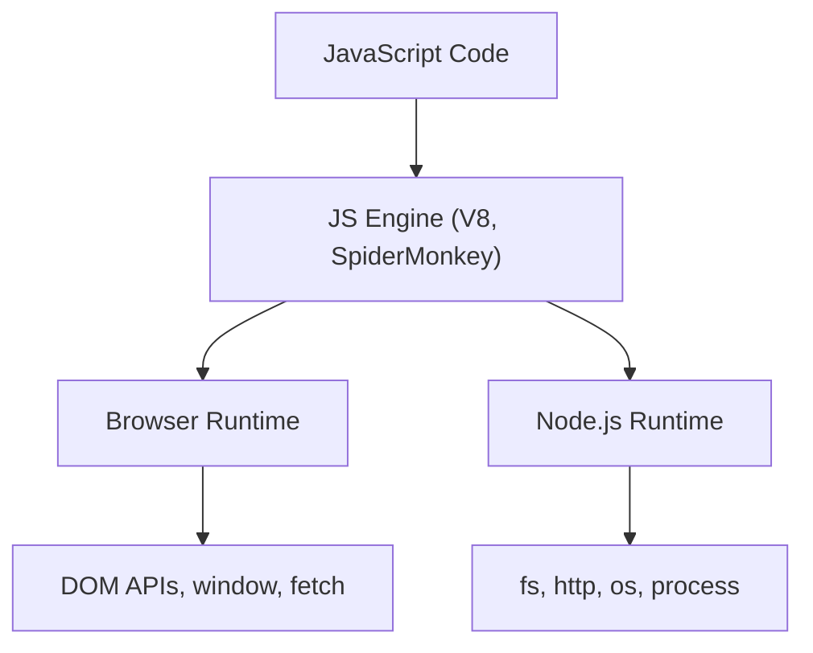
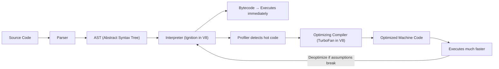
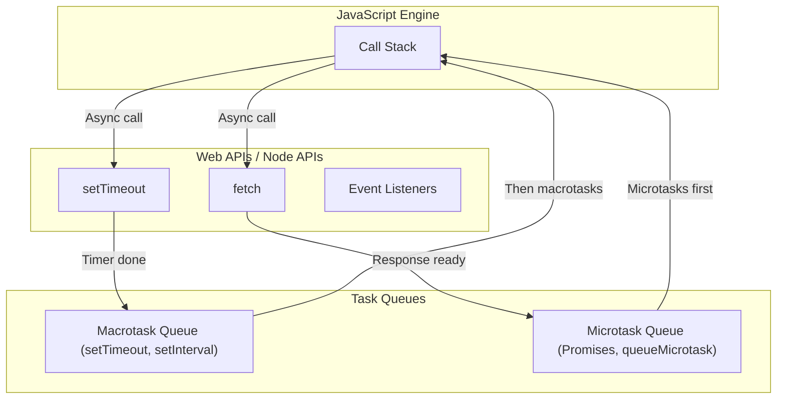

# How JavaScript Runs

## Two Environments

JavaScript executes in two primary environments:

### 1. The Browser

Every modern browser has a built-in JavaScript engine:

| Browser      | Engine                 |
| ------------ | ---------------------- |
| Chrome, Edge | V8                     |
| Firefox      | SpiderMonkey           |
| Safari       | JavaScriptCore (Nitro) |

The browser provides additional APIs beyond the language itself: `document` (DOM), `window`, `fetch`, `localStorage`, `setTimeout`, etc.

### 2. Node.js (Server/Desktop)

Node.js takes Chrome's V8 engine and wraps it with system-level APIs:

- File system access (`fs`)
- Network capabilities (`http`, `net`)
- Operating system info (`os`)
- Child processes (`child_process`)

Node.js does **not** have `document`, `window`, or any DOM APIs — there is no web page on the server.



---

## Compilation vs Interpretation

### Traditional Interpretation

Code is read line by line and executed immediately. No separate compilation step.

```
Source Code → Interpreter → Executed immediately (line by line)
```

### Traditional Compilation

Entire source code is converted to machine code before execution.

```
Source Code → Compiler → Machine Code → Executed
```

### JavaScript: JIT Compilation (Just-In-Time)

Modern JavaScript engines use a hybrid approach:



1. **Parse** — source code → AST (Abstract Syntax Tree).
2. **Interpret** — AST → bytecode → immediate execution (fast startup).
3. **Profile** — engine monitors which functions run frequently ("hot" code).
4. **Optimize** — hot code is compiled to highly optimized machine code.
5. **Deoptimize** — if assumptions break (e.g., a variable changes type), falls back to bytecode.

This is why JavaScript can be surprisingly fast despite being "interpreted."

---

## Single-Threaded Nature

JavaScript runs on a **single thread** — one call stack, one thing at a time. It cannot execute two pieces of code simultaneously.

```javascript
console.log("First");
console.log("Second");
console.log("Third");
// Always: First, Second, Third — never out of order
```

### Why Single-Threaded?

JavaScript was designed for the browser. If two threads tried to modify the same DOM element simultaneously, you would get race conditions and unpredictable UI. A single thread avoids this entirely.

### The Problem

If JavaScript is single-threaded, how does it handle:

- Network requests that take 2 seconds?
- Timers (`setTimeout`)?
- User interactions while code is running?

The answer: the **Event Loop**.

---

## The Event Loop

The event loop is JavaScript's concurrency model. It allows non-blocking asynchronous operations on a single thread.



### How It Works

1. Synchronous code runs on the **call stack** (one function at a time).
2. When an async operation is encountered (`setTimeout`, `fetch`, event listener), it is handed off to **Web APIs** (browser) or **C++ APIs** (Node.js).
3. When the async operation completes, its callback is placed in a **task queue**.
4. The **event loop** checks: "Is the call stack empty?" If yes, it moves the next task from the queue to the call stack.

### Example

```javascript
console.log("1"); // Sync — runs immediately

setTimeout(() => {
  console.log("2"); // Async — goes to macrotask queue
}, 0);

Promise.resolve().then(() => {
  console.log("3"); // Async — goes to microtask queue
});

console.log("4"); // Sync — runs immediately

// Output: 1, 4, 3, 2
```

**Why this order?**

1. `"1"` — synchronous, runs first.
2. `setTimeout` callback → macrotask queue (waits).
3. Promise `.then` → microtask queue (waits).
4. `"4"` — synchronous, runs next.
5. Call stack empty → microtask queue drains first → `"3"`.
6. Microtask queue empty → macrotask queue → `"2"`.

### Priority Order

1. Synchronous code (call stack)
2. Microtasks (Promises, `queueMicrotask`, `MutationObserver`)
3. Macrotasks (`setTimeout`, `setInterval`, `setImmediate`, I/O callbacks)

---

## Memory Management

JavaScript handles memory automatically through **garbage collection** — you do not manually allocate or free memory.

### Memory Lifecycle

```
Allocate → Use → Release (garbage collected)
```

### How Garbage Collection Works

The primary algorithm is **mark-and-sweep**:

1. Start from "roots" (global object, currently executing function's variables).
2. Mark all objects reachable from roots.
3. Sweep (delete) all unmarked objects — they are unreachable and therefore garbage.

```javascript
function createUser() {
  let user = { name: "Vikas" }; // Memory allocated
  return user;
}

let currentUser = createUser(); // Referenced — kept alive
currentUser = null; // No more references — eligible for GC
```

### Common Memory Leaks

| Cause                       | Example                                          | Fix                           |
| --------------------------- | ------------------------------------------------ | ----------------------------- |
| Forgotten event listeners   | `addEventListener` without `removeEventListener` | Clean up on component unmount |
| Closures holding references | Inner function retains outer scope variables     | Nullify references when done  |
| Global variables            | Accidental globals (missing `let`/`const`)       | Always declare variables      |
| Detached DOM nodes          | Removed from DOM but still referenced in JS      | Clear references              |

---

## Global Execution Context

When JavaScript runs, it creates a **Global Execution Context** before executing any code.

### Two Phases

#### 1. Creation Phase (Memory Allocation)

- Creates the global object (`window` in browser, `global` in Node.js).
- Creates `this` (points to the global object).
- Allocates memory for variables and functions (**hoisting**):
  - `var` declarations → initialized to `undefined`.
  - `let`/`const` declarations → allocated but uninitialized (Temporal Dead Zone).
  - Function declarations → stored entirely in memory.

#### 2. Execution Phase

- Code runs line by line.
- Variables are assigned their values.
- Functions are invoked (creating new execution contexts on the call stack).

```javascript
console.log(x); // undefined (var is hoisted with value undefined)
console.log(y); // ReferenceError (let is in TDZ)
console.log(greet); // function greet() {...} (entire function hoisted)

var x = 10;
let y = 20;

function greet() {
  return "Hello";
}
```

### The Call Stack

Every function invocation creates a new execution context pushed onto the call stack.

```javascript
function multiply(a, b) {
  return a * b;
}

function square(n) {
  return multiply(n, n);
}

let result = square(5);
```

```
Call Stack:
│ multiply(5, 5) │  ← top (currently executing)
│ square(5)      │
│ Global         │  ← bottom
```

Each context is popped off when the function returns.

---

## The Smallest Possible Program

An empty JavaScript file is a valid program. When the engine runs it:

1. Creates the Global Execution Context.
2. Creates the global object (`window` / `global`).
3. Sets `this` to the global object.
4. Finds no code to execute.
5. Program ends.

```javascript
// empty file — still creates global context and global object
```

This means `window` (browser) or `global` (Node.js) exists even before you write any code.

---

## Summary

- JavaScript runs in browsers (V8, SpiderMonkey) and on servers (Node.js).
- Modern engines use JIT compilation — interpret first for fast startup, then optimize hot paths.
- JavaScript is single-threaded but achieves concurrency through the event loop.
- The event loop prioritizes: synchronous → microtasks (Promises) → macrotasks (`setTimeout`).
- Memory is managed automatically via garbage collection (mark-and-sweep).
- Every program starts with a Global Execution Context that creates the global object and hoists declarations.
- Understanding these internals explains why JavaScript behaves the way it does — hoisting, async ordering, and memory leaks all stem from these fundamentals.
