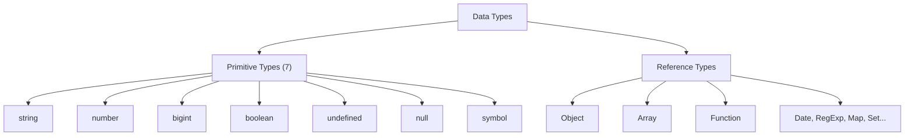
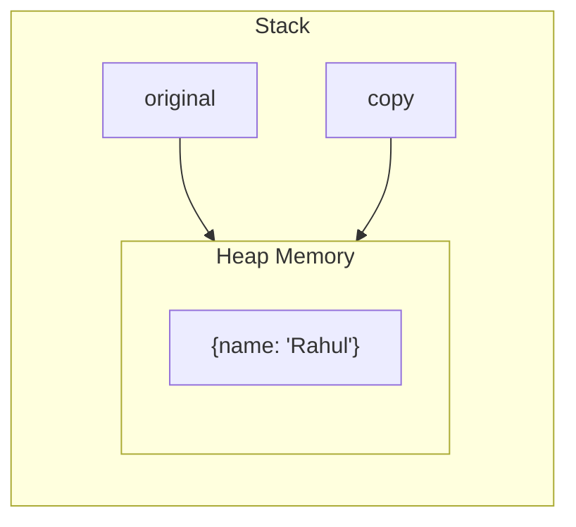

# Data Types in JavaScript

## Two Categories

JavaScript has two categories of data types:



---

## Primitive Types

Primitives are **immutable** and stored directly in the variable (on the stack). When you assign a primitive to another variable, it creates a **copy**.

### string

```javascript
let name = "Vikas";
let greeting = `Hello, ${name}!`; // Template literal
let multiline = `Line 1
Line 2`;

// Strings are immutable
let str = "hello";
str[0] = "H"; // Does nothing — strings cannot be changed in place
str = "Hello"; // This creates a NEW string
```

### number

```javascript
let integer = 42;
let decimal = 3.14;
let negative = -10;
let infinity = Infinity;
let notANumber = NaN; // Result of invalid math operations

// JavaScript has ONE number type — no int vs float distinction
typeof 42 === typeof 3.14; // true — both are "number"

// Special values
console.log(0.1 + 0.2); // 0.30000000000000004 (floating point issue)
console.log(1 / 0); // Infinity
console.log("abc" * 2); // NaN
```

### bigint

```javascript
let huge = 9007199254740991n; // Note the 'n' suffix
let alsoHuge = BigInt("9007199254740991");

// Cannot mix BigInt and Number
// huge + 1; // TypeError
huge + 1n; // 9007199254740992n
```

### boolean

```javascript
let isActive = true;
let isDeleted = false;

// Truthy and Falsy values
// Falsy: false, 0, -0, 0n, "", null, undefined, NaN
// Truthy: everything else (including "0", "false", [], {})
```

### undefined

```javascript
let x;
console.log(x); // undefined — declared but no value assigned

function doNothing() {}
console.log(doNothing()); // undefined — function with no return
```

### null

```javascript
let user = null; // Intentionally empty — "no value"

// typeof null is "object" — this is a historic bug in JavaScript
typeof null; // "object" (should be "null" but cannot be fixed)
```

### symbol

```javascript
let id = Symbol("id");
let anotherId = Symbol("id");
id === anotherId; // false — every Symbol is unique

// Used as unique object property keys
const SECRET_KEY = Symbol("secret");
let obj = {
  [SECRET_KEY]: "hidden value",
  name: "visible",
};
```

---

## Reference Types

Reference types are stored on the **heap**. Variables hold a **reference** (pointer) to the memory location, not the actual data.

### Object

```javascript
let user = {
  name: "Vikas",
  age: 25,
  isActive: true,
};

user.email = "vikas@example.com"; // Add property
delete user.isActive; // Remove property
```

### Array

```javascript
let colors = ["red", "green", "blue"];
colors.push("yellow"); // Add to end
colors[0]; // "red" — access by index
colors.length; // 4
```

### Function

```javascript
function greet(name) {
  return `Hello, ${name}!`;
}

// Functions are objects — they can have properties
greet.description = "A greeting function";
```

---

## Primitive vs Reference: The Key Difference

### Primitives Copy by Value

```javascript
let a = 10;
let b = a; // b gets a COPY of 10
b = 20;

console.log(a); // 10 — unchanged
console.log(b); // 20
```

### References Copy by Reference

```javascript
let original = { name: "Vikas" };
let copy = original; // copy points to the SAME object
copy.name = "Rahul";

console.log(original.name); // "Rahul" — both point to same object!
console.log(copy.name); // "Rahul"
```



---

## Type Checking

### `typeof` Operator

```javascript
typeof "hello"; // "string"
typeof 42; // "number"
typeof true; // "boolean"
typeof undefined; // "undefined"
typeof null; // "object" ← BUG (historical)
typeof {}; // "object"
typeof []; // "object" ← arrays are objects
typeof function () {}; // "function"
typeof Symbol(); // "symbol"
typeof 10n; // "bigint"
```

### Better Checks

```javascript
// Check for null
value === null;

// Check for array
Array.isArray([1, 2, 3]); // true
Array.isArray({}); // false

// Check for NaN
Number.isNaN(NaN); // true
Number.isNaN("hello"); // false (better than global isNaN)
```

---

## Type Coercion

JavaScript automatically converts types in certain contexts.

### Implicit Coercion (Automatic)

```javascript
// String concatenation wins over addition
"5" + 3; // "53" (number → string)
"5" - 3; // 2 (string → number, because - is only for numbers)

// Boolean context
if ("hello") {
} // true — non-empty string is truthy
if (0) {
} // false — 0 is falsy

// Equality
"5" == 5; // true — coerces types
"5" === 5; // false — strict equality, no coercion
```

### Explicit Coercion (Manual)

```javascript
// To string
String(42); // "42"
(42).toString(); // "42"

// To number
Number("42"); // 42
parseInt("42px"); // 42 (parses until non-digit)
parseFloat("3.14"); // 3.14
+"42"; // 42 (unary plus)

// To boolean
Boolean(0); // false
Boolean("hello"); // true
!!value; // Convert any value to boolean
```

---

## `==` vs `===`

| Operator | Name            | Behavior                      |
| -------- | --------------- | ----------------------------- |
| `==`     | Loose equality  | Coerces types, then compares  |
| `===`    | Strict equality | No coercion — type must match |

```javascript
0 == false; // true (both coerce to 0)
0 === false; // false (number vs boolean)
"" == false; // true
"" === false; // false
null == undefined; // true (special rule)
null === undefined; // false
```

**Rule: Always use `===`** unless you have a specific reason for `==` (like `null == undefined` check).

---

## Best Practices

1. **Use `===` and `!==`** — strict comparison avoids coercion bugs.
2. **Be explicit with type conversions** — `Number(value)` is clearer than `+value`.
3. **Check for null/undefined** — use `value == null` (one valid use of `==`) or `value === null || value === undefined`.
4. **Know your falsy values** — `0`, `""`, `null`, `undefined`, `NaN`, `false`.
5. **Use `Array.isArray()`** — `typeof []` returns `"object"`, which is unhelpful.

---

## Common Mistakes

| Mistake                       | Why It Is Wrong                             | Fix                                    |
| ----------------------------- | ------------------------------------------- | -------------------------------------- |
| `typeof null === "null"`      | `typeof null` is `"object"` (bug)           | Use `value === null`                   |
| Using `==` for comparison     | Implicit coercion causes unexpected matches | Use `===`                              |
| Assuming arrays copy by value | Arrays are reference types                  | Use `[...arr]` or `structuredClone()`  |
| `0.1 + 0.2 === 0.3`           | Floating point math is imprecise            | Use tolerance: `Math.abs(a-b) < 0.001` |
| Not knowing `NaN !== NaN`     | NaN is not equal to itself                  | Use `Number.isNaN(value)`              |

---

## Summary

- JavaScript has 7 primitive types (string, number, bigint, boolean, undefined, null, symbol) and reference types (objects, arrays, functions).
- Primitives are immutable and copied by value; reference types are mutable and copied by reference.
- `typeof` is useful but has quirks (`null` → `"object"`, arrays → `"object"`).
- Type coercion happens automatically in many contexts — use `===` and explicit conversions to avoid surprises.
- Understanding the primitive vs. reference distinction prevents a huge class of bugs involving shared objects and unexpected mutations.
