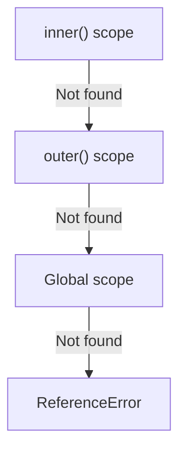

# Scope, Scope Chaining & Closures

## What Is Scope?

Scope determines where variables are accessible in your code. It is the set of rules that governs how the JavaScript engine looks up variable names.

**Analogy:** Scope is like rooms in a building. A variable declared in a room (block) is only visible inside that room. But you can always look out the window (to the enclosing scope) to find things that are not in your room.

---

## Types of Scope

### 1. Global Scope

Variables declared outside any function or block:

```javascript
const APP_NAME = "MyApp"; // Global — accessible everywhere

function greet() {
  console.log(APP_NAME); // ✅ Accessible
}
```

### 2. Function Scope

Variables declared inside a function — visible only within that function:

```javascript
function calculate() {
  let result = 42; // Function scoped
  console.log(result); // ✅ 42
}

// console.log(result); // ❌ ReferenceError
```

### 3. Block Scope

Variables declared with `let` or `const` inside `{}`:

```javascript
if (true) {
  let blockVar = "I'm block scoped";
  const alsoBlock = "Me too";
  var notBlock = "I escape blocks"; // var ignores block scope
}

// console.log(blockVar); // ❌ ReferenceError
// console.log(alsoBlock); // ❌ ReferenceError
console.log(notBlock); // ✅ "I escape blocks"
```

---

## Lexical Environment

Every time code runs, a **Lexical Environment** is created. It consists of:

1. **Environment Record** — stores local variables and function declarations.
2. **Reference to outer environment** — link to the parent scope.

```javascript
let globalVar = "global";

function outer() {
  let outerVar = "outer";

  function inner() {
    let innerVar = "inner";
    console.log(innerVar); // ✅ own scope
    console.log(outerVar); // ✅ parent scope
    console.log(globalVar); // ✅ grandparent scope
  }

  inner();
}

outer();
```

Lexical means **"defined at write time"** — scope is determined by where you write the code, not where you call it.

---

## Scope Chaining

When JavaScript cannot find a variable in the current scope, it walks up the chain of outer environments until it finds it or reaches the global scope.



```javascript
let a = 1;

function first() {
  let b = 2;

  function second() {
    let c = 3;

    function third() {
      console.log(a); // walks up: third → second → first → global → found (1)
      console.log(b); // walks up: third → second → first → found (2)
      console.log(c); // walks up: third → second → found (3)
    }

    third();
  }

  second();
}

first();
```

**Key insight:** Scope chain is based on where functions are **written** (lexical/static), not where they are **called** (dynamic).

---

## Closures

### Definition

A closure is a function that **remembers** and can access variables from its outer (enclosing) scope, even after the outer function has returned.

```javascript
function createCounter() {
  let count = 0; // This variable is "closed over"

  return function increment() {
    count++;
    return count;
  };
}

const counter = createCounter();
console.log(counter()); // 1
console.log(counter()); // 2
console.log(counter()); // 3

// count is not accessible from outside
// console.log(count); // ReferenceError
```

**What happened:**

1. `createCounter()` runs, creates `count = 0`, returns the inner function.
2. `createCounter()` finishes — its execution context is popped off the call stack.
3. But `count` is NOT garbage collected because the returned function still holds a reference to it.
4. Every time we call `counter()`, it accesses and modifies the same `count`.

### Why Closures Work

The inner function retains a reference to its **lexical environment** (the scope chain at the time of its creation). As long as the inner function exists, the variables it references are kept alive.

---

## Closure Use Cases

### 1. Data Privacy / Encapsulation

```javascript
function createBankAccount(initialBalance) {
  let balance = initialBalance; // Private — no direct access

  return {
    deposit(amount) {
      balance += amount;
      return balance;
    },
    withdraw(amount) {
      if (amount > balance) throw new Error("Insufficient funds");
      balance -= amount;
      return balance;
    },
    getBalance() {
      return balance;
    },
  };
}

const account = createBankAccount(1000);
account.deposit(500); // 1500
account.withdraw(200); // 1300
account.getBalance(); // 1300
// account.balance;       // undefined — truly private
```

### 2. Function Factories

```javascript
function createMultiplier(factor) {
  return function (number) {
    return number * factor;
  };
}

const double = createMultiplier(2);
const triple = createMultiplier(3);

double(5); // 10
triple(5); // 15
```

### 3. Event Handlers with State

```javascript
function createClickTracker(buttonId) {
  let clicks = 0;

  document.getElementById(buttonId).addEventListener("click", () => {
    clicks++;
    console.log(`Button clicked ${clicks} times`);
  });
}

createClickTracker("myBtn");
```

### 4. Memoization

```javascript
function memoize(fn) {
  const cache = {}; // Closed over — persists between calls

  return function (...args) {
    const key = JSON.stringify(args);
    if (cache[key] !== undefined) {
      return cache[key]; // Return cached result
    }
    cache[key] = fn(...args);
    return cache[key];
  };
}

const expensiveAdd = memoize((a, b) => {
  console.log("Computing...");
  return a + b;
});

expensiveAdd(1, 2); // "Computing..." → 3
expensiveAdd(1, 2); // 3 (no "Computing..." — cached)
```

---

## The Classic Loop Problem

```javascript
// Bug: all buttons log "5"
for (var i = 0; i < 5; i++) {
  setTimeout(() => {
    console.log(i); // 5, 5, 5, 5, 5
  }, 100);
}
```

**Why?** `var` is function-scoped — there is only ONE `i`. By the time `setTimeout` callbacks run, the loop is done and `i === 5`.

### Fix 1: Use `let` (Block Scope)

```javascript
for (let i = 0; i < 5; i++) {
  setTimeout(() => {
    console.log(i); // 0, 1, 2, 3, 4
  }, 100);
}
```

`let` creates a new `i` for each iteration — each callback closes over its own copy.

### Fix 2: IIFE (Pre-ES6 Solution)

```javascript
for (var i = 0; i < 5; i++) {
  (function (j) {
    setTimeout(() => {
      console.log(j); // 0, 1, 2, 3, 4
    }, 100);
  })(i);
}
```

---

## Common Mistakes

| Mistake                             | Why It Is Wrong                                     | Fix                                   |
| ----------------------------------- | --------------------------------------------------- | ------------------------------------- |
| Closures in loops with `var`        | All callbacks share the same variable               | Use `let` or IIFE                     |
| Memory leaks from closures          | Closed-over variables are never garbage collected   | Nullify references when done          |
| Assuming scope is dynamic           | Scope is lexical (where written, not where called)  | Trace the scope chain from definition |
| Overusing closures for simple state | Adds complexity; a class or module might be clearer | Use the simplest tool for the job     |

---

## Summary

- **Scope** determines variable visibility: global → function → block.
- **Lexical environment** stores variables and links to the outer scope — this link forms the **scope chain**.
- The engine resolves variables by walking up the scope chain until found (or throws `ReferenceError`).
- **Closures** are functions that remember their outer scope even after the outer function returns.
- Closures enable data privacy, function factories, memoization, and stateful event handlers.
- Use `let` in loops to avoid the classic closure-with-`var` bug — each iteration gets its own scope.
