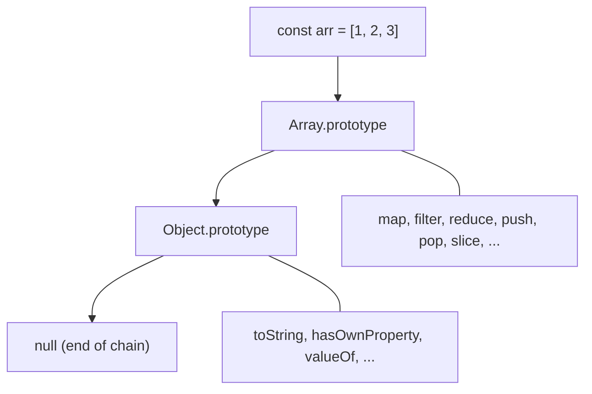

# Array.prototype Basics

## What Is Array.prototype?

`Array.prototype` is the object from which all JavaScript arrays inherit their methods. When you create an array, it does not carry its own copies of `map`, `filter`, `push`, etc. — it inherits them through the **prototype chain** from `Array.prototype`.

**Analogy:** Think of `Array.prototype` as a shared toolbox in a workshop. Every workbench (array instance) can reach into the toolbox to use any tool (method). The tools are not duplicated on every workbench — they live in one shared place.

---

## Why This Matters

- Understanding prototypes explains why `[1, 2, 3].map(...)` works even though you never defined `map` on that array.
- Knowing the prototype chain helps you debug unexpected behavior (e.g., why `for...in` iterates over custom prototype methods).
- It is foundational to understanding how JavaScript's inheritance model works.

---

## The Prototype Chain for Arrays



```javascript
const arr = [1, 2, 3];

// arr itself has no 'map' property — it inherits it
console.log(arr.hasOwnProperty("map")); // false
console.log(Array.prototype.hasOwnProperty("map")); // true

// The chain
Object.getPrototypeOf(arr) === Array.prototype; // true
Object.getPrototypeOf(Array.prototype) === Object.prototype; // true
Object.getPrototypeOf(Object.prototype) === null; // true
```

---

## How Method Lookup Works

When you call `arr.filter(...)`, the engine:

1. Looks at `arr` itself — no `filter` property found.
2. Follows the prototype link to `Array.prototype` — finds `filter` here.
3. Calls it with `arr` as `this`.

```javascript
const nums = [1, 2, 3, 4, 5];

// These are equivalent:
nums.filter((n) => n > 2); // [3, 4, 5]
Array.prototype.filter.call(nums, (n) => n > 2); // [3, 4, 5]
```

---

## Common Array.prototype Methods

### Mutating Methods (modify the original array)

```javascript
const arr = [1, 2, 3];

arr.push(4); // [1, 2, 3, 4] — add to end
arr.pop(); // [1, 2, 3] — remove from end
arr.unshift(0); // [0, 1, 2, 3] — add to start
arr.shift(); // [1, 2, 3] — remove from start
arr.splice(1, 1); // [1, 3] — remove 1 element at index 1
arr.reverse(); // [3, 1] — reverses in place
arr.sort((a, b) => a - b); // [1, 3] — sorts in place
arr.fill(0); // [0, 0] — fills all elements with 0
```

### Non-Mutating Methods (return a new array/value)

```javascript
const arr = [1, 2, 3, 4, 5];

arr.map((n) => n * 2); // [2, 4, 6, 8, 10]
arr.filter((n) => n > 3); // [4, 5]
arr.reduce((sum, n) => sum + n, 0); // 15
arr.find((n) => n > 3); // 4
arr.findIndex((n) => n > 3); // 3
arr.some((n) => n > 4); // true
arr.every((n) => n > 0); // true
arr.includes(3); // true
arr.indexOf(3); // 2
arr.slice(1, 3); // [2, 3]
arr.concat([6, 7]); // [1, 2, 3, 4, 5, 6, 7]
arr.flat(); // flattens nested arrays
arr.flatMap((n) => [n, n * 2]); // [1, 2, 2, 4, 3, 6, 4, 8, 5, 10]
```

---

## Adding Custom Methods to Array.prototype

You **can** extend `Array.prototype` with custom methods. Every array will then have access to them:

```javascript
// Custom method: get the last element
Array.prototype.last = function () {
  return this[this.length - 1];
};

[10, 20, 30].last(); // 30
["a", "b", "c"].last(); // "c"
```

### Another Example: Sum

```javascript
Array.prototype.sum = function () {
  return this.reduce((total, n) => total + n, 0);
};

[1, 2, 3, 4, 5].sum(); // 15
```

### Another Example: Unique

```javascript
Array.prototype.unique = function () {
  return [...new Set(this)];
};

[1, 2, 2, 3, 3, 3].unique(); // [1, 2, 3]
```

---

## Why You Usually Should NOT Extend Array.prototype

### 1. Name Collisions

If a future JavaScript version adds a method with the same name, your version overrides it (or vice versa):

```javascript
// You define Array.prototype.at in 2019
Array.prototype.at = function (index) {
  return this[index];
};

// ES2022 adds Array.prototype.at() with different behavior (supports negative indices)
// Your code now breaks or behaves unexpectedly
```

### 2. Pollutes All Arrays

Every array in your entire application (including third-party libraries) gets your custom method:

```javascript
Array.prototype.debug = function () {
  console.log("Debug:", this);
  return this;
};

// Some library internally does for...in on an array:
const arr = [1, 2, 3];
for (let key in arr) {
  console.log(key); // "0", "1", "2", "debug" ← unexpected!
}
```

### 3. Breaks `for...in` Loops

Custom prototype properties are enumerable by default:

```javascript
Array.prototype.customMethod = function () {};

const arr = [1, 2, 3];
for (let key in arr) {
  console.log(key); // "0", "1", "2", "customMethod" ← bug
}
```

### 4. Testing and Debugging Difficulty

If a prototype method behaves unexpectedly, it is hard to trace where it was defined — especially across multiple files or libraries.

---

## Safer Alternatives

### Alternative 1: Utility Functions

```javascript
// Instead of Array.prototype.last
function last(arr) {
  return arr[arr.length - 1];
}

last([1, 2, 3]); // 3
```

### Alternative 2: Subclass Array

```javascript
class SuperArray extends Array {
  last() {
    return this[this.length - 1];
  }

  sum() {
    return this.reduce((total, n) => total + n, 0);
  }
}

const arr = SuperArray.from([1, 2, 3, 4, 5]);
arr.last(); // 5
arr.sum(); // 15
arr.filter((n) => n > 2); // SuperArray [3, 4, 5] — still a SuperArray!
```

### Alternative 3: Use `Object.defineProperty` (Non-enumerable)

If you must extend the prototype, make it non-enumerable:

```javascript
Object.defineProperty(Array.prototype, "last", {
  value: function () {
    return this[this.length - 1];
  },
  enumerable: false, // won't show up in for...in
  writable: true,
  configurable: true,
});

[1, 2, 3].last(); // 3

// Safe with for...in now
for (let key in [1, 2, 3]) {
  console.log(key); // "0", "1", "2" — no "last"
}
```

---

## Inspecting the Prototype Chain

```javascript
const arr = [1, 2, 3];

// Check the prototype
console.log(Object.getPrototypeOf(arr)); // Array.prototype (shows all methods)

// Check if something is an array
Array.isArray(arr); // true
arr instanceof Array; // true

// See all own properties of Array.prototype
console.log(Object.getOwnPropertyNames(Array.prototype));
// ["length", "constructor", "at", "concat", "copyWithin", "fill", "find", ...]

// Check if a method is inherited vs. own
arr.hasOwnProperty("length"); // true — length is on the instance
arr.hasOwnProperty("map"); // false — map is inherited from Array.prototype
```

---

## How `this` Works in Prototype Methods

When you call `arr.map(fn)`, inside the `map` implementation, `this` refers to `arr`:

```javascript
Array.prototype.myMap = function (callback) {
  // `this` is the array the method was called on
  const result = [];
  for (let i = 0; i < this.length; i++) {
    result.push(callback(this[i], i, this));
  }
  return result;
};

[1, 2, 3].myMap((n) => n * 10); // [10, 20, 30]
```

This is why array methods work — they use `this` to access the array they are called on, not a hardcoded reference.

---

## Best Practices

1. **Do not modify `Array.prototype` in production code** — use utility functions or subclassing instead.
2. **Use `Object.defineProperty` if you must extend** — set `enumerable: false` to avoid breaking `for...in`.
3. **Prefer non-mutating methods** (`map`, `filter`, `slice`) over mutating ones (`splice`, `sort`, `reverse`) for predictable code.
4. **Understand that `sort()` mutates** — use `[...arr].sort()` or `arr.toSorted()` (ES2023) if you need a copy.
5. **Use `Array.isArray()` over `instanceof`** — `instanceof` fails across iframes/realms where `Array` is a different constructor.
6. **Know that array methods return the same type when subclassing** — `SuperArray.filter()` returns a `SuperArray`, not a plain `Array`.

---

## Common Mistakes

| Mistake                                       | Why It Is Wrong                                            | Fix                                                  |
| --------------------------------------------- | ---------------------------------------------------------- | ---------------------------------------------------- |
| Adding enumerable prototype methods           | Breaks `for...in`, affects all arrays globally             | Use `Object.defineProperty` with `enumerable: false` |
| Assuming `sort()` returns a new array         | `sort()` mutates in place AND returns the same reference   | Use `[...arr].sort()` or `.toSorted()`               |
| Using `for...in` on arrays                    | Iterates inherited enumerable properties too               | Use `for...of`, `.forEach()`, or index-based `for`   |
| Overriding built-in prototype methods         | May break libraries or future JS features                  | Use a different name or utility functions            |
| Forgetting `this` in custom prototype methods | Arrow functions don't have their own `this`                | Use `function` keyword for prototype methods         |
| Confusing `Array.prototype` with `Array`      | Static methods like `Array.isArray` live on `Array` itself | Know the difference: `Array.from()` vs `arr.map()`   |

---

## Summary

- Every array inherits methods from `Array.prototype` through the prototype chain.
- The chain goes: `array instance → Array.prototype → Object.prototype → null`.
- You **can** add custom methods to `Array.prototype`, but you usually **should not** — it pollutes all arrays, risks name collisions, and breaks `for...in`.
- Safer alternatives: utility functions, subclassing `Array`, or `Object.defineProperty` with `enumerable: false`.
- Prototype methods use `this` to reference the array they are called on — this is why `function` (not arrow functions) must be used for custom prototype methods.
- Understanding the prototype chain is key to understanding how JavaScript's inheritance works beneath the syntactic sugar of classes.
