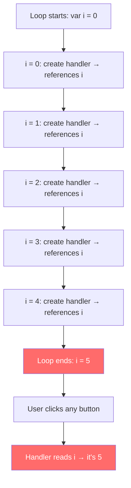
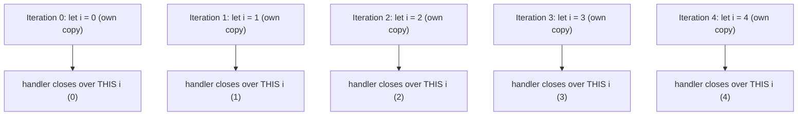

# The Two Button Problem

## What Is the Two Button Problem?

The "Two Button Problem" (or more generally, the "loop closure problem") is a classic JavaScript bug where multiple event handlers created inside a loop all reference the **same variable** instead of their own copy. When any button is clicked, they all display the same (final) value.

**Analogy:** Imagine 5 people each looking at the same whiteboard to read a number. By the time they look, someone has erased the old numbers and written "5". They all see "5" — because they were all looking at the same board, not their own personal copy.

---

## Why This Matters

- This is one of the most common interview questions about closures.
- It demonstrates a real bug that occurs when creating handlers, timers, or callbacks in loops.
- Understanding it solidifies your knowledge of `var` vs `let`, closures, and function scope.
- It shows up in real code: dynamically generating buttons, list items with click handlers, or delayed operations.

---

## The Bug: All Buttons Show the Same Value

### HTML Setup

```html
<button>Button 1</button>
<button>Button 2</button>
<button>Button 3</button>
<button>Button 4</button>
<button>Button 5</button>
```

### Buggy Code with `var`

```javascript
var buttons = document.querySelectorAll("button");

for (var i = 0; i < buttons.length; i++) {
  buttons[i].addEventListener("click", function () {
    console.log("Button " + i + " clicked");
  });
}

// Click any button → always logs "Button 5 clicked"
```

**Expected:** Each button logs its own number (0, 1, 2, 3, 4).
**Actual:** Every button logs "Button 5 clicked".

---

## Why This Happens



### The Three Key Facts

1. **`var` is function-scoped, not block-scoped.** There is only ONE `i` variable shared across all iterations.
2. **Closures capture references, not values.** The click handler does not snapshot `i` — it holds a live reference to the same `i` variable.
3. **Event handlers run later.** By the time a user clicks, the loop is long finished and `i` equals `buttons.length` (5).

### Step-by-Step Execution

```javascript
// Iteration 0: handler created, closes over `i` (currently 0, but it's a reference)
// Iteration 1: handler created, closes over the SAME `i` (currently 1)
// Iteration 2: handler created, closes over the SAME `i` (currently 2)
// Iteration 3: handler created, closes over the SAME `i` (currently 3)
// Iteration 4: handler created, closes over the SAME `i` (currently 4)
// Loop ends: i++ makes i = 5, condition fails, loop stops.

// Later: user clicks Button 0
// Handler runs → reads `i` → i is 5 → logs "Button 5 clicked"
```

The same issue with `setTimeout`:

```javascript
for (var i = 0; i < 5; i++) {
  setTimeout(function () {
    console.log(i); // 5, 5, 5, 5, 5
  }, 100);
}
```

---

## Fix 1: Use `let` (Modern Solution)

```javascript
const buttons = document.querySelectorAll("button");

for (let i = 0; i < buttons.length; i++) {
  buttons[i].addEventListener("click", function () {
    console.log("Button " + i + " clicked");
  });
}

// Click Button 0 → "Button 0 clicked" ✅
// Click Button 3 → "Button 3 clicked" ✅
```

### Why `let` Fixes It

`let` is **block-scoped**. In a `for` loop, each iteration gets its own `i` variable:



Each handler captures its own unique `i`. When clicked later, it reads **its own** copy.

---

## Fix 2: IIFE (Immediately Invoked Function Expression)

This is the pre-ES6 solution — useful to understand for interviews and legacy code:

```javascript
var buttons = document.querySelectorAll("button");

for (var i = 0; i < buttons.length; i++) {
  (function (index) {
    buttons[index].addEventListener("click", function () {
      console.log("Button " + index + " clicked");
    });
  })(i); // Pass current value of i as argument
}
```

### Why IIFE Fixes It

1. The IIFE creates a **new function scope** on each iteration.
2. The current value of `i` is **passed as an argument** (`index`).
3. `index` is a local variable inside the IIFE — each handler closes over its own `index`.

```javascript
// Iteration 0: IIFE called with i=0 → creates local `index = 0` → handler captures index (0)
// Iteration 1: IIFE called with i=1 → creates local `index = 1` → handler captures index (1)
// ...each IIFE call creates its own scope with its own copy
```

---

## Fix 3: `forEach` (Functional Approach)

```javascript
const buttons = document.querySelectorAll("button");

// Convert NodeList to Array (or use Array.from)
Array.from(buttons).forEach(function (button, index) {
  button.addEventListener("click", function () {
    console.log("Button " + index + " clicked");
  });
});
```

### Why `forEach` Fixes It

`forEach` calls its callback function once per element. Each call creates a **new function scope** with its own `index` parameter — same principle as the IIFE fix.

---

## Fix 4: Using `data-*` Attributes (DOM Approach)

Avoid closures entirely by storing the value in the DOM:

```html
<button data-index="0">Button 1</button>
<button data-index="1">Button 2</button>
<button data-index="2">Button 3</button>
```

```javascript
const buttons = document.querySelectorAll("button");

for (var i = 0; i < buttons.length; i++) {
  buttons[i].addEventListener("click", function (event) {
    const index = event.target.dataset.index;
    console.log("Button " + index + " clicked");
  });
}
```

---

## Fix 5: Event Delegation (Scalable Approach)

```javascript
document.addEventListener("click", function (event) {
  if (event.target.tagName === "BUTTON") {
    const index = Array.from(document.querySelectorAll("button")).indexOf(
      event.target,
    );
    console.log("Button " + index + " clicked");
  }
});
```

---

## Comparison of All Fixes

| Fix            | How It Works                                 | When to Use                       |
| -------------- | -------------------------------------------- | --------------------------------- |
| `let`          | Block scope creates new variable per loop    | Always (modern code)              |
| IIFE           | Function scope creates new variable per call | Legacy code / interview questions |
| `forEach`      | Callback scope creates new parameter         | When iterating arrays/NodeLists   |
| `data-*` attrs | Value stored in DOM, read at click time      | When you need DOM-based state     |
| Delegation     | Single handler, determine target at runtime  | Dynamic elements, performance     |

---

## The `setTimeout` Version

The same bug and fixes apply to any delayed execution:

```javascript
// Bug
for (var i = 0; i < 5; i++) {
  setTimeout(function () {
    console.log(i); // 5, 5, 5, 5, 5
  }, i * 1000);
}

// Fix with let
for (let i = 0; i < 5; i++) {
  setTimeout(function () {
    console.log(i); // 0, 1, 2, 3, 4
  }, i * 1000);
}

// Fix with IIFE
for (var i = 0; i < 5; i++) {
  (function (j) {
    setTimeout(function () {
      console.log(j); // 0, 1, 2, 3, 4
    }, j * 1000);
  })(i);
}

// Fix with setTimeout's third argument
for (var i = 0; i < 5; i++) {
  setTimeout(
    function (j) {
      console.log(j); // 0, 1, 2, 3, 4
    },
    i * 1000,
    i, // passed as argument to the callback
  );
}
```

---

## Best Practices

1. **Always use `let` or `const` in loops** — `var` in loops is the root cause; `let` eliminates the entire class of bugs.
2. **Understand the WHY, not just the fix** — interviewers ask why `let` works, not just to use it.
3. **Prefer `forEach` or `for...of` over `for` loops** — functional iteration creates natural scoping boundaries.
4. **Be aware of async timing** — any callback that runs later (events, timers, promises) can fall into this trap with `var`.
5. **Use `const` when the loop variable is not reassigned** — `for...of` and `forEach` callbacks can use `const` for element references.

---

## Common Mistakes

| Mistake                                    | Why It Is Wrong                                    | Fix                                                 |
| ------------------------------------------ | -------------------------------------------------- | --------------------------------------------------- |
| Using `var` in a loop with async callbacks | All callbacks share one variable                   | Use `let` or wrap in IIFE                           |
| Thinking closures capture values           | Closures capture **references** to variables       | Create a new scope to snapshot the value            |
| Assuming the handler runs during the loop  | Handlers run when the event fires (much later)     | The loop variable has its final value by then       |
| Using an arrow function as the "IIFE fix"  | Arrow IIFE works but is confusing to read          | Use standard `(function(i) {...})(i)` syntax        |
| Not understanding why `let` fixes it       | "Just use let" without understanding block scoping | Know that `let` creates a new binding per iteration |

---

## Mental Model

```
var in a loop = ONE shared box
All functions peek into the SAME box.
By the time they peek, the box has the final value.

let in a loop = SEPARATE boxes per iteration
Each function has its own box.
Each box keeps the value from its iteration.
```

---

## Summary

- The Two Button Problem occurs when handlers/callbacks in a loop all close over the **same `var` variable**.
- By the time handlers execute, the loop is done and the variable holds its final value.
- **Root cause:** `var` is function-scoped (one variable for all iterations) + closures capture references (not values) + handlers run asynchronously (after the loop finishes).
- **Fix with `let`:** Creates a new block-scoped variable per iteration — each handler gets its own copy.
- **Fix with IIFE:** Creates a new function scope per iteration — passes the current value as a parameter.
- **Fix with `forEach`:** Each callback invocation naturally creates its own scope.
- This is not just academic — it applies to any situation where you create callbacks inside loops: event listeners, `setTimeout`, promises, etc.
