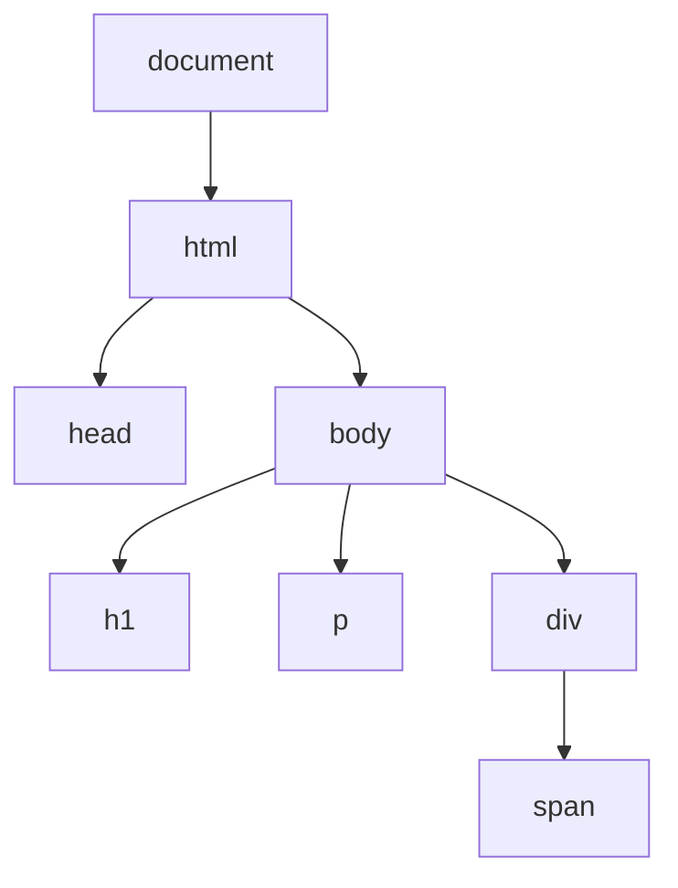

# DOM Manipulation & Events

## What Is the DOM?

The DOM (Document Object Model) is a tree-structured representation of an HTML document. When the browser parses HTML, it creates this tree of objects that JavaScript can read and modify.



Every element, attribute, and text node is an object in this tree. JavaScript can:

- Find elements in the tree.
- Change their content, attributes, and styles.
- Add new elements or remove existing ones.
- React to user interactions (clicks, typing, scrolling).

---

## Selecting Elements

### Single Element

```javascript
// By ID (fastest — IDs are unique)
const header = document.getElementById("main-header");

// By CSS selector (first match)
const firstCard = document.querySelector(".card");
const nav = document.querySelector("nav > ul");
```

### Multiple Elements

```javascript
// By CSS selector (all matches — returns NodeList)
const allCards = document.querySelectorAll(".card");

// By class name (returns HTMLCollection — live)
const items = document.getElementsByClassName("item");

// By tag name (returns HTMLCollection — live)
const paragraphs = document.getElementsByTagName("p");
```

### NodeList vs HTMLCollection

| Feature       | NodeList (`querySelectorAll`) | HTMLCollection (`getElementsBy...`) |
| ------------- | ----------------------------- | ----------------------------------- |
| `forEach`     | ✅ Yes                        | ❌ No (convert to array first)      |
| Live updates  | ❌ No (static snapshot)       | ✅ Yes (reflects DOM changes)       |
| Array methods | Need `Array.from()`           | Need `Array.from()`                 |

```javascript
// Convert to array for full array methods
const cardsArray = Array.from(document.querySelectorAll(".card"));
// or
const cardsArray2 = [...document.querySelectorAll(".card")];
```

---

## Modifying Content

```javascript
const heading = document.querySelector("h1");

// Text content (plain text, no HTML parsing)
heading.textContent = "New Heading";

// HTML content (parses HTML)
heading.innerHTML = "New <em>Heading</em>";

// Outer HTML (replaces the element itself)
heading.outerHTML = "<h2>Replaced entirely</h2>";
```

**Security warning:** Never use `innerHTML` with user input — it creates XSS vulnerabilities. Use `textContent` for user data.

---

## Modifying Attributes

```javascript
const link = document.querySelector("a");

// Get
link.getAttribute("href"); // "/about"

// Set
link.setAttribute("target", "_blank");

// Remove
link.removeAttribute("title");

// Check
link.hasAttribute("href"); // true

// Direct property access (common attributes)
link.href = "https://example.com";
link.id = "main-link";
link.className = "nav-link active";
```

### Data Attributes

```html
<div data-user-id="42" data-role="admin">User Card</div>
```

```javascript
const card = document.querySelector("div");
card.dataset.userId; // "42"
card.dataset.role; // "admin"
card.dataset.status = "active"; // Adds data-status="active"
```

---

## Modifying Styles

```javascript
const box = document.querySelector(".box");

// Inline styles (camelCase)
box.style.backgroundColor = "blue";
box.style.padding = "1rem";
box.style.display = "none";

// Multiple styles at once
Object.assign(box.style, {
  color: "white",
  fontSize: "1.2rem",
  borderRadius: "8px",
});
```

### Class Manipulation (Preferred Over Inline Styles)

```javascript
const el = document.querySelector(".card");

el.classList.add("active", "highlighted");
el.classList.remove("hidden");
el.classList.toggle("dark-mode"); // Add if missing, remove if present
el.classList.contains("active"); // true
el.classList.replace("old", "new");
```

---

## Creating and Inserting Elements

```javascript
// Create
const newDiv = document.createElement("div");
newDiv.textContent = "I am new!";
newDiv.classList.add("card");

// Insert
document.body.appendChild(newDiv); // End of body
document.body.prepend(newDiv); // Start of body
document.body.insertBefore(newDiv, referenceElement); // Before specific element

// Modern insertion methods
const container = document.querySelector(".container");
container.append(newDiv); // End (can append text too)
container.prepend(newDiv); // Start
container.before(newDiv); // Before container itself
container.after(newDiv); // After container itself

// Insert adjacent HTML
container.insertAdjacentHTML("beforeend", "<p>New paragraph</p>");
// Positions: "beforebegin" | "afterbegin" | "beforeend" | "afterend"
```

---

## Removing Elements

```javascript
const element = document.querySelector(".to-remove");

// Modern (preferred)
element.remove();

// Legacy
element.parentNode.removeChild(element);
```

---

## Event Listeners

### Adding Events

```javascript
const button = document.querySelector("#submit-btn");

button.addEventListener("click", function (event) {
  console.log("Button clicked!");
  console.log("Target:", event.target);
  console.log("Type:", event.type);
});

// Arrow function
button.addEventListener("click", (e) => {
  e.preventDefault(); // Prevent default behavior (form submit, link navigation)
});
```

### Removing Events

```javascript
// Must pass the exact same function reference
function handleClick(e) {
  console.log("Clicked");
}

button.addEventListener("click", handleClick);
button.removeEventListener("click", handleClick);
```

### Common DOM Events

| Category | Events                                                       |
| -------- | ------------------------------------------------------------ |
| Mouse    | `click`, `dblclick`, `mouseenter`, `mouseleave`, `mousemove` |
| Keyboard | `keydown`, `keyup`, `keypress` (deprecated)                  |
| Form     | `submit`, `input`, `change`, `focus`, `blur`                 |
| Window   | `load`, `DOMContentLoaded`, `resize`, `scroll`               |
| Touch    | `touchstart`, `touchmove`, `touchend`                        |
| Drag     | `dragstart`, `drag`, `dragend`, `drop`                       |

---

## Event Bubbling & Capturing

### Bubbling (Default)

Events travel **up** from the target element to the root:

```html
<div id="outer">
  <div id="inner">
    <button id="btn">Click me</button>
  </div>
</div>
```

```javascript
document.getElementById("outer").addEventListener("click", () => {
  console.log("Outer"); // 3rd
});
document.getElementById("inner").addEventListener("click", () => {
  console.log("Inner"); // 2nd
});
document.getElementById("btn").addEventListener("click", () => {
  console.log("Button"); // 1st (target)
});

// Click button → Button, Inner, Outer
```

### Capturing

Events travel **down** from the root to the target (set third argument to `true`):

```javascript
document.getElementById("outer").addEventListener(
  "click",
  () => {
    console.log("Outer — capture");
  },
  true,
); // true = capture phase

// Click button → Outer — capture, Button, Inner, Outer
```

### Stopping Propagation

```javascript
button.addEventListener("click", (e) => {
  e.stopPropagation(); // Event stops here — no bubbling up
  console.log("Only this fires");
});
```

---

## Event Delegation

Instead of adding listeners to many child elements, add one listener to the parent and use `event.target` to identify which child was clicked:

```javascript
// Bad: listener on every list item
document.querySelectorAll("li").forEach((li) => {
  li.addEventListener("click", () => console.log(li.textContent));
});

// Good: one listener on the parent
document.querySelector("ul").addEventListener("click", (e) => {
  if (e.target.tagName === "LI") {
    console.log(e.target.textContent);
  }
});
```

**Benefits:**

- Works for dynamically added elements (they do not need their own listener).
- Better performance (one listener vs hundreds).
- Less memory usage.

```javascript
// Delegation with closest() for nested elements
document.querySelector(".card-container").addEventListener("click", (e) => {
  const card = e.target.closest(".card"); // Finds nearest .card ancestor
  if (card) {
    console.log("Card clicked:", card.dataset.id);
  }
});
```

---

## Best Practices

1. **Use `addEventListener`** over `onclick` attributes — supports multiple handlers.
2. **Use event delegation** for lists, grids, and dynamically generated elements.
3. **Use `textContent`** over `innerHTML` to prevent XSS.
4. **Use `classList`** over directly modifying `className` — safer and more readable.
5. **Batch DOM reads and writes** — interleaving them causes layout thrashing.
6. **Use `DOMContentLoaded`** to ensure DOM is ready before manipulating it.

```javascript
document.addEventListener("DOMContentLoaded", () => {
  // DOM is fully parsed and ready
});
```

---

## Common Mistakes

| Mistake                           | Why It Is Wrong                                | Fix                         |
| --------------------------------- | ---------------------------------------------- | --------------------------- |
| Using `innerHTML` with user input | XSS vulnerability                              | Use `textContent`           |
| Adding listeners inside loops     | Performance waste; breaks with dynamic content | Use event delegation        |
| Not checking if element exists    | `null.addEventListener(...)` throws TypeError  | Guard with `if (element)`   |
| Using `onclick` attribute in JS   | Overwrites previous handler                    | Use `addEventListener`      |
| Not removing event listeners      | Memory leaks in SPAs                           | Remove on component cleanup |

---

## Summary

- The DOM is a tree of objects representing the HTML document — JavaScript interacts with it to make pages dynamic.
- Select elements with `querySelector`/`querySelectorAll`; modify with `textContent`, `classList`, `style`, `setAttribute`.
- Create elements with `createElement` and insert with `append`/`prepend`/`before`/`after`.
- Events bubble up by default — use event delegation to handle events on a parent for many children.
- `e.preventDefault()` stops default browser behavior; `e.stopPropagation()` stops bubbling.
- Prefer `classList` over inline styles, `textContent` over `innerHTML`, and delegation over individual listeners.
