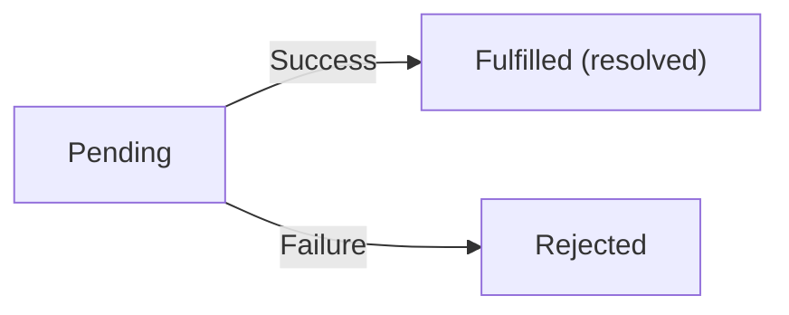

# Promises, Fetch & Async/Await

## The Problem: Callback Hell

When async operations depend on each other, callbacks nest deeply:

```javascript
getUser(userId, (user) => {
  getOrders(user.id, (orders) => {
    getOrderDetails(orders[0].id, (details) => {
      getShippingInfo(details.shippingId, (shipping) => {
        console.log(shipping); // 4 levels deep — "pyramid of doom"
      });
    });
  });
});
```

This is hard to read, debug, and handle errors for. Promises solve this.

---

## Promises

A Promise represents a value that **will be available in the future** — it is a container for an eventual result (or error).

### Three States



- **Pending** — operation in progress.
- **Fulfilled** — operation succeeded, result is available.
- **Rejected** — operation failed, error is available.

### Creating a Promise

```javascript
const myPromise = new Promise((resolve, reject) => {
  // Async operation
  const success = true;

  if (success) {
    resolve("Operation succeeded!"); // Fulfills the promise
  } else {
    reject(new Error("Operation failed")); // Rejects the promise
  }
});
```

### Consuming a Promise

```javascript
myPromise
  .then((result) => {
    console.log(result); // "Operation succeeded!"
  })
  .catch((error) => {
    console.error(error.message);
  })
  .finally(() => {
    console.log("Always runs, success or failure");
  });
```

### Chaining Promises

`.then()` returns a new Promise, allowing chaining (solves callback hell):

```javascript
getUser(userId)
  .then((user) => getOrders(user.id))
  .then((orders) => getOrderDetails(orders[0].id))
  .then((details) => getShippingInfo(details.shippingId))
  .then((shipping) => console.log(shipping))
  .catch((error) => console.error("Something failed:", error));
```

Flat, readable, single error handler for the entire chain.

---

## Promise Static Methods

### `Promise.all` — All Must Succeed

```javascript
const results = await Promise.all([
  fetch("/api/users"),
  fetch("/api/posts"),
  fetch("/api/comments"),
]);
// Returns array of results — fails if ANY promise rejects
```

### `Promise.allSettled` — Wait for All (Success or Failure)

```javascript
const results = await Promise.allSettled([
  fetch("/api/users"),
  fetch("/api/broken-endpoint"),
]);
// [{status: "fulfilled", value: ...}, {status: "rejected", reason: ...}]
```

### `Promise.race` — First to Settle Wins

```javascript
const fastest = await Promise.race([
  fetch("/api/server1"),
  fetch("/api/server2"),
]);
// Returns result of whichever resolves/rejects first
```

### `Promise.any` — First to Succeed Wins

```javascript
const first = await Promise.any([fetch("/api/server1"), fetch("/api/server2")]);
// Returns first successful result (ignores rejections unless ALL reject)
```

---

## Fetch API

The Fetch API is the modern way to make HTTP requests. It returns a Promise.

### Basic GET Request

```javascript
fetch("https://jsonplaceholder.typicode.com/users")
  .then((response) => {
    if (!response.ok) {
      throw new Error(`HTTP error! Status: ${response.status}`);
    }
    return response.json(); // Parse JSON body (also returns a Promise)
  })
  .then((users) => {
    console.log(users);
  })
  .catch((error) => {
    console.error("Fetch failed:", error);
  });
```

### POST Request

```javascript
fetch("https://api.example.com/users", {
  method: "POST",
  headers: {
    "Content-Type": "application/json",
    Authorization: "Bearer token123",
  },
  body: JSON.stringify({
    name: "Vikas",
    email: "vikas@example.com",
  }),
})
  .then((response) => response.json())
  .then((data) => console.log("Created:", data));
```

### Response Object

```javascript
const response = await fetch("/api/data");

response.status; // 200, 404, 500, etc.
response.ok; // true if status is 200-299
response.statusText; // "OK", "Not Found", etc.
response.headers; // Headers object

// Body parsing methods (each returns a Promise)
await response.json(); // Parse as JSON
await response.text(); // Parse as plain text
await response.blob(); // Parse as binary (images, files)
```

**Important:** `fetch` only rejects on network errors — a 404 or 500 response is still a "successful" fetch. Always check `response.ok`.

---

## Async / Await

Async/await is syntactic sugar over Promises — it makes async code look synchronous.

### Basic Syntax

```javascript
async function fetchUsers() {
  try {
    const response = await fetch("/api/users");

    if (!response.ok) {
      throw new Error(`HTTP ${response.status}`);
    }

    const users = await response.json();
    return users;
  } catch (error) {
    console.error("Failed to fetch users:", error);
    throw error; // Re-throw if caller needs to know
  }
}
```

### Rules

- `await` can only be used inside an `async` function (or at the top level of a module).
- `async` functions always return a Promise.
- `await` pauses execution until the Promise settles.

### Error Handling with try/catch

```javascript
async function loadDashboard() {
  try {
    const [users, posts, stats] = await Promise.all([
      fetch("/api/users").then((r) => r.json()),
      fetch("/api/posts").then((r) => r.json()),
      fetch("/api/stats").then((r) => r.json()),
    ]);

    renderDashboard(users, posts, stats);
  } catch (error) {
    showErrorMessage("Failed to load dashboard");
    console.error(error);
  } finally {
    hideLoadingSpinner();
  }
}
```

### Sequential vs Parallel

```javascript
// Sequential (slow) — each waits for the previous
async function sequential() {
  const users = await fetch("/users").then((r) => r.json()); // 1s
  const posts = await fetch("/posts").then((r) => r.json()); // 1s
  const comments = await fetch("/comments").then((r) => r.json()); // 1s
  // Total: ~3 seconds
}

// Parallel (fast) — all start at once
async function parallel() {
  const [users, posts, comments] = await Promise.all([
    fetch("/users").then((r) => r.json()), // 1s
    fetch("/posts").then((r) => r.json()), // 1s ← runs simultaneously
    fetch("/comments").then((r) => r.json()), // 1s
  ]);
  // Total: ~1 second
}
```

---

## Destructuring API Responses

```javascript
async function getUserProfile(userId) {
  const response = await fetch(`/api/users/${userId}`);
  const {
    name,
    email,
    address: { city, country },
  } = await response.json();

  console.log(`${name} from ${city}, ${country}`);
}
```

---

## Real-World Fetch Wrapper

```javascript
async function apiRequest(endpoint, options = {}) {
  const baseURL = "https://api.example.com";

  const config = {
    headers: {
      "Content-Type": "application/json",
      ...options.headers,
    },
    ...options,
  };

  if (config.body && typeof config.body === "object") {
    config.body = JSON.stringify(config.body);
  }

  const response = await fetch(`${baseURL}${endpoint}`, config);

  if (!response.ok) {
    const error = await response.json().catch(() => ({}));
    throw new Error(error.message || `HTTP ${response.status}`);
  }

  return response.json();
}

// Usage
const users = await apiRequest("/users");
const newUser = await apiRequest("/users", {
  method: "POST",
  body: { name: "Vikas", email: "v@example.com" },
});
```

---

## Best Practices

1. **Always handle errors** — use `try/catch` with async/await, `.catch()` with Promises.
2. **Always check `response.ok`** — `fetch` does not reject on HTTP errors.
3. **Use `Promise.all` for independent requests** — do not await sequentially when they can run in parallel.
4. **Prefer async/await** over `.then()` chains — more readable and easier to debug.
5. **Add timeouts to fetch** using `AbortController`:

```javascript
const controller = new AbortController();
setTimeout(() => controller.abort(), 5000); // 5s timeout

const response = await fetch("/api/data", {
  signal: controller.signal,
});
```

---

## Common Mistakes

| Mistake                                | Why It Is Wrong                                | Fix                                   |
| -------------------------------------- | ---------------------------------------------- | ------------------------------------- |
| Not checking `response.ok`             | 404/500 responses are not caught by `.catch()` | `if (!response.ok) throw new Error()` |
| Sequential `await` for independent ops | Unnecessarily slow                             | Use `Promise.all()`                   |
| Forgetting `await` on fetch            | Works with the Response Promise, not the data  | Always `await` async calls            |
| Not stringifying body                  | Server receives `[object Object]`              | `JSON.stringify(body)`                |
| Swallowing errors silently             | Bugs become invisible                          | Log errors and re-throw when needed   |

---

## Summary

- **Promises** represent future values — they have pending, fulfilled, and rejected states.
- **Chaining** (`.then().then()`) replaces callback nesting with flat, readable code.
- **`fetch()`** is the modern HTTP client — always check `response.ok` before parsing.
- **Async/await** makes async code read like synchronous code — use `try/catch` for error handling.
- **`Promise.all()`** runs multiple promises in parallel; **`Promise.allSettled()`** when you need all results regardless of failures.
- Never forget error handling — unhandled promise rejections crash Node.js and create poor UX in browsers.
