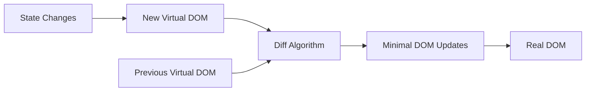

# Introduction to React

## What Is React?

React is a JavaScript library for building user interfaces, created by Facebook (Meta) in 2013. It lets you build complex UIs from small, isolated, reusable pieces called **components**.

**Analogy:** React is like LEGO blocks. Each component is a brick — self-contained with its own shape and behavior. You compose small bricks into larger structures, and if you want to change one part of the structure, you only swap out that brick without rebuilding everything.

---

## Why React?

| Problem Without React              | React Solution                            |
| ---------------------------------- | ----------------------------------------- |
| Manual DOM manipulation is verbose | Declarative UI — describe what you want   |
| UI gets out of sync with data      | State-driven rendering                    |
| Reusing UI patterns is messy       | Components encapsulate UI + logic         |
| Full page reloads for updates      | Virtual DOM diffs and patches efficiently |
| Large apps become unmaintainable   | Component architecture organizes code     |

---

## Real DOM vs Virtual DOM

### Real DOM

The actual browser DOM — updating it is expensive because the browser must:

1. Recalculate styles (CSSOM).
2. Reflow (layout — positions and sizes).
3. Repaint (draw pixels).

### Virtual DOM

A lightweight JavaScript copy of the real DOM that React maintains in memory.



1. When state changes, React creates a **new Virtual DOM tree**.
2. It **diffs** the new tree with the previous one.
3. It calculates the **minimum set of changes** needed.
4. It **patches** only those changes to the real DOM.

This is why React is fast — it batches and minimizes actual DOM operations.

---

## Setting Up React with Vite

```bash
# Create a new React project with Vite
npm create vite@latest my-app -- --template react

# For TypeScript
npm create vite@latest my-app -- --template react-ts

# Navigate and install
cd my-app
npm install
npm run dev
```

### Project Structure

```
my-app/
├── public/
│   └── vite.svg
├── src/
│   ├── App.jsx          # Root component
│   ├── App.css
│   ├── main.jsx         # Entry point
│   └── index.css
├── index.html           # Single HTML file
├── package.json
└── vite.config.js
```

---

## Components

Components are the building blocks of React. They are JavaScript functions that return JSX (UI).

### Function Component

```jsx
function Greeting({ name }) {
  return <h1>Hello, {name}!</h1>;
}

// Arrow function style
const Greeting = ({ name }) => {
  return <h1>Hello, {name}!</h1>;
};

// Usage
<Greeting name="Vikas" />;
```

### JSX (JavaScript XML)

JSX lets you write HTML-like syntax in JavaScript:

```jsx
function App() {
  const isLoggedIn = true;
  const items = ["React", "Vue", "Angular"];

  return (
    <div className="app">
      {/* Expressions in curly braces */}
      <h1>{isLoggedIn ? "Welcome back!" : "Please log in"}</h1>

      {/* Rendering lists */}
      <ul>
        {items.map((item, index) => (
          <li key={index}>{item}</li>
        ))}
      </ul>

      {/* Conditional rendering */}
      {isLoggedIn && <button>Logout</button>}
    </div>
  );
}
```

**JSX rules:**

- Use `className` instead of `class`.
- Use `htmlFor` instead of `for`.
- All tags must be closed (``, `<br />`).
- Return a single root element (or use `<>...</>` Fragment).
- JavaScript expressions go in `{}`.

---

## State (`useState`)

State is data that changes over time and triggers re-renders:

```jsx
import { useState } from "react";

function Counter() {
  const [count, setCount] = useState(0); // [value, setter] = useState(initial)

  return (
    <div>
      <p>Count: {count}</p>
      <button onClick={() => setCount(count + 1)}>Increment</button>
      <button onClick={() => setCount((prev) => prev - 1)}>Decrement</button>
    </div>
  );
}
```

- `useState` returns `[currentValue, setterFunction]`.
- Calling the setter triggers a re-render.
- Use the callback form (`prev => prev + 1`) when new state depends on old state.

---

## Props (Passing Data Down)

Props are how parent components pass data to children:

```jsx
// Parent
function App() {
  return <UserCard name="Vikas" age={25} isActive={true} />;
}

// Child
function UserCard({ name, age, isActive }) {
  return (
    <div className={`card ${isActive ? "active" : ""}`}>
      <h2>{name}</h2>
      <p>Age: {age}</p>
    </div>
  );
}
```

**Props are read-only** — a child cannot modify its props. Data flows one-way (parent → child).

### Props Drilling Problem

When data must pass through many intermediate components:

```jsx
// App → Layout → Sidebar → UserInfo → Avatar
// Each component passes props it doesn't use — this is "props drilling"
```

**Solutions:** Context API, state management (Redux), or composition patterns.

---

## `useEffect` Hook

Side effects: data fetching, subscriptions, DOM manipulation, timers.

```jsx
import { useState, useEffect } from "react";

function UserProfile({ userId }) {
  const [user, setUser] = useState(null);

  useEffect(() => {
    // Effect function — runs after render
    fetch(`/api/users/${userId}`)
      .then((res) => res.json())
      .then((data) => setUser(data));

    // Cleanup function (optional) — runs before next effect or unmount
    return () => {
      console.log("Cleanup");
    };
  }, [userId]); // Dependency array — re-run only when userId changes

  if (!user) return <p>Loading...</p>;
  return <h1>{user.name}</h1>;
}
```

**Dependency array:**

- `[]` — run once on mount (like componentDidMount).
- `[dep1, dep2]` — re-run when deps change.
- No array — run after every render (rarely wanted).

---

## `useRef` Hook

Reference a DOM element or persist a value across renders without causing re-renders:

```jsx
import { useRef } from "react";

function TextInput() {
  const inputRef = useRef(null);

  const focusInput = () => {
    inputRef.current.focus(); // Direct DOM access
  };

  return (
    <>
      <input ref={inputRef} type="text" />
      <button onClick={focusInput}>Focus Input</button>
    </>
  );
}
```

---

## Context API (`useContext`)

Share state across components without props drilling:

```jsx
import { createContext, useContext, useState } from "react";

// 1. Create context
const ThemeContext = createContext();

// 2. Provider wraps the tree
function App() {
  const [theme, setTheme] = useState("light");

  return (
    <ThemeContext.Provider value={{ theme, setTheme }}>
      <Header />
      <Main />
    </ThemeContext.Provider>
  );
}

// 3. Consume anywhere in the tree
function Header() {
  const { theme, setTheme } = useContext(ThemeContext);

  return (
    <header className={theme}>
      <button onClick={() => setTheme(theme === "light" ? "dark" : "light")}>
        Toggle Theme
      </button>
    </header>
  );
}
```

---

## Performance Hooks

### `useMemo` — Memoize Expensive Computations

```jsx
const expensiveResult = useMemo(() => {
  return heavyCalculation(data);
}, [data]); // Recalculates only when data changes
```

### `useCallback` — Memoize Functions

```jsx
const handleClick = useCallback(() => {
  doSomething(id);
}, [id]); // New function only when id changes
```

### `React.memo` — Skip Re-renders for Unchanged Props

```jsx
const ChildComponent = React.memo(function Child({ name }) {
  console.log("Rendered");
  return <p>{name}</p>;
});
// Only re-renders if name prop actually changes
```

---

## React Router

```jsx
import {
  BrowserRouter,
  Routes,
  Route,
  Link,
  useParams,
} from "react-router-dom";

function App() {
  return (
    <BrowserRouter>
      <nav>
        <Link to="/">Home</Link>
        <Link to="/about">About</Link>
        <Link to="/users/123">User 123</Link>
      </nav>

      <Routes>
        <Route path="/" element={<Home />} />
        <Route path="/about" element={<About />} />
        <Route path="/users/:id" element={<UserProfile />} />
        <Route path="*" element={<NotFound />} />
      </Routes>
    </BrowserRouter>
  );
}

function UserProfile() {
  const { id } = useParams();
  return <h1>User ID: {id}</h1>;
}
```

**Use `<Link>` instead of `<a>`** — `<Link>` does client-side navigation without full page reload.

---

## Lazy Loading & Suspense

```jsx
import { lazy, Suspense } from "react";

const HeavyComponent = lazy(() => import("./HeavyComponent"));

function App() {
  return (
    <Suspense fallback={<div>Loading...</div>}>
      <HeavyComponent />
    </Suspense>
  );
}
```

Splits code into chunks — `HeavyComponent` is only loaded when rendered.

---

## Summary

- React builds UIs from reusable **components** that return JSX.
- The **Virtual DOM** diffs changes and patches the real DOM efficiently.
- **State** (`useState`) drives re-renders; **props** pass data parent → child.
- **`useEffect`** handles side effects (fetching, subscriptions, DOM manipulation).
- **Context API** eliminates props drilling for shared state.
- **`useMemo`**, **`useCallback`**, and **`React.memo`** optimize performance.
- **React Router** handles client-side navigation without page reloads.
- **Lazy loading** with `Suspense` splits code for faster initial loads.
