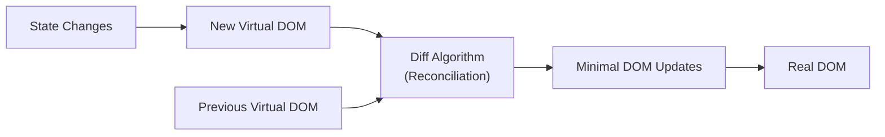

# Real DOM vs Virtual DOM

## The Real DOM

The DOM (Document Object Model) is the browser's internal representation of an HTML page as a tree of objects. When you update something in the DOM, the browser must:

1. **Recalculate styles** (CSSOM)
2. **Reflow** (layout — calculate positions and sizes)
3. **Repaint** (draw pixels to screen)
4. **Composite** (layer elements together)

Even changing one element's text can trigger this cascade on a large portion of the tree.

**Problem:** Frequent DOM updates (like in dynamic UIs) become expensive because the browser recalculates layout and repaints repeatedly.

---

## The Virtual DOM

The Virtual DOM is a lightweight **JavaScript copy** of the real DOM that React keeps in memory. It is a plain JS object tree — not connected to the browser's rendering engine.



### How It Works

1. When state changes, React creates a **new Virtual DOM tree** (fast — it's just JS objects).
2. React **diffs** the new tree against the previous one (reconciliation).
3. It identifies the **minimum set of changes** needed.
4. It **batches and applies** only those changes to the real DOM.

### Example

```jsx
// Before state change: Virtual DOM has <p>Count: 0</p>
// After state change:  Virtual DOM has <p>Count: 1</p>

// Diff result: only the text node inside <p> changed
// Real DOM update: change just that text node (not the entire page)
```

---

## Why Not Just Update the Real DOM Directly?

| Approach                             | Behavior                                           |
| ------------------------------------ | -------------------------------------------------- |
| Direct DOM manipulation (vanilla JS) | Every change immediately triggers layout/repaint   |
| Virtual DOM (React)                  | Changes are batched, diffed, and applied minimally |

### Batching

```jsx
function handleClick() {
  setCount(count + 1); // Does NOT update DOM here
  setName("Vikas"); // Does NOT update DOM here
  setActive(true); // Does NOT update DOM here
}
// React batches all three → single DOM update
```

---

## Reconciliation Algorithm

React's diffing algorithm makes assumptions to achieve O(n) performance:

1. **Different element types** → tear down old tree, build new one.
2. **Same element type** → compare attributes, update only what changed.
3. **Lists with `key` prop** → identify which items moved, added, or removed.

```jsx
// Keys help React identify which items changed in a list
<ul>
  {items.map((item) => (
    <li key={item.id}>{item.name}</li> // key must be stable and unique
  ))}
</ul>
```

**Never use array index as key** for dynamic lists — it causes bugs when items are reordered or deleted.

---

## React Fiber (Under the Hood)

React 16+ uses the **Fiber** architecture — it breaks rendering work into small units and can:

- **Pause** work and come back later.
- **Prioritize** updates (user interactions > data fetching animations).
- **Abort** unnecessary work if new updates come in.

This makes React responsive even during complex re-renders.

---

## Common Misconception

> "Virtual DOM is always faster than the real DOM."

Not exactly. The Virtual DOM adds overhead (creating JS objects, diffing). For trivial updates, direct DOM manipulation is faster. React's advantage shows at scale — when many things change and you need to minimize expensive DOM operations.

---

## Summary

- The **real DOM** is the browser's live document tree — updating it triggers layout recalculation and repainting.
- The **Virtual DOM** is React's in-memory copy — lightweight JS objects that can be diffed quickly.
- React's reconciliation algorithm finds the **minimum changes** needed, then batches and applies them to the real DOM.
- **Keys** in lists help React track which elements changed, moved, or were removed.
- The Virtual DOM is not magic — it's a strategy to minimize expensive DOM operations in complex, dynamic UIs.
