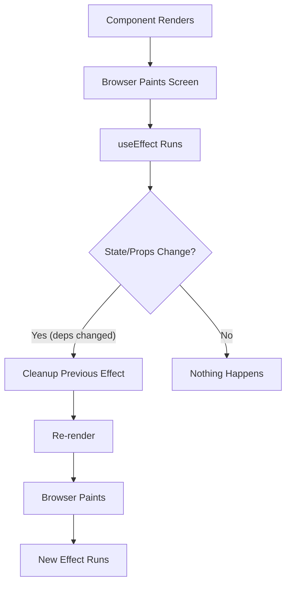

# useEffect Hook

## What Are Side Effects?

A **side effect** is anything that reaches outside the component's render cycle — anything beyond calculating and returning JSX.

**Analogy:** Think of a chef cooking a meal (rendering UI). Side effects are everything the chef does besides cooking: calling a supplier for ingredients (API calls), setting a kitchen timer (setTimeout), turning on background music (event listeners), or cleaning up the station after service (cleanup functions).

### Examples of Side Effects

- Fetching data from an API
- Subscribing to events (WebSocket, resize, scroll)
- Setting up timers (`setTimeout`, `setInterval`)
- Directly manipulating the DOM
- Writing to localStorage
- Logging analytics

---

## Why useEffect?

| Without useEffect                         | With useEffect                               |
| ----------------------------------------- | -------------------------------------------- |
| Side effects run during render (blocking) | Side effects run after render (non-blocking) |
| No way to clean up subscriptions          | Cleanup function prevents memory leaks       |
| Effects run on every render uncontrolled  | Dependency array gives precise control       |
| Data fetching mixed with UI logic         | Clear separation of concerns                 |

---

## useEffect Syntax

```jsx
import { useEffect } from "react";

useEffect(() => {
  // Effect code — runs AFTER the component renders

  return () => {
    // Cleanup code (optional) — runs before next effect or on unmount
  };
}, [dependencies]); // Dependency array — controls WHEN the effect re-runs
```

### When It Runs



---

## The Dependency Array

The dependency array is the **most important** part of `useEffect` — it tells React when to re-run the effect.

### Three Modes

```jsx
// 1. No dependency array — runs after EVERY render
useEffect(() => {
  console.log("Runs after every single render");
});

// 2. Empty array [] — runs ONCE on mount, cleans up on unmount
useEffect(() => {
  console.log("Runs once after first render");
  return () => console.log("Cleanup on unmount");
}, []);

// 3. With dependencies — runs on mount + whenever any dependency changes
useEffect(() => {
  console.log(`userId changed to ${userId}`);
  fetchUser(userId);
}, [userId]); // Re-runs only when userId changes
```

### Comparison Table

| Dependency Array | Runs When                         | Use Case                           |
| ---------------- | --------------------------------- | ---------------------------------- |
| Not provided     | After every render                | Rarely wanted — usually a mistake  |
| `[]`             | Once on mount                     | Setup subscriptions, initial fetch |
| `[a, b]`         | On mount + when `a` or `b` change | Fetch data when params change      |

---

## Cleanup Function

The cleanup function prevents **memory leaks** by undoing whatever the effect set up. It runs:

1. Before the effect re-runs (when dependencies change).
2. When the component unmounts (removed from the tree).

### Timer Cleanup

```jsx
function CountdownTimer({ seconds }) {
  const [remaining, setRemaining] = useState(seconds);

  useEffect(() => {
    const intervalId = setInterval(() => {
      setRemaining((prev) => {
        if (prev <= 0) return 0;
        return prev - 1;
      });
    }, 1000);

    // Cleanup: clear the interval when component unmounts or seconds changes
    return () => clearInterval(intervalId);
  }, [seconds]);

  return <p>Time left: {remaining}s</p>;
}
```

### Event Listener Cleanup

```jsx
function WindowSize() {
  const [size, setSize] = useState({
    width: window.innerWidth,
    height: window.innerHeight,
  });

  useEffect(() => {
    const handleResize = () => {
      setSize({ width: window.innerWidth, height: window.innerHeight });
    };

    window.addEventListener("resize", handleResize);

    // Cleanup: remove the listener
    return () => window.removeEventListener("resize", handleResize);
  }, []); // Empty array — setup once, cleanup on unmount

  return (
    <p>
      {size.width} × {size.height}
    </p>
  );
}
```

### WebSocket / Subscription Cleanup

```jsx
function ChatRoom({ roomId }) {
  const [messages, setMessages] = useState([]);

  useEffect(() => {
    const connection = createConnection(roomId);
    connection.on("message", (msg) => {
      setMessages((prev) => [...prev, msg]);
    });
    connection.connect();

    return () => {
      connection.disconnect(); // Clean up old connection
    };
  }, [roomId]); // Reconnect when room changes

  return (
    <ul>
      {messages.map((msg, i) => (
        <li key={i}>{msg}</li>
      ))}
    </ul>
  );
}
```

---

## Fetching Data with useEffect

```jsx
function UserProfile({ userId }) {
  const [user, setUser] = useState(null);
  const [loading, setLoading] = useState(true);
  const [error, setError] = useState(null);

  useEffect(() => {
    let isCancelled = false; // Prevent state update on unmounted component

    async function fetchUser() {
      setLoading(true);
      setError(null);

      try {
        const response = await fetch(`/api/users/${userId}`);
        if (!response.ok) throw new Error("Failed to fetch");
        const data = await response.json();

        if (!isCancelled) {
          setUser(data);
        }
      } catch (err) {
        if (!isCancelled) {
          setError(err.message);
        }
      } finally {
        if (!isCancelled) {
          setLoading(false);
        }
      }
    }

    fetchUser();

    return () => {
      isCancelled = true; // Cancel if userId changes before fetch completes
    };
  }, [userId]);

  if (loading) return <p>Loading...</p>;
  if (error) return <p>Error: {error}</p>;
  return <h1>{user.name}</h1>;
}
```

### Using AbortController (Modern Approach)

```jsx
useEffect(() => {
  const controller = new AbortController();

  async function fetchData() {
    try {
      const res = await fetch(`/api/users/${userId}`, {
        signal: controller.signal,
      });
      const data = await res.json();
      setUser(data);
    } catch (err) {
      if (err.name !== "AbortError") {
        setError(err.message);
      }
    }
  }

  fetchData();

  return () => controller.abort(); // Cancels the HTTP request
}, [userId]);
```

---

## Common Patterns

### Document Title Update

```jsx
function PageTitle({ title }) {
  useEffect(() => {
    document.title = title;
  }, [title]);

  return <h1>{title}</h1>;
}
```

### localStorage Sync

```jsx
function useLocalStorage(key, initialValue) {
  const [value, setValue] = useState(() => {
    const stored = localStorage.getItem(key);
    return stored ? JSON.parse(stored) : initialValue;
  });

  useEffect(() => {
    localStorage.setItem(key, JSON.stringify(value));
  }, [key, value]);

  return [value, setValue];
}
```

### Debounced Search

```jsx
function SearchInput() {
  const [query, setQuery] = useState("");
  const [results, setResults] = useState([]);

  useEffect(() => {
    if (!query.trim()) {
      setResults([]);
      return;
    }

    const timeoutId = setTimeout(() => {
      fetch(`/api/search?q=${query}`)
        .then((res) => res.json())
        .then((data) => setResults(data));
    }, 500); // Wait 500ms after user stops typing

    return () => clearTimeout(timeoutId); // Cancel if user types again
  }, [query]);

  return (
    <div>
      <input value={query} onChange={(e) => setQuery(e.target.value)} />
      <ul>
        {results.map((item) => (
          <li key={item.id}>{item.name}</li>
        ))}
      </ul>
    </div>
  );
}
```

---

## useEffect vs Event Handlers

Not everything needs `useEffect`. Some logic belongs in event handlers instead.

| Use useEffect                             | Use Event Handler                                   |
| ----------------------------------------- | --------------------------------------------------- |
| React to state/prop changes (synchronize) | Respond to user actions (button click, form submit) |
| Set up subscriptions                      | Navigate on form submit                             |
| Sync with external systems                | Send analytics on button click                      |
| Fetch data when a dependency changes      | POST data on form submit                            |

```jsx
// ❌ Unnecessary useEffect — this should be an event handler
function Form() {
  const [data, setData] = useState("");
  const [submitted, setSubmitted] = useState(false);

  useEffect(() => {
    if (submitted) {
      fetch("/api/submit", { method: "POST", body: data });
    }
  }, [submitted, data]);

  return <button onClick={() => setSubmitted(true)}>Submit</button>;
}

// ✅ Just use the event handler directly
function Form() {
  const [data, setData] = useState("");

  const handleSubmit = async () => {
    await fetch("/api/submit", { method: "POST", body: data });
  };

  return <button onClick={handleSubmit}>Submit</button>;
}
```

---

## Best Practices

1. **Always include cleanup** for subscriptions, timers, and event listeners — prevents memory leaks.
2. **Use AbortController** for fetch requests that may become stale.
3. **Keep effects focused** — one effect per concern. Don't combine unrelated logic in a single useEffect.
4. **Include all dependencies** that are read inside the effect — the ESLint plugin (`react-hooks/exhaustive-deps`) catches missing ones.
5. **Avoid unnecessary effects** — if you're transforming data for display, do it during render, not in an effect.
6. **Don't lie about dependencies** — omitting a dependency to "prevent re-runs" causes stale data bugs. Fix the root cause instead.
7. **Consider custom hooks** for reusable effect patterns (e.g., `useFetch`, `useLocalStorage`, `useWindowSize`).

---

## Common Mistakes

| Mistake                                   | Why It's Wrong                                                         | Fix                                       |
| ----------------------------------------- | ---------------------------------------------------------------------- | ----------------------------------------- |
| Infinite loop: setting state without deps | Effect → setState → re-render → effect → ...                           | Add a dependency array                    |
| Missing dependency in array               | Effect uses stale values from an old closure                           | Add the dependency (or restructure)       |
| Async function as effect directly         | `useEffect(async () => ...)` returns a Promise, not a cleanup function | Define async function inside and call it  |
| Not cleaning up subscriptions             | Memory leaks — listeners pile up                                       | Return a cleanup function                 |
| Fetching without cancellation             | State updates on unmounted components                                  | Use `isCancelled` flag or AbortController |
| Using effect for derived state            | Over-complicates code                                                  | Compute during render instead             |

### The Async Mistake in Detail

```jsx
// ❌ WRONG — async returns a Promise, not a cleanup function
useEffect(async () => {
  const data = await fetchData();
  setData(data);
}, []);

// ✅ CORRECT — define async inside and call it
useEffect(() => {
  async function loadData() {
    const data = await fetchData();
    setData(data);
  }
  loadData();
}, []);
```

---

## Summary

- **Side effects** are operations that reach outside the component (API calls, subscriptions, DOM manipulation).
- `useEffect` runs **after render** — it does not block the browser from painting.
- The **dependency array** controls when the effect re-runs: `[]` = once, `[deps]` = when deps change, none = every render.
- Always **clean up** subscriptions, timers, and listeners to prevent memory leaks.
- Use **AbortController** or `isCancelled` flags for data fetching to handle component unmount.
- Not everything needs an effect — user-triggered actions belong in **event handlers**.
- Keep effects **focused and small** — one concern per `useEffect`.
