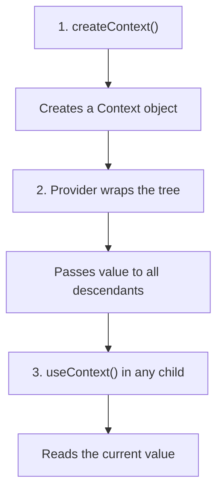

# useContext & Context API

## The Props Drilling Problem (Recap)

When a deeply nested component needs data from a distant ancestor, every component in between must forward props it doesn't even use.

```
App (has user data)
 └── Layout           ← passes user (doesn't use it)
      └── Sidebar     ← passes user (doesn't use it)
           └── UserInfo  ← finally uses user
```

**Analogy:** Props drilling is like passing a note in class through 5 students who don't care about it — just to reach the person at the back. Context is like the teacher announcing it to the whole class at once — whoever needs it, listens.

---

## Why Context API?

| Props Drilling                                   | Context API                            |
| ------------------------------------------------ | -------------------------------------- |
| Every intermediate component must forward props  | Components access shared data directly |
| Adding a new prop means changing many files      | Only change the provider and consumer  |
| Components become coupled to data they don't use | Clean separation of concerns           |
| Hard to refactor                                 | Easy to restructure the tree           |

---

## How Context Works — Three Steps



---

## Step 1: createContext()

```jsx
import { createContext } from "react";

// Create with a default value (used if no Provider above in tree)
const ThemeContext = createContext("light");
const UserContext = createContext(null);
const LanguageContext = createContext("en");
```

The default value is a **fallback** — it's only used if a component calls `useContext(ThemeContext)` without a `ThemeContext.Provider` ancestor.

---

## Step 2: Context.Provider with value Prop

Wrap the part of your component tree that needs access to the data:

```jsx
import { useState } from "react";
import { ThemeContext } from "./ThemeContext";

function App() {
  const [theme, setTheme] = useState("light");

  return (
    // Everything inside this Provider can access { theme, setTheme }
    <ThemeContext.Provider value={{ theme, setTheme }}>
      <Header />
      <Main />
      <Footer />
    </ThemeContext.Provider>
  );
}
```

- The `value` prop is what consumers receive.
- When `value` changes, all consumers re-render.
- You can nest providers — the closest one wins.

---

## Step 3: useContext() to Consume

Any component inside the Provider can read the value directly — no prop passing needed:

```jsx
import { useContext } from "react";
import { ThemeContext } from "./ThemeContext";

function Header() {
  const { theme, setTheme } = useContext(ThemeContext);

  return (
    <header className={`header-${theme}`}>
      <h1>My App</h1>
      <button onClick={() => setTheme(theme === "light" ? "dark" : "light")}>
        Toggle Theme ({theme})
      </button>
    </header>
  );
}

// Works at ANY depth — no props drilling
function DeepNestedButton() {
  const { theme } = useContext(ThemeContext);
  return <button className={`btn-${theme}`}>Click Me</button>;
}
```

---

## Complete Example: Theme Context

```jsx
// ThemeContext.js
import { createContext, useContext, useState } from "react";

const ThemeContext = createContext();

export function ThemeProvider({ children }) {
  const [theme, setTheme] = useState("light");

  const toggleTheme = () => {
    setTheme((prev) => (prev === "light" ? "dark" : "light"));
  };

  return (
    <ThemeContext.Provider value={{ theme, toggleTheme }}>
      {children}
    </ThemeContext.Provider>
  );
}

// Custom hook for cleaner consumption
export function useTheme() {
  const context = useContext(ThemeContext);
  if (!context) {
    throw new Error("useTheme must be used within a ThemeProvider");
  }
  return context;
}
```

```jsx
// App.jsx
import { ThemeProvider } from "./ThemeContext";

function App() {
  return (
    <ThemeProvider>
      <Header />
      <Main />
    </ThemeProvider>
  );
}
```

```jsx
// Any component
import { useTheme } from "./ThemeContext";

function Card({ title, content }) {
  const { theme } = useTheme();

  return (
    <div className={`card card-${theme}`}>
      <h2>{title}</h2>
      <p>{content}</p>
    </div>
  );
}
```

---

## Patterns: Real-World Context Examples

### Authentication Context

```jsx
// AuthContext.js
import { createContext, useContext, useState, useEffect } from "react";

const AuthContext = createContext();

export function AuthProvider({ children }) {
  const [user, setUser] = useState(null);
  const [loading, setLoading] = useState(true);

  useEffect(() => {
    // Check if user is already logged in
    const token = localStorage.getItem("token");
    if (token) {
      fetchUser(token)
        .then(setUser)
        .finally(() => setLoading(false));
    } else {
      setLoading(false);
    }
  }, []);

  const login = async (email, password) => {
    const response = await fetch("/api/login", {
      method: "POST",
      body: JSON.stringify({ email, password }),
    });
    const data = await response.json();
    localStorage.setItem("token", data.token);
    setUser(data.user);
  };

  const logout = () => {
    localStorage.removeItem("token");
    setUser(null);
  };

  return (
    <AuthContext.Provider value={{ user, login, logout, loading }}>
      {children}
    </AuthContext.Provider>
  );
}

export function useAuth() {
  const context = useContext(AuthContext);
  if (!context) throw new Error("useAuth must be used within AuthProvider");
  return context;
}
```

```jsx
// Usage in any component
function Navbar() {
  const { user, logout } = useAuth();

  return (
    <nav>
      {user ? (
        <>
          <span>Welcome, {user.name}</span>
          <button onClick={logout}>Logout</button>
        </>
      ) : (
        <Link to="/login">Login</Link>
      )}
    </nav>
  );
}
```

### Language / i18n Context

```jsx
const LanguageContext = createContext();

const translations = {
  en: { greeting: "Hello", farewell: "Goodbye" },
  hi: { greeting: "नमस्ते", farewell: "अलविदा" },
  es: { greeting: "Hola", farewell: "Adiós" },
};

export function LanguageProvider({ children }) {
  const [lang, setLang] = useState("en");

  const t = (key) => translations[lang][key] || key;

  return (
    <LanguageContext.Provider value={{ lang, setLang, t }}>
      {children}
    </LanguageContext.Provider>
  );
}

export function useLanguage() {
  return useContext(LanguageContext);
}

// Usage
function Greeting() {
  const { t, lang, setLang } = useLanguage();

  return (
    <div>
      <p>{t("greeting")}!</p>
      <select value={lang} onChange={(e) => setLang(e.target.value)}>
        <option value="en">English</option>
        <option value="hi">Hindi</option>
        <option value="es">Spanish</option>
      </select>
    </div>
  );
}
```

---

## When to Use Context vs Redux

| Use Context When                                  | Use Redux / Zustand When                        |
| ------------------------------------------------- | ----------------------------------------------- |
| Data is relatively simple (theme, auth, language) | Complex state with many actions and reducers    |
| Few state updates (theme toggle, login/logout)    | Frequent updates (real-time data, forms)        |
| Small to medium apps                              | Large apps with many developers                 |
| Read-heavy, write-infrequent data                 | Complex state transitions and middleware needed |
| You want zero extra dependencies                  | You need devtools, time-travel debugging        |

**Rule of thumb:** Start with Context. If you find yourself with 5+ contexts or complex update logic, consider a state library.

---

## Performance Concern: Consumer Re-renders

**Problem:** When the Provider's `value` changes, **ALL** consumers re-render — even if they only use a portion of the value.

```jsx
// ❌ Problem: changing theme re-renders components that only use user
function App() {
  const [theme, setTheme] = useState("light");
  const [user, setUser] = useState(null);

  return (
    <AppContext.Provider value={{ theme, setTheme, user, setUser }}>
      <UserProfile /> {/* Re-renders when theme changes! */}
      <ThemeToggle /> {/* Re-renders when user changes! */}
    </AppContext.Provider>
  );
}
```

---

## Splitting Contexts to Avoid Unnecessary Re-renders

**Solution:** Separate concerns into different contexts:

```jsx
// ✅ Split into separate contexts
const ThemeContext = createContext();
const UserContext = createContext();

function App() {
  const [theme, setTheme] = useState("light");
  const [user, setUser] = useState(null);

  return (
    <ThemeContext.Provider value={{ theme, setTheme }}>
      <UserContext.Provider value={{ user, setUser }}>
        <UserProfile /> {/* Only re-renders when user changes */}
        <ThemeToggle /> {/* Only re-renders when theme changes */}
      </UserContext.Provider>
    </ThemeContext.Provider>
  );
}

function UserProfile() {
  const { user } = useContext(UserContext); // Only subscribes to user
  return <p>{user?.name}</p>;
}

function ThemeToggle() {
  const { theme, setTheme } = useContext(ThemeContext); // Only subscribes to theme
  return (
    <button onClick={() => setTheme(theme === "light" ? "dark" : "light")}>
      {theme}
    </button>
  );
}
```

### Split State from Dispatch

Another pattern — separate the read (state) from the write (dispatch):

```jsx
const TodoStateContext = createContext();
const TodoDispatchContext = createContext();

function TodoProvider({ children }) {
  const [todos, dispatch] = useReducer(todoReducer, []);

  return (
    <TodoStateContext.Provider value={todos}>
      <TodoDispatchContext.Provider value={dispatch}>
        {children}
      </TodoDispatchContext.Provider>
    </TodoStateContext.Provider>
  );
}

// Components that only ADD todos don't re-render when list changes
function AddTodo() {
  const dispatch = useContext(TodoDispatchContext);
  // ...
}

// Components that only DISPLAY todos don't re-render on dispatch changes
function TodoList() {
  const todos = useContext(TodoStateContext);
  // ...
}
```

### Memoizing the Provider Value

Prevent unnecessary re-renders when the parent re-renders but context value hasn't changed:

```jsx
function ThemeProvider({ children }) {
  const [theme, setTheme] = useState("light");

  // ✅ Memoize the value object to maintain referential equality
  const value = useMemo(() => ({ theme, setTheme }), [theme]);

  return (
    <ThemeContext.Provider value={value}>{children}</ThemeContext.Provider>
  );
}
```

---

## Best Practices

1. **Create custom hooks** (`useTheme`, `useAuth`) for each context — cleaner API and error handling.
2. **Split unrelated data** into separate contexts to prevent unnecessary re-renders.
3. **Memoize provider value** with `useMemo` to avoid creating new object references on every render.
4. **Throw errors** in custom hooks when used outside the Provider — catches mistakes early.
5. **Keep context values focused** — don't dump everything into one giant context.
6. **Place Providers as low as possible** in the tree — don't wrap the entire app if only one subtree needs it.
7. **Use Context for read-heavy, write-infrequent data** — for frequent updates, consider a state library.

---

## Common Mistakes

| Mistake                                                     | Why It's Wrong                                                   |
| ----------------------------------------------------------- | ---------------------------------------------------------------- |
| Putting everything in one context                           | Every consumer re-renders on any change                          |
| Creating a new object as `value` on every render            | All consumers re-render even if data hasn't changed — memoize it |
| Using Context for highly dynamic, frequently updating state | Causes excessive re-renders — use Redux/Zustand or refs          |
| Forgetting to wrap components with the Provider             | Components get the default value (usually `undefined`) silently  |
| Not providing a default value to `createContext`            | Makes it hard to test components in isolation                    |
| Using Context when simple composition would work            | Over-engineering — sometimes passing children or props is enough |

---

## Summary

- **Context API** eliminates props drilling by providing a way to share values across the component tree.
- Three steps: **`createContext()`** → **`Provider`** (wraps tree, sets value) → **`useContext()`** (reads value).
- Create **custom hooks** (`useTheme`, `useAuth`) for cleaner consumption and error handling.
- **Performance:** All consumers re-render when the Provider value changes — split contexts and memoize values.
- Use Context for **global, infrequent-change data** (theme, auth, language). For complex/frequent updates, reach for state management libraries.
- Always **separate concerns** — one context per domain (theme, auth, language).
