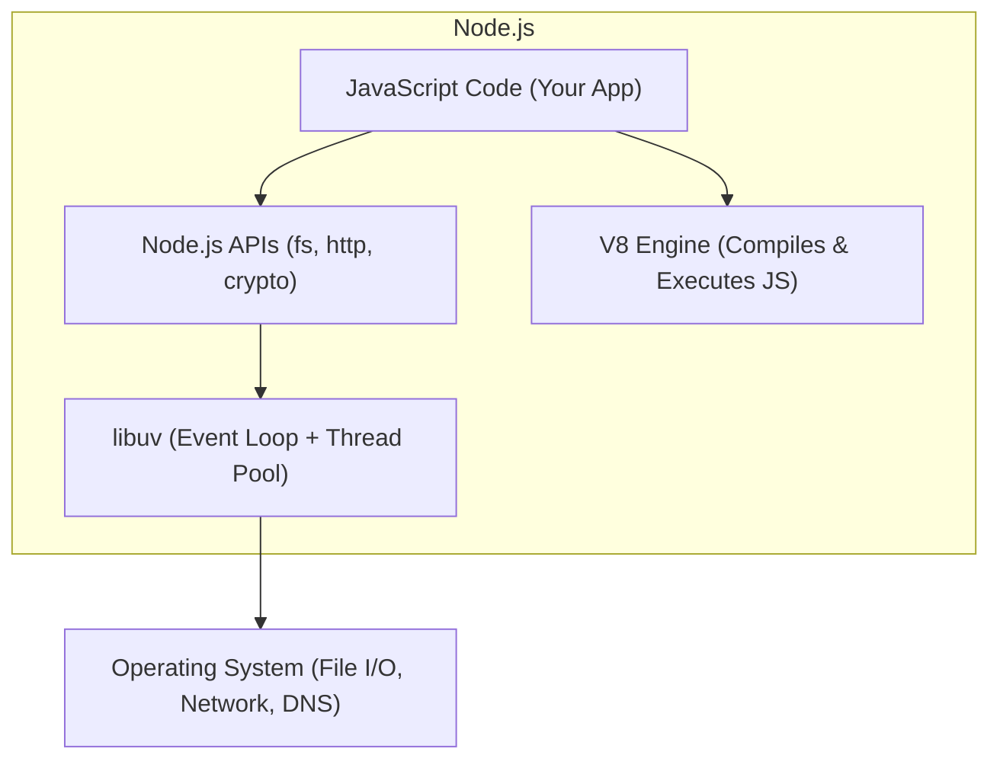

# Introduction to Node.js

## What Is Node.js?

Node.js is a **JavaScript runtime** built on Chrome's V8 engine that lets you run JavaScript outside the browser — on servers, desktops, and IoT devices. It is event-driven, non-blocking, and designed for building scalable network applications.

**Analogy:** If the browser is a theme park where JavaScript entertains visitors (users), Node.js is the backstage machinery — handling logistics, managing resources, and keeping everything running behind the scenes.

---

## Why Node.js?

| Feature                | Benefit                                                   |
| ---------------------- | --------------------------------------------------------- |
| Single language (JS)   | Same language for frontend and backend                    |
| Non-blocking I/O       | Handles thousands of concurrent connections               |
| Event-driven           | Efficient for real-time applications (chat, gaming)       |
| npm ecosystem          | Largest package registry in the world (~2M packages)      |
| Fast startup           | V8 JIT compilation — faster than traditional interpreters |
| Microservices friendly | Lightweight, fast boot — ideal for containerized apps     |

---

## Node.js Architecture



- **V8** — compiles JavaScript to machine code.
- **libuv** — handles async I/O, the event loop, and a thread pool for heavy operations.
- **Node APIs** — JavaScript wrappers around C/C++ system operations.

### Single-Threaded + Event Loop

Node.js runs JavaScript on a **single thread** but delegates I/O operations to the OS (which uses multiple threads). The event loop coordinates callbacks when operations complete.

```javascript
// This does NOT block the thread
const fs = require("fs");

fs.readFile("large-file.txt", (err, data) => {
  console.log("File read complete");
});

console.log("This runs immediately — not waiting for file read");
```

---

## Node.js vs Browser JavaScript

| Feature         | Browser                 | Node.js                    |
| --------------- | ----------------------- | -------------------------- |
| Global object   | `window`                | `global` / `globalThis`    |
| DOM access      | ✅ `document`, `window` | ❌ No DOM                  |
| File system     | ❌ (sandboxed)          | ✅ `fs` module             |
| HTTP server     | ❌ (client only)        | ✅ `http` module           |
| Modules         | ES Modules (`import`)   | CommonJS (`require`) + ESM |
| Package manager | N/A                     | npm / yarn / pnpm          |

---

## Installation & First Program

### Install Node.js

Download LTS from [https://nodejs.org](https://nodejs.org). Verify:

```bash
node --version   # v20.x.x
npm --version    # 10.x.x
```

### Node.js REPL

```bash
$ node
> 2 + 2
4
> "hello".toUpperCase()
'HELLO'
> .exit
```

### First Program

```javascript
// hello.js
const os = require("os");

console.log(`Hello from Node.js!`);
console.log(`Platform: ${os.platform()}`);
console.log(`CPU Cores: ${os.cpus().length}`);
console.log(`Free Memory: ${(os.freemem() / 1024 / 1024).toFixed(0)} MB`);
```

```bash
node hello.js
```

---

## CommonJS vs ES Modules

### CommonJS (Traditional Node.js)

```javascript
// math.js
function add(a, b) {
  return a + b;
}
function subtract(a, b) {
  return a - b;
}

module.exports = { add, subtract };

// app.js
const { add, subtract } = require("./math");
console.log(add(2, 3)); // 5
```

### ES Modules (Modern)

```javascript
// math.mjs (or .js with "type": "module" in package.json)
export function add(a, b) {
  return a + b;
}
export function subtract(a, b) {
  return a - b;
}

// app.mjs
import { add, subtract } from "./math.mjs";
console.log(add(2, 3)); // 5
```

To use ESM in Node.js, add to `package.json`:

```json
{ "type": "module" }
```

---

## Core Modules Overview

| Module   | Purpose                           |
| -------- | --------------------------------- |
| `fs`     | File system (read, write, delete) |
| `path`   | File path utilities               |
| `http`   | Create HTTP servers and clients   |
| `os`     | Operating system information      |
| `events` | Event emitter pattern             |
| `crypto` | Cryptographic functions           |
| `url`    | URL parsing                       |
| `stream` | Handle streaming data             |

---

## npm (Node Package Manager)

```bash
# Initialize a project
npm init -y

# Install a package
npm install express

# Install as dev dependency
npm install --save-dev nodemon

# Install globally
npm install -g typescript

# Run scripts defined in package.json
npm run dev
npm start
npm test
```

### package.json Scripts

```json
{
  "scripts": {
    "start": "node src/index.js",
    "dev": "nodemon src/index.js",
    "build": "tsc",
    "test": "jest"
  }
}
```

---

## The `process` Object

```javascript
// Environment variables
console.log(process.env.NODE_ENV); // "development" or "production"

// Command line arguments
console.log(process.argv); // [node path, file path, ...args]

// Exit the process
process.exit(0); // 0 = success, 1 = failure

// Current working directory
console.log(process.cwd());

// Memory usage
console.log(process.memoryUsage());
```

---

## Summary

- Node.js runs JavaScript on the server using Chrome's V8 engine.
- It is single-threaded but handles concurrency through an event loop and non-blocking I/O.
- CommonJS (`require`/`module.exports`) is traditional; ES Modules (`import`/`export`) are the modern standard.
- npm manages packages and scripts — `package.json` is the project manifest.
- Core modules (`fs`, `http`, `path`, `os`) provide system-level capabilities without external dependencies.
- Node.js is ideal for I/O-heavy applications (APIs, real-time apps, microservices) but less suited for CPU-heavy computation.
