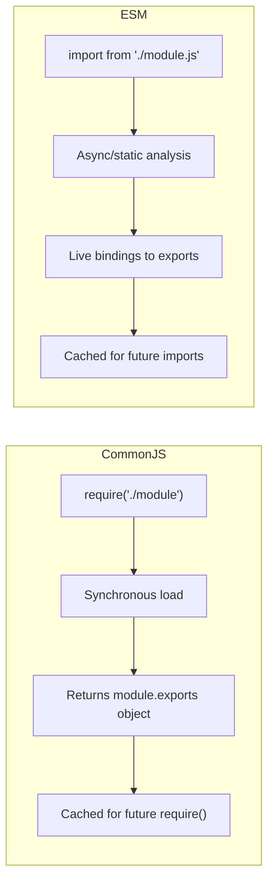

# CommonJS vs ES Modules

## What Are Module Systems?

Module systems let you split code into separate files, export functionality from one file, and import it into another. JavaScript has two competing systems:

- **CommonJS (CJS):** The original Node.js module system — uses `require()` and `module.exports`.
- **ES Modules (ESM):** The official JavaScript standard — uses `import` and `export`.

**Analogy:** Think of modules like shipping containers. CommonJS is like a delivery truck that must arrive and be fully unpacked before you can see what is inside (synchronous). ES Modules are like a manifest sent ahead of the delivery — you know what is coming before it arrives (statically analyzable, async-ready).

---

## Why This Matters

- Node.js supports both systems, but they behave differently.
- Libraries are increasingly shipping ESM-only — you need to know how to consume them.
- Understanding the differences prevents confusing errors like `ERR_REQUIRE_ESM` or `SyntaxError: Cannot use import statement`.
- Bundlers (Webpack, Vite, Rollup) leverage ESM's static structure for tree-shaking.

---

## CommonJS (CJS)

### Basic Syntax

```javascript
// math.js — exporting
function add(a, b) {
  return a + b;
}

function subtract(a, b) {
  return a - b;
}

module.exports = { add, subtract };

// Or export individually:
// exports.add = add;
// exports.subtract = subtract;
```

```javascript
// app.js — importing
const { add, subtract } = require("./math");

console.log(add(2, 3)); // 5
console.log(subtract(5, 2)); // 3
```

### Default Export (Single Value)

```javascript
// logger.js
class Logger {
  log(msg) {
    console.log(`[LOG] ${msg}`);
  }
}

module.exports = Logger; // Export the class itself
```

```javascript
// app.js
const Logger = require("./logger");
const logger = new Logger();
logger.log("Hello"); // [LOG] Hello
```

### Key Characteristics

- `require()` is **synchronous** — blocks execution until the module is loaded.
- `module.exports` is an object by default — you can assign anything to it.
- `exports` is a shortcut reference to `module.exports` (but reassigning `exports =` breaks the link).
- Modules are **cached** after first load — subsequent `require()` calls return the same object.
- You can `require()` conditionally or dynamically (inside `if` statements, loops, etc.).

```javascript
// Dynamic/conditional require — valid in CJS
if (process.env.NODE_ENV === "production") {
  const productionConfig = require("./config.prod");
}

// Require inside a function — valid
function loadPlugin(name) {
  return require(`./plugins/${name}`);
}
```

---

## ES Modules (ESM)

### Basic Syntax

```javascript
// math.js — exporting
export function add(a, b) {
  return a + b;
}

export function subtract(a, b) {
  return a - b;
}
```

```javascript
// app.js — importing
import { add, subtract } from "./math.js"; // Note: file extension required in Node.js

console.log(add(2, 3)); // 5
console.log(subtract(5, 2)); // 3
```

### Default Export

```javascript
// logger.js
export default class Logger {
  log(msg) {
    console.log(`[LOG] ${msg}`);
  }
}
```

```javascript
// app.js
import Logger from "./logger.js"; // No braces for default import
const logger = new Logger();
```

### Named + Default Together

```javascript
// utils.js
export const VERSION = "1.0.0";
export function helper() {}

export default function main() {
  console.log("main function");
}
```

```javascript
// app.js
import main, { VERSION, helper } from "./utils.js";
```

### Renaming Imports

```javascript
import { add as sum, subtract as minus } from "./math.js";
sum(2, 3); // 5
```

### Import Everything (Namespace)

```javascript
import * as math from "./math.js";
math.add(2, 3); // 5
math.subtract(5, 2); // 3
```

### Key Characteristics

- `import`/`export` are **static** — must be at the top level (not inside if/else, loops, or functions).
- Imports are **hoisted** — they run before any other code in the file.
- Loading is **asynchronous** under the hood.
- Imports are **live bindings** — if the exporting module changes a value, importers see the change.
- File extensions are **required** in Node.js ESM (`.js`, `.mjs`).
- `this` is `undefined` at the module top level (not `globalThis`).

---

## Enabling ESM in Node.js

### Option 1: `"type": "module"` in package.json

```json
{
  "name": "my-app",
  "version": "1.0.0",
  "type": "module"
}
```

Now all `.js` files in this package are treated as ES Modules.

### Option 2: `.mjs` File Extension

```
project/
├── utils.mjs    ← Always ESM regardless of package.json
├── helper.cjs   ← Always CJS regardless of package.json
└── app.js       ← Depends on "type" in package.json
```

### Summary of Extensions

| Extension | Module System     | When to Use                          |
| --------- | ----------------- | ------------------------------------ |
| `.js`     | Depends on `type` | Default — controlled by package.json |
| `.mjs`    | Always ESM        | ESM file in a CJS project            |
| `.cjs`    | Always CommonJS   | CJS file in an ESM project           |

---

## Side-by-Side Comparison



| Feature             | CommonJS                       | ES Modules                               |
| ------------------- | ------------------------------ | ---------------------------------------- |
| Syntax              | `require()` / `module.exports` | `import` / `export`                      |
| Loading             | Synchronous                    | Asynchronous                             |
| Evaluation          | Runtime (dynamic)              | Parse time (static)                      |
| Conditional imports | ✅ Yes                         | ❌ No (use dynamic `import()`)           |
| Tree-shaking        | ❌ Difficult                   | ✅ Easy (static analysis)                |
| Top-level await     | ❌ No                          | ✅ Yes                                   |
| File extensions     | Optional (`.js` assumed)       | Required in Node.js                      |
| `this` at top level | `module.exports`               | `undefined`                              |
| Live bindings       | ❌ No (copies of values)       | ✅ Yes (live references)                 |
| `__dirname`         | ✅ Available                   | ❌ Not available (use `import.meta.url`) |
| `__filename`        | ✅ Available                   | ❌ Not available                         |

---

## Live Bindings vs Copies

### CommonJS: Exports are Copies

```javascript
// counter.js (CJS)
let count = 0;
function increment() {
  count++;
}
module.exports = { count, increment };
```

```javascript
// app.js (CJS)
const { count, increment } = require("./counter");
console.log(count); // 0
increment();
console.log(count); // 0 ← still 0! We got a copy, not a reference.
```

### ESM: Exports are Live Bindings

```javascript
// counter.js (ESM)
export let count = 0;
export function increment() {
  count++;
}
```

```javascript
// app.js (ESM)
import { count, increment } from "./counter.js";
console.log(count); // 0
increment();
console.log(count); // 1 ← updated! Live binding to the original variable.
```

---

## Dynamic Import (Works in Both)

When you need conditional or lazy loading in ESM:

```javascript
// Dynamic import — returns a Promise
async function loadModule(condition) {
  if (condition) {
    const { add } = await import("./math.js");
    return add(1, 2);
  }
}

// Top-level await (ESM only)
const { readFile } = await import("node:fs/promises");
```

---

## Interop: Using CJS in ESM and Vice Versa

### Importing CJS from ESM

```javascript
// legacy-lib.cjs
module.exports = { greet: (name) => `Hello, ${name}` };
```

```javascript
// app.js (ESM)
import legacyLib from "./legacy-lib.cjs"; // Default import gets module.exports
console.log(legacyLib.greet("World")); // Hello, World

// Named imports MAY work (Node.js attempts to detect them):
import { greet } from "./legacy-lib.cjs"; // Sometimes works, sometimes doesn't
```

### Importing ESM from CJS

You **cannot** use `require()` on ES Modules. You must use dynamic `import()`:

```javascript
// app.cjs (CommonJS)
// const esm = require('./esm-module.js'); // ❌ ERR_REQUIRE_ESM

// Must use dynamic import (returns a Promise):
async function main() {
  const { add } = await import("./esm-module.js");
  console.log(add(1, 2));
}

main();
```

---

## Replacing `__dirname` and `__filename` in ESM

```javascript
// CommonJS — these are available
console.log(__dirname); // /home/user/project
console.log(__filename); // /home/user/project/app.js

// ESM — use import.meta.url
import { fileURLToPath } from "node:url";
import { dirname } from "node:path";

const __filename = fileURLToPath(import.meta.url);
const __dirname = dirname(__filename);

console.log(__dirname); // /home/user/project
console.log(__filename); // /home/user/project/app.js
```

---

## Best Practices

1. **Use ESM for new projects** — it is the standard, supports tree-shaking, and enables top-level await.
2. **Set `"type": "module"` in package.json** — cleaner than renaming all files to `.mjs`.
3. **Always include file extensions in ESM imports** — Node.js requires them (unlike bundlers).
4. **Use `.cjs` for the rare CommonJS file in an ESM project** — e.g., config files that tools expect as CJS.
5. **Prefer named exports over default exports** — better autocomplete, easier refactoring, clearer imports.
6. **Use dynamic `import()` for conditional loading** — it works in both CJS and ESM contexts.
7. **Do not mix `exports.x` and `module.exports =`** — pick one pattern per file.

---

## Common Mistakes

| Mistake                                       | Why It Is Wrong                                       | Fix                                                     |
| --------------------------------------------- | ----------------------------------------------------- | ------------------------------------------------------- |
| Using `require()` in an ESM file              | `require` is not defined in ES Modules                | Use `import` or `createRequire` from `node:module`      |
| Forgetting file extensions in ESM imports     | Node.js does not resolve `.js` automatically in ESM   | Always write `import x from './file.js'`                |
| `require()` on an ESM package                 | CJS cannot synchronously load ESM                     | Use `await import()` instead                            |
| Reassigning `exports` directly                | `exports = {}` breaks the link to `module.exports`    | Use `module.exports = {}` instead                       |
| Assuming CJS named imports always work in ESM | Node.js static analysis of CJS exports is not perfect | Use default import and destructure                      |
| Using `__dirname` in ESM                      | Not available in ES Modules                           | Use `import.meta.url` + `fileURLToPath`                 |
| Default-exporting an object in ESM            | Defeats tree-shaking; use named exports instead       | `export function x()` instead of `export default { x }` |

---

## Summary

- **CommonJS:** `require()`/`module.exports` — synchronous, dynamic, copies values, supports `__dirname`.
- **ES Modules:** `import`/`export` — asynchronous, static, live bindings, tree-shakeable, standard JavaScript.
- Enable ESM via `"type": "module"` in package.json or use `.mjs` extensions.
- Use `.cjs` extension when you need CommonJS in an ESM project.
- CJS can import ESM only through dynamic `import()`. ESM can import CJS via default import.
- ESM is the future — use it for new projects. Know CJS for maintaining legacy code and understanding older packages.
- Named exports > default exports for better tooling, clearer code, and tree-shaking.
