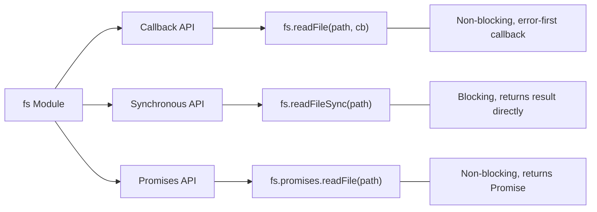

# Node.js File System (fs) Module

## What Is the fs Module?

The `fs` (file system) module is a built-in Node.js module that provides functions to interact with the file system — reading, writing, deleting, and manipulating files and directories. It is one of the core reasons Node.js can be used as a server-side language.

**Analogy:** The `fs` module is like having a file manager assistant. You can ask it to read documents, create new ones, rename them, delete them, or check if they exist — all programmatically. It comes in three flavors: callback-based (original), synchronous (blocking), and promise-based (modern).

---

## Why This Matters

- Almost every backend application reads config files, writes logs, or processes uploads.
- Understanding sync vs async file operations is critical for Node.js performance.
- The promises API (`fs/promises`) is the modern approach you should default to.
- Streams are essential for handling large files without running out of memory.

---

## Three API Styles



```javascript
// All three read the same file:
const fs = require("node:fs");
const fsPromises = require("node:fs/promises");

// 1. Callback (original)
fs.readFile("./data.txt", "utf-8", (err, data) => {
  if (err) throw err;
  console.log(data);
});

// 2. Synchronous (blocking)
const data = fs.readFileSync("./data.txt", "utf-8");
console.log(data);

// 3. Promises (modern — recommended)
const data2 = await fsPromises.readFile("./data.txt", "utf-8");
console.log(data2);
```

---

## Reading Files

### `readFile` — Read Entire File into Memory

```javascript
import { readFile } from "node:fs/promises";

// As string (specify encoding)
const content = await readFile("./config.json", "utf-8");
const config = JSON.parse(content);

// As Buffer (no encoding specified)
const buffer = await readFile("./image.png");
console.log(buffer.length); // size in bytes
```

### `readFileSync` — Blocking Read

```javascript
import { readFileSync } from "node:fs";

// Use only at startup (config loading, etc.) — never in request handlers
const config = JSON.parse(readFileSync("./config.json", "utf-8"));
```

### When to Use Each

| Method         | Use When                                 | Avoid When                            |
| -------------- | ---------------------------------------- | ------------------------------------- |
| `readFile`     | Reading small-medium files in async code | File is very large (use streams)      |
| `readFileSync` | App startup, CLI scripts, one-time reads | Inside request handlers or loops      |
| Streams        | Large files, real-time processing        | You need the full content immediately |

---

## Writing Files

### `writeFile` — Write (Overwrites Existing)

```javascript
import { writeFile } from "node:fs/promises";

// Write a string
await writeFile("./output.txt", "Hello, World!", "utf-8");

// Write JSON
const data = { name: "Alice", age: 30 };
await writeFile("./user.json", JSON.stringify(data, null, 2), "utf-8");

// Write with options
await writeFile("./log.txt", "Entry\n", {
  encoding: "utf-8",
  flag: "w", // 'w' = overwrite (default), 'a' = append
  mode: 0o644, // file permissions
});
```

### `appendFile` — Add to End of File

```javascript
import { appendFile } from "node:fs/promises";

await appendFile("./log.txt", `[${new Date().toISOString()}] Server started\n`);
await appendFile(
  "./log.txt",
  `[${new Date().toISOString()}] Request received\n`,
);
```

### `writeFileSync` — Blocking Write

```javascript
import { writeFileSync } from "node:fs";

writeFileSync("./output.txt", "Blocking write");
```

---

## Deleting Files

### `unlink` — Delete a File

```javascript
import { unlink } from "node:fs/promises";

await unlink("./temp-file.txt");
// File is now deleted — no recycle bin, no undo
```

### `rm` — Delete File or Directory (Modern)

```javascript
import { rm } from "node:fs/promises";

// Delete a file
await rm("./temp.txt");

// Delete a directory and all contents (recursive)
await rm("./temp-folder", { recursive: true, force: true });
// force: true prevents errors if the path doesn't exist
```

---

## Working with Directories

### `mkdir` — Create Directory

```javascript
import { mkdir } from "node:fs/promises";

// Create a single directory
await mkdir("./logs");

// Create nested directories (like mkdir -p)
await mkdir("./data/users/avatars", { recursive: true });
```

### `readdir` — List Directory Contents

```javascript
import { readdir } from "node:fs/promises";

// Simple list of filenames
const files = await readdir("./src");
console.log(files); // ['index.js', 'utils.js', 'config']

// With file type info
const entries = await readdir("./src", { withFileTypes: true });
entries.forEach((entry) => {
  if (entry.isFile()) console.log(`File: ${entry.name}`);
  if (entry.isDirectory()) console.log(`Dir: ${entry.name}`);
});
```

### `rmdir` / `rm` — Remove Directory

```javascript
import { rmdir, rm } from "node:fs/promises";

// Remove empty directory
await rmdir("./empty-folder");

// Remove directory with contents (prefer rm over rmdir)
await rm("./folder-with-files", { recursive: true });
```

---

## Checking File Info

### `stat` — Get File Metadata

```javascript
import { stat } from "node:fs/promises";

const info = await stat("./package.json");
console.log(info.isFile()); // true
console.log(info.isDirectory()); // false
console.log(info.size); // file size in bytes
console.log(info.mtime); // last modified time
console.log(info.birthtime); // creation time
```

### `access` — Check If File Exists / Is Accessible

```javascript
import { access, constants } from "node:fs/promises";

async function fileExists(path) {
  try {
    await access(path, constants.F_OK);
    return true;
  } catch {
    return false;
  }
}

console.log(await fileExists("./config.json")); // true or false
```

---

## Renaming and Copying

```javascript
import { rename, copyFile } from "node:fs/promises";

// Rename (also moves files)
await rename("./old-name.txt", "./new-name.txt");
await rename("./file.txt", "./archive/file.txt"); // moves to archive/

// Copy
await copyFile("./source.txt", "./backup.txt");
```

---

## Watching Files for Changes

```javascript
import { watch } from "node:fs/promises";

// Watch a directory for changes
const watcher = watch("./src", { recursive: true });

for await (const event of watcher) {
  console.log(`${event.eventType}: ${event.filename}`);
  // "rename: newfile.js" or "change: index.js"
}
```

```javascript
// Callback-based watch (simpler for single file)
import { watchFile } from "node:fs";

watchFile("./config.json", (curr, prev) => {
  console.log("Config changed!");
  console.log(`Previous modified: ${prev.mtime}`);
  console.log(`Current modified: ${curr.mtime}`);
});
```

---

## Streams for Large Files

Reading an entire large file into memory will crash your app. Streams process data in chunks:

```javascript
import { createReadStream, createWriteStream } from "node:fs";

// Read a large file in chunks
const readStream = createReadStream("./large-file.csv", "utf-8");

readStream.on("data", (chunk) => {
  console.log(`Received ${chunk.length} bytes`);
  // Process chunk here
});

readStream.on("end", () => {
  console.log("Finished reading");
});

readStream.on("error", (err) => {
  console.error("Read error:", err.message);
});
```

### Piping Streams (Copy Large File)

```javascript
import { createReadStream, createWriteStream } from "node:fs";
import { pipeline } from "node:stream/promises";

// Efficiently copy a large file
await pipeline(
  createReadStream("./large-video.mp4"),
  createWriteStream("./backup-video.mp4"),
);
console.log("Copy complete");
```

### Line-by-Line Reading

```javascript
import { createReadStream } from "node:fs";
import { createInterface } from "node:readline";

const rl = createInterface({
  input: createReadStream("./large-log.txt"),
  crlfDelay: Infinity,
});

for await (const line of rl) {
  // Process each line without loading entire file
  if (line.includes("ERROR")) {
    console.log(line);
  }
}
```

---

## Path Module Integration

Always use the `path` module to construct file paths — it handles OS differences (Windows `\` vs Unix `/`):

```javascript
import { readFile, writeFile } from "node:fs/promises";
import path from "node:path";
import { fileURLToPath } from "node:url";

// Get current directory in ESM
const __dirname = path.dirname(fileURLToPath(import.meta.url));

// Build paths safely
const configPath = path.join(__dirname, "config", "settings.json");
const outputPath = path.resolve("output", "results.txt"); // absolute path

// Parse path components
const filePath = "/home/user/docs/report.pdf";
console.log(path.basename(filePath)); // "report.pdf"
console.log(path.extname(filePath)); // ".pdf"
console.log(path.dirname(filePath)); // "/home/user/docs"

// Read file using constructed path
const config = await readFile(configPath, "utf-8");
```

---

## Practical Example: Simple Logger

```javascript
import { appendFile, mkdir } from "node:fs/promises";
import path from "node:path";

class FileLogger {
  constructor(logDir = "./logs") {
    this.logDir = logDir;
    this.initialized = this.init();
  }

  async init() {
    await mkdir(this.logDir, { recursive: true });
  }

  async log(level, message) {
    await this.initialized;
    const timestamp = new Date().toISOString();
    const fileName = `${timestamp.split("T")[0]}.log`; // 2024-01-15.log
    const filePath = path.join(this.logDir, fileName);
    const entry = `[${timestamp}] [${level.toUpperCase()}] ${message}\n`;

    await appendFile(filePath, entry, "utf-8");
  }

  info(msg) {
    return this.log("info", msg);
  }
  error(msg) {
    return this.log("error", msg);
  }
  warn(msg) {
    return this.log("warn", msg);
  }
}

// Usage
const logger = new FileLogger();
await logger.info("Server started on port 3000");
await logger.error("Database connection failed");
```

---

## Practical Example: Recursive Directory Listing

```javascript
import { readdir, stat } from "node:fs/promises";
import path from "node:path";

async function listFilesRecursive(dir, fileList = []) {
  const entries = await readdir(dir, { withFileTypes: true });

  for (const entry of entries) {
    const fullPath = path.join(dir, entry.name);

    if (entry.isDirectory()) {
      await listFilesRecursive(fullPath, fileList);
    } else {
      fileList.push(fullPath);
    }
  }

  return fileList;
}

const allFiles = await listFilesRecursive("./src");
console.log(allFiles);
// ['src/index.js', 'src/utils/helpers.js', 'src/config/db.js', ...]
```

---

## Best Practices

1. **Use `fs/promises` by default** — cleaner async/await code, no callback hell.
2. **Use sync methods only at startup** — `readFileSync` for loading config before the server starts.
3. **Always handle errors** — files might not exist, permissions might be wrong, disk might be full.
4. **Use streams for large files** — anything over 50-100MB should not be loaded entirely into memory.
5. **Use the `path` module** — never concatenate paths with `+` or template literals. `path.join()` handles OS differences.
6. **Set encoding explicitly** — `readFile` without encoding returns a Buffer, not a string.
7. **Use `recursive: true` for mkdir** — avoids errors when parent directories do not exist.
8. **Prefer `rm` over `rmdir`** — `rm` with `{ recursive: true, force: true }` is more flexible.
9. **Close file handles** — if using `fs.open()`, always close the handle in a `finally` block.

---

## Common Mistakes

| Mistake                                           | Why It Is Wrong                                     | Fix                                              |
| ------------------------------------------------- | --------------------------------------------------- | ------------------------------------------------ |
| Using `readFileSync` in request handlers          | Blocks the event loop, kills server performance     | Use `await readFile()` or streams                |
| Concatenating paths with `+`                      | Breaks on different OS (Windows `\` vs Unix `/`)    | Use `path.join()` or `path.resolve()`            |
| Not specifying encoding in `readFile`             | Returns a Buffer instead of a string                | Add `'utf-8'` as second argument                 |
| Reading large files with `readFile`               | Loads entire file into memory — potential OOM crash | Use `createReadStream` or readline               |
| Not checking if file/directory exists             | `unlink` or `readFile` throws if path doesn't exist | Use try/catch or `access()` check                |
| Using `existsSync` then reading (race condition)  | File could be deleted between check and read        | Use try/catch around the read operation directly |
| Forgetting `{ recursive: true }` for nested mkdir | `mkdir` fails if parent directory doesn't exist     | Always pass `{ recursive: true }`                |
| Writing to a file in a loop without await         | Writes overlap and corrupt the file                 | Use `await` per write or collect and write once  |

---

## Summary

- The `fs` module provides three APIs: callbacks (legacy), sync (blocking), and promises (modern/recommended).
- **Reading:** `readFile` for small files, streams for large files.
- **Writing:** `writeFile` to overwrite, `appendFile` to add content.
- **Deleting:** `unlink` for files, `rm` with `{ recursive: true }` for directories.
- **Directories:** `mkdir` (create), `readdir` (list), `rmdir`/`rm` (remove).
- **Streams** process data in chunks — essential for large files to avoid memory issues.
- **Path module** should always be used to construct file paths safely across operating systems.
- Use sync methods only at startup; use `fs/promises` everywhere else.
- Always handle errors — file operations are among the most common sources of runtime crashes.
