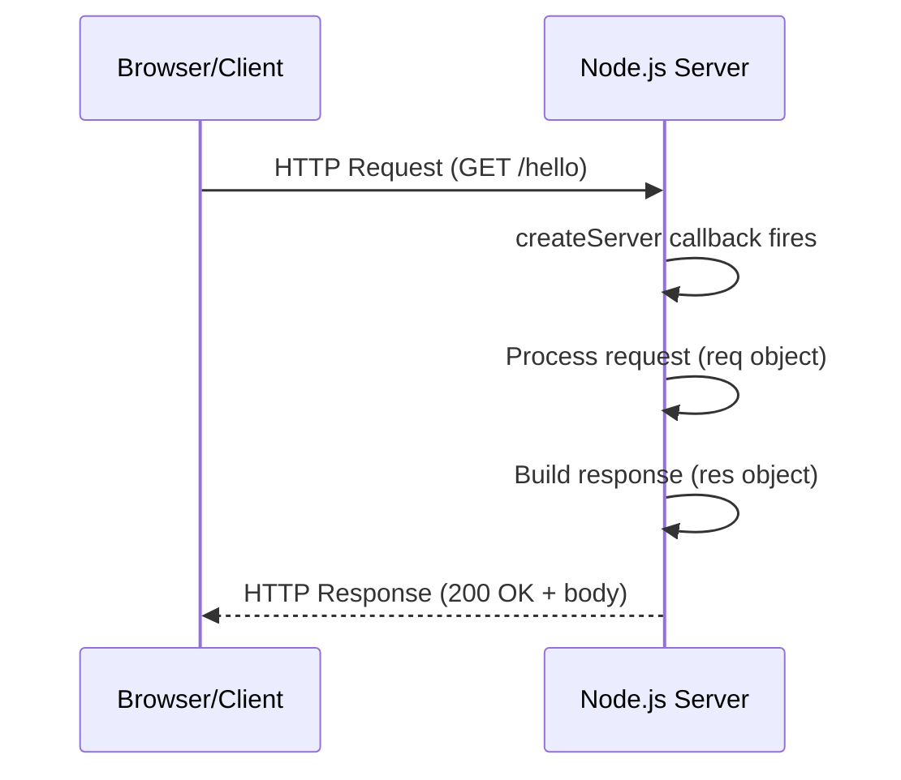

# HTTP Module & Creating a Server Without Express

## What Is the HTTP Module?

The `http` module is a built-in Node.js module that lets you create HTTP servers and make HTTP requests without any external libraries. It is the foundation that frameworks like Express, Koa, and Fastify are built on top of.

**Analogy:** The `http` module is like building a restaurant from scratch — you handle everything yourself: greeting customers (incoming requests), taking orders (parsing request data), cooking (processing), and serving plates (sending responses). Express is like hiring a manager to handle the routine stuff for you. Understanding the raw `http` module means you know what is happening under the hood.

---

## Why This Matters

- Express, Fastify, and every Node.js web framework use `http.createServer()` internally.
- Understanding raw HTTP helps you debug framework-level issues.
- For simple APIs or microservices, you may not need a framework at all.
- Interview questions often ask you to build a server without Express.
- You learn HTTP protocol concepts (methods, headers, status codes) by handling them directly.

---

## Creating a Basic Server

```javascript
import http from "node:http";

const server = http.createServer((req, res) => {
  res.writeHead(200, { "Content-Type": "text/plain" });
  res.end("Hello, World!");
});

server.listen(3000, () => {
  console.log("Server running at http://localhost:3000");
});
```



---

## The Request Object (req)

The `req` object is an `http.IncomingMessage` instance containing all information about the incoming request:

```javascript
const server = http.createServer((req, res) => {
  console.log(req.method); // "GET", "POST", "PUT", "DELETE"
  console.log(req.url); // "/users?page=2"
  console.log(req.headers); // { host: 'localhost:3000', content-type: '...', ... }
  console.log(req.headers["content-type"]); // "application/json"
  console.log(req.headers["user-agent"]); // Browser/client info

  res.end("OK");
});
```

### Parsing the URL

```javascript
import http from "node:http";

const server = http.createServer((req, res) => {
  // Parse URL and query parameters
  const baseURL = `http://${req.headers.host}`;
  const url = new URL(req.url, baseURL);

  console.log(url.pathname); // "/users"
  console.log(url.searchParams.get("page")); // "2"
  console.log(url.searchParams.get("limit")); // null if not present

  res.end("OK");
});
```

### Reading Request Body (POST/PUT)

The request body arrives in chunks (it is a readable stream). You must collect the chunks:

```javascript
const server = http.createServer((req, res) => {
  if (req.method === "POST") {
    let body = "";

    req.on("data", (chunk) => {
      body += chunk.toString();
    });

    req.on("end", () => {
      const parsed = JSON.parse(body);
      console.log(parsed); // { name: "Alice", age: 30 }

      res.writeHead(201, { "Content-Type": "application/json" });
      res.end(JSON.stringify({ message: "User created", data: parsed }));
    });
  }
});
```

### Helper Function to Parse Body

```javascript
function parseBody(req) {
  return new Promise((resolve, reject) => {
    let body = "";
    req.on("data", (chunk) => (body += chunk.toString()));
    req.on("end", () => {
      try {
        resolve(JSON.parse(body));
      } catch {
        resolve(body); // Return raw string if not JSON
      }
    });
    req.on("error", reject);
  });
}

// Usage
const server = http.createServer(async (req, res) => {
  if (req.method === "POST") {
    const data = await parseBody(req);
    // use data...
  }
});
```

---

## The Response Object (res)

The `res` object is an `http.ServerResponse` instance used to send data back to the client:

### `res.writeHead(statusCode, headers)`

Sets the status code and headers. Must be called before `res.write()` or `res.end()`:

```javascript
res.writeHead(200, {
  "Content-Type": "application/json",
  "X-Custom-Header": "my-value",
  "Cache-Control": "no-cache",
});
```

### `res.setHeader(name, value)`

Sets a single header (can be called multiple times before sending):

```javascript
res.setHeader("Content-Type", "text/html");
res.setHeader("X-Request-Id", "abc123");
res.statusCode = 200;
```

### `res.write(data)` — Send Partial Response

```javascript
res.write("First chunk\n");
res.write("Second chunk\n");
res.end("Final chunk"); // Must call end() to finish the response
```

### `res.end(data)` — Finish the Response

```javascript
res.end(); // End with no body
res.end("Hello"); // End with a body
res.end(JSON.stringify({ ok: true })); // End with JSON
```

> **Important:** You must ALWAYS call `res.end()`. If you forget, the client hangs waiting forever.

---

## Common Content-Type Headers

| Content-Type               | Use For                      | Example                     |
| -------------------------- | ---------------------------- | --------------------------- |
| `text/plain`               | Plain text                   | Error messages, simple APIs |
| `text/html`                | HTML pages                   | Server-rendered pages       |
| `application/json`         | JSON data                    | REST API responses          |
| `text/css`                 | CSS files                    | Serving stylesheets         |
| `application/javascript`   | JavaScript files             | Serving scripts             |
| `image/png`                | PNG images                   | Serving static images       |
| `application/octet-stream` | Binary data / file downloads | File download responses     |

---

## HTTP Status Codes

| Code | Name                  | When to Use                           |
| ---- | --------------------- | ------------------------------------- |
| 200  | OK                    | Successful GET, PUT                   |
| 201  | Created               | Successful POST (resource created)    |
| 204  | No Content            | Successful DELETE (no body to return) |
| 301  | Moved Permanently     | URL has permanently changed           |
| 304  | Not Modified          | Cached version is still valid         |
| 400  | Bad Request           | Invalid input from client             |
| 401  | Unauthorized          | Authentication required               |
| 403  | Forbidden             | Authenticated but not permitted       |
| 404  | Not Found             | Resource does not exist               |
| 405  | Method Not Allowed    | Wrong HTTP method for this endpoint   |
| 500  | Internal Server Error | Unhandled server error                |

---

## Manual Routing

### Basic Routing with if/else

```javascript
import http from "node:http";

const server = http.createServer(async (req, res) => {
  const { method } = req;
  const url = new URL(req.url, `http://${req.headers.host}`);
  const path = url.pathname;

  // Set default JSON header
  res.setHeader("Content-Type", "application/json");

  if (path === "/" && method === "GET") {
    res.writeHead(200);
    res.end(JSON.stringify({ message: "Welcome to the API" }));
  } else if (path === "/users" && method === "GET") {
    const users = [
      { id: 1, name: "Alice" },
      { id: 2, name: "Bob" },
    ];
    res.writeHead(200);
    res.end(JSON.stringify(users));
  } else if (path === "/users" && method === "POST") {
    const body = await parseBody(req);
    res.writeHead(201);
    res.end(JSON.stringify({ message: "User created", data: body }));
  } else {
    res.writeHead(404);
    res.end(JSON.stringify({ error: "Route not found" }));
  }
});

server.listen(3000);
```

### Routing with switch Statement

```javascript
const server = http.createServer((req, res) => {
  const route = `${req.method} ${req.url}`;

  switch (route) {
    case "GET /":
      res.writeHead(200, { "Content-Type": "text/html" });
      res.end("<h1>Home Page</h1>");
      break;

    case "GET /about":
      res.writeHead(200, { "Content-Type": "text/html" });
      res.end("<h1>About Page</h1>");
      break;

    case "GET /api/health":
      res.writeHead(200, { "Content-Type": "application/json" });
      res.end(JSON.stringify({ status: "healthy", uptime: process.uptime() }));
      break;

    default:
      res.writeHead(404, { "Content-Type": "application/json" });
      res.end(JSON.stringify({ error: "Not Found" }));
  }
});
```

### Dynamic Routes (Path Parameters)

```javascript
const server = http.createServer((req, res) => {
  const url = new URL(req.url, `http://${req.headers.host}`);
  const path = url.pathname;

  // Match /users/:id pattern
  const userMatch = path.match(/^\/users\/(\d+)$/);

  if (userMatch && req.method === "GET") {
    const userId = userMatch[1];
    res.writeHead(200, { "Content-Type": "application/json" });
    res.end(JSON.stringify({ id: userId, name: `User ${userId}` }));
    return;
  }

  // Match /posts/:id/comments pattern
  const commentMatch = path.match(/^\/posts\/(\d+)\/comments$/);

  if (commentMatch && req.method === "GET") {
    const postId = commentMatch[1];
    res.writeHead(200, { "Content-Type": "application/json" });
    res.end(JSON.stringify({ postId, comments: [] }));
    return;
  }

  res.writeHead(404, { "Content-Type": "application/json" });
  res.end(JSON.stringify({ error: "Not Found" }));
});
```

---

## Serving HTML

```javascript
import http from "node:http";
import { readFile } from "node:fs/promises";
import path from "node:path";
import { fileURLToPath } from "node:url";

const __dirname = path.dirname(fileURLToPath(import.meta.url));

const server = http.createServer(async (req, res) => {
  if (req.url === "/" && req.method === "GET") {
    try {
      const html = await readFile(path.join(__dirname, "index.html"), "utf-8");
      res.writeHead(200, { "Content-Type": "text/html" });
      res.end(html);
    } catch (err) {
      res.writeHead(500, { "Content-Type": "text/plain" });
      res.end("Internal Server Error");
    }
  } else {
    res.writeHead(404, { "Content-Type": "text/plain" });
    res.end("Not Found");
  }
});

server.listen(3000);
```

---

## Serving Static Files

```javascript
import http from "node:http";
import { readFile } from "node:fs/promises";
import path from "node:path";
import { fileURLToPath } from "node:url";

const __dirname = path.dirname(fileURLToPath(import.meta.url));
const PUBLIC_DIR = path.join(__dirname, "public");

// Map extensions to content types
const MIME_TYPES = {
  ".html": "text/html",
  ".css": "text/css",
  ".js": "application/javascript",
  ".json": "application/json",
  ".png": "image/png",
  ".jpg": "image/jpeg",
  ".svg": "image/svg+xml",
  ".ico": "image/x-icon",
};

const server = http.createServer(async (req, res) => {
  // Security: prevent directory traversal
  const safePath = path.normalize(req.url).replace(/^(\.\.[\/\\])+/, "");
  const filePath = path.join(
    PUBLIC_DIR,
    safePath === "/" ? "index.html" : safePath,
  );

  // Ensure the file is within PUBLIC_DIR
  if (!filePath.startsWith(PUBLIC_DIR)) {
    res.writeHead(403);
    res.end("Forbidden");
    return;
  }

  try {
    const data = await readFile(filePath);
    const ext = path.extname(filePath);
    const contentType = MIME_TYPES[ext] || "application/octet-stream";

    res.writeHead(200, { "Content-Type": contentType });
    res.end(data);
  } catch (err) {
    if (err.code === "ENOENT") {
      res.writeHead(404, { "Content-Type": "text/plain" });
      res.end("File Not Found");
    } else {
      res.writeHead(500, { "Content-Type": "text/plain" });
      res.end("Internal Server Error");
    }
  }
});

server.listen(3000);
```

---

## Complete REST API Example

```javascript
import http from "node:http";

// In-memory "database"
let users = [
  { id: 1, name: "Alice", email: "alice@example.com" },
  { id: 2, name: "Bob", email: "bob@example.com" },
];
let nextId = 3;

function parseBody(req) {
  return new Promise((resolve, reject) => {
    let body = "";
    req.on("data", (chunk) => (body += chunk.toString()));
    req.on("end", () => {
      try {
        resolve(body ? JSON.parse(body) : {});
      } catch (e) {
        reject(new Error("Invalid JSON"));
      }
    });
    req.on("error", reject);
  });
}

function sendJSON(res, statusCode, data) {
  res.writeHead(statusCode, { "Content-Type": "application/json" });
  res.end(JSON.stringify(data));
}

const server = http.createServer(async (req, res) => {
  const url = new URL(req.url, `http://${req.headers.host}`);
  const path = url.pathname;
  const method = req.method;

  try {
    // GET /users — List all users
    if (path === "/users" && method === "GET") {
      return sendJSON(res, 200, users);
    }

    // GET /users/:id — Get single user
    const singleUser = path.match(/^\/users\/(\d+)$/);
    if (singleUser && method === "GET") {
      const user = users.find((u) => u.id === parseInt(singleUser[1]));
      if (!user) return sendJSON(res, 404, { error: "User not found" });
      return sendJSON(res, 200, user);
    }

    // POST /users — Create user
    if (path === "/users" && method === "POST") {
      const body = await parseBody(req);
      if (!body.name || !body.email) {
        return sendJSON(res, 400, { error: "Name and email required" });
      }
      const newUser = { id: nextId++, name: body.name, email: body.email };
      users.push(newUser);
      return sendJSON(res, 201, newUser);
    }

    // PUT /users/:id — Update user
    if (singleUser && method === "PUT") {
      const id = parseInt(singleUser[1]);
      const index = users.findIndex((u) => u.id === id);
      if (index === -1) return sendJSON(res, 404, { error: "User not found" });

      const body = await parseBody(req);
      users[index] = { ...users[index], ...body };
      return sendJSON(res, 200, users[index]);
    }

    // DELETE /users/:id — Delete user
    if (singleUser && method === "DELETE") {
      const id = parseInt(singleUser[1]);
      const index = users.findIndex((u) => u.id === id);
      if (index === -1) return sendJSON(res, 404, { error: "User not found" });

      users.splice(index, 1);
      return sendJSON(res, 204, null);
    }

    // 404 for unmatched routes
    sendJSON(res, 404, { error: "Route not found" });
  } catch (err) {
    sendJSON(res, 500, { error: "Internal Server Error" });
  }
});

server.listen(3000, () => {
  console.log("REST API running at http://localhost:3000");
});
```

---

## CORS Headers (Cross-Origin Requests)

```javascript
const server = http.createServer((req, res) => {
  // Set CORS headers on every response
  res.setHeader("Access-Control-Allow-Origin", "*");
  res.setHeader(
    "Access-Control-Allow-Methods",
    "GET, POST, PUT, DELETE, OPTIONS",
  );
  res.setHeader("Access-Control-Allow-Headers", "Content-Type, Authorization");

  // Handle preflight OPTIONS request
  if (req.method === "OPTIONS") {
    res.writeHead(204);
    res.end();
    return;
  }

  // ... normal route handling
});
```

---

## Best Practices

1. **Always call `res.end()`** — forgetting it causes the client to hang indefinitely.
2. **Set Content-Type header** — clients need to know how to interpret the response body.
3. **Handle errors with try/catch** — uncaught errors in the callback crash the server.
4. **Validate request body** — never trust client input; check for required fields.
5. **Prevent directory traversal** — when serving files, sanitize the path and ensure it stays within your public directory.
6. **Use `res.writeHead()` before writing body** — headers must be sent first (HTTP protocol requirement).
7. **Parse the URL with `new URL()`** — do not string-split `req.url` manually.
8. **Use streams for large responses** — pipe file streams directly to `res` instead of loading into memory.
9. **Add a catch-all 404** — unmatched routes should return a proper 404 response.
10. **Limit request body size** — prevent denial-of-service from extremely large payloads.

---

## Common Mistakes

| Mistake                                  | Why It Is Wrong                                      | Fix                                                 |
| ---------------------------------------- | ---------------------------------------------------- | --------------------------------------------------- |
| Forgetting `res.end()`                   | Client connection hangs forever                      | Always call `res.end()` in every code path          |
| Not setting `Content-Type`               | Browser may misinterpret the response                | Set header before `end()`/`write()`                 |
| Sending headers after body started       | Throws `ERR_HTTP_HEADERS_SENT`                       | Call `writeHead`/`setHeader` before `write`/`end`   |
| Not handling POST body as a stream       | `req.body` does not exist (that is an Express thing) | Listen for `data` and `end` events on `req`         |
| String matching on URL without parsing   | Fails for URLs with query strings (`/users?page=1`)  | Use `new URL()` to parse pathname and params        |
| No error handling in async route handler | Unhandled rejection crashes the server               | Wrap in try/catch, send 500 response                |
| Serving files without path sanitization  | Directory traversal attack (`../../etc/passwd`)      | Use `path.normalize()` and verify path is in public |
| Calling `res.end()` multiple times       | Throws error on second call                          | Use `return` after sending response                 |

---

## Summary

- `http.createServer(callback)` creates a server — the callback receives `req` (request info) and `res` (response methods).
- **Request:** `req.method`, `req.url`, `req.headers` give you everything about the incoming request. Body arrives as stream chunks.
- **Response:** `res.writeHead()` sets status + headers, `res.write()` sends partial data, `res.end()` finishes the response.
- **Routing** is done manually with `if/else` or `switch` on `req.method` + `req.url`. Use regex for dynamic parameters.
- Always set `Content-Type`, always call `res.end()`, always handle errors.
- This is what Express does under the hood — knowing it makes you a better Node.js developer.
- For production, use a framework. For learning, interviews, and simple scripts — raw `http` module is sufficient.
