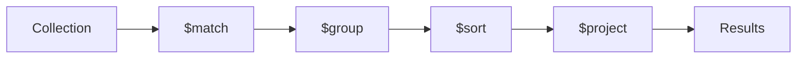

# Advanced MongoDB

## Indexes

Indexes improve query performance by allowing MongoDB to find documents without scanning every document in a collection.

### Creating Indexes

```javascript
// Single field index
db.users.createIndex({ email: 1 }); // 1 = ascending, -1 = descending

// Compound index (multiple fields)
db.products.createIndex({ category: 1, price: -1 });

// Unique index
db.users.createIndex({ email: 1 }, { unique: true });

// Text index (full-text search)
db.posts.createIndex({ title: "text", content: "text" });

// TTL index (auto-delete after time)
db.sessions.createIndex({ createdAt: 1 }, { expireAfterSeconds: 3600 });
```

### In Mongoose

```javascript
// In schema definition
const userSchema = new mongoose.Schema({
  email: { type: String, unique: true, index: true },
  name: String,
  createdAt: { type: Date, index: { expires: "7d" } }, // TTL
});

// Compound index
userSchema.index({ lastName: 1, firstName: 1 });
userSchema.index({ title: "text", content: "text" }); // Text search
```

### When to Index

- Fields used in `find()` filters.
- Fields used in `sort()`.
- Fields in `$lookup` (joins).
- Unique constraints.

**Do not over-index** — each index uses memory and slows down writes.

---

## Aggregation Framework

The aggregation pipeline processes documents through a series of stages:



### Common Stages

```javascript
// Sales analytics example
db.orders.aggregate([
  // Stage 1: Filter
  {
    $match: {
      status: "completed",
      createdAt: { $gte: new Date("2024-01-01") },
    },
  },

  // Stage 2: Group and calculate
  {
    $group: {
      _id: "$category",
      totalRevenue: { $sum: "$amount" },
      averageOrder: { $avg: "$amount" },
      orderCount: { $sum: 1 },
      maxOrder: { $max: "$amount" },
    },
  },

  // Stage 3: Sort by revenue
  { $sort: { totalRevenue: -1 } },

  // Stage 4: Limit top 5
  { $limit: 5 },

  // Stage 5: Reshape output
  {
    $project: {
      category: "$_id",
      totalRevenue: 1,
      averageOrder: { $round: ["$averageOrder", 2] },
      orderCount: 1,
      _id: 0,
    },
  },
]);
```

### `$lookup` (Join)

```javascript
db.orders.aggregate([
  {
    $lookup: {
      from: "users", // Collection to join
      localField: "userId", // Field in orders
      foreignField: "_id", // Field in users
      as: "customer", // Output array field
    },
  },
  { $unwind: "$customer" }, // Flatten array to object
  {
    $project: {
      orderTotal: "$amount",
      customerName: "$customer.name",
      customerEmail: "$customer.email",
    },
  },
]);
```

### `$unwind` — Deconstruct Arrays

```javascript
// Document: { name: "Vikas", skills: ["JS", "React", "Node"] }
db.users.aggregate([{ $unwind: "$skills" }]);
// Produces 3 documents:
// { name: "Vikas", skills: "JS" }
// { name: "Vikas", skills: "React" }
// { name: "Vikas", skills: "Node" }
```

---

## Transactions

Ensure multiple operations either all succeed or all fail (atomicity across documents/collections):

```javascript
const session = await mongoose.startSession();

try {
  session.startTransaction();

  // Debit from sender
  await Account.updateOne(
    { _id: senderId },
    { $inc: { balance: -amount } },
    { session },
  );

  // Credit to receiver
  await Account.updateOne(
    { _id: receiverId },
    { $inc: { balance: amount } },
    { session },
  );

  // Create transaction record
  await Transaction.create(
    [
      {
        from: senderId,
        to: receiverId,
        amount,
        date: new Date(),
      },
    ],
    { session },
  );

  await session.commitTransaction();
  console.log("Transfer successful");
} catch (error) {
  await session.abortTransaction();
  console.error("Transfer failed:", error);
  throw error;
} finally {
  session.endSession();
}
```

**Note:** Transactions require a replica set (Atlas free tier includes one).

---

## Relationships: Embedding vs Referencing

### Decision Guide

| Factor                  | Embed          | Reference           |
| ----------------------- | -------------- | ------------------- |
| Data accessed together? | ✅ Always      | ❌ Independently    |
| Subdocument size?       | Small (< 100)  | Large or growing    |
| Update frequency?       | Rarely changes | Frequently changes  |
| Relationship?           | 1:1 or 1:few   | 1:many or many:many |
| Need atomic operations? | ✅ Yes         | Less critical       |
| Document size limit?    | Under 16MB     | Could exceed        |

### Embedding Pattern

```javascript
// Blog post with embedded comments (1:few, always read together)
{
  title: "MongoDB Tips",
  content: "...",
  comments: [
    { user: "Vikas", text: "Great post!", date: new Date() },
    { user: "Rahul", text: "Very helpful", date: new Date() }
  ]
}
```

### Referencing Pattern

```javascript
// User and Orders (1:many, orders grow over time)
// users collection
{ _id: ObjectId("user1"), name: "Vikas" }

// orders collection
{ _id: ObjectId("order1"), userId: ObjectId("user1"), amount: 999 }
{ _id: ObjectId("order2"), userId: ObjectId("user1"), amount: 499 }
```

### Hybrid (Partial Embedding)

```javascript
// Store summary in parent, details in separate collection
{
  _id: ObjectId("user1"),
  name: "Vikas",
  recentOrders: [   // Only last 5 (denormalized summary)
    { orderId: ObjectId("order1"), amount: 999, date: "2024-01-15" }
  ],
  orderCount: 47    // Counter cache
}
```

---

## Pagination & Filtering

### Offset-Based Pagination

```javascript
async function getUsers(page = 1, limit = 10, filters = {}) {
  const skip = (page - 1) * limit;

  const [users, total] = await Promise.all([
    User.find(filters).sort({ createdAt: -1 }).skip(skip).limit(limit),
    User.countDocuments(filters),
  ]);

  return {
    data: users,
    pagination: {
      total,
      page,
      limit,
      totalPages: Math.ceil(total / limit),
      hasNext: page * limit < total,
      hasPrev: page > 1,
    },
  };
}
```

### Cursor-Based Pagination (Better for Large Datasets)

```javascript
async function getUsersAfter(cursor, limit = 10) {
  const filter = cursor
    ? { _id: { $gt: new mongoose.Types.ObjectId(cursor) } }
    : {};

  const users = await User.find(filter)
    .sort({ _id: 1 })
    .limit(limit + 1);

  const hasMore = users.length > limit;
  const data = hasMore ? users.slice(0, limit) : users;
  const nextCursor = hasMore ? data[data.length - 1]._id : null;

  return { data, nextCursor, hasMore };
}
```

### Dynamic Filtering

```javascript
function buildFilter(query) {
  const filter = {};

  if (query.search) {
    filter.$or = [
      { name: { $regex: query.search, $options: "i" } },
      { email: { $regex: query.search, $options: "i" } },
    ];
  }
  if (query.role) filter.role = query.role;
  if (query.minAge) filter.age = { ...filter.age, $gte: Number(query.minAge) };
  if (query.maxAge) filter.age = { ...filter.age, $lte: Number(query.maxAge) };
  if (query.active !== undefined) filter.isActive = query.active === "true";

  return filter;
}

app.get("/api/users", async (req, res) => {
  const filter = buildFilter(req.query);
  const result = await getUsers(req.query.page, req.query.limit, filter);
  res.json(result);
});
```

---

## Best Practices

1. **Index your queries** — use `explain()` to verify index usage.
2. **Use aggregation for analytics** — not application code loops.
3. **Prefer cursor pagination** for large, real-time datasets.
4. **Limit document size** — keep under 16MB; break large arrays into references.
5. **Use transactions** for multi-document operations that must be atomic.
6. **Denormalize strategically** — accept some redundancy for read performance.

---

## Summary

- Indexes dramatically improve query performance — create them for frequently filtered/sorted fields.
- The aggregation pipeline processes data through stages (`$match`, `$group`, `$sort`, `$lookup`, `$project`).
- Transactions ensure atomicity across multiple documents/collections — require replica sets.
- Choose embedding for tightly coupled, small, rarely-changing data; referencing for large, independent, frequently-changing data.
- Implement pagination (offset or cursor-based) and dynamic filtering for production-ready APIs.
