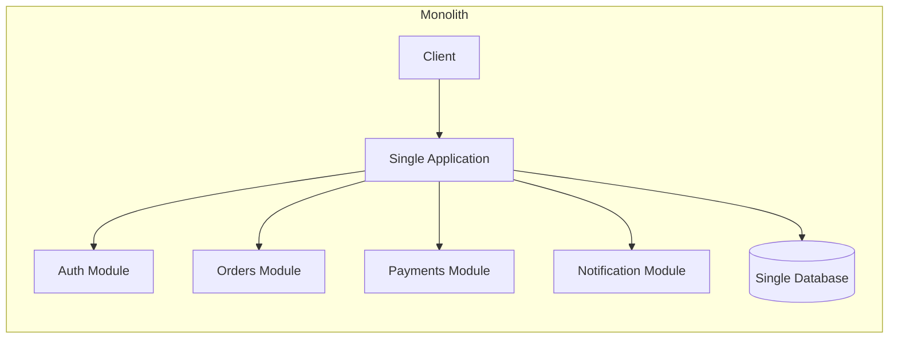
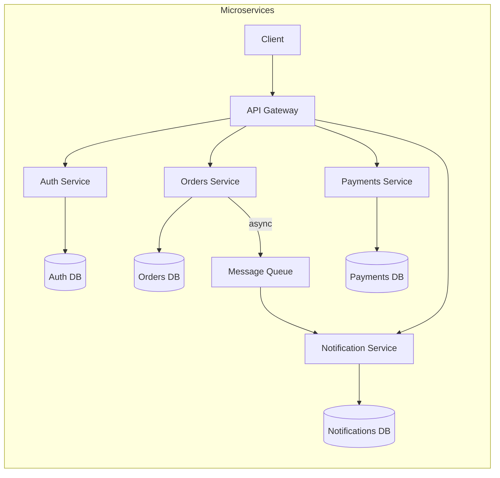
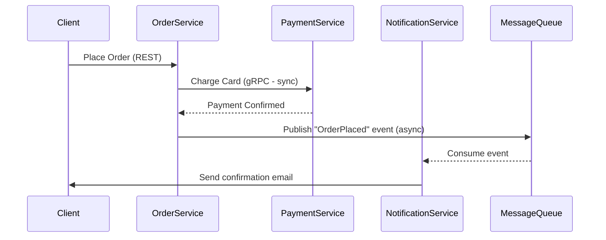
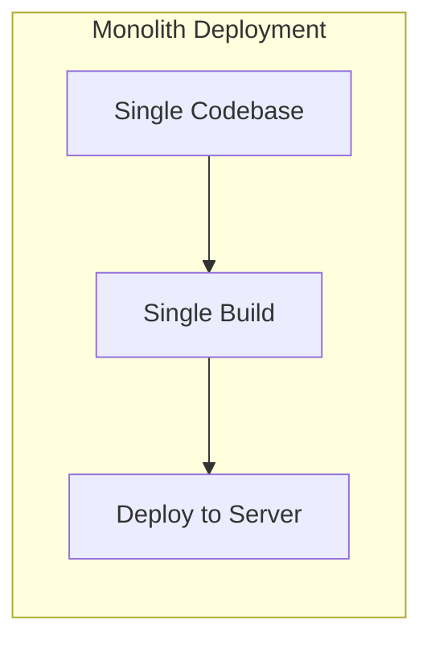
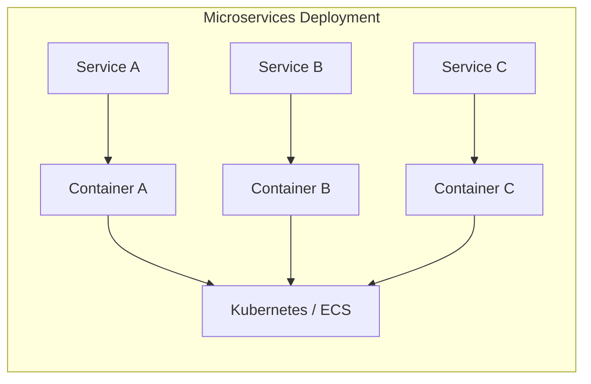
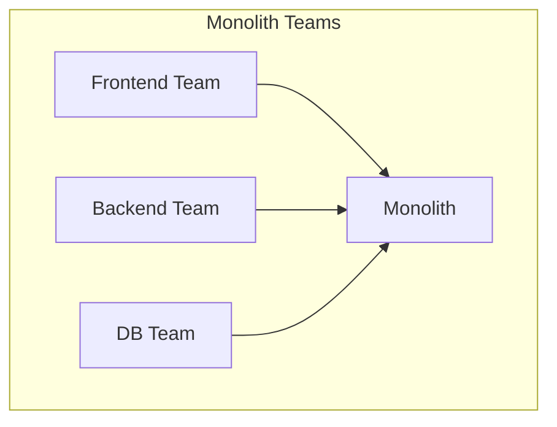
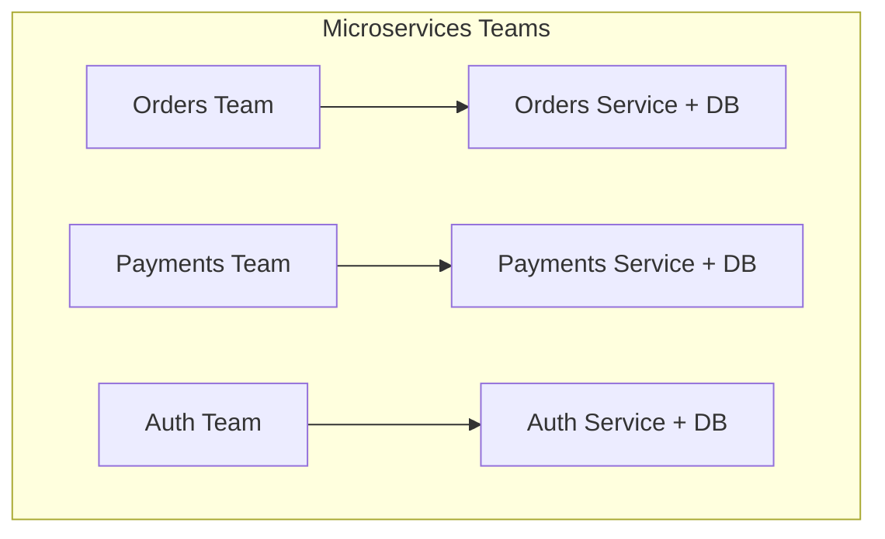

# Monolith vs Microservices Architecture

## What / Why

**Monolith** = One single deployable unit containing all application logic. Think of it as a single building where every department (auth, billing, orders, notifications) shares the same walls, plumbing, and electrical system.

**Microservices** = Application split into small, independently deployable services, each owning a specific business capability. Think of it as a campus of separate buildings — each has its own infrastructure but they communicate via roads (APIs).

The choice between them impacts how you build, deploy, scale, and organize teams.

---

## Architecture Overview

---

## Comparison Table

| Aspect                        | Monolith                                 | Microservices                                 |
| ----------------------------- | ---------------------------------------- | --------------------------------------------- |
| **Deployment**                | Single unit — deploy everything together | Independent — deploy services individually    |
| **Scaling**                   | Scale entire app (vertical mostly)       | Scale individual services (horizontal)        |
| **Development Speed (early)** | Fast — no network overhead, simple setup | Slow — infra complexity from day one          |
| **Development Speed (late)**  | Slow — large codebase, merge conflicts   | Fast — small focused codebases                |
| **Technology**                | Single tech stack                        | Polyglot — each service picks its best tool   |
| **Data Management**           | Single shared database                   | Database per service (data isolation)         |
| **Fault Isolation**           | One bug can crash entire app             | Failure contained to one service              |
| **Testing**                   | Simple — all code in one place           | Complex — integration testing across services |
| **Team Size**                 | Small teams (< 10 devs)                  | Large distributed teams                       |
| **Latency**                   | In-process function calls (nanoseconds)  | Network calls between services (milliseconds) |
| **Operational Complexity**    | Low — one thing to monitor/deploy        | High — many services to orchestrate           |
| **Data Consistency**          | Easy — ACID transactions                 | Hard — eventual consistency, sagas            |

---

## Communication Patterns (Microservices)

### Synchronous Communication

| Protocol                     | Use Case                     | Pros                                | Cons                                  |
| ---------------------------- | ---------------------------- | ----------------------------------- | ------------------------------------- |
| **REST (HTTP/JSON)**         | CRUD operations, public APIs | Simple, universal, debuggable       | Verbose, slower serialization         |
| **gRPC (HTTP/2 + Protobuf)** | Internal service-to-service  | Fast (binary), streaming, type-safe | Harder to debug, requires proto files |
| **GraphQL**                  | Client-facing aggregation    | Flexible queries, no over-fetching  | Complex server implementation         |

### Asynchronous Communication

| Pattern             | Use Case                    | Tools              |
| ------------------- | --------------------------- | ------------------ |
| **Message Queue**   | Task processing, decoupling | RabbitMQ, SQS      |
| **Event Streaming** | Event sourcing, real-time   | Kafka, Kinesis     |
| **Pub/Sub**         | Fan-out notifications       | Redis Pub/Sub, SNS |

---

## Deployment Differences

| Deployment Aspect | Monolith                | Microservices                        |
| ----------------- | ----------------------- | ------------------------------------ |
| CI/CD Pipeline    | One pipeline            | One per service                      |
| Rollback          | Roll back everything    | Roll back one service                |
| Downtime Risk     | Higher — full redeploy  | Lower — only affected service        |
| Infrastructure    | VMs or single container | Container orchestration (K8s, ECS)   |
| Service Discovery | Not needed              | Required (Consul, DNS, K8s services) |

---

## Team Organization Impact (Conway's Law)

> "Organizations design systems that mirror their communication structure." — Conway's Law

- **Monolith** → Teams organized by technical layer (frontend team, backend team, DB team). Cross-team coordination needed for features.
- **Microservices** → Teams organized by business domain (orders team, payments team). Each team owns their service end-to-end.

---

## When to Choose Which

### Choose Monolith When:

- Early-stage startup / MVP
- Small team (< 8-10 developers)
- Simple domain with few bounded contexts
- You need to move fast and validate ideas
- Operational expertise is limited

### Choose Microservices When:

- Large team working on independent features
- Different parts need different scaling strategies
- Business domains are well-defined and decoupled
- You have DevOps maturity (CI/CD, monitoring, containerization)
- Parts of the system have different availability requirements

### The Pragmatic Middle Ground: Modular Monolith

- Keep single deployment but enforce module boundaries
- Clean interfaces between modules (like internal APIs)
- Easier to extract into microservices later if needed
- Best of both: simplicity of monolith + separation of concerns

---

## Best Practices

1. **Start monolith, extract later** — Don't pre-optimize. Most startups don't survive long enough for microservices to matter.
2. **Define clear boundaries** — Whether monolith or micro, keep bounded contexts clean.
3. **If microservices, invest in observability** — Distributed tracing (Jaeger), centralized logging (ELK), metrics (Prometheus/Grafana).
4. **Avoid the "distributed monolith"** — Microservices that must deploy together aren't microservices. They're a monolith with network latency.
5. **One database per service** — Shared databases create hidden coupling.
6. **Design for failure** — Circuit breakers, retries with backoff, timeouts on all network calls.
7. **API versioning** — Services evolve independently; breaking changes need version management.

---

## Summary

- Monolith = simple, fast to start, hard to scale organizationally
- Microservices = complex, slow to start, scales with team/domain growth
- The real answer is usually "modular monolith → extract services when pain is real"
- Communication: REST for simplicity, gRPC for performance, async queues for decoupling
- Conway's Law means your architecture will reflect your team structure — design both together
