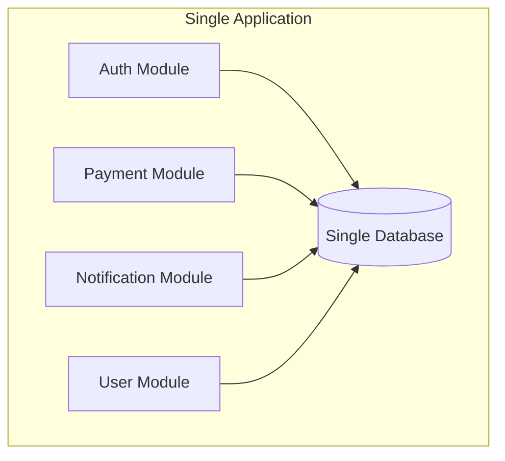
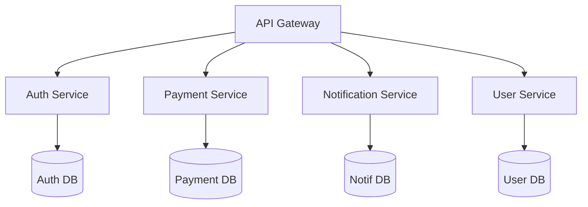
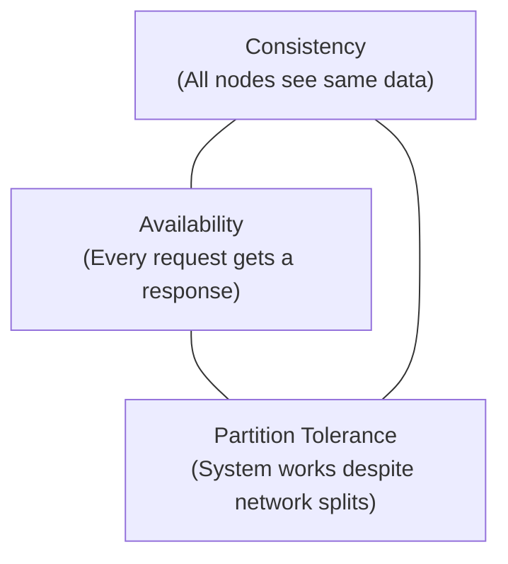
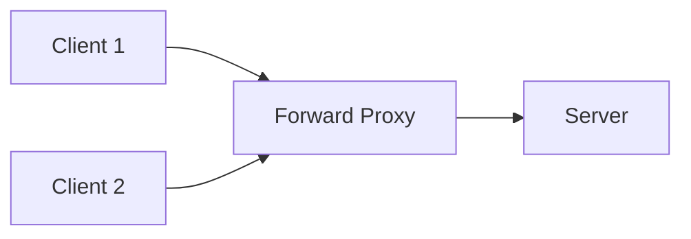
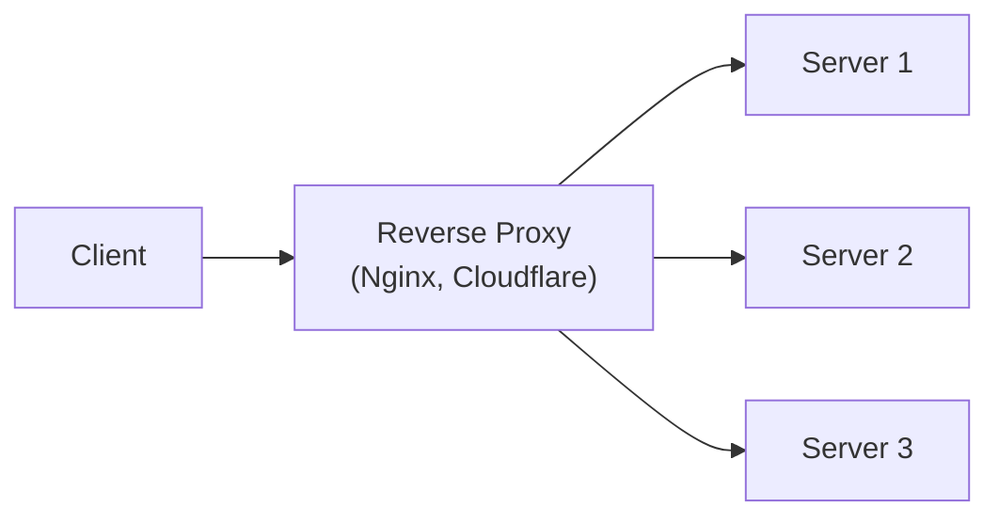

# System Design Fundamentals

## Monolith vs Microservices

### Monolithic Architecture

All components (auth, payments, notifications, etc.) live in a **single codebase** and deploy as a **single unit**.



**Pros:** Simple to develop, test, and deploy early on. Single deployment. Easy debugging.

**Cons:** Scales as a whole (cannot scale just one module). One bug can crash everything. Team coupling increases with size.

### Microservices Architecture

Each feature is a **separate service** with its own codebase, database, and deployment pipeline.



**Pros:** Independent scaling, deployment, and tech choices. Fault isolation. Team autonomy.

**Cons:** Complex infrastructure (service discovery, communication). Distributed system challenges (network failures, data consistency). Operational overhead.

### When to Choose Which?

| Start with Monolith when...  | Move to Microservices when...             |
| ---------------------------- | ----------------------------------------- |
| Small team (< 10 developers) | Team grows, domains become clear          |
| MVP / early product stage    | Specific modules need independent scaling |
| Simple business logic        | Deployment coupling becomes painful       |
| Unknown domain boundaries    | Different modules need different tech     |

---

## CAP Theorem

In any distributed system, you can only guarantee **two of three**:



- **Consistency (C)** — every read receives the most recent write.
- **Availability (A)** — every request gets a non-error response (even if stale).
- **Partition Tolerance (P)** — system operates despite network failures between nodes.

**In practice:** Network partitions are inevitable in distributed systems, so you always choose P. The real choice is **CP vs AP**:

| Choice | Meaning                            | Example                         |
| ------ | ---------------------------------- | ------------------------------- |
| CP     | Consistent but may reject requests | MongoDB (in strict mode), HBase |
| AP     | Available but may serve stale data | DynamoDB, Cassandra             |

---

## BASE Consistency

An alternative to ACID for distributed systems:

| Property                 | Meaning                                                |
| ------------------------ | ------------------------------------------------------ |
| **B**asically Available  | System guarantees availability (may serve stale data)  |
| **S**oft State           | State may change over time even without new input      |
| **E**ventual Consistency | Given enough time, all replicas converge to same state |

**ACID** (relational DBs) = strong consistency, transactions, immediate.
**BASE** (NoSQL/distributed) = trade consistency for availability and partition tolerance.

---

## Throughput vs Latency

- **Latency** — how long a single request takes (measured in ms). "How fast is one trip?"
- **Throughput** — how many requests the system handles per second (RPS/QPS). "How many trips per hour?"

```
Low latency + Low throughput = Sports car (fast but carries one person)
High latency + High throughput = Bus (slow but carries many people)
High latency + Low throughput = Bicycle (worst case)
Low latency + High throughput = Bullet train (ideal)
```

Improving one does not automatically improve the other. You can have a fast response time per request (low latency) but still handle few total requests (low throughput) if resources are limited.

---

## High Availability & Fault Tolerance

### High Availability (HA)

The system stays operational a high percentage of time:

| Uptime  | Downtime/Year | Called   |
| ------- | ------------- | -------- |
| 99%     | 3.65 days     | Two 9s   |
| 99.9%   | 8.76 hours    | Three 9s |
| 99.99%  | 52.6 minutes  | Four 9s  |
| 99.999% | 5.26 minutes  | Five 9s  |

### Achieving HA

- **Redundancy** — multiple servers, databases, data centers.
- **Load balancing** — distribute traffic across healthy instances.
- **Health checks** — detect and route away from failing nodes.
- **Auto-scaling** — add capacity during traffic spikes.
- **Geographic distribution** — survive entire data center failures.

### Fault Tolerance

The system continues operating (possibly degraded) when components fail:

- **Graceful degradation** — show cached data when DB is down.
- **Circuit breakers** — stop calling a failing service, return fallback.
- **Retry with backoff** — retry failed requests with increasing delays.
- **Bulkheads** — isolate failures so one component does not crash everything.

---

## Proxy vs Reverse Proxy

### Forward Proxy

Sits in front of **clients** — hides client identity from servers.



**Use cases:** Corporate firewalls, VPNs, content filtering, anonymous browsing.

### Reverse Proxy

Sits in front of **servers** — hides server details from clients.



**Use cases:** Load balancing, SSL termination, caching, DDoS protection, serving static assets.

| Feature       | Forward Proxy        | Reverse Proxy              |
| ------------- | -------------------- | -------------------------- |
| Protects      | Clients              | Servers                    |
| Placed before | Clients              | Servers                    |
| Client knows? | Yes (configured)     | No (transparent)           |
| Common tools  | Squid, corporate VPN | Nginx, HAProxy, Cloudflare |

---

## Summary

- **Monolith** is simpler for small teams; **microservices** for large-scale independent scaling and deployment.
- **CAP theorem**: distributed systems must choose between consistency and availability when partitions occur.
- **BASE** trades strong consistency for availability and eventual convergence.
- **Latency** is single-request speed; **throughput** is total requests per second — optimize both.
- **High availability** comes from redundancy, load balancing, health checks, and auto-scaling.
- **Forward proxies** protect clients; **reverse proxies** protect and optimize servers.
