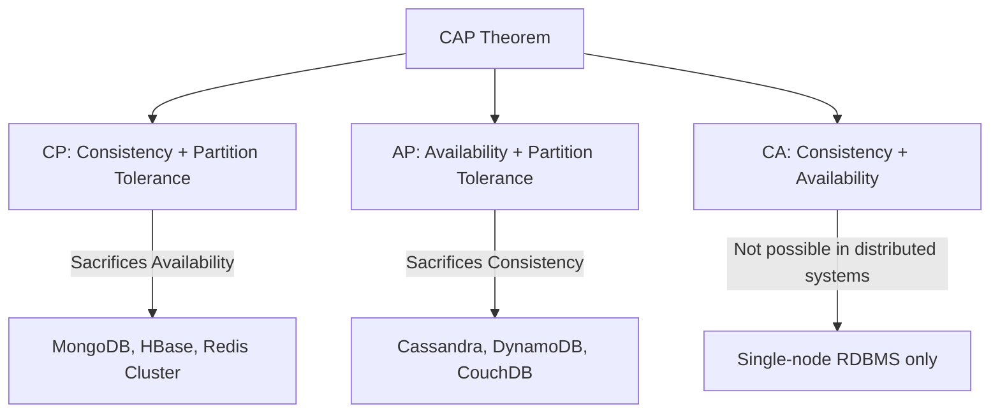
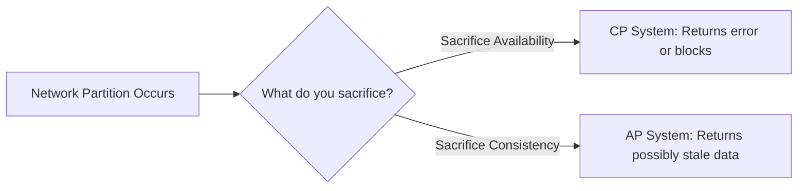
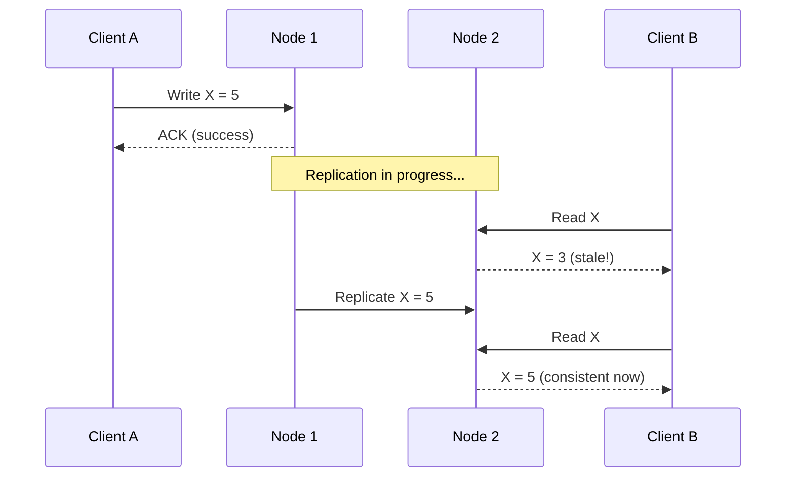

# CAP Theorem & BASE Consistency

## What / Why

When you distribute data across multiple machines, you face fundamental tradeoffs in how that data behaves. The CAP theorem and BASE model provide frameworks for reasoning about these tradeoffs.

**Analogy:** Imagine a chain of libraries across cities. If one library updates a book's content, do all libraries instantly get the update (consistency)? Can every library always serve readers (availability)? What happens if the road between two libraries is blocked (partition)?

You can't guarantee all three simultaneously in a distributed system. That's CAP.

---

## CAP Theorem Explained

**CAP** states that a distributed data store can only guarantee **two out of three** properties simultaneously:

| Property                    | Definition                                                                 | Real-World Meaning                            |
| --------------------------- | -------------------------------------------------------------------------- | --------------------------------------------- |
| **C** — Consistency         | Every read receives the most recent write or an error                      | All nodes see the same data at the same time  |
| **A** — Availability        | Every request receives a non-error response (no guarantee it's the latest) | System always responds, even if data is stale |
| **P** — Partition Tolerance | System continues operating despite network partitions between nodes        | Handles network failures between nodes        |



---

## Why "Pick 2" is Slightly Misleading

Network partitions **will happen** in any distributed system (hardware fails, cables get cut, cloud regions go down). So Partition Tolerance isn't optional — it's a given.

The real choice is:

> **When a partition occurs**, do you sacrifice **Consistency** or **Availability**?

- **CP** → During a partition, refuse to respond rather than serve stale data
- **AP** → During a partition, serve potentially stale data rather than reject requests



---

## Real-World System Classification

| System                       | Type         | Behavior During Partition                                                                     |
| ---------------------------- | ------------ | --------------------------------------------------------------------------------------------- |
| **MongoDB**                  | CP           | Primary accepts writes; if primary unreachable, secondaries won't accept writes (unavailable) |
| **HBase**                    | CP           | Strong consistency; unavailable during region server failures                                 |
| **Redis Cluster**            | CP           | Rejects writes if master is unreachable from majority                                         |
| **Cassandra**                | AP           | All nodes accept reads/writes; resolves conflicts later (last-write-wins)                     |
| **DynamoDB**                 | AP (tunable) | Eventually consistent by default; optional strong consistency per read                        |
| **CouchDB**                  | AP           | Accepts writes on any node; conflict resolution on sync                                       |
| **PostgreSQL (single node)** | CA           | Consistent + Available but can't tolerate network partitions (it's not distributed)           |
| **Zookeeper**                | CP           | Consensus-based; unavailable if quorum lost                                                   |

---

## CA — Why It Doesn't Exist in Distributed Systems

A "CA" system means: consistent AND available, but doesn't tolerate partitions. This only works on a **single node** (traditional RDBMS on one server). The moment you add a second node, network partitions become possible, and you're forced to choose between C and A.

---

## ACID vs BASE

These are two consistency models for databases:

| Property        | ACID                                          | BASE                                                  |
| --------------- | --------------------------------------------- | ----------------------------------------------------- |
| **Full Name**   | Atomicity, Consistency, Isolation, Durability | Basically Available, Soft State, Eventual Consistency |
| **Philosophy**  | Correctness above all                         | Availability above all                                |
| **Consistency** | Immediate (strong)                            | Eventual (weak)                                       |
| **Use Case**    | Banking, inventory, bookings                  | Social feeds, analytics, caching                      |
| **Scalability** | Harder to scale horizontally                  | Scales easily across nodes                            |
| **Systems**     | PostgreSQL, MySQL, Oracle                     | Cassandra, DynamoDB, MongoDB                          |
| **Tradeoff**    | Lower availability, higher latency            | Higher availability, possible stale reads             |

---

## BASE Breakdown

| Component                | Meaning                                                               | Example                                                           |
| ------------------------ | --------------------------------------------------------------------- | ----------------------------------------------------------------- |
| **Basically Available**  | System guarantees availability (in CAP sense) — always responds       | DynamoDB always returns data, even if slightly stale              |
| **Soft State**           | State may change over time without input (due to background sync)     | Replicas converging to same value asynchronously                  |
| **Eventual Consistency** | If no new updates, all replicas will eventually return the same value | DNS propagation — takes time but eventually all DNS servers agree |

---

## Eventual Consistency Deep Dive



### Conflict Resolution Strategies

When two nodes accept conflicting writes during a partition:

| Strategy                         | How It Works                                 | Used By                                |
| -------------------------------- | -------------------------------------------- | -------------------------------------- |
| **Last Write Wins (LWW)**        | Highest timestamp wins                       | Cassandra, DynamoDB                    |
| **Vector Clocks**                | Track causal history, detect conflicts       | Riak (older versions)                  |
| **CRDTs**                        | Data structures that mathematically converge | Redis, Riak 2.0                        |
| **Application-level resolution** | App decides how to merge                     | CouchDB (returns all conflicts to app) |

---

## Tunable Consistency

Many modern systems let you **tune** consistency per operation:

```
Cassandra consistency levels:
- ONE: Write/read from 1 replica (fast, weakly consistent)
- QUORUM: Majority of replicas must respond (balanced)
- ALL: All replicas must respond (strong consistency, low availability)
```

**Formula:** `R + W > N` guarantees strong consistency

- R = replicas read from
- W = replicas written to
- N = total replicas

Example: N=3, W=2, R=2 → 2+2 > 3 → Strong consistency ✓

---

## Best Practices

1. **Understand your data's consistency needs** — Financial transactions need ACID. Social media likes can be eventually consistent.
2. **Design for partition tolerance** — It's not optional in distributed systems. Plan your C vs A tradeoff.
3. **Use tunable consistency where available** — Not all reads/writes in your app need the same guarantees.
4. **Implement idempotency** — In eventually consistent systems, duplicate messages are common. Make operations safe to retry.
5. **Monitor replication lag** — Know how "eventual" your eventual consistency actually is (milliseconds? seconds? minutes?).
6. **Don't mix up CAP consistency with ACID consistency** — CAP "C" = all nodes see same data. ACID "C" = database transitions between valid states.
7. **Design conflict resolution early** — If you choose AP, decide upfront how conflicts are resolved.

---

## Summary

- **CAP Theorem**: In distributed systems, partitions are inevitable — choose between consistency (CP) or availability (AP)
- **CP systems** (MongoDB, HBase): Refuse to serve during partitions — correctness over availability
- **AP systems** (Cassandra, DynamoDB): Always serve, reconcile later — availability over correctness
- **CA doesn't exist** in truly distributed systems (only single-node databases)
- **ACID** = strong consistency, immediate correctness (SQL databases)
- **BASE** = eventual consistency, high availability, soft state (NoSQL databases)
- **Eventual consistency** means replicas converge over time — design conflict resolution strategies
- Most real systems offer **tunable consistency** — pick per operation, not per system
