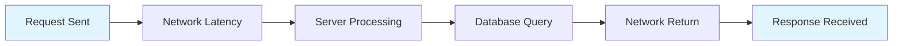
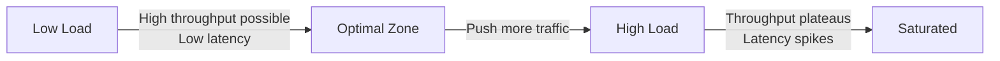
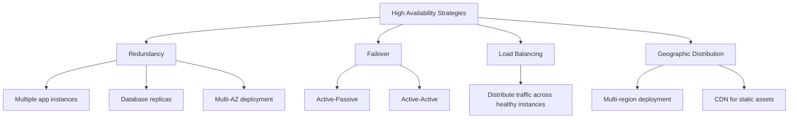
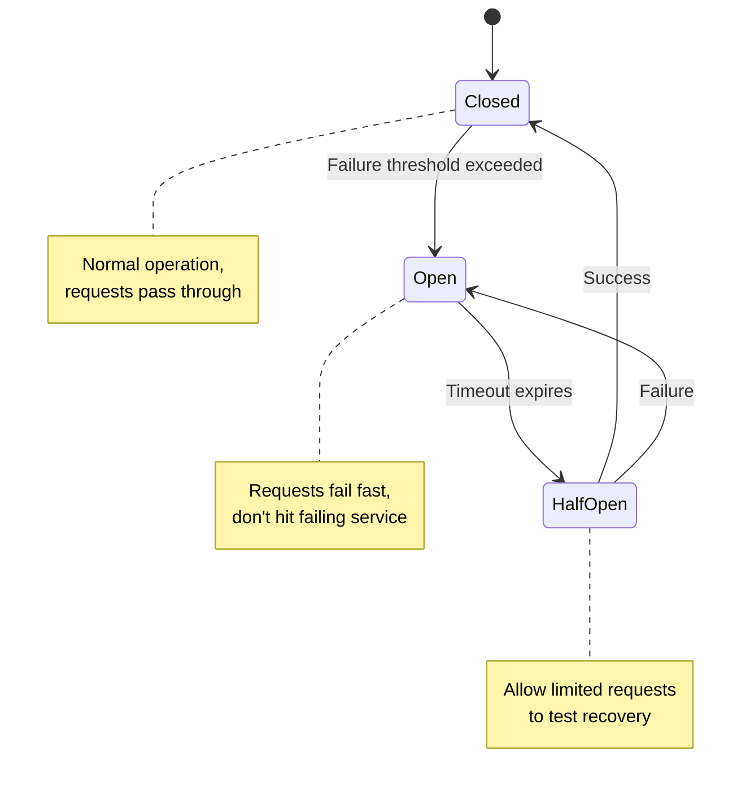
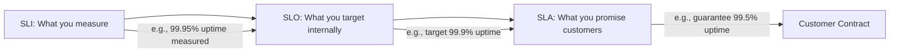

# Throughput, Latency, High Availability & Fault Tolerance

## What / Why

These are the core performance and reliability metrics that define whether a system meets user expectations and business requirements. Every system design interview and production system revolves around these numbers.

**Analogy:**

- **Throughput** = How many cars a highway can handle per hour (total capacity)
- **Latency** = How long it takes one car to travel from point A to point B (individual trip time)
- **Availability** = What percentage of the time the highway is actually open
- **Fault Tolerance** = The highway still works even when a lane is closed

---

## Throughput

### Definition

The amount of work a system can handle per unit time.

| Metric                     | Meaning                            | Example                           |
| -------------------------- | ---------------------------------- | --------------------------------- |
| **Requests/sec (RPS)**     | HTTP requests processed per second | Web server handling 10,000 RPS    |
| **Queries/sec (QPS)**      | Database queries per second        | PostgreSQL handling 50,000 QPS    |
| **Bandwidth**              | Data transferred per second        | Network throughput of 1 Gbps      |
| **Transactions/sec (TPS)** | Completed transactions per second  | Payment system processing 500 TPS |

### Factors Affecting Throughput

- CPU/memory resources
- I/O bottlenecks (disk, network)
- Concurrency model (threads, async, event loop)
- Database connection pool size
- Network bandwidth

---

## Latency

### Definition

The time taken to complete a single operation (from request sent to response received).



**Total Latency** = Network (there) + Processing + DB + Network (back)

### Percentile Latencies (P50 / P95 / P99)

Average latency is misleading. Use percentiles:

| Percentile       | Meaning                              | Why It Matters                    |
| ---------------- | ------------------------------------ | --------------------------------- |
| **P50 (median)** | 50% of requests are faster than this | Typical user experience           |
| **P95**          | 95% of requests are faster than this | Most users' worst experience      |
| **P99**          | 99% of requests are faster than this | Tail latency — your slowest users |
| **P99.9**        | 99.9% of requests are faster         | Edge cases, often VIP customers   |

**Example:**

- P50 = 50ms → Most users see 50ms response
- P95 = 200ms → 1 in 20 users waits 200ms+
- P99 = 2000ms → 1 in 100 users waits 2 seconds+

> Tail latencies (P99) often matter most because high-value users (power users, paying customers) make the most requests and are most likely to hit P99.

### Common Latency Numbers

| Operation                 | Approximate Time |
| ------------------------- | ---------------- |
| L1 cache reference        | 0.5 ns           |
| L2 cache reference        | 7 ns             |
| RAM access                | 100 ns           |
| SSD random read           | 150 μs           |
| HDD seek                  | 10 ms            |
| Same datacenter roundtrip | 0.5 ms           |
| Cross-continent roundtrip | 150 ms           |

---

## Throughput vs Latency Tradeoff

They're often inversely related under load:



| Scenario                    | Throughput | Latency               | Why                                                 |
| --------------------------- | ---------- | --------------------- | --------------------------------------------------- |
| Batching requests           | ↑ Higher   | ↑ Higher per request  | Amortize overhead, but each request waits for batch |
| More concurrent connections | ↑ Higher   | ↑ Higher (contention) | More work done, but resources contested             |
| Caching                     | ↑ Higher   | ↓ Lower               | Serve from memory, less DB load                     |
| Smaller payload             | Same       | ↓ Lower               | Less data to transfer/parse                         |

---

## High Availability

### Definition

The percentage of time a system is operational and accessible.

### Availability Table (The "Nines")

| Availability         | Downtime/Year | Downtime/Month | Downtime/Week |
| -------------------- | ------------- | -------------- | ------------- |
| 99% (two nines)      | 3.65 days     | 7.31 hours     | 1.68 hours    |
| 99.9% (three nines)  | 8.76 hours    | 43.8 minutes   | 10.1 minutes  |
| 99.95%               | 4.38 hours    | 21.9 minutes   | 5.04 minutes  |
| 99.99% (four nines)  | 52.6 minutes  | 4.38 minutes   | 1.01 minutes  |
| 99.999% (five nines) | 5.26 minutes  | 26.3 seconds   | 6.05 seconds  |

> Most SaaS products target 99.9% — 99.99%. Five nines is extremely expensive and typically reserved for critical infrastructure (DNS, payment processors).

### How to Achieve High Availability



### Availability in Series vs Parallel

**In series** (both must work): `A_total = A1 × A2`

- Service A (99.9%) → Service B (99.9%) = 99.8% total

**In parallel** (either works): `A_total = 1 - (1 - A1) × (1 - A2)`

- Service A (99.9%) || Service B (99.9%) = 99.9999% total

---

## Fault Tolerance

### Definition

The ability of a system to continue operating (possibly at reduced capacity) when components fail.

### Key Patterns

| Pattern                            | What It Does                                 | Example                                      |
| ---------------------------------- | -------------------------------------------- | -------------------------------------------- |
| **Circuit Breaker**                | Stops calling a failing service, fails fast  | After 5 failures in 10s, stop trying for 30s |
| **Retry with Exponential Backoff** | Retry failed requests with increasing delays | 1s → 2s → 4s → 8s → give up                  |
| **Timeout**                        | Don't wait forever for a response            | If no response in 3s, fail                   |
| **Bulkhead**                       | Isolate failures to prevent cascade          | Separate thread pools per dependency         |
| **Fallback**                       | Provide degraded but functional response     | Show cached data when DB is down             |
| **Graceful Degradation**           | Disable non-critical features under load     | Disable recommendations, keep search working |

### Circuit Breaker State Machine



### Retry Strategy with Backoff

```
Attempt 1: Wait 1s    (+ jitter: 1.2s)
Attempt 2: Wait 2s    (+ jitter: 2.4s)
Attempt 3: Wait 4s    (+ jitter: 3.8s)
Attempt 4: Wait 8s    (+ jitter: 9.1s)
Attempt 5: Give up → fallback
```

> Always add **jitter** (random delay) to prevent thundering herd — all retries hitting at the same time.

---

## SLAs, SLOs, and SLIs

| Term    | Full Name               | Definition                               | Example                                            |
| ------- | ----------------------- | ---------------------------------------- | -------------------------------------------------- |
| **SLI** | Service Level Indicator | Actual measured metric                   | "P99 latency was 450ms this month"                 |
| **SLO** | Service Level Objective | Internal target for an SLI               | "P99 latency should be < 500ms"                    |
| **SLA** | Service Level Agreement | Contract with customers (with penalties) | "We guarantee 99.9% uptime or credit your account" |



> **Key insight:** SLA < SLO < actual performance. Always set SLA lower than SLO to give yourself a buffer. Set SLO lower than what you currently achieve.

### Error Budget

If your SLO is 99.9% uptime per month:

- **Error budget** = 0.1% = 43.8 minutes of allowed downtime
- Use this budget intentionally: risky deployments, experiments, migrations
- If budget is exhausted: freeze changes, focus on reliability

---

## Best Practices

1. **Measure percentiles, not averages** — Averages hide tail latency. A P50 of 100ms with P99 of 10s means your system is unreliable.
2. **Design for failure** — Every network call will eventually fail. Have timeouts, retries, and fallbacks for all external dependencies.
3. **Set error budgets** — Teams should know exactly how much unreliability they can tolerate per month.
4. **Redundancy at every layer** — Multiple app servers, multiple DB replicas, multiple availability zones.
5. **Load test to find limits** — Know your system's breaking point before users discover it.
6. **Monitor the right SLIs** — Latency (P50/P95/P99), error rate, throughput, saturation.
7. **Graceful degradation > complete failure** — Turn off recommendations before you turn off checkout.
8. **Circuit breakers on all external calls** — Protect your system from cascading failures.

---

## Summary

- **Throughput** = Total work capacity (RPS, QPS). Increase via horizontal scaling, caching, async processing.
- **Latency** = Individual request time. Measure with percentiles (P50/P95/P99), not averages.
- **They trade off** — Pushing throughput higher increases latency under load.
- **High Availability** = System uptime percentage. Achieve via redundancy, failover, and geographic distribution. 99.9% = 8.76 hours downtime/year.
- **Fault Tolerance** = Surviving component failures. Use circuit breakers, retries with backoff, bulkheads, graceful degradation.
- **SLI/SLO/SLA** = Measure → Target → Promise. Set error budgets to balance reliability with shipping speed.
